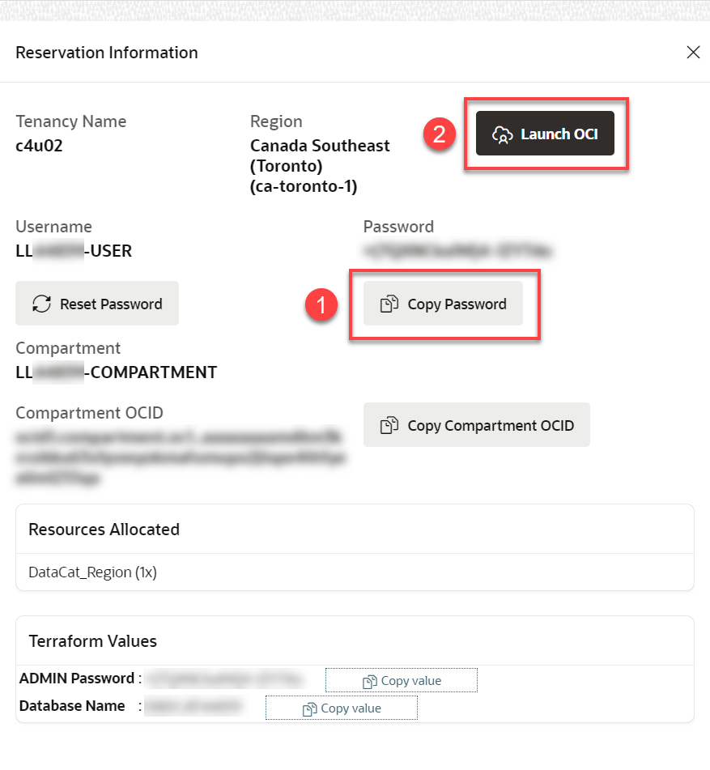
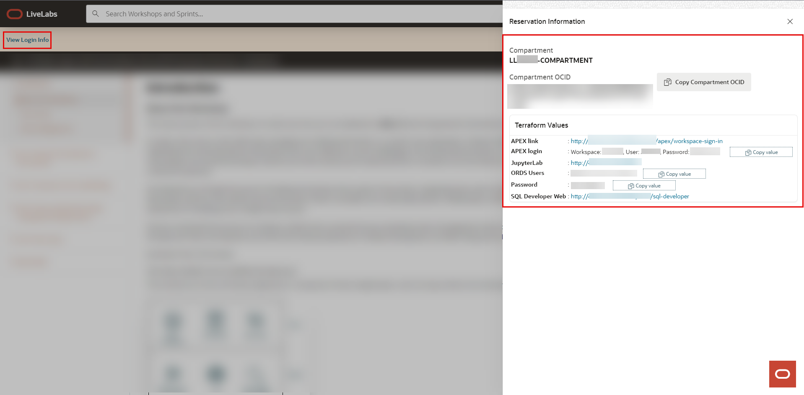
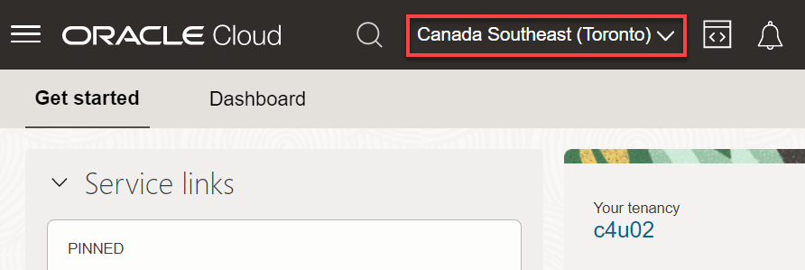
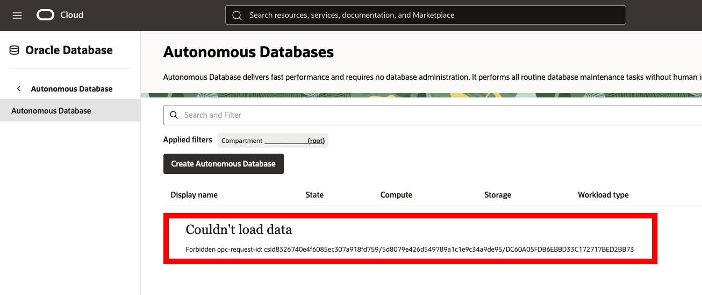
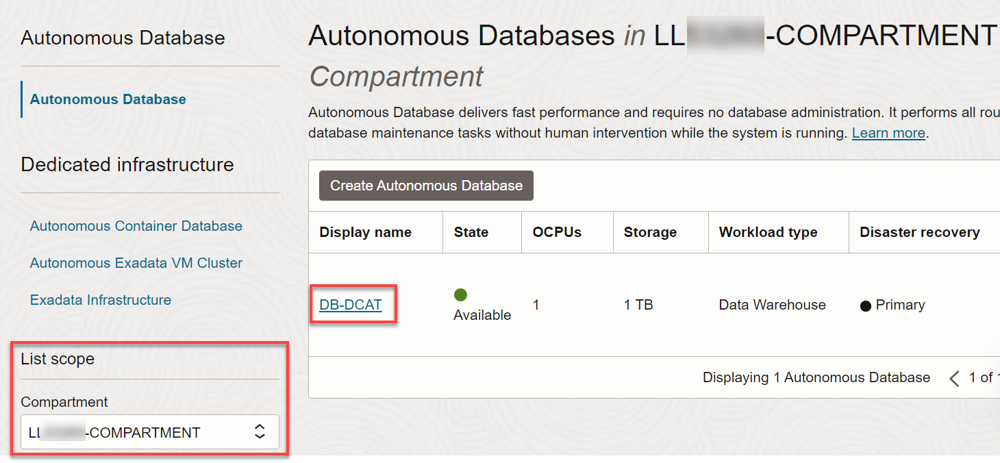
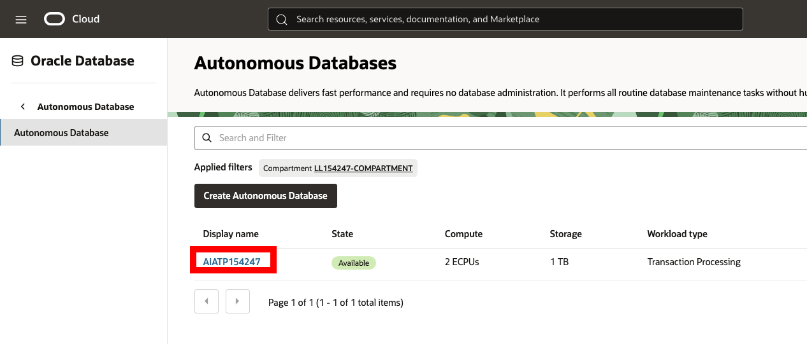
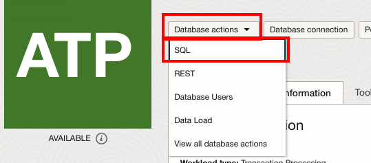

# Get Started with Livelabs

## Introduction

Welcome to your LiveLabs Sandbox environment. In order to start your workshop, you need to login to our LiveLabs Sandbox.

In this lab, we are going to show you where you can find the login information and how to log in to the LiveLabs Sandbox.

Estimated Time: 5 minutes

### Objectives

* View login information to LiveLabs Sandbox
* Login to LiveLabs Sandbox

### Prerequisites

* Requested a Green Button environment

## Task 1: Log in to the Oracle Cloud Console

1. Click the **View Login Info** link in the banner.

    

     This panel displays important information that you will need throughout this workshop.

    

    This includes access URLs to JupyterLab, APEX, and SQL Developer Web.

    **Note:** The labs will explain which of the above mentioned tools are required.

    

2. Click **Copy Password** to copy your initial password, and then click **Launch OCI**.

3. On the Sign In page, in the **Oracle Cloud Infrastructure Direct Sign-In** section, your assigned username is already displayed in the **User Name** field. Paste your password in the **Password** field, and then click **Sign In**.

    

4. The **Change Password** dialog box is displayed. Paste your assigned password that you copied in the **Current Password**. Enter a new password in the **New Password** and **Confirm New Password** fields, and then click **Save New Password**. Make a note of your new password as you will need it in this workshop.

    

    The **Oracle Cloud Console** Home page is displayed. Make sure that the displayed region is the same that was assigned to you in the **Reservation Information** panel of the **Run Workshop *workshop-name*** page, **Canada Southeast (Toronto)** in this example.

    

    >**Note:** Bookmark the workshop page for quicker access.

## Task 2: Navigate to the Autonomous Database

1. You should be already logged in to the Console using the instructions in the **Task 1** in this lab.

2. Open the **Navigation** menu and click **Oracle Database**. Under **Oracle Database**, click **Autonomous Database**. The **Autonomous Databases** page should be displayed; however, your assigned resources for this workshop are all in your assigned LiveLabs compartment (that is displayed in the  **Reservation Information** panel) and not in the **root** tenancy. The following expected warning message is displayed.

    

3. To select your assigned LiveLabs compartment, click the **Compartment** drop-down list in the **List Scope** section on the left. Enter your LiveLabs assigned compartment name in the **Compartment** text field to search for it which should look something like **LL#####-COMPARTMENT** where the **#####** is a unique five-digit number. Alternatively, you can drill-down on the **Livelabs** node and select your assigned compartment. When your assigned compartment is displayed in the list of compartments, select it. In addition, make sure that your LiveLabs assigned region from the **Run Workshop *workshop-name*** page is selected in Console's banner.

    

    >**Note:** Refer to the **Reservation Information** panel that you can access from the **Run Workshop *workshop-name*** tab for information about your assigned resources.

    

4. On the **Autonomous Databases** page, click your **DB-DCAT** ADB instance.
    

5. On the **Autonomous Database details** page, click the **Database actions** drop-down list, and then click **SQL**.

    

You may now proceed to the next lab.

## Learn More

* [Oracle Cloud Infrastructure Documentation](https://docs.cloud.oracle.com/en-us/iaas/Content/GSG/Concepts/baremetalintro.htm)
* [Using Oracle Autonomous Database Serverless](https://docs.oracle.com/en/cloud/paas/autonomous-database/adbsa/index.html)

## Acknowledgements

* **Author:** Killian Lynch, Oracle Database Product Manager
* **Contributors:**
    * Mike Matthews, Autonomous Database Product Management
    * Marty Gubar, Autonomous Database Product Management
    * Lauran K. Serhal, Consulting User Assistance Developer
* **Last Updated By/Date:** Hope Fisher, Dec 2024
