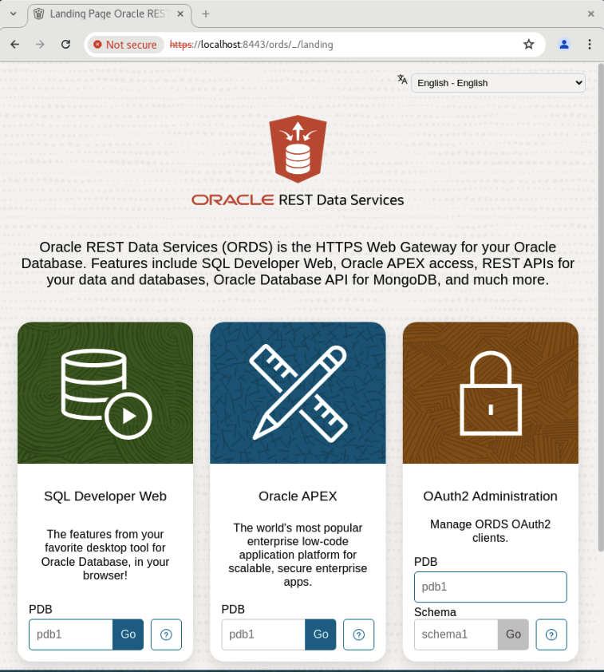
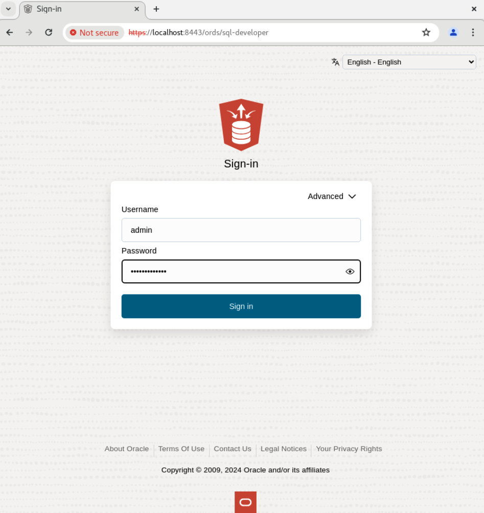
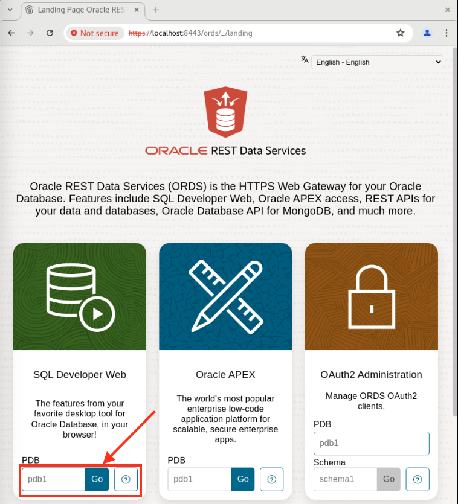
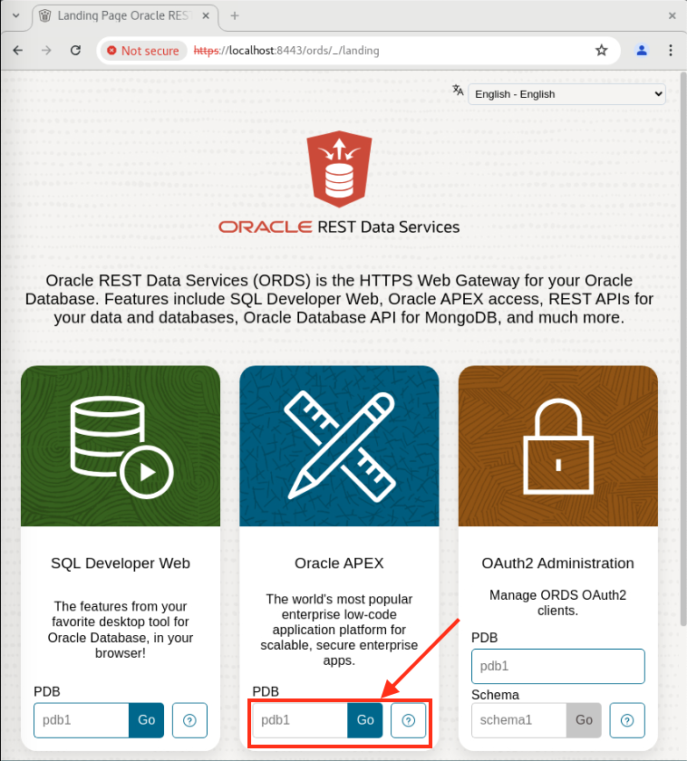
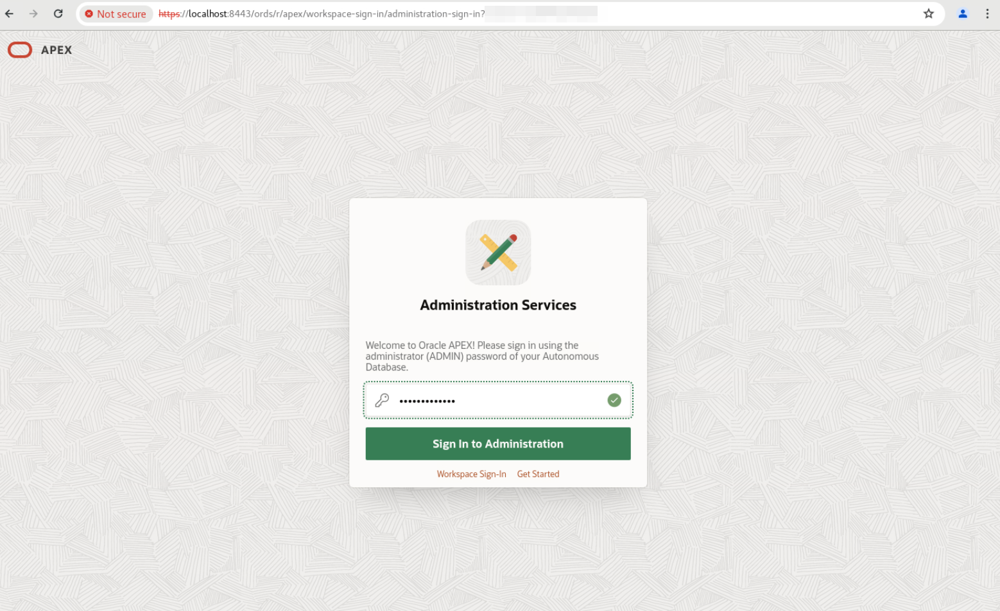
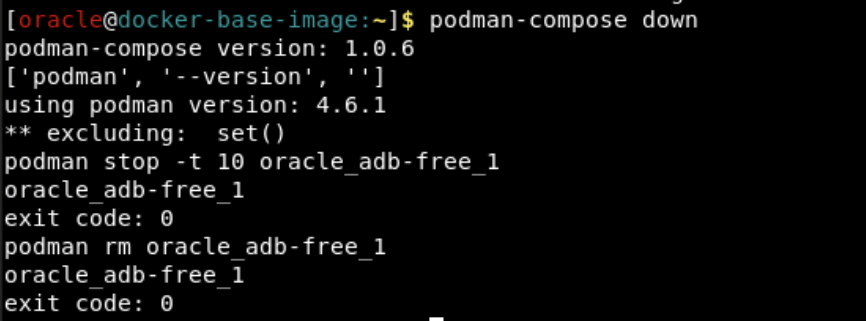
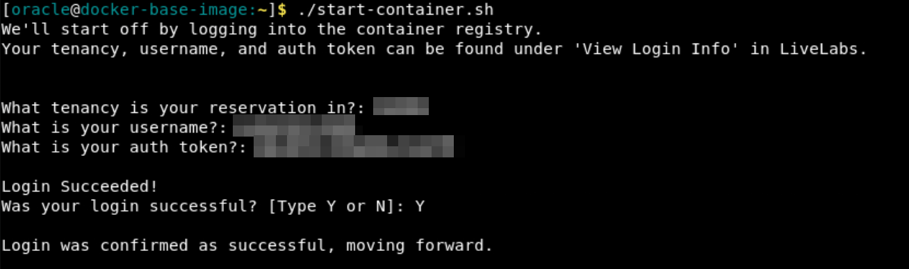

# Prepare Setup

## Introduction
In this lab, you will quickly configure the Oracle Autonomous Database Free 23ai Docker Container in your remote desktop environment.

*Estimated Time:* 10 minutes

### Objectives

In this lab, you will:

* Pull, run, and start an Oracle Autonomous Database 23ai Docker image with Podman.
* Gain access to Database Actions, APEX, and more via your container.
* Explore Oracle’s AI Vector Search. 

### Prerequisites
This lab assumes you have:
- An Oracle account


## Task 1: Install and Configure the ADB Free 23ai Container Image

In the LiveLabs Sandbox, we will download the image from an OCI bucket. However, when using your own environment you will download the image directly from the Oracle Container Registry. That process is detailed in the free tier instructions.

**_Note:_** _All of the following commands are to be run in the remote desktop's terminal._

1.  **Set the OCI CLI environment variables.** Our image is stored in the Toronto region and we're using the instance principal authorization method. Run the following commands in the terminal to configure the OCI CLI accordingly.

    ```
    <copy>
    export OCI_CLI_REGION=ca-toronto-1
    export OCI_CLI_AUTH=instance_principal
    </copy>
    ```
2. **Download the image from Object Storage.** 

    ```
    <copy>
    oci os object get -bn image_bucket -ns c4u04 --name adb-free-23ai.tar.gz --file /tmp/adb-free-23ai.tar.gz
    </copy>
    ```

3. **Download the installation and configuration files.** These commands pull two resources from object storage: the vector embedding model (for Lab 3) and the installation zip file. The zip file contains the YAML file and two scripts required to help re-configure APEX (explained in step 6).

    ```
    <copy>
    wget https://objectstorage.ca-toronto-1.oraclecloud.com/p/AZAlcycOLHY5iAWwYZ6KTwJcrnJy7k1LcpHJh0ELmGdZj5ptc6rEteLmnUKnn4Gl/n/c4u04/b/apex-images/o/BERT-TINY.onnx
    wget https://objectstorage.ca-toronto-1.oraclecloud.com/p/WC7293Pwf4UNmrM44Mequmek_fjzKDkU-zBUrA8lAzcJMAiR19Jecjt1x1U4gBne/n/c4u04/b/apex-images/o/compose12.zip
    unzip compose12.zip
    </copy>
    ```

4. **Load the image into the podman catalog. (~5 mins)** Our image has been downloaded locally. Podman-load copies the image from the local docker archive into the podman container storage. 

    ```
    <copy>
    podman load -i /tmp/adb-free-23ai.tar.gz
    </copy>
    ```

4. **Launch the image.** The podman-compose command will configure and run the container image based on your YAML file. You can configure the ADB to be suited for any workload type. However, we've preset the workload type to ATP.

    ```
    <copy>
    podman-compose up
    </copy>
    ```
5. **Open a new terminal tab and confirm the ADB is connected.** In another tab of the terminal, run this command. 

      ```
    <copy>
    podman exec -it /etc/init.d/oracle_adb-free_1 status
    </copy>
    ```

6. **Re-configure the APEX image.** We'll need to redirect APEX to use the images behind our firewall. Run this command to do so.

    ```
    <copy>
    podman exec -it oracle_adb-free_1 /bin/sh -c "/u01/scripts/db-config.sh"
    </copy>
    ```

## Task 3: Explore the Database Tools: APEX & ORDS

Oracle Autonomous Database Free has APEX and ORDS (a.k.a Database Actions) preinstalled. Let's see how you can get started!

1. **Open Google Chrome.** Click Activities >> Google Chrome icon, to open a new Chrome window.

2. **Launch ORDS.** Paste the following URL into your Chrome browser to Launch ORDS.

    ```
    <copy>
    https://localhost:8443/ords
    </copy>
    ```

    

3. **Sign into ORDS.** 
    
    **Username -** admin
    **Password -** Welcome_12345 (or the custom password you specified in Task 1, Step 5.)

    

4. **Launch SQL Developer Web.** You now have access to Database Actions! Let's first click SQL Developer Web to test it out.

    

5. **Launch APEX.** Go back to the landing page and click Go to Oracle APEX.

    ```
    <copy>
    https://localhost:8443/ords
    </copy>
    ```

    

6. **Sign-in to APEX.** 

    **Username -** admin
    **Password -** Welcome_12345 (or the custom password you specified in Task 1, Step 5.)

    

Now you have access to Database Actions and APEX within your ADB 23ai Container Image! Feel free to explore what's possible within your environment.

## Appendix 1: Restart Docker Container
1. If you wanted to stop the ADB Docker container at any time and start with a fresh one, feel free to. If you are in the middle of running the start-container.sh script, type ctrl+C to stop it.

2. Run this command to stop the container.

    ```
    <copy>
    podman-compose down
    </copy>
    ```

    

2. Return to the home directory and restart the start-container.sh script.

    ```
    <copy>
    cd ~
    ./start-container.sh
    </copy>
    ```

    

4. Run through the same steps onward of Task 1, step 4.

## Appendix 2: Explore the Podman Compose script
1. If you want to take a closer look at how we configure the container, run this command.

    ```
    <copy>
    cat ~/podman-compose.yml
    </copy>
    ```

    

## Acknowledgements
- **Authors** - Brianna Ambler, Dan Williams Database Product Management, July 2024
- **Contributors** - Brianna Ambler, Dan Williams,  Database Product Management
- **Last Updated By/Date** - Brianna Ambler, Dan Williams July 2024
