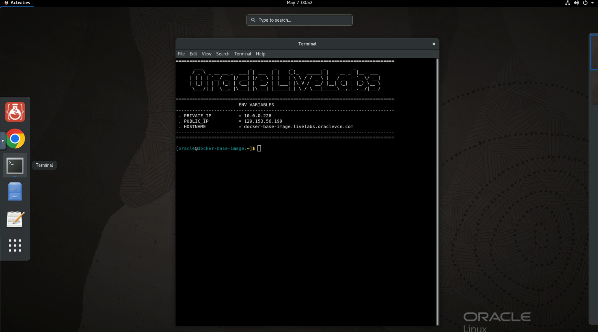
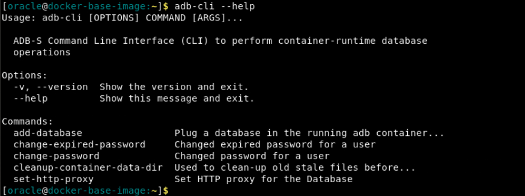
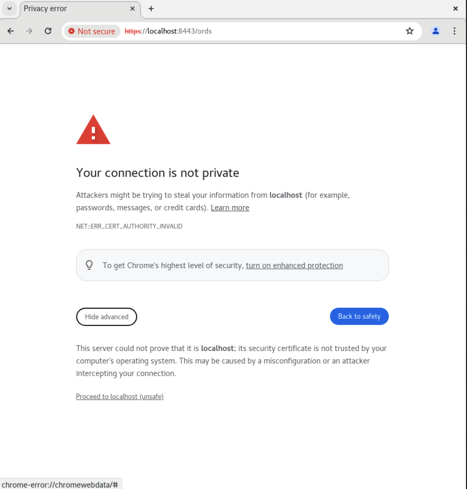
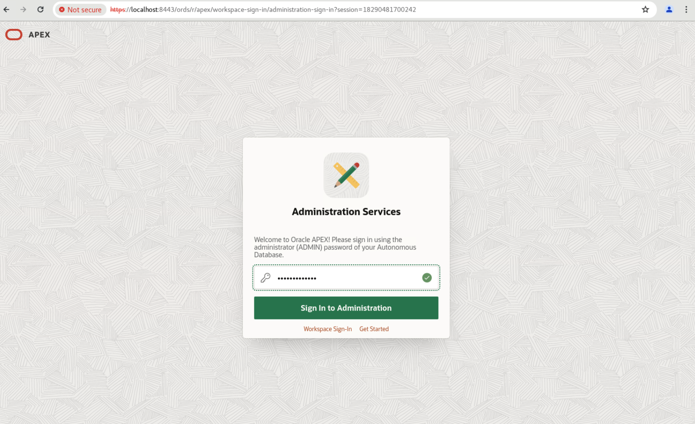

# Prepare Setup

## Introduction
This lab will show you how to pull, run, and start an Oracle Autonomous Database 23ai Docker image.

*Estimated Lab Time:* 10 minutes

### Prerequisites
This lab assumes you have:
- An Oracle account

## Task 1: Pull and start Docker image
1.  The terminal should be open, if not go to Activities and click Terminal.

    
 
2.  Pull the zip file with our podman-compose files and scripts that we'll be running to create and configure the ADB container. We'll also be unzipping the files, then giving them the permissions to be executable within the container.

    ```
    <copy>
    wget https://objectstorage.ca-toronto-1.oraclecloud.com/n/c4u04/b/apex-images/o/compose.zip
    unzip compose.zip
    chmod +x scripts start-container.sh
    chmod ugo+x -R scripts start-container.sh
    </copy>
    ```

3. Run this command to begin the process of starting up the container. Follow the instructions of the script until you reach the SQLPlus prompt.

    ```
    <copy>
    ./start-container.sh
    </copy>
    ```

3. Input your tenancy name, username, and auth token as found under "View Login Details" in your LiveLabs reservation.

    Output:
    ```
    [oracle@docker-base-image:~]$ ./start-container.sh
    Your tenancy, username, and auth token can be found under 'View Login Info' in LiveLabs.

    What tenancy is your reservation in?: <tenancy-name>
    What is your username?: <username>

    For username, enter in <tenancy-name>/<username>. Do this all in lowercase.
    For password, enter in your auth token copied from View Login Details.

    Username: <tenancy-name>/<username>
    Password: 
    Login Succeeded!
    ```
    
4. Input your workload type, admin password, and wallet password as preferred while following the password restrictions listed in the script.

    Output:
    ```
    What workload type do you want for your ADB? [Type ATP or ADW]: ATP

    Make sure the following passwords you select are between 12-30 characters, with at least 1 uppercase letter, 1 lowercase letter, and 1 number.
    What do you want your Admin Password to be?: <admin-password>
    What do you want your Wallet Password to be?: <wallet-password>

    ```

5. The container is now initializing. A podman-compose.yml script is running in the background to pull the image, start the container, mount necessary scripts onto the database.

    Output:
    ```
    podman run ...
    Trying to pull yyz.ocir.io/c4u04/livelabs:latest-23ai...
    Getting image source signatures
    Copying blob ... done  
    Copying blob ... done  
    Copying blob ... done  
    Copying config ... done  
    Writing manifest to image destination
    <container-id>
    exit code: 0
    ```

<!-- 3. Now that you are prompted to login, type the username in the format of ***tenancy-name***/***username***. The password will be your ***auth-token***. You will find all the necessary information in the Login Details of your LiveLabs reservation. 

    

4. Hit enter, and it should say "Login Succeeded".

     -->

6. Now, we're waiting until the container is healthy so we can run the remainder of our scripts.

    Output:
    ```
    The container ID is:
    <container-id>

    Waiting for container to be healthy...
    Waiting for container to be healthy...
    Waiting for container to be healthy...
    Waiting for container to be healthy...
    Waiting for container to be healthy...
    Waiting for container to be healthy...
    Waiting for container to be healthy...
    Waiting for container to be healthy...
    Waiting for container to be healthy...
    Waiting for container to be healthy...
    Container is healthy now

    ```

6. Once it reaches SQLPlus, paste this in to run this script within the container. This is going to reset where the APEX images are sourced from so APEX will function within our LiveLabs environment.

    ```
    <copy>
    @/u01/scripts/reset-image-prefix.sql
    </copy>
    ```

    Output:
    ```
    Setting up the correct APEX images directory...
    Your TNS_ADMIN location = /u01/app/oracle/wallets/tls_wallet

    SQL*Plus: Release 23.0.0.0.0 - Production on Wed May 22 00:39:58 2024
    Version 23.4.0.24.05

    Copyright (c) 1982, 2024, Oracle.  All rights reserved.

    Last Successful login time: Wed May 22 2024 00:39:26 +00:00

    Connected to:
    Oracle Database 23ai Enterprise Edition Release 23.0.0.0.0 - Production
    Version 23.4.0.24.05

    SQL> @/u01/scripts/reset-image-prefix.sql

    PL/SQL procedure successfully completed.

    Disconnected from Oracle Database 23ai Enterprise Edition Release 23.0.0.0.0 - Production
    Version 23.4.0.24.05
    ```


7. As the script completes, make sure you copy and run the command printed out at the end so you can easily run ADB-CLI commands.

    Output:
    ```
    Copy and run this command to setup your ADB CLI:
    alias adb-cli='podman exec <container-id> adb-cli'
    ```


8. Now, the ADB container is live and you can run commands against it. You can view the list of available commands using the following command.

    ```
    <copy>
    adb-cli --help 
    </copy>
    ```

    


## Task 2: Access Database Actions and APEX

1. To access Database Actions/ORDS, open a new window in your Chrome browser and go to this website:

    ```
    <copy>
    https://localhost:8443/ords
    </copy>
    ```

    It must include the "https://" to work.

2. Click 'Advanced' then 'Proceed to localhost (unsafe)'.
    
    

3. Sign in with the password you had set as ADMIN_PASSWORD in the run command for Task 1, Step 6.

    

4. Now you have access to Database Actions and APEX within your ADB 23ai Container Image! Feel free to explore what's possible within your environment.

<!-- 11. 
9. You can add a database.

    ```
    <copy>
    adb-cli add-database --workload-type "ADW" --admin-password "Welcome_1234"
    </copy>
    ```

10. You can change the admin password.

    ```
    <copy>
    adb-cli change-password --database-name "MYADW" --old-password "Welcome_1234" --new-password "Welcome_12345"
    </copy>
    ```

11. **Note:** At anytime, you can check if your container is still running with this command. The list returned should not be empty.

    ```
    <copy>
    podman ps -a
    </copy>
    ```

 11. 
mkdir /scratch/
podman cp adb-free:/u01/app/oracle/wallets/tls_wallet /scratch/tls_wallet

12. 

hostname fqdn -->


<!-- 11. This is how you connect to ORDS.

12. Finally, this is how you would connect to APEX. -->

## Acknowledgements
* **Author** - Kaylien Phan, Senior Product Manager
* **Contributors** - David Start
* **Last Updated By/Date** - Kaylien Phan, May 2024