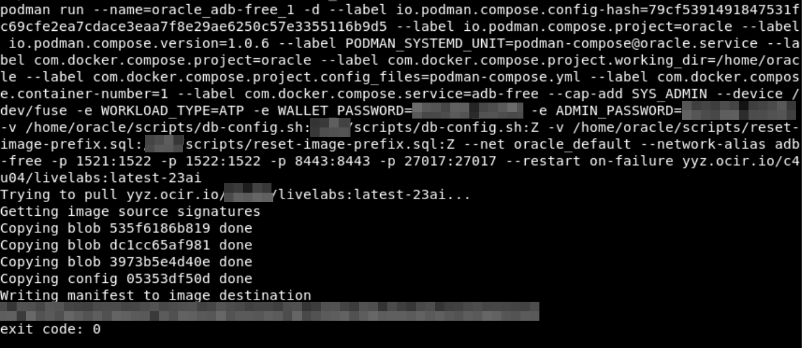
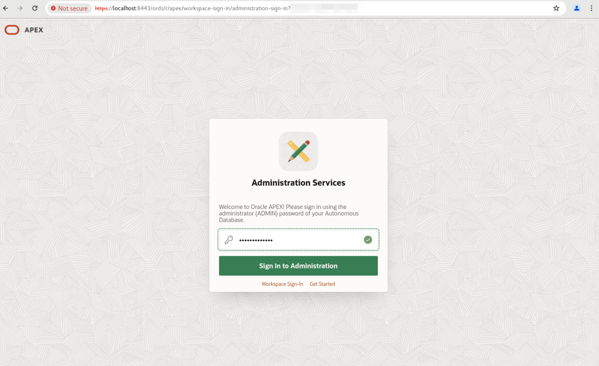
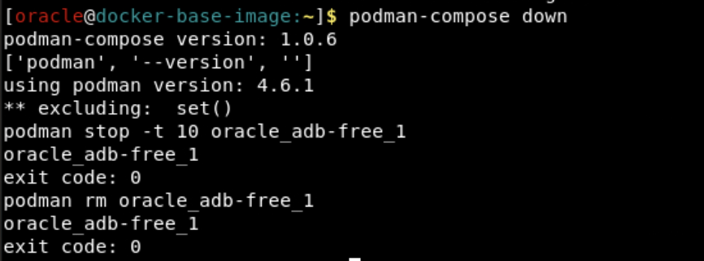

# Prepare Setup

## Introduction
In this lab, you will quickly configure the Oracle Autonomous Database Free 23ai Docker Container in your remote desktop environment.

*Estimated Time:* 10 minutes

### Objectives

In this lab, you will:

* Pull, run, and start an Oracle Autonomous Database 23ai Docker image with Podman.
* Gain access to Database Actions, APEX, and more via your container.

### Prerequisites
This lab assumes you have:
- An Oracle account

## Task 1: Pull and Start Docker Image
1.  The terminal should be open, if not go to Activities and click Terminal.

    
 
2.  Pull the zip file with our podman-compose files and scripts that we'll be running to create and configure the ADB container. We'll also be unzipping the files, then giving them the permissions to be executable within the container.

    ```
    <copy>
    wget https://objectstorage.ca-toronto-1.oraclecloud.com/p/WC7293Pwf4UNmrM44Mequmek_fjzKDkU-zBUrA8lAzcJMAiR19Jecjt1x1U4gBne/n/c4u04/b/apex-images/o/compose.zip
    unzip compose.zip
    chmod +x scripts start-container.sh
    chmod ugo+x -R scripts start-container.sh
    </copy>
    ```

    

3. Run this command to begin the process of starting up the container. Go to your LiveLabs reservation under View Login Details in order to get your information needed to login to the container registry.

    ```
    <copy>
    ./start-container.sh
    </copy>
    ```

    

    

4. Input your tenancy name, username, and auth token as found under "View Login Details" in your LiveLabs reservation.
    
    

5. Input your workload type, admin password, and wallet password as preferred while following the password restrictions listed in the script.

    

6. The container is now initializing. A podman-compose.yml script is running in the background to pull the image, start the container, mount necessary scripts onto the database.

    

<!-- 3. Now that you are prompted to login, type the username in the format of ***tenancy-name***/***username***. The password will be your ***auth-token***. You will find all the necessary information in the Login Details of your LiveLabs reservation. 

    

4. Hit enter, and it should say "Login Succeeded".

     -->

7. Now, we're waiting until the container is healthy so we can run the remainder of our scripts.

    

8. Once it reaches SQLPlus, paste this in to run this script within the container. This is going to reset where the APEX images are sourced from so APEX will function within our LiveLabs environment.

    ```
    <copy>
    @/u01/scripts/reset-image-prefix.sql
    </copy>
    ```
    
    

9. As the script completes, make sure you copy and run the command printed out at the end so you can easily run ADB-CLI commands.

    

10. Now, the ADB container is live and you can run commands against it. You can view the list of available commands using the following command.

    ```
    <copy>
    adb-cli --help 
    </copy>
    ```

    

## Task 2: Access Database Actions and APEX

1. To access Database Actions/ORDS, open a new window in your Chrome browser and go to this website:

    ```
    <copy>
    https://localhost:8443/ords
    </copy>
    ```

    It must include the "https://" to work.

    

2. Sign in with your admin password you had set for the ADB in Task 1, Step 4.

    

3. You now have access to Database Actions.

    

4. Go back to the landing page and click Go to Oracle APEX.

    ```
    <copy>
    https://localhost:8443/ords
    </copy>
    ```

    

2. Sign in with your admin password you had set for the ADB in Task 1, Step 4.

    

3. Now you have access to Database Actions and APEX within your ADB 23ai Container Image! Feel free to explore what's possible within your environment.

<!-- 11. 
9. You can add a database.

    ```
    <copy>
    adb-cli add-database --workload-type "ADW" --admin-password "Welcome_1234"
    </copy>
    ```

10. You can change the admin password.

    ```
    <copy>
    adb-cli change-password --database-name "MYADW" --old-password "Welcome_1234" --new-password "Welcome_12345"
    </copy>
    ```

11. **Note:** At anytime, you can check if your container is still running with this command. The list returned should not be empty.

    ```
    <copy>
    podman ps -a
    </copy>
    ```

 11. 
mkdir /scratch/
podman cp adb-free:/u01/app/oracle/wallets/tls_wallet /scratch/tls_wallet

12. 

hostname fqdn -->


<!-- 11. This is how you connect to ORDS.

12. Finally, this is how you would connect to APEX. -->

## Appendix 1: Restart Docker Container
1. If you wanted to stop the ADB Docker container at any time and start with a fresh one, feel free to. If you are in the middle of running the start-container.sh script, type ctrl+C to stop it.

2. Run this command to stop the container.

    ```
    <copy>
    podman-compose down
    </copy>
    ```

    

2. Return to the home directory and restart the start-container.sh script.

    ```
    <copy>
    cd ~
    ./start-container.sh
    </copy>
    ```

    

4. Run through the same steps onward of Task 1, step 4.

## Appendix 2: Explore the Podman Compose script
1. If you want to take a closer look at how we configure the container, run this command.

    ```
    <copy>
    cat ~/podman-compose.yml
    </copy>
    ```

## Acknowledgements
- **Author** - Kaylien Phan, Senior Product Manager, May 2024
- **Contributors** - Brianna Ambler, Kevin Lazarz
- **Last Updated By/Date** - Kaylien Phan, May 2024
