# Install Oracle Autonomous Database 23ai Free Container Image

## Introduction
In this lab, you will experience just how easy it is to get started with the Oracle Autonomous Database 23ai Free container image. Once launched, we will show you how to take advantage of the developer tools available to you, as we show you how to access SQL Developer Web & APEX--without any additional installations!

**_Estimated Time: 30 minutes_**

### **Objectives**
In this lab, you will:

* Launch the container image using Podman.
* Connect to your Autonomous Database.
* Access SQL Developer Web & APEX.

### **Prerequisites**
This lab assumes you have:
- An Oracle account


## Task 1: Install and Configure the ADB Free 23ai Container Image

In the LiveLabs Sandbox, we will download the image from an OCI bucket. However, when using your own environment you will download the image directly from the Oracle Container Registry. That process is detailed in the free tier instructions.

**_Reminder:_** _All of the following commands are to be run in the remote desktop's terminal._

1. **Download the container image and workshop resources.** The following commands download all of the resources we'll use in the workshop. The most important file is the YAML file, which provides the configuration details of the container. We'll take a closer look at how this file works shortly.

    ```
    <copy>
    ## Downloading the container image.
    oci os object get -bn image_bucket -ns c4u04 --name adb-free-23ai.tar.gz --file adb-free-23ai.tar.gz

    ## Downloading both the container and workshop resources. 
    wget https://objectstorage.ca-toronto-1.oraclecloud.com/p/GDCjmPfuRMx-juvDGT0Mn7ZsaI_O5y_PsGg41xcLVVl8vewGOm6Ns4zeLsTPAr3p/n/c4u04/b/apex-images/o/configuration-files.zip -P /tmp

    ## Opening the zip file.
    unzip -q /tmp/configuration-files.zip
    chmod -R 777 mount-files

    </copy>
    ```
    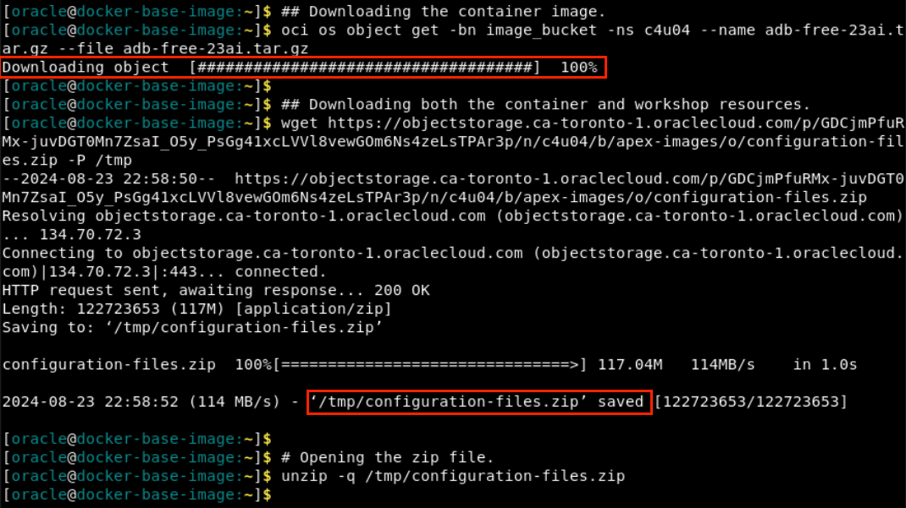


2. **Load the image into the podman catalog. (~5 mins)** Podman-load copies the image from the local docker archive into the podman container storage. This will take about 5 minutes--let's review the YAML file in the meantime.

    ```
    <copy>
    podman load -i adb-free-23ai.tar.gz
    </copy>
    ```
    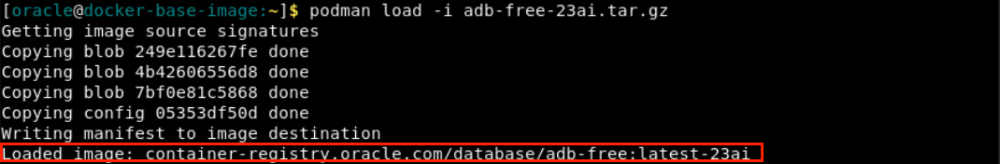

3. **Review the YAML file.** Run the following command to learn more about how the YAML file helps launch the container image.
    ```
    <copy>
    cat podman-compose.yml
    </copy>
    ```

    ```
    version: "3.9"
    services:
    adb-free:  # Name of the service/container.
    image: container-registry.oracle.com/database/adb-free:latest-23ai
    # The container image to use. In this case, it's an Oracle Autonomous Database Free image.

    environment:  # Environment variables passed to the container.
      - WORKLOAD_TYPE=ATP  # Specify the workload type (ATP stands for Autonomous Transaction Processing).
      - WALLET_PASSWORD=Welcome_12345  # Password for the database wallet.
      - ADMIN_PASSWORD=Welcome_12345  # Admin user password for the database.

    ports:  # Mapping of host ports to container ports.
      - "1521:1522"  # Map host port 1521 to container port 1522 (database listener port).
      - "1522:1522"  # Map host port 1522 to container port 1522 (alternative database listener port).
      - "8443:8443"  # Map host port 8443 to container port 8443 (HTTPS port).
      - "27017:27017"  # Map host port 27017 to container port 27017 (MongoDB port).

    volumes:  # Mount host directories/files into the container.
      - "/home/oracle/mount-files/scripts/reset-image-prefix.sql:/u01/scripts/reset-image-prefix.sql:Z"
      - "/home/oracle/mount-files/scripts/db-config.sh:/u01/scripts/db-config.sh:Z"
      - "/home/oracle/mount-files/all-MiniLM-L12-v2.onnx:/u01/all-MiniLM-L12-v2.onnx:Z"
      - "/home/oracle/mount-files/customer-orders-schema/:/u01/customer-orders-schema:Z"

    devices:  # Allow the container to access specific devices on the host.
      - /dev/fuse  # /dev/fuse is required for file system operations like mounting.

    cap_add:  # Add Linux capabilities to the container.
      - SYS_ADMIN  # SYS_ADMIN capability is required for mounting file systems.

    restart: on-failure  # Automatically restart the container if it exits with a non-zero status.

    userns_mode: "keep-id"  # Keep the user namespace mapping, meaning the container runs with the same user ID as on the host.
    ```

4. **Launch the image.** The podman-compose command will configure and run the container image based on your YAML file. The terminal will output "exit code: 0" when the container successfully launches.

    ```
    <copy>  
    podman-compose up -d
    </copy>
    ```
    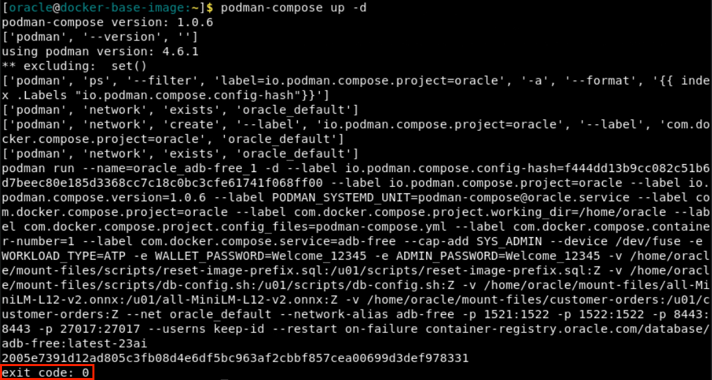

5. **Confirm the container is up and running.** This command generates the name and current status for all of your running containers.

      ```
    <copy>
    podman ps --format "{{.Names}} {{.Status}}"
    </copy>
    ```
    

6. **Confirm the files were pre-loaded into the container.** If you see the 'all-MiniLM-L12-v2.onnx', 'scripts', and 'customer-orders' listed in the output, you're good to go! 
    ```
    <copy>
    podman exec -it oracle_adb-free_1 ls /u01/
    </copy>
    ```
    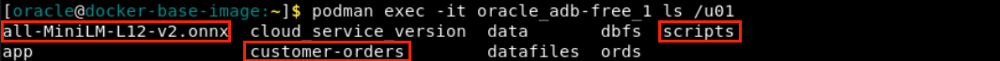
   
7. **Relocate tnsnames.ora in the container.** 'tnsnames.ora' is a configuration file, storing the database details necessary for connection. We're moving the file into a directory that's meant for our database for easy connection.
    ```
    <copy>
    podman exec -it oracle_adb-free_1 cp /u01/app/oracle/wallets/tls_wallet/tnsnames.ora /u01/app/oracle/product/23.0.0.0/dbhome_1/network/admin/tnsnames.ora
    </copy>
    ```

8. **Confirm ORDS is running.** The 'jps' command lists out all of the java proceses running on the host. We're then filtering that list on the term 'ords'.
    ```
    <copy>
    podman exec -it oracle_adb-free_1 jps -l | grep ords
    </copy>
    ```
    

9. **Configure the APEX image.** We'll first need to redirect APEX to use the images behind our firewall. Run this command in the terminal to do so. This is only required for APEX use in Livelabs.
    ```
    <copy>
    podman exec -it oracle_adb-free_1 /bin/sh -c "/u01/scripts/db-config.sh"
    </copy>
    ```  
    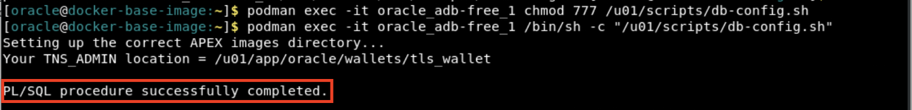

## Task 2: Access APEX & SQL Developer Web

Oracle Autonomous Database Free has ORDS preinstalled. Let's see how you can get started!

1. **Open new Chrome window.** 
    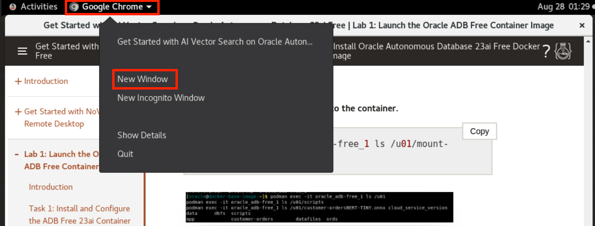

2. **Launch ORDS.** Paste the following URL into your Chrome browser to Launch ORDS.

    ```
    <copy>
    https://localhost:8443/ords
    </copy>
    ```

3. **Launch SQL Developer Web.** You now have access to Database Actions! This is where you'll find both APEX and SQL Developer Web. For now, we'll only launch SQL Developer Web.

    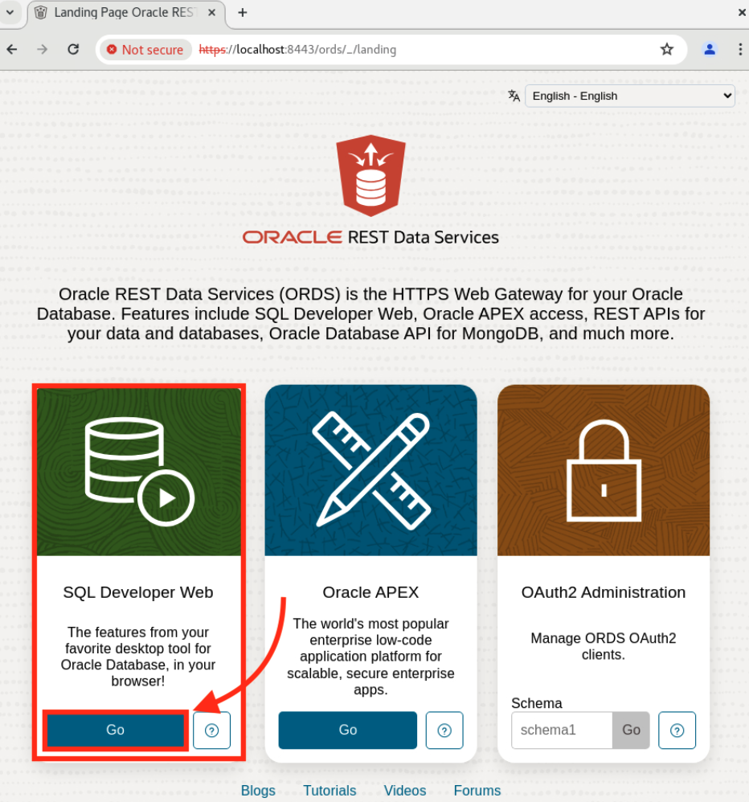

4. **Sign into SQL Developer Web.** Use the database admin login credentials below.<br/> 
    
    **Username -** admin<br/>
    **Password -** Welcome_12345

    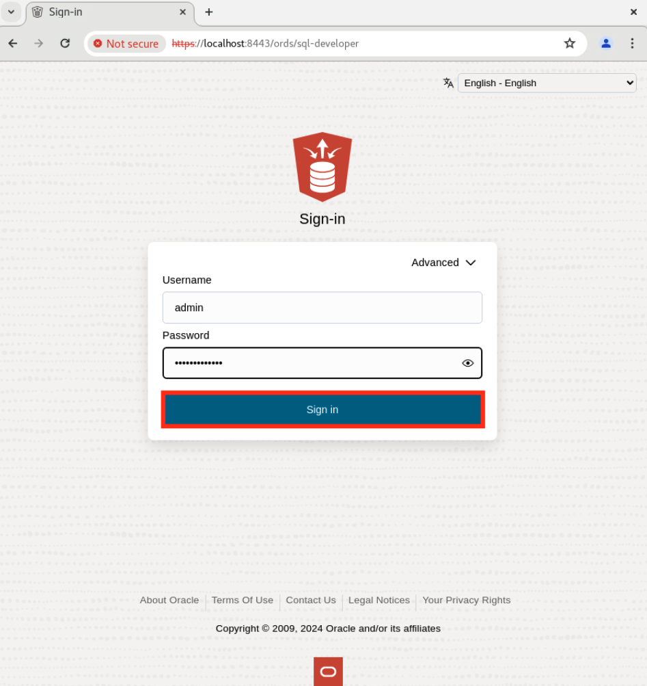

5. **Lauch the SQL worksheet.** Select the 'SQL' tab, as shown below.
    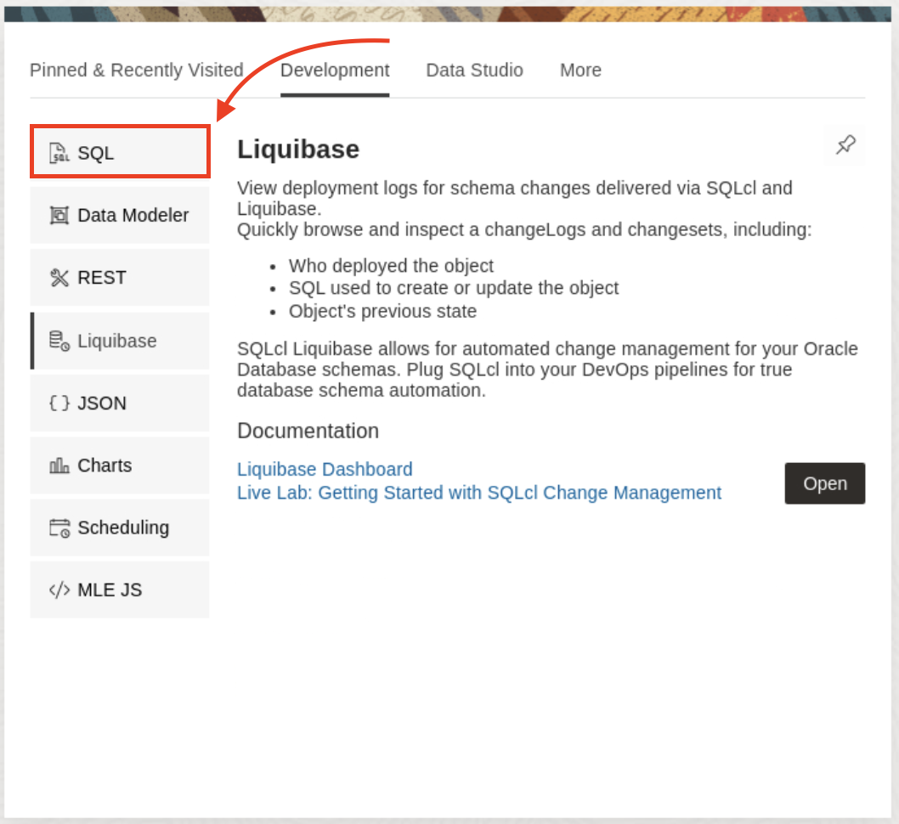

6. **Follow the tour and explore a bit!**
    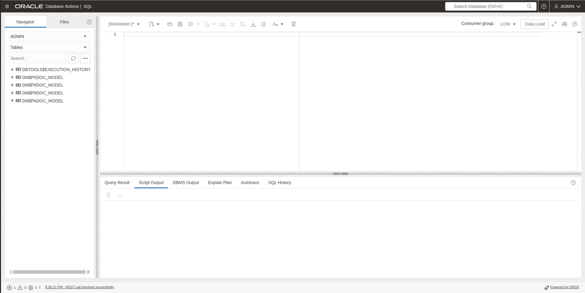

**You may proceed to the next lab.**


## Appendix 1: Restart Docker Container
1. If you wanted to stop the ADB Docker container at any time and start with a fresh one, feel free to. If you are in the middle of running the start-container.sh script, type ctrl+C to stop it.

2. Run this command to stop the container.

    ```
    <copy>
    podman-compose down
    </copy>
    ```

    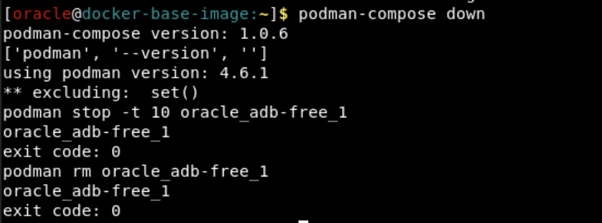

2. Return to the home directory and restart the start-container.sh script.

    ```
    <copy>
    cd ~
    ./start-container.sh
    </copy>
    ```

    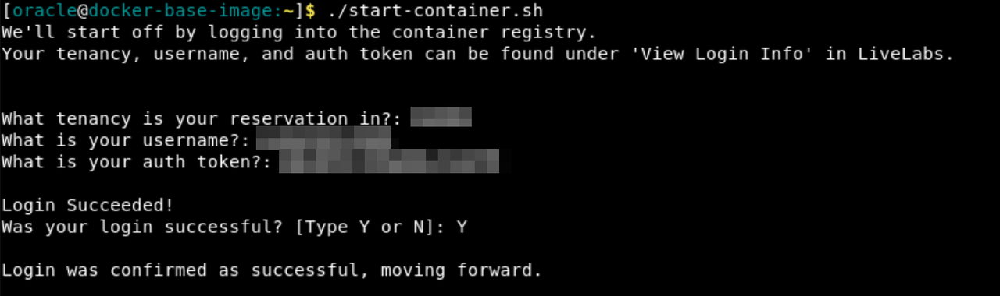

4. Run through the same steps onward of Task 1, step 4.

## Appendix 2: Explore the Podman Compose script
1. If you want to take a closer look at how we configure the container, run this command.

    ```
    <copy>
    cat ~/podman-compose.yml
    </copy>
    ```

    

## Acknowledgements
- **Authors** - Brianna Ambler, Dan Williams Database Product Management, July 2024
- **Contributors** - Brianna Ambler, Dan Williams,  Database Product Management
- **Last Updated By/Date** - Dan Williams, August 2024
