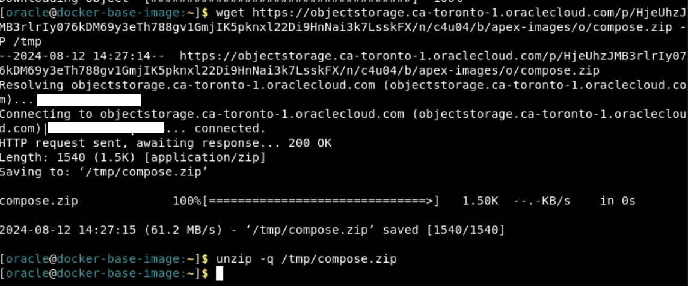
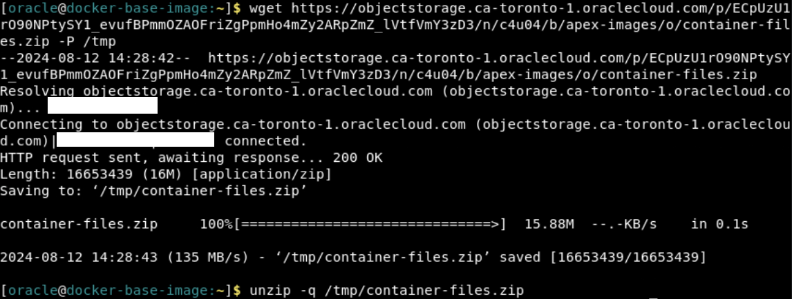
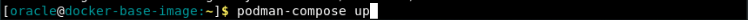
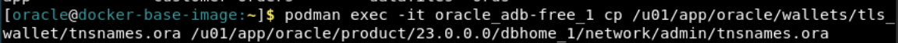

# Install Oracle Autonomous Database 23ai Free Docker Image

## Introduction
In this lab, you will experience just how easy it is to get started with the Oracle Autonomous Database 23ai Free Container Image. One launched, we will show you how to take advantage of the developer tools available to you, as we show you how to access SQL Developer Web & APEX--without any additional installations!

**_Estimated Time: 30 minutes_**

### **Objectives**
In this lab, you will:

* Launch the Docker container image.
* Connect to your Autonomous Database.
* Access SQL Developer Web & APEX.

### **Prerequisites**
This lab assumes you have:
- An Oracle account


## Task 1: Install and Configure the ADB Free 23ai Container Image

In the LiveLabs Sandbox, we will download the image from an OCI bucket. However, when using your own environment you will download the image directly from the Oracle Container Registry. That process is detailed in the free tier instructions.

**_Note:_** _All of the following commands are to be run in the remote desktop's terminal._

1.  **Set the OCI CLI environment variables.** Our image is stored in the Toronto region and we're using the instance principal authorization method. Run the following commands in the terminal to configure the OCI CLI accordingly.

    ```
    <copy>
    export OCI_CLI_REGION=ca-toronto-1
    export OCI_CLI_AUTH=instance_principal
    </copy>
    ```
     
2. **Download the image from Object Storage.** 

    ```
    <copy>
    oci os object get -bn image_bucket -ns c4u04 --name adb-free-23ai.tar.gz --file /tmp/adb-free-23ai.tar.gz
    </copy>
    ```
    

3. **Download the container installation files.** We'll be using three files to launch and configure the container. Read their descriptions below and proceed to downloading them with provided command.

    **podman-compose.yaml -** The YAML file provides the configuration details of the container. These details prepare the container to deploy ADB 23ai Free.<br />
    **db-config.sh + reset-image-prefix.sql -** Together, these scripts redirect APEX to images behind our firewall rather than their default location. This allows APEX to run properly on LiveLabs without any compliance breaches. 

    ```
    <copy>
    wget https://objectstorage.ca-toronto-1.oraclecloud.com/p/HjeUhzJMB3rlrIy076kDM69y3eTh788gv1GmjIK5pknxl22Di9HnNai3k7LsskFX/n/c4u04/b/apex-images/o/compose.zip -P /tmp
    unzip -q /tmp/compose.zip
    </copy>
    ```
    

4. **Download the container resource files.** The following command downloads the vector embedding model and the sample schema (for the vector search labs) and copies it into the container. Refer to Appendix 1: Understanding the YAML File for more details.

    ```
    <copy>
    wget https://objectstorage.ca-toronto-1.oraclecloud.com/p/ECpUzU1rO90NPtySY1_evufBPmmOZAOFriZgPpmHo4mZy2ARpZmZ_lVtfVmY3zD3/n/c4u04/b/apex-images/o/container-files.zip -P /tmp
    unzip -q /tmp/container-files.zip
    </copy>
    ```
    
5. **Load the image into the podman catalog. (~5 mins)** Our image has been downloaded locally. Podman-load copies the image from the local docker archive into the podman container storage. This will take about 5 minutes, let's review the YAML file in the meantime.

    ```
    <copy>
    podman load -i /tmp/adb-free-23ai.tar.gz
    </copy>
    ```
    

6. **Review the YAML file.** Run the following command to learn more about how the YAML file helps launch the container image.
    ```
    <copy>
    cat podman-compose.yml
    </copy>
    ```

    ```
    version: "3.9"
    services:
    adb-free:  # Name of the service/container.
    image: container-registry.oracle.com/database/adb-free:latest-23ai
    # The container image to use. In this case, it's an Oracle Autonomous Database Free image.

    environment:  # Environment variables passed to the container.
      - WORKLOAD_TYPE=ATP  # Specify the workload type (ATP stands for Autonomous Transaction Processing).
      - WALLET_PASSWORD=Welcome_12345  # Password for the database wallet.
      - ADMIN_PASSWORD=Welcome_12345  # Admin user password for the database.

    ports:  # Mapping of host ports to container ports.
      - "1521:1522"  # Map host port 1521 to container port 1522 (database listener port).
      - "1522:1522"  # Map host port 1522 to container port 1522 (alternative database listener port).
      - "8443:8443"  # Map host port 8443 to container port 8443 (HTTPS port).
      - "27017:27017"  # Map host port 27017 to container port 27017 (MongoDB port).

    volumes:  # Mount host directories/files into the container.
      - "/home/oracle/scripts/db-config.sh:/u01/scripts/db-config.sh:Z"
      - "/home/oracle/scripts/reset-image-prefix.sql:/u01/scripts/reset-image-prefix.sql:Z" 
      - "/home/oracle/BERT-TINY.onnx:/u01/BERT-TINY.onnx:Z" 
      - "/home/oracle/customer-orders/:/u01/customer-orders:Z" 

    devices:  # Allow the container to access specific devices on the host.
      - /dev/fuse  # /dev/fuse is required for file system operations like mounting.

    cap_add:  # Add Linux capabilities to the container.
      - SYS_ADMIN  # SYS_ADMIN capability is required for mounting file systems.

    restart: on-failure  # Automatically restart the container if it exits with a non-zero status.

    userns_mode: "keep-id"  # Keep the user namespace mapping, meaning the container runs with the same user ID as on the host.
    ```

7. **Launch the image.** The podman-compose command will configure and run the container image based on your YAML file. You can configure the ADB to be suited for any workload type. However, we've preset the workload type to ATP.

    ```
    <copy>
    podman-compose up
    </copy>
    ```
    

8. **In a new terminal tab, confirm the container is up and running.** In another tab of the terminal, run this command. 

      ```
    <copy>
    podman ps
    </copy>
    ```
    

9. **Confirm ORDS is running.**
    ```
    <copy>
    podman exec -it ps -ef | grep ords.war
    podman exec -it jps -mlv | grep ords
    </copy>
    ```
    
10. **Confirm the files were pre-loaded into the container.**
    ```
    <copy>
    podman exec -it oracle_adb-free_1 ls /u01
    podman exec -it oracle_adb-free_1 ls /u01/scripts
    podman exec -it oracle_adb-free_1 ls /u01/customer-orders
    </copy>
    ```
    

11. **Relocate tnsnames.ora in the container.** 'tnsnames.ora' is a configuration file, storing the database details necessary for connection. We're moving the file into a directory that's meant for our database for easy connection.
    ```
    <copy>
    podman exec -it oracle_adb-free_1 cp /u01/app/oracle/wallets/tls_wallet/tnsnames.ora /u01/app/oracle/product/23.0.0.0/dbhome_1/network/admin/tnsnames.ora
    </copy>
    ```
    

## Task 2: Access APEX & SQL Developer Web

Oracle Autonomous Database Free has APEX and ORDS (a.k.a Database Actions) preinstalled. Let's see how you can get started!

1. **Re-configure the APEX image.** We'll first need to redirect APEX to use the images behind our firewall. Run this command in the terminal to do so.

    ```
    <copy>
    podman exec -it oracle_adb-free_1 /bin/sh -c "/u01/scripts/db-config.sh"
    </copy>
    ```  

2. **Open Google Chrome.** Click Activities >> Google Chrome icon, to open a new Chrome window.
    
    
3. **Launch ORDS.** Paste the following URL into your Chrome browser to Launch ORDS.

    ```
    <copy>
    https://localhost:8443/ords
    </copy>
    ```
    

4. **Sign into ORDS.** 
    
    **Username -** admin
    **Password -** Welcome_12345 (or the custom password you specified in Task 1, Step 5.)

    

5. **Launch SQL Developer Web.** You now have access to Database Actions! This is where you'll find both APEX and SQL Developer Web. For now, we'll only launch SQL Developer Web.

    

8. **Sign-in to SQL Developer Web.** <br/>
    **Username -** admin <br/>
    **Password -** Welcome_12345 (or the custom password you specified in Task 1, Step 5.)

    

9. **Lauch the SQL worksheet.** Select the 'SQL' tab, as shown below.

You may proceed to the next lab.


## Appendix 1: Restart Docker Container
1. If you wanted to stop the ADB Docker container at any time and start with a fresh one, feel free to. If you are in the middle of running the start-container.sh script, type ctrl+C to stop it.

2. Run this command to stop the container.

    ```
    <copy>
    podman-compose down
    </copy>
    ```

    

2. Return to the home directory and restart the start-container.sh script.

    ```
    <copy>
    cd ~
    ./start-container.sh
    </copy>
    ```

    

4. Run through the same steps onward of Task 1, step 4.

## Appendix 2: Explore the Podman Compose script
1. If you want to take a closer look at how we configure the container, run this command.

    ```
    <copy>
    cat ~/podman-compose.yml
    </copy>
    ```

    

## Acknowledgements
- **Authors** - Brianna Ambler, Dan Williams Database Product Management, July 2024
- **Contributors** - Brianna Ambler, Dan Williams,  Database Product Management
- **Last Updated By/Date** - Dan Williams, August 2024
