# Bank Transfers Graph Example with SQL/PGQ in 23ai

## Introduction

In this lab you will view the queries created the graph (that is, `bank_graph`) in APEX.

Estimated Time: 10 minutes.

<!-- <if type="livelabs">
Watch the video below for a quick walk-through of the lab. 
[Change password](videohub:1_ypjlr8es)
</if> -->

### Objectives
Learn how to:
- Use APEX and SQL to query, analyze, and visualize a graph.

### Prerequisites
This lab assumes:
- The graph user and graph bank_graph exists
- Access to Oracle APEX

## Task 1: Login and create APEX workspace

1. Go back to LiveLabs and click on View Login Details, and then APEX URL to open your APEX workspace in a new tab.

    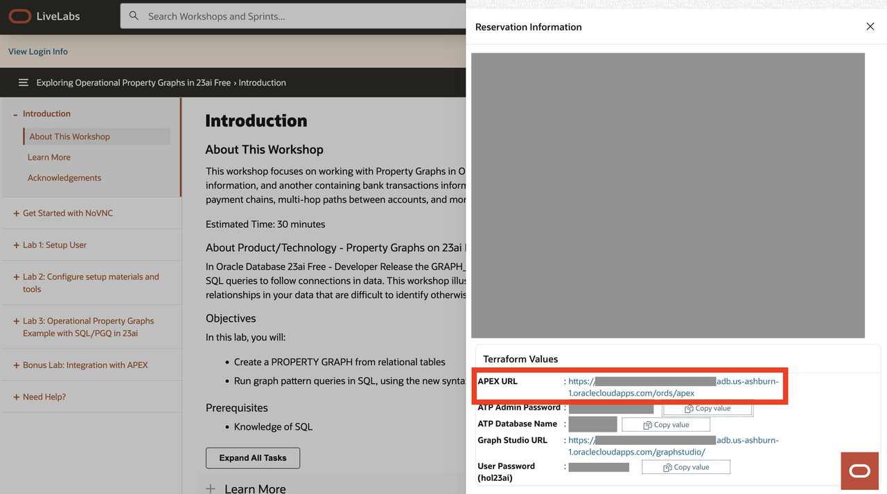

2. Fill out your password with your ATP Admin Password that's underneath your Terraform variables in your Login Details. 

    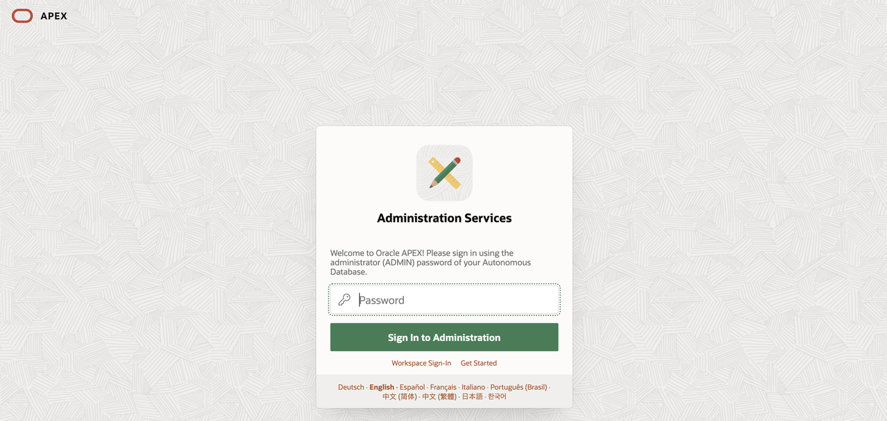

3. You can see the welcome screen for APEX now. Click Create Workspace.

    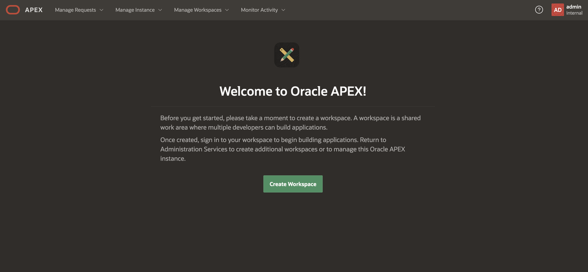

4. Click Existing Schema.

    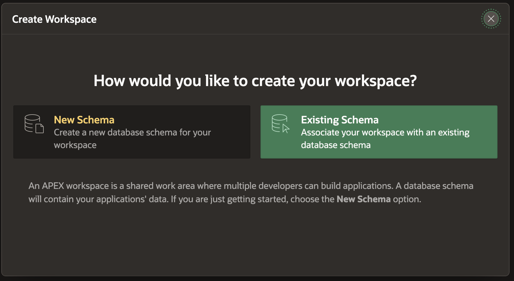

5. Fill out the following information for the workspace. 

    Database User: Click on the menu icon and select HOL23AI.

    Workspace: HOL23AI (filled out automatically).

    Workspace Username: graph

    Username Password: User Password (hol23ai) that's underneath your Terraform variables.

    Click Create Workspace.

    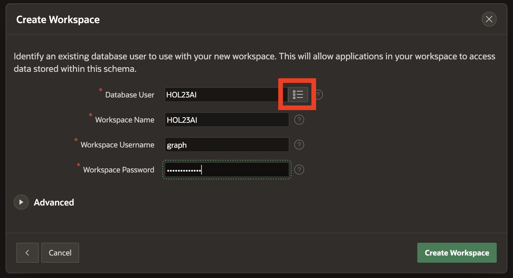

6. Success! Workspace created.

    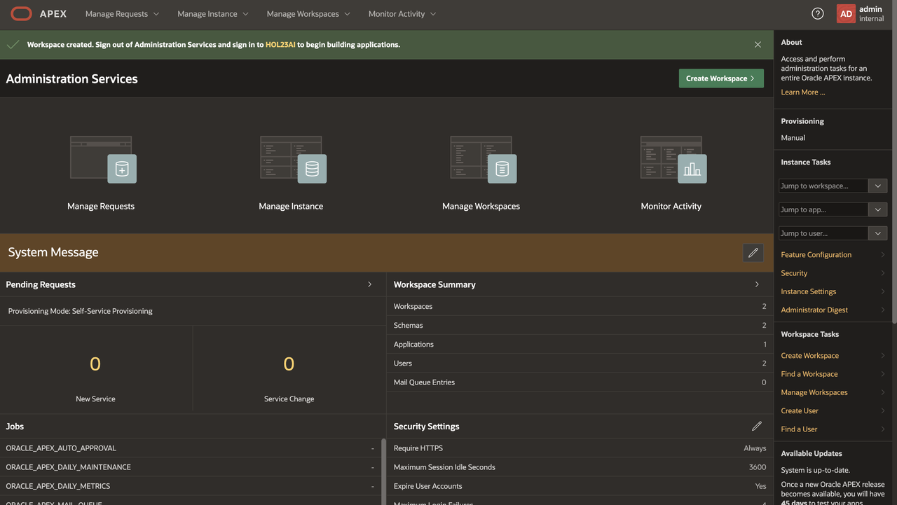

## Task 2: Import APEX app to visualize queries

1. In the upper right corner, click the admin icon then click Sign out.

    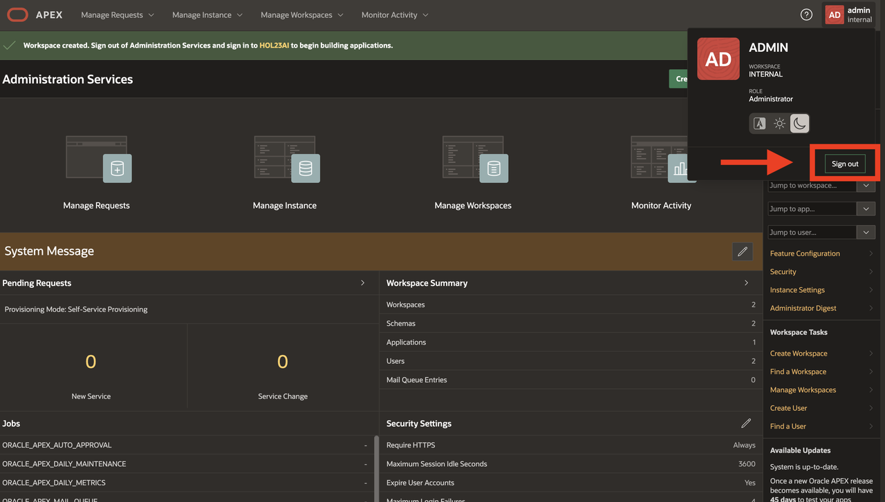

2.  Log back in as the admin info you just created along with the workspace name as HOL23AI and username as graph.

    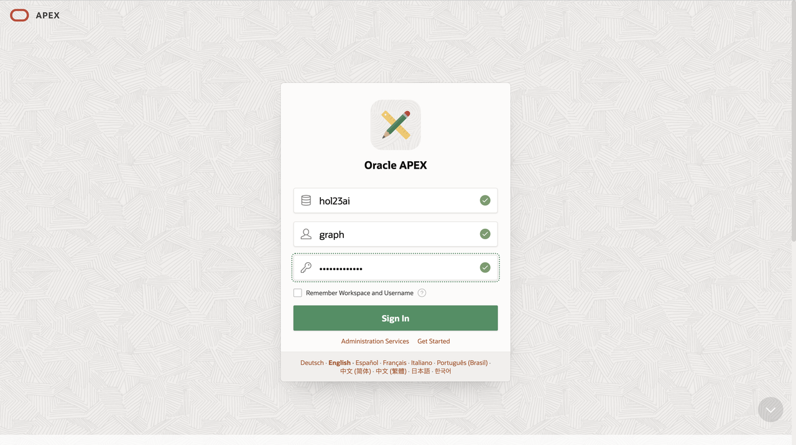

3. You should now be on the homepage of your workspace.

    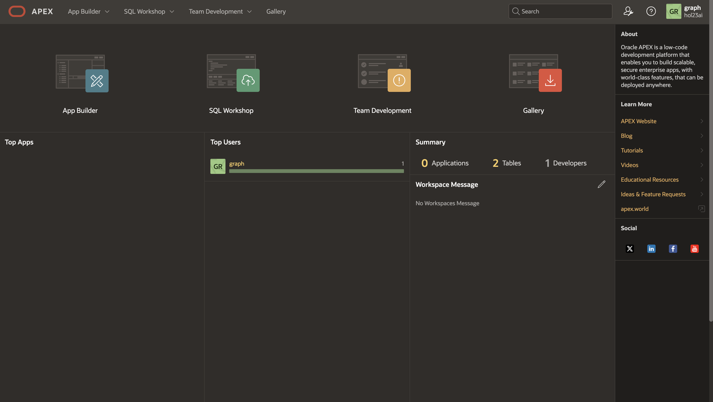

4. Click App Builder -> Import.

    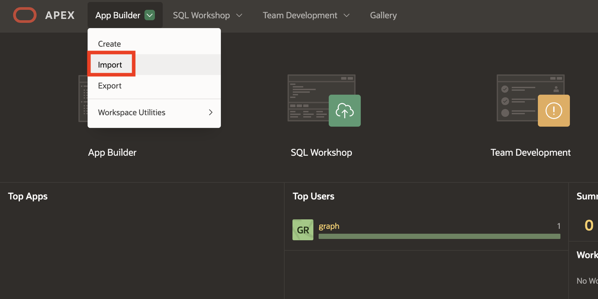

5. Click to add a file to open for import. In the beginning of this lab, you had downloaded and unzipped a zip file. Within there, you should navigate to the graph folder -> f106.sql. Leave the defaults and click Next.

    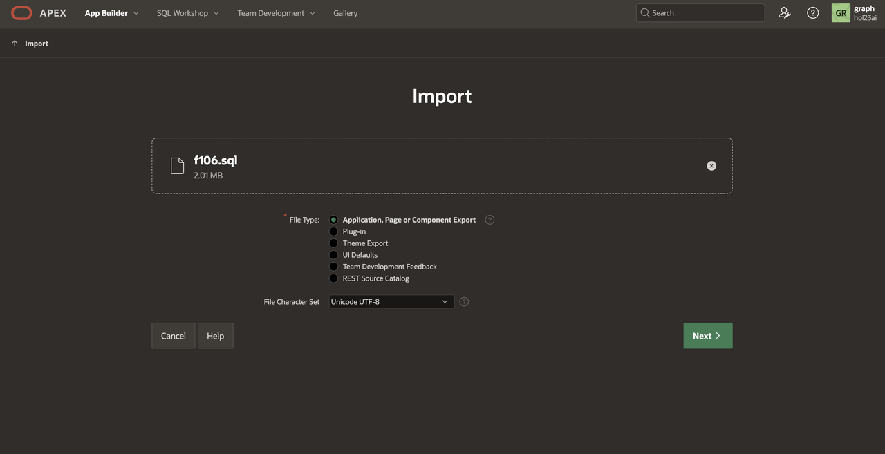

    
7.  Select Reuse Application ID 106 From Export File. Leave all other options and click Install Application.

    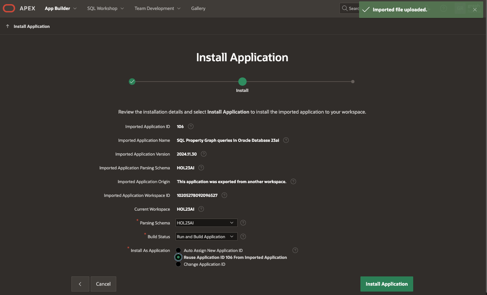

8.  Click Install Supporting Objects.

    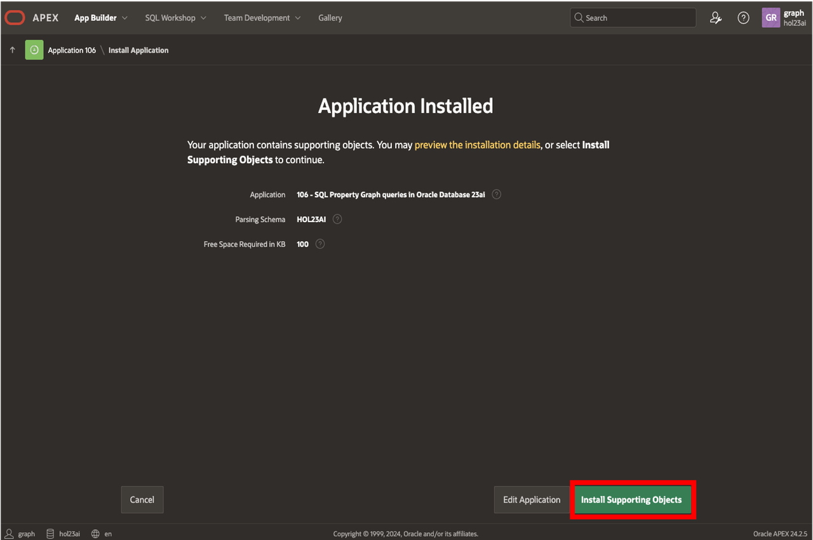

9.  Click Run Application.

    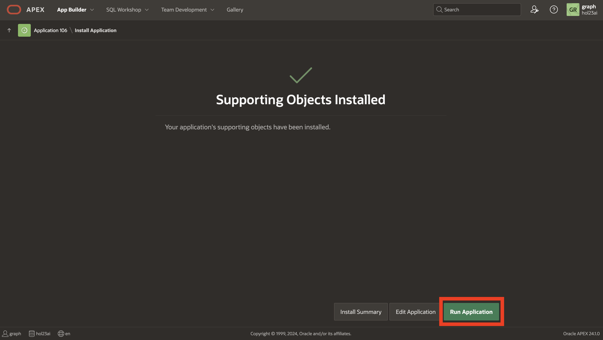

10.  Login with your graph user and the password.

    **NOTE:** graph is case-sensitive.

    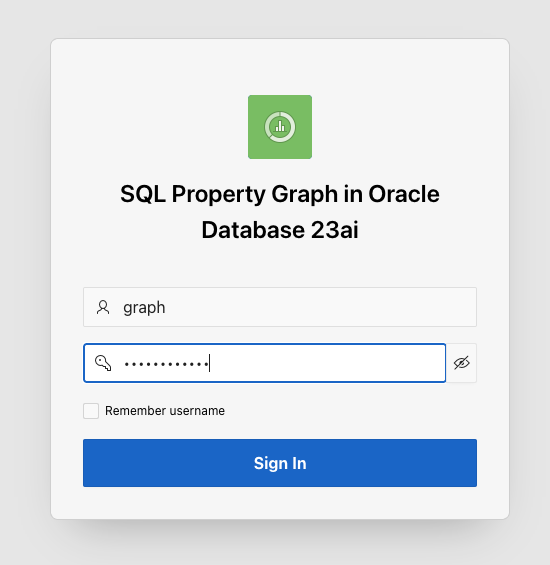

11. Click Property Graph queries with SQL box.
    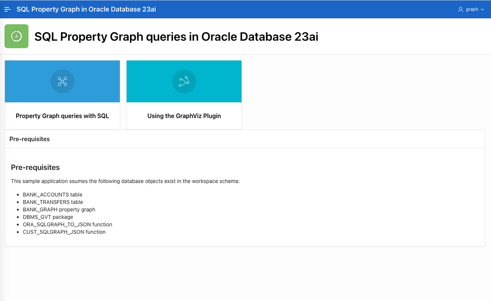
    
12. Scroll through output to see the queries that you had ran in the prior lab visualized.
    

13. Click the hamburger menu in the upper left corner of the application and click "Using the Graph Visualization Plugin".

    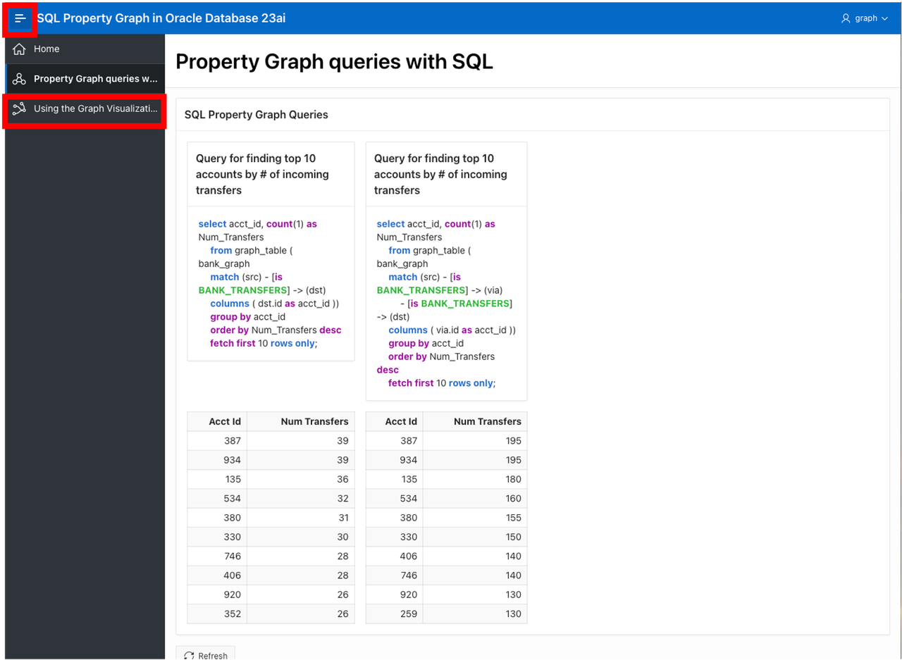

14. Scroll through the output to see the Graph Viz plugin utilized.
    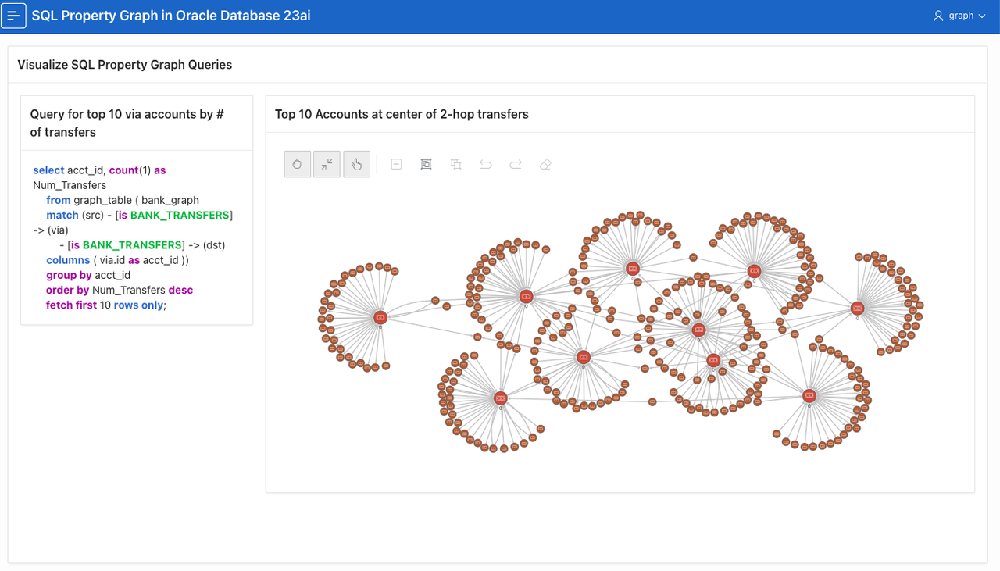

15. You have now completed this lab.

## Learn More
* [Oracle Property Graph](https://docs.oracle.com/en/database/oracle/property-graph/index.html)
* [SQL Property Graph syntax in Oracle Database 23ai Free - Developer Release](https://docs.oracle.com/en/database/oracle/property-graph/23.1/spgdg/sql-ddl-statements-property-graphs.html#GUID-6EEB2B99-C84E-449E-92DE-89A5BBB5C96E)

## Acknowledgements
- **Author** - Kaylien Phan, Thea Lazarova, William Masdon
- **Contributors** - Melliyal Annamalai, Jayant Sharma, Ramu Murakami Gutierrez, Rahul Tasker
- **Last Updated By/Date** - Renée Wikestad, June 2025
