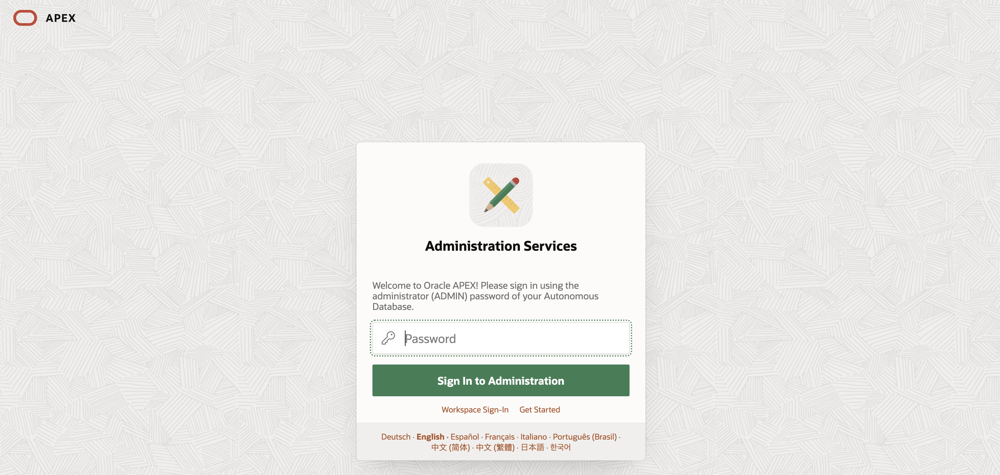
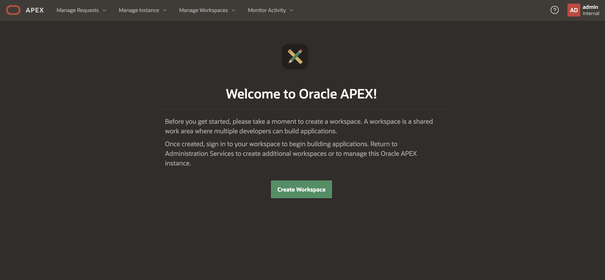
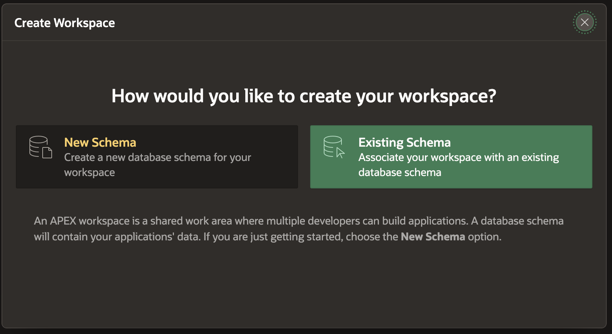

# Bank Transfers Graph Example with SQL/PGQ in 26ai

## Introduction

In this lab you will view the queries created the graph (that is, `bank_graph`) in APEX.

Estimated Time: 10 minutes.

<!-- <if type="livelabs">
Watch the video below for a quick walk-through of the lab. 
[Change password](videohub:1_ypjlr8es)
</if> -->

### Objectives

Learn how to:

- Use APEX and SQL to query, analyze, and visualize a graph.

### Prerequisites

This lab assumes:

- The graph user and graph bank_graph exists
- Access to Oracle APEX

## Task 1: Login and create APEX workspace

1. Go back to LiveLabs and click on View Login Details, and then APEX URL to open your APEX workspace in a new tab.

    

2. Fill out your password with your ATP Admin Password that's underneath your Terraform Values in your Login Details.

    

3. You can see the welcome screen for APEX now. Click Create Workspace.

    

4. Click Existing Schema.

    

5. Fill out the following information for the workspace.

    Database User: Click on the menu icon and select GRAPHUSER.

    Workspace: GRAPHUSER (filled out automatically).

    Workspace Username: graph

    Username Password: User Password (graphuser) that's underneath your Terraform Values.

    Click **Create Workspace**.

    

6. Success! Workspace created.

    

## Task 2: Import APEX app to visualize queries

1. In the upper right corner, click the admin icon then click Sign out.

    

2.  Log back in as the admin info you just created along with the workspace name as GRAPHUSER and username as graph.

    

3. You should now be on the homepage of your workspace.

    

4. Click App Builder -> Import.

    

5. Click to add a file to open for import. In the beginning of this workshop, you downloaded and unzipped a zip file. Within there, you should navigate to the graph folder -> f106.sql. Leave the defaults and click Next.

    

6.  Select Reuse Application ID 106 From Export File. Leave all other options and click Install Application.

    

7.  Click Install Supporting Objects.

    

8.  Click Run Application.

    

9.  Login with your graph user and the password.

    **NOTE:** graph is case-sensitive.

    

10. Click Property Graph queries with SQL box.
    
    
11. Scroll through output to see the queries that you had ran in the prior lab visualized.
    

12. Click the hamburger menu in the upper left corner of the application and click "Using the Graph Visualization Plugin".

    

13. Scroll through the output to see the Graph Viz plugin utilized.
    

14. You have now completed this lab.

## Learn More

- [Oracle Property Graph](https://docs.oracle.com/en/database/oracle/property-graph/index.html)
- [Graph Developer's Guide for Property Graph - SQL DDL Statements for Property Graphs](https://docs.oracle.com/en/database/oracle/property-graph/25.4/spgdg/sql-ddl-statements-property-graphs.html)

## Acknowledgements

- **Author** - Kaylien Phan, Thea Lazarova, William Masdon
- **Contributors** - Melliyal Annamalai, Jayant Sharma, Ramu Murakami Gutierrez, Rahul Tasker, Renée Wikestad
- **Last Updated By/Date** - Denise Myrick, November 2025
