# Tools Setup

## Introduction

This lab walks you through configuring SQLcl, APEX and ORDS.

Estimated Time: 20 minutes

### Objectives

In this lab, you will:
* Configure SQLcl
* Configure APEX
* Configure ORDS
* Login to Database Actions (SQL Developer Web)

### Prerequisites

This lab assumes you have:
* Completed all previous workshops
* Have a Linux VM running Oracle Database 23ai Free Database
* Have access to a GUI on the Linux VM to run Database Actions (SQL Developer Web)

[Lab Walkthrough](videohub:1_17wvzaf1)

## Task 1: Setup SQLcl

1. Open a terminal if you don't currently have one open. To open one Click on Activities and then Terminal.

    


2. A newer version of java will be installed and you will need to ensure the environment variable JAVA_HOME is pointing at it. Some of the utilities require a higher version.
    ```
    <copy>
    sudo dnf install -y jdk-17.x86_64

    java -version

    echo $JAVA_HOME
    </copy>
    ```
    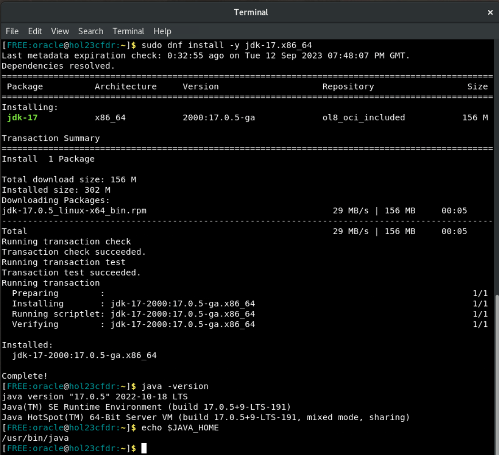

3. Install SQLcl using dnf.
    ```
    <copy>
    sudo dnf install -y sqlcl
    </copy>
    ```
    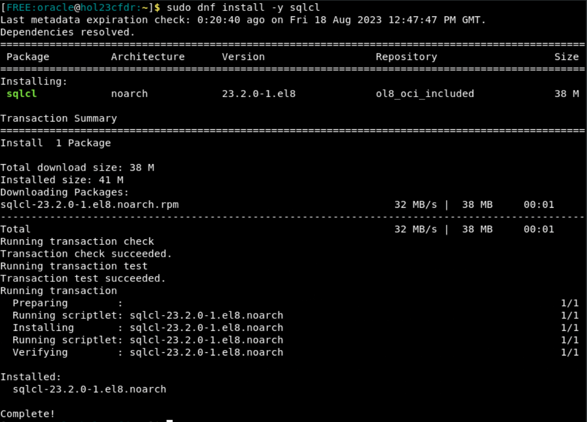

4. Test out SQLcl by connecting to the database. Notice the command is sql not sqlplus.
    ```
    <copy>
    sql / as sysdba
    </copy>
    ```
    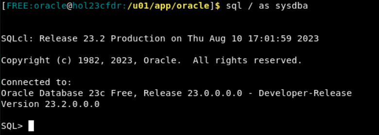

5. You can explore the database if you want. When you get done type exit. Your first few commands might take a little longer as the java environment is initializing.
    ```
    <copy>
    show pdbs
    </copy>
    ```
    ```
    <copy>
    exit
    </copy>
    ```
    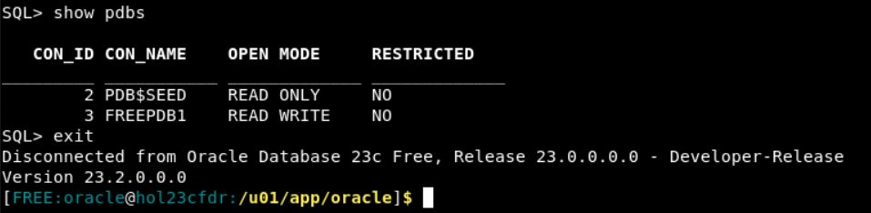

## Task 2: Setup APEX

1. Install APEX using dnf. The first command installs apex and the second adds the images directory that will be used later. What you will also notice is this has a dependency on ORDS and install it.
    ```
    <copy>
    sudo dnf install -y oracle-apex23.1.noarch
    sudo dnf install -y oracle-apex23.1-images.noarch
    </copy>
    ```
    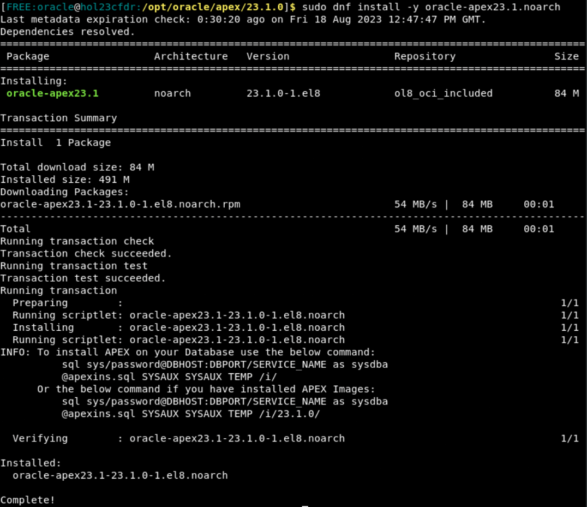
    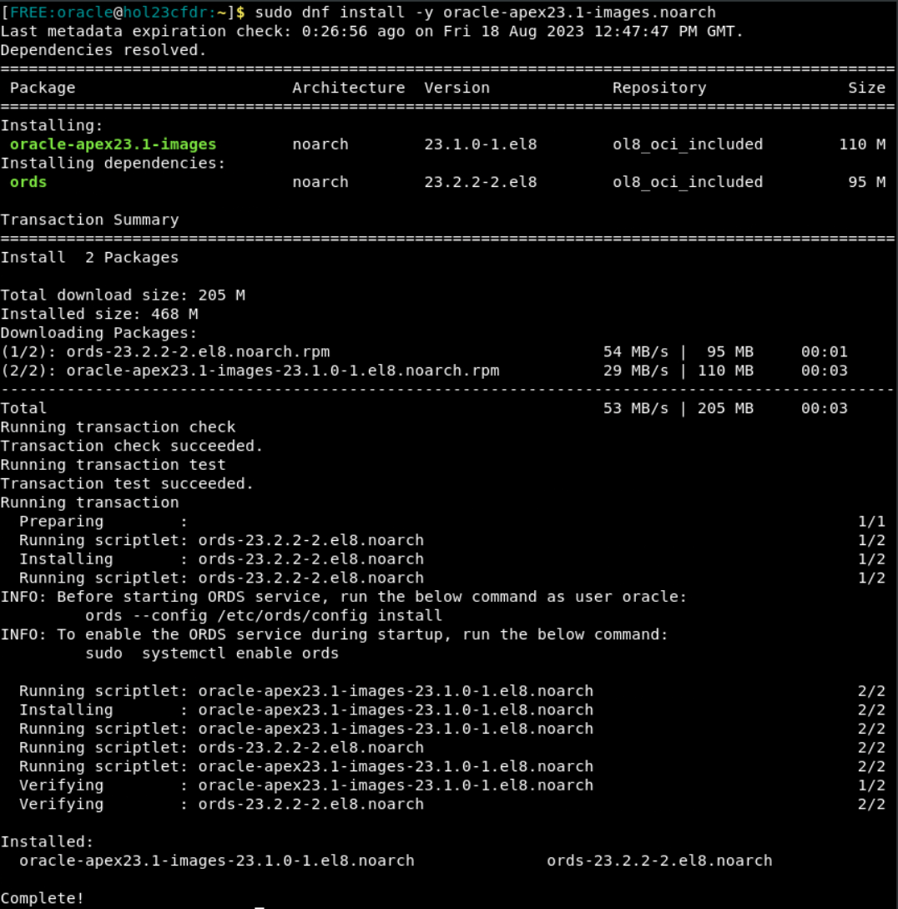

2. Run the install script into the <b>Pluggable</b> database. It's important that you install into the pluggable and not the container. Please review the architecture section of the APEX documentation in the additional information section for different deployment modes. This script will take about 5-7 minutes to complete.
    ```
    <copy>
    cd /opt/oracle/apex/23.1.0
    sql / as sysdba
    </copy>
    ```
    ```
    <copy>
    ALTER SESSION SET CONTAINER = FREEPDB1;
    </copy>
    ```
    ```
    <copy>  
    @apexins.sql SYSAUX SYSAUX TEMP /i/
    </copy>
    ```
    ```
    <copy>
    exit;
    </copy>
    ```
    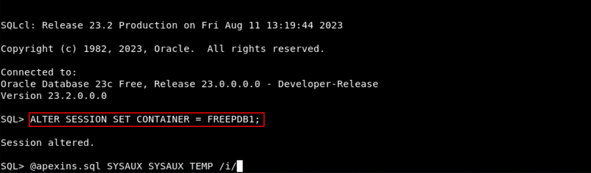
    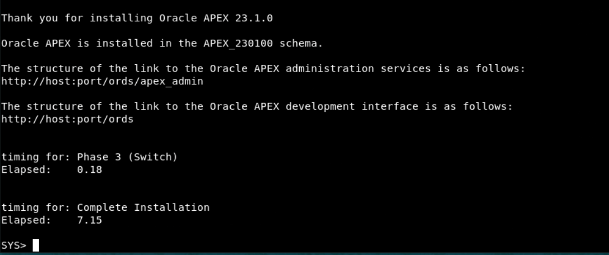

3. Run the change password script into the <b>Pluggable</b> database. When prompted use the values below
    - Username: Use the default ADMIN
    - Email: Use the default ADMIN
    - Password: Provide a password, I will use Welcome123#
    ```
    <copy>
    sql / as sysdba
    </copy>
    ```
    ```
    <copy>
    ALTER SESSION SET CONTAINER = FREEPDB1;
    </copy>
    ```
    ```
    <copy>
    @apxchpwd.sql
    </copy>
    ```
    ```
    <copy>
    exit;
    </copy>
    ```
    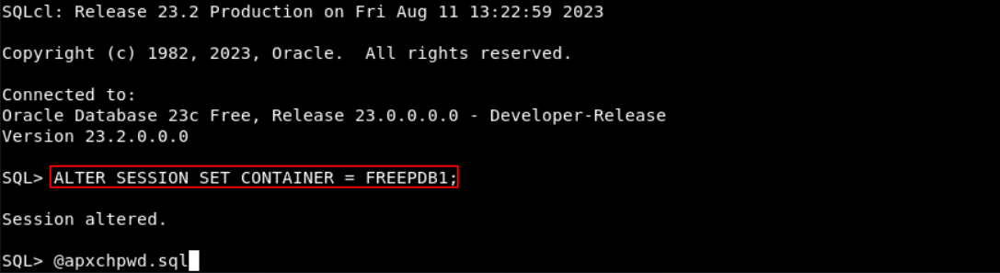

4. Unlock and set the passwords for the various accounts in the <b>Pluggable</b> database. You will be prompted during the rest config script. I'm going to use Welcome123# for my examples but you can use any password you want.
    ```
    <copy>
    sql / as sysdba
    </copy>
    ```
    ```
    <copy>
    ALTER SESSION SET CONTAINER = FREEPDB1;
    </copy>
    ```
    ```
    <copy>
    ALTER USER APEX_PUBLIC_USER IDENTIFIED BY Welcome123# ACCOUNT UNLOCK;
    </copy>
    ```
    ```
    <copy>
    @apex_rest_config.sql
    </copy>
    ```
    ```
    <copy>
    exit;
    </copy>
    ```
    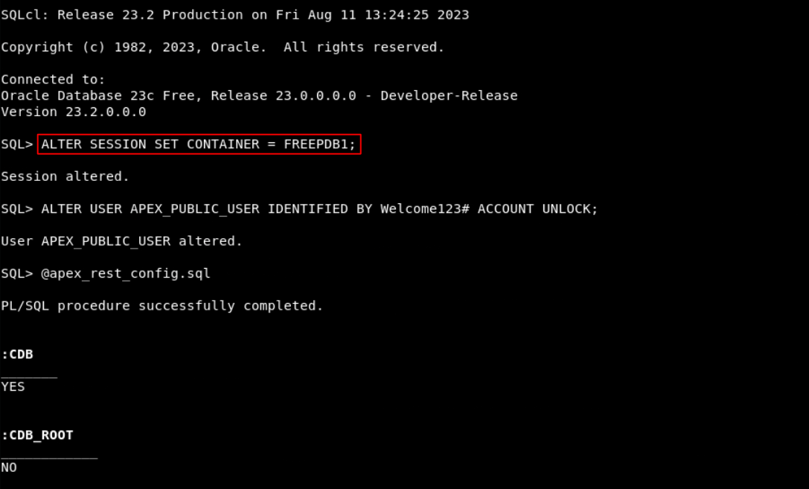

## Task 3: Setup ORDS

1. Install ORDS using the dnf command. What you will see is that it is already installed. This happened when the images directory was installed.
    ```
    <copy>
    sudo dnf install -y ords
    </copy>
    ```
    

2. You will need to grant the correct privileges to the hol23c user.
    ```
    <copy>
    cd /opt/oracle/ords/scripts/installer
    sql / as sysdba
    </copy>
    ```
    ```
    <copy>
    ALTER SESSION SET CONTAINER = FREEPDB1;
    </copy>
    ```
    ```
    <copy>
    @ords_installer_privileges.sql hol23c
    </copy>
    ```
    ```
    <copy>
    exit;
    </copy>
    ```
    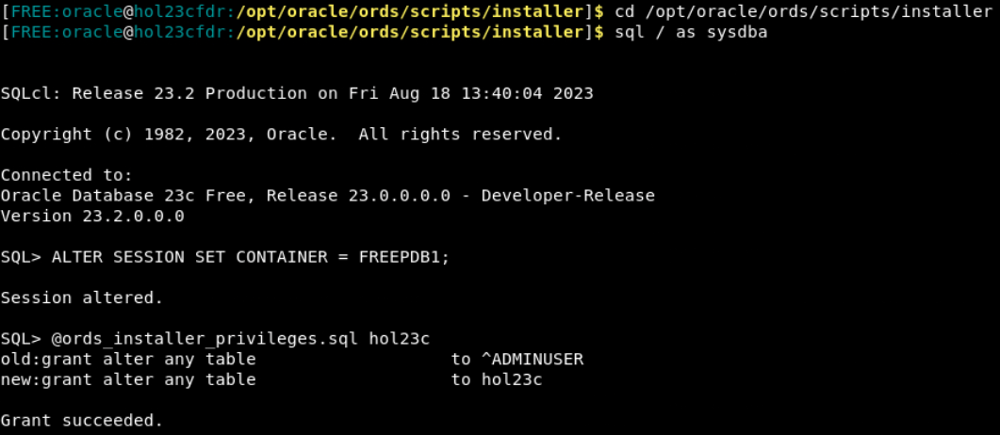

3. Copy the images directory from APEX to the ORDS directory
    ```
    <copy>
    cp -r /opt/oracle/apex/23.1.0/images /opt/oracle/ords
    </copy>
    ```
    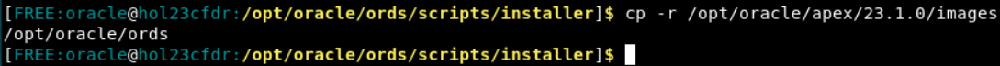

4. Install ORDS answering the prompts with the following responses:
    - Installation: 2
    - Connection: 1
    - Hostname: localhost
    - Port: 1521 (Unless you used a different one)
    - Service Name: <b>FREEPDB1 (The PDB not the container)</b>
    - username: hol23c
    - password: Welcome123# (Unless you used a different one for hol23c)
    - Default tablespace: SYSAUX
    - Temporary Tablespace: TEMP
    - Features: 1 Database Actions (Enables all features)
    - Configuration: 1 Configure and Start
    - Protocol: 1 HTTP
    - HTTP port: 8080
    - Static resources location: /opt/oracle/ords/images
    ```
    <copy>
    ords --config /etc/ords/config install
    </copy>
    ```
    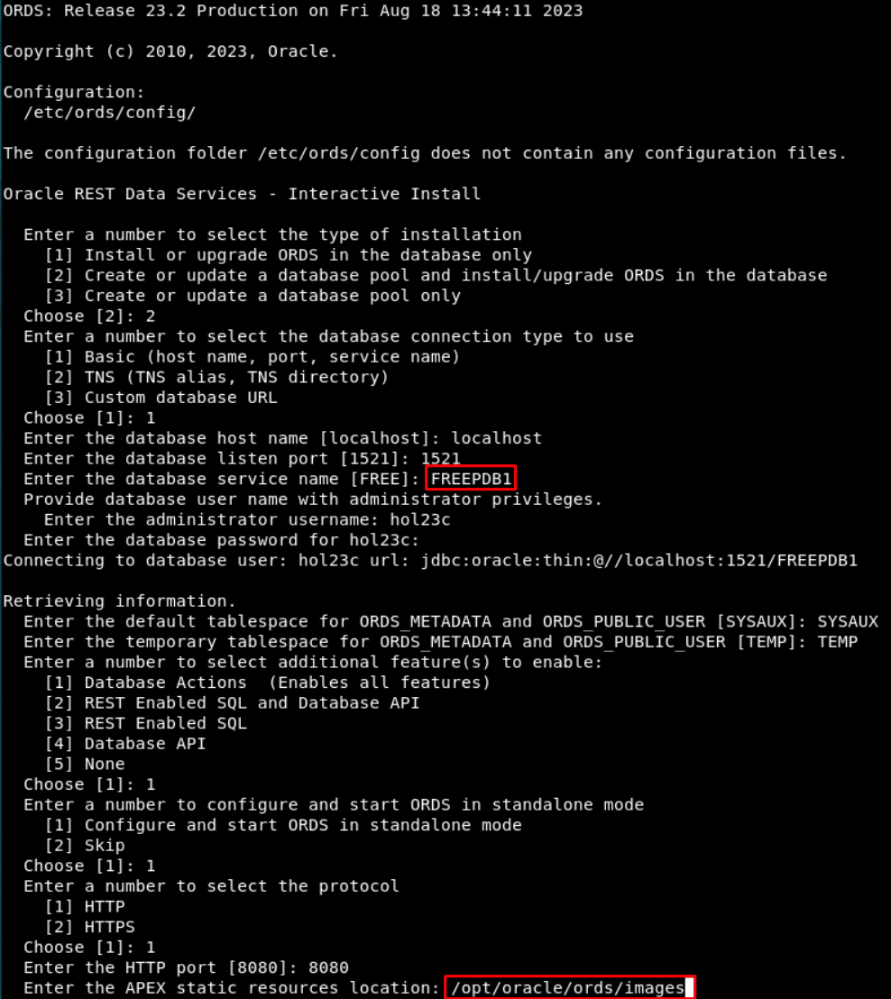

5. After the installation has completed, the screen stops scrolling and you see the line "Oracle REST Data Services initialized" Stop ORDS by pressing CTRL-C
    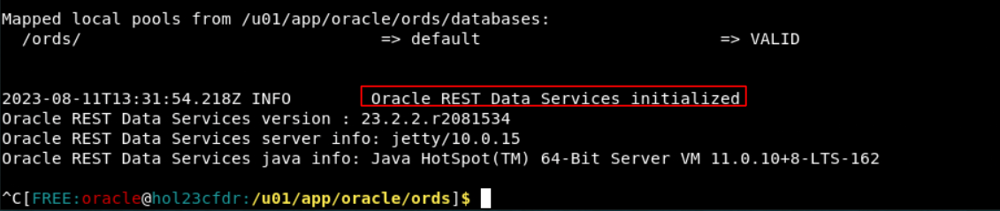

6. Enable hol23c the ability to use ORDS.
    ```
    <copy>
    sql hol23c/Welcome123#@localhost:1521/freepdb1
    </copy>
    ```
    ```
    <copy>
    BEGIN
     ords_admin.enable_schema(
         p_enabled => TRUE,
         p_schema => 'HOL23C',
         p_url_mapping_type => 'BASE_PATH',
         p_url_mapping_pattern => 'hol23c',
         p_auto_rest_auth => NULL
     );
    commit;
    END;
    /
    </copy>
    ```
    ```
    <copy>
    exit;
    </copy>
    ```
    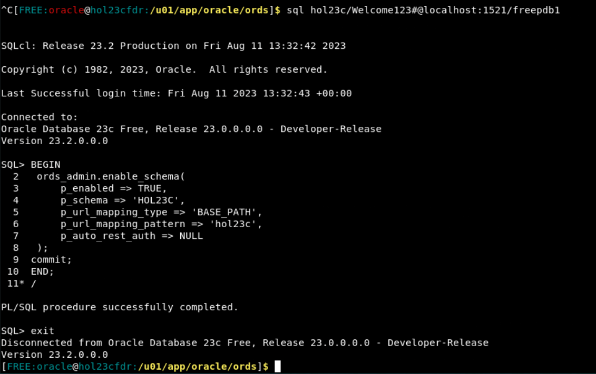

## Task 4: Login

1. Restart ORDS. Wait about 30 seconds for it to finish starting before proceeding.
    ```
    <copy>
    sudo systemctl stop ords
    sudo systemctl start ords
    </copy>
    ```
    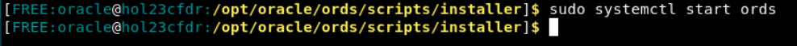

2. Open a browser. If you have one currently open you can click on new window. If not click on activities and then browser.
    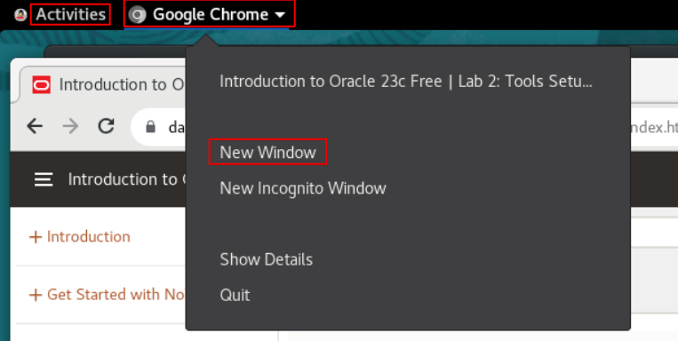

3. Navigate to SQL Developer Web by going to the following address.
    ```
    <copy>
    http://localhost:8080/ords/
    </copy>
    ```
    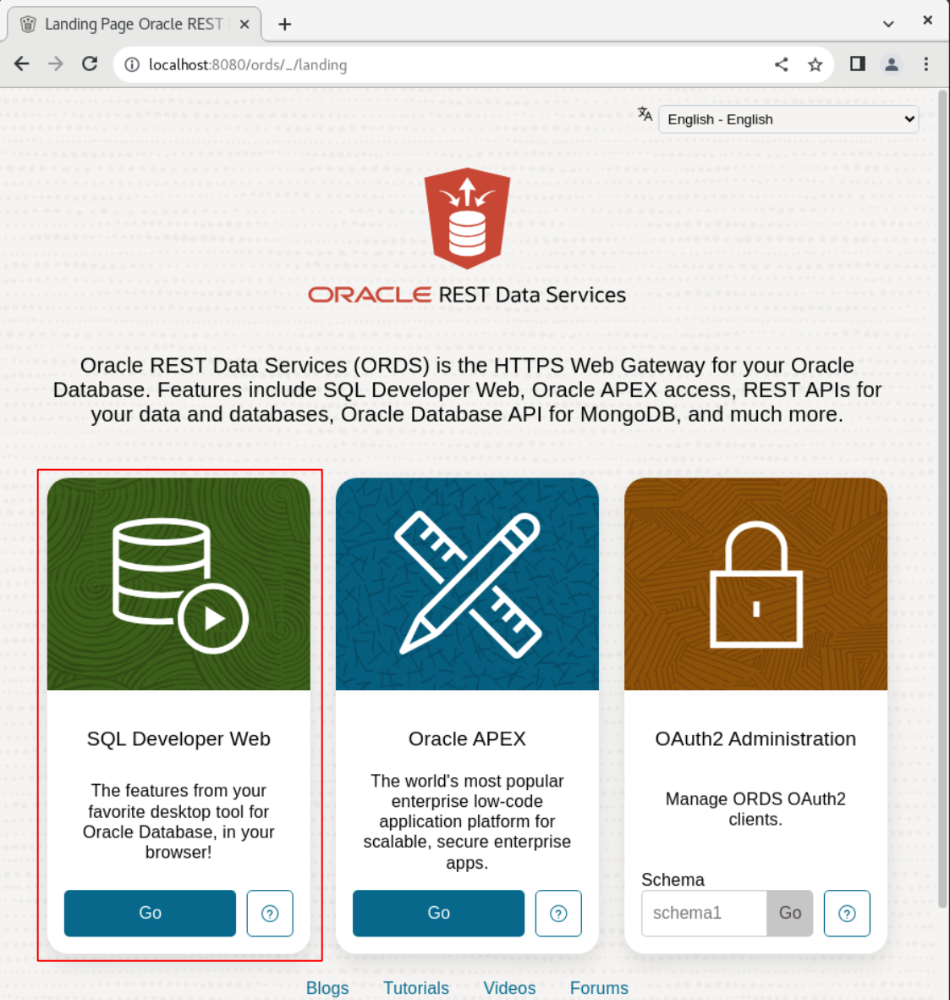

4. Log into sql dev web as hol23c with your password. I used Welcome123#.
    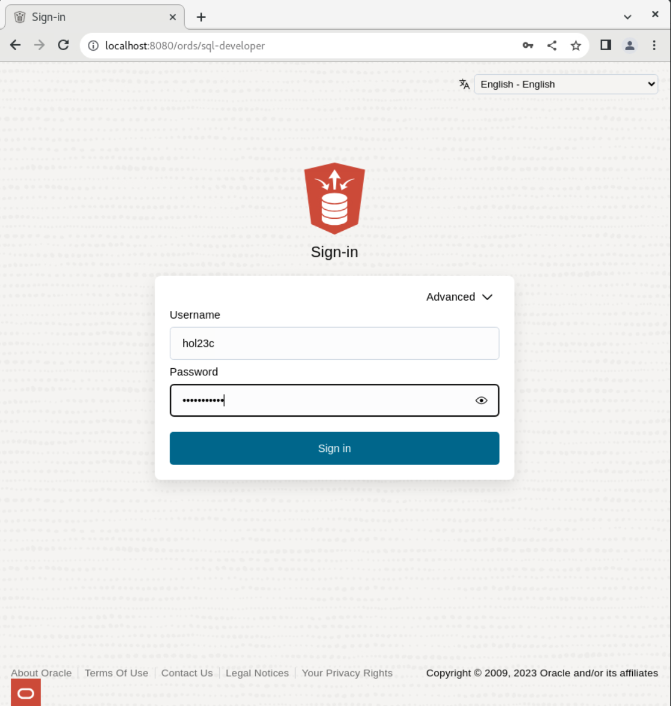

5. You may now **proceed to the next lab**
    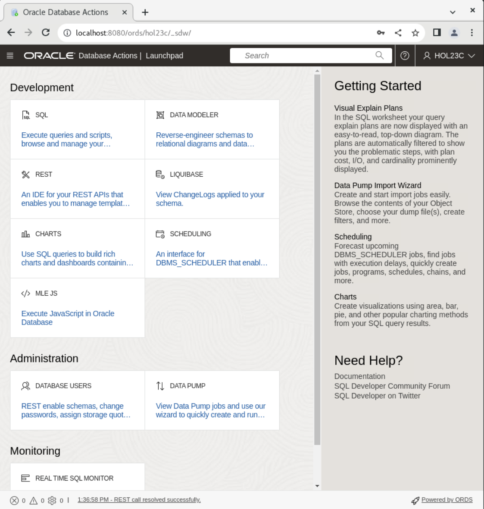

## Learn More

* [Oracle SQLcl] (https://www.oracle.com/database/sqldeveloper/technologies/sqlcl)
* [Oracle Database Actions] (https://www.oracle.com/database/sqldeveloper/technologies/db-actions/)
* [Oracle APEX] (https://www.oracle.com/tools/downloads/apex-downloads)
* [Oracle APEX Installation Architecture Choices] (https://docs.oracle.com/en/database/oracle/apex/23.1/htmig/understanding-installation-choices.html#GUID-A805FD4D-6049-429D-9DD2-717C75D96E62)

## Acknowledgements
* **Author** - David Start, Database Product Management
* **Contributors** - David Start, Database Product Management
* **Last Updated By/Date** - David Start, Database Product Management, August 2023
