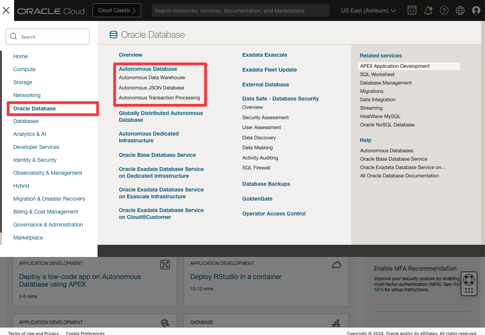
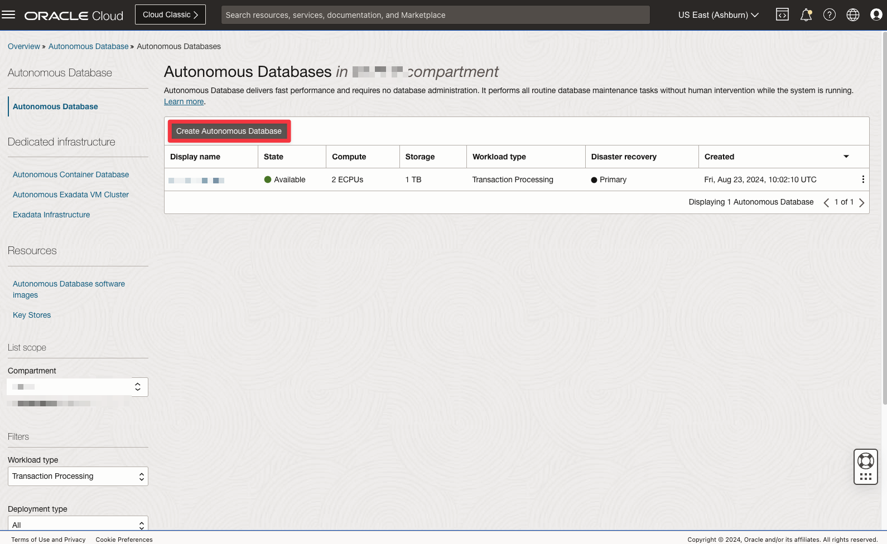
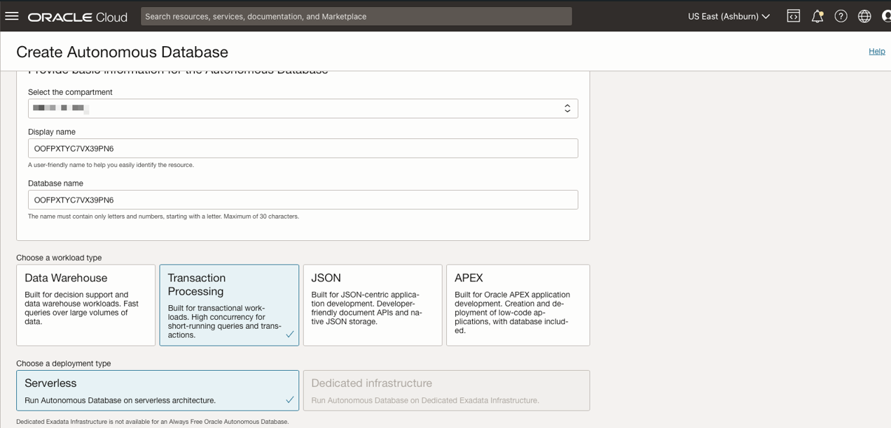
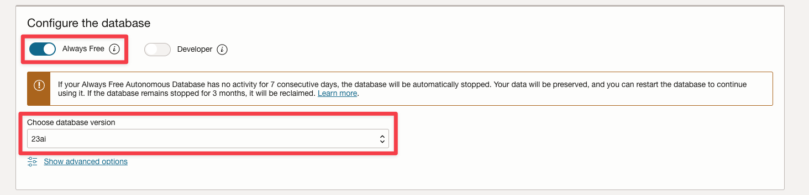
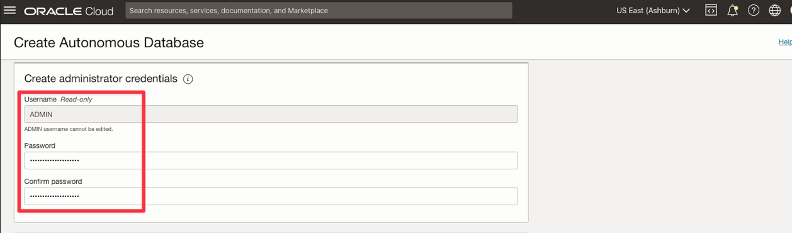
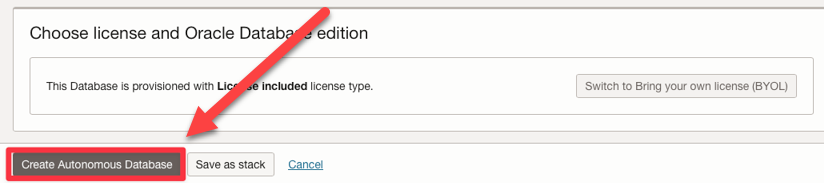
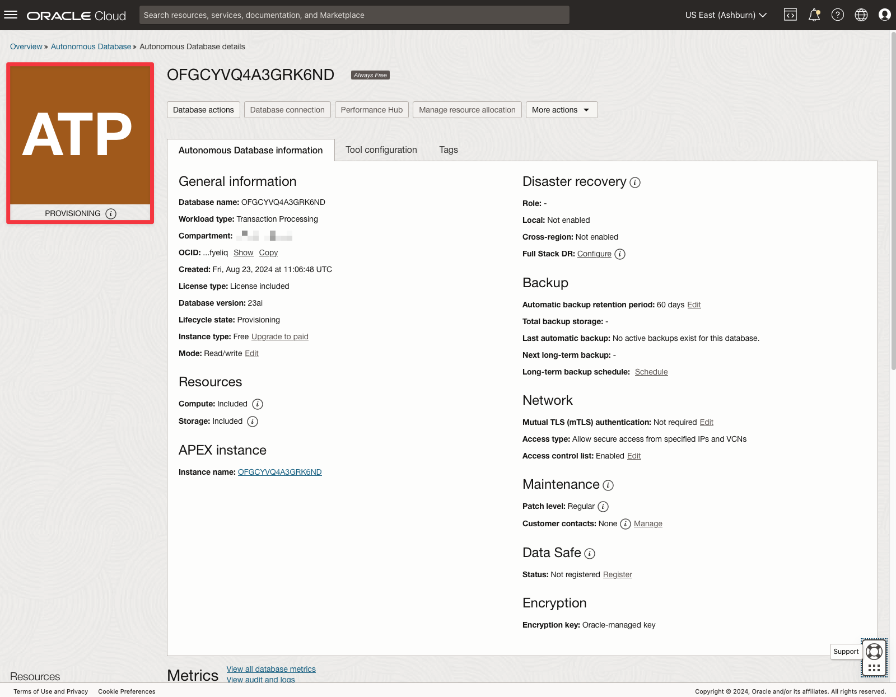
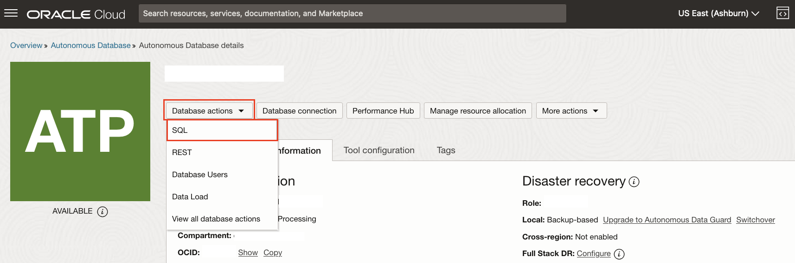
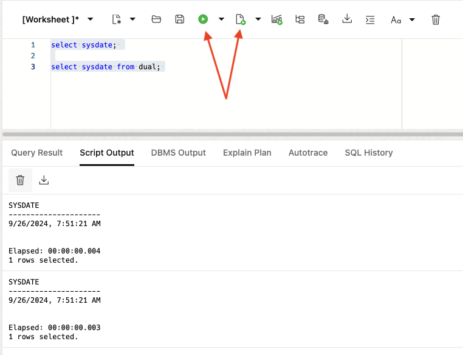

# Create an Autonomous Database 23ai instance

## Introduction

Now that you have an Oracle Cloud account, you will learn how to create an Autonomous Database instance. This lab walks you through the necessary steps. This setup will allow for the latest version of Oracle Database, which is essential to the successive labs.

Estimated Time: 15 minutes

### Objectives

In this lab, you will:

-  Create an ADB instance
- Configure an ADB instance

### Prerequisites

- An Oracle Free Tier or Paid Cloud account

## Task 1: Choose ADB from the Services Menu

1. Login to the Oracle Cloud. If you are using a Free Trial or Always Free account and you want to use Always Free Resources, you need to be in the home region of the tenancy.

2. Open the **Navigation** menu in the upper left and click **Oracle Database**. Under **Oracle Database**, click **Autonomous Transaction Processing**. The **Autonomous Transaction Processing** page will be displayed.

    > Note: The database type does not affect the outcome of this particular workshop. The following steps assume an ATP selection for clarity.

    

## Task 2: Create the ADB instance

1. Click on **Create Autonomous Database** button to start the instance creation process

     

2. This brings up the Create Autonomous Database screen where you will specify the configuration of the instance

3. Provide basic information for the autonomous database:

    - **Choose a compartment** - It will be prepopulated, but you have the option to select a compartment for the database from the drop-down list
    - **Display Name** - You can leave the prepopulated name.
    - **Database Name** - You can leave the prepopulated name. If you want to change it, use letters and numbers only, starting with a letter. Maximum length is 14 characters. (Underscores not
    initially supported.)
    - **Workload** - For this lab, choose *Transaction Processing*.
    - **Deployment Type** - Choose *Serverless* as the deployment type.

    

4. Configure the database:

    - **Always Free** - If your Cloud Account is an Always Free account, you can select this option to create an always free autonomous database. An always free database comes with 1 CPU and 20 GB of storage. For this lab, you can leave Always Free checked.
    - **Choose database version** - Select 23ai from the database version.

    

5. Create administrator credentials:
    - **Password and Confirm Password** - Specify the password for ADMIN user of the service instance and confirm the password.

     

6. Click **Create Autonomous Database**

    

7. Your instance will begin provisioning. In a few minutes, the state will turn from Provisioning to **Available**. At this point, your Autonomous Transaction Processing database is ready to use!

    

## Task 3: Database Actions - SQL

Formerly known as SQL Developer Web, Database Actions brings you your favorite Oracle Database desktop tool’s features and experience to your browser! Delivered as a single-page web application, Database Actions is powered by Oracle REST Data Services (ORDS). Database Actions offers, a worksheet for running queries and scripts, the ability to manage and browse your data dictionary, a REST development environment for your REST APIs and AUTOREST enabled objects, an interface for Oracle’s JSON Document Store (SODA), a DBA console for managing the database, a data model reporting solution, and access to PerfHub.

For this workshop, we'll utilize the SQL worksheet feature.

1. From your Autonomous Database details page, click **Database Actions**, then **SQL**.

    >NOTE: To view more Database Actions, select **View all database actions**. This will redirect to the Database Actions Launchpad, where you can explore other available features.

    

2. A new browser tab to your Database Actions SQL Worksheet will open. Enter your SQL into the worksheet area, and press the **Run Statement** icon to run a single query, or the **Run Script** icon to run all statements in the worksheet.

    

You are now ready to **proceed to the next lab**.

## Learn More

* [Create an Autonomous Database documentation](https://docs.oracle.com/en-us/iaas/autonomous-database/doc/create-adb.html)
* [Oracle Database Actions Overview](https://www.oracle.com/database/sqldeveloper/technologies/db-actions/)

## Acknowledgements

* **Author** - Carmen Berdant, Technical Program Manager, Product Management
* **Contributors** -  Kevin Lazarz, Senior Manager, Product Management
* **Last Updated By/Date** - Hope Fisher, Product Manager, Sept 2024