# Operational Property Graphs Example with SQL/PGQ in 23ai

## Introduction

In this lab you will create an Operational Property Graph inside of Graph Studio, then query the newly created graph (that is, `bank_graph`) using SQL/PGQ, a new extension in SQL:2023.
​

Estimated Time: 15 minutes.
​
### Objectives
* Open up Graph Studio
* Create an Operational Property Graph 

Learn how to:
- Use SQL/PGQ to define and query a property graph.
​
### Prerequisites
This lab assumes you have:
- Access to an Oracle Always Free Autonomous Database 23ai
- The bank\_accounts and bank\_transfers tables exist. 
- The database user exists and has the right roles and privileges.

<!-- <if type="livelabs">
Watch the video below for a quick walk-through of the lab. 
[Change password](videohub:1_ovgflc5c)
</if> -->
### Overview
Here is a diagram representing the tables that will be underlying the Operational Property Graph that we will be creating.

| Name | Null? | Type |
| ------- |:--------:| --------------:|
| ID | NOT NULL | NUMBER|
| NAME |  | VARCHAR2(4000) |
| BALANCE |  | NUMBER |
{: title="BANK_ACCOUNTS"}

| Name | Null? | Type |
| ------- |:--------:| --------------:|
| TXN_ID | NOT NULL | NUMBER|
| SRC\_ACCT\_ID |  | NUMBER |
| DST\_ACCT\_ID |  | NUMBER |
| DESCRIPTION |  | VARCHAR2(4000) |
| AMOUNT |  | NUMBER |
{: title="BANK_TRANSFERS"}

## Task 1: Create the Property Graph

1. Click View Login Info on your LiveLabs reservation.

    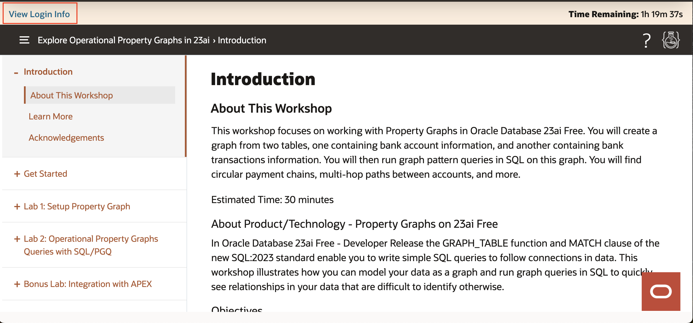

2. On the right hand side underneath Terraform Values, copy the User Password, and then click the Graph Studio URL.

    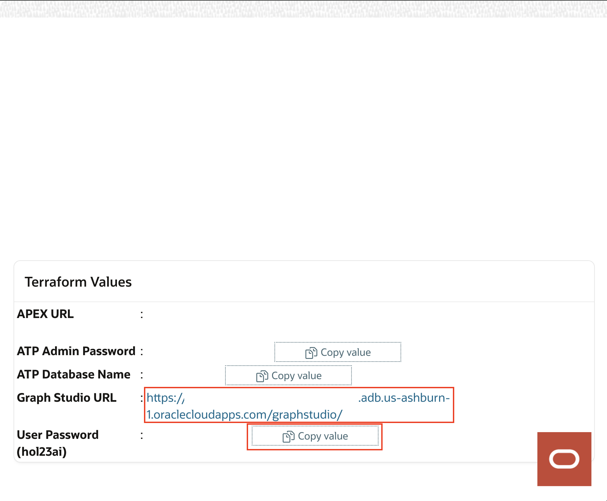

3. Sign into Graph Studio. 

    Username: hol23ai

    Password: Listed underneath Terraform Values -> User Password (hol23ai).

    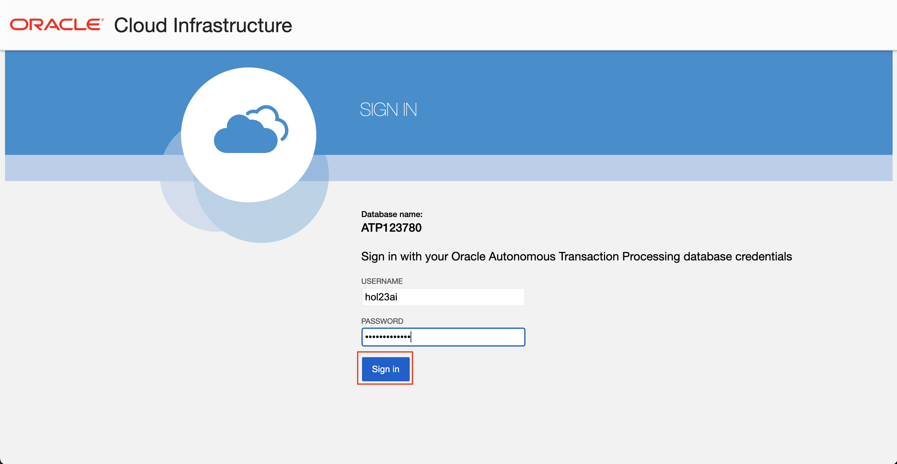

4. Click the **Graph** icon to navigate to create your graph.  
    Then click **Create Graph**.  
   
    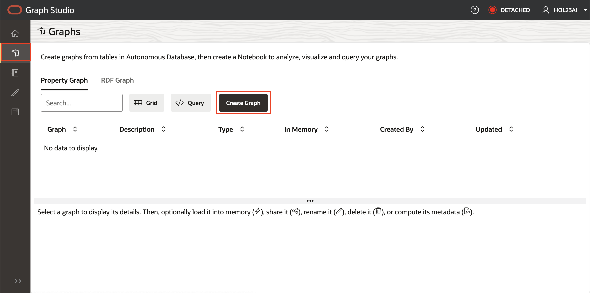  

5. Enter `bank_graph` as the graph name, then click **next**. The description is optional.   
    That graph name is used throughout the next lab. _Do not enter a different name because then the queries and code snippets in the next lab will fail._
    
    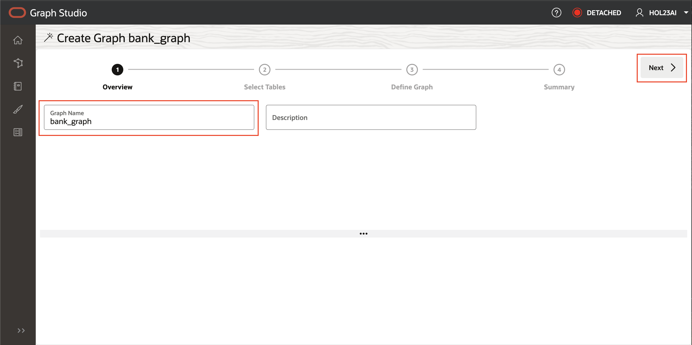

6. Expand your user name **HOL23AI** and make sure that  `BANK_ACCOUNTS` and `BANK_TRANSFERS` tables are selected. 

    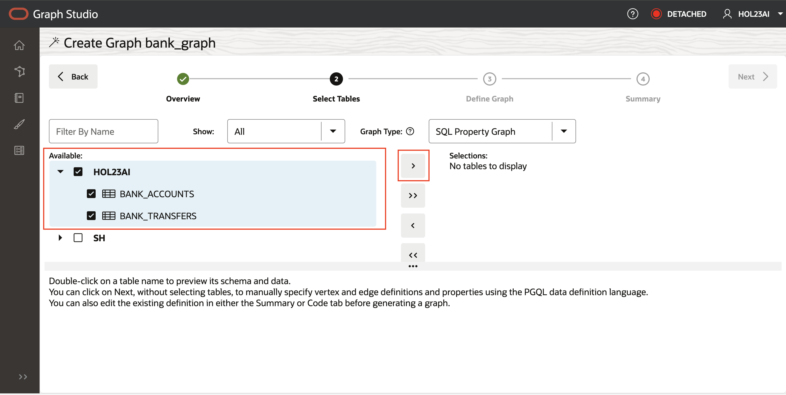

7. Move them to the right by clicking the first icon on the shuttle control.   

    

8. Click **Next**.  

    The suggested graph has the `BANK_ACCOUNTS` as a vertex table since there are foreign key constraints specified on `BANK_TRANSFERS` that reference it.   

    And `BANK_TRANSFERS` is a suggested edge table. Click **Next**.

    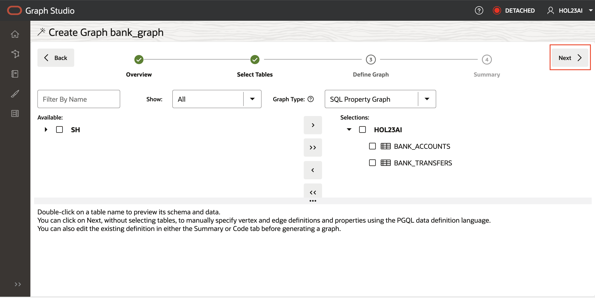    

9. In the Summary step, click on **Create Graph**. This will open a Create Graph tab, click on **Create Graph**. 

     

10. Toggle "Load into Memory", then **Create Graph**.

    

The BANK_GRAPH is a view on the underlying tables and metadata, this means that no data is duplicated.

## Task 2: Import the notebook

 You can import a notebook that has the graph queries and analytics. Each paragraph in the notebook has an explanation.  You can review the explanation, and then run the query or analytics algorithm.

  [Click here to download the notebook](https://objectstorage.us-ashburn-1.oraclecloud.com/p/dqjiuqt-1hR0bnn1GJlBo4aNXLmARXMBKEq646U2ZarOlUkmf5K0slE7u2WyEryK/n/c4u04/b/livelabsfiles/o/labfiles/BANK_GRAPH_23ai_alg_15.dsnb) and save it to a folder on your local computer.

 1. Click the **Notebook** icon. Import a notebook by clicking on the notebook icon on the left, and then clicking on the **Import** icon on the far right.

    
    
     Select or drag and drop the notebook and click **Import**.

    

    A dialog pops up a named **Compute Environment**. It will disappear when the compute environment finishes attaching, usually in less than one minute. Or you can click **Close** to close the dialog and start working on your environment. Note that you will not be able to run any paragraph until the environment finishes attaching.

    >Note: The instructions for the next task is written within this notebook. You can follow the instructions in the notebook or follow along below.
​
## Task 3: Query bank_graph
​
In this task we will run queries using SQL/PGQ's GRAPH_TABLE operator, MATCH clause, and COLUMNS clause. The GRAPH\_TABLE operator enables you to query the property graph by specifying a graph pattern to look for and return the results as a set of columns. The MATCH clause lets you specify the graph patterns, and the COLUMN clause lists the query output columns. Everything else is existing SQL syntax.

A common query in analyzing money flows is to see if there is a sequence of transfers that connect one source account to a destination account. We'll be demonstrating that sequence of transfers in standard SQL.

>Note: The following instructions are also written within the notebook. The SQL statements can be run directly by pressing the triangle _play_ button next to each query entry.


1. Let's use SQL to find the top 10 accounts by number of transfers the account has received. Run the paragraph with the following query.
    
    ```
    <copy>
    SELECT acct_id, COUNT(1) AS Num_Transfers 
    FROM graph_table ( BANK_GRAPH 
        MATCH (src) - [IS BANK_TRANSFERS] -> (dst) 
        COLUMNS ( dst.id AS acct_id )
    ) GROUP BY acct_id ORDER BY Num_Transfers DESC FETCH FIRST 10 ROWS ONLY;
    </copy>
    ```

    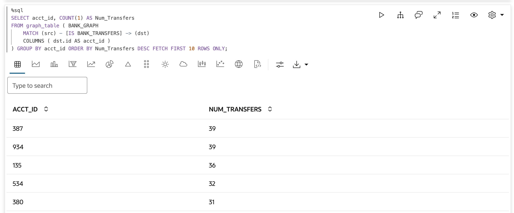
​
    We see that accounts **387** and **934** have a high number of incoming transactions.
    
2.  What if we want to find the accounts where money was simply passing through? Let's find the top 10 accounts in the middle of a 2-hop chain of transfers.
    
    ```
    <copy>
    SELECT acct_id, COUNT(1) AS Num_In_Middle 
    FROM graph_table ( BANK_GRAPH 
        MATCH (src) - [IS BANK_TRANSFERS] -> (via) - [IS BANK_TRANSFERS] -> (dst) 
        COLUMNS ( via.id AS acct_id )
    ) GROUP BY acct_id ORDER BY Num_In_Middle DESC FETCH FIRST 10 ROWS ONLY;
    </copy>
    ```
    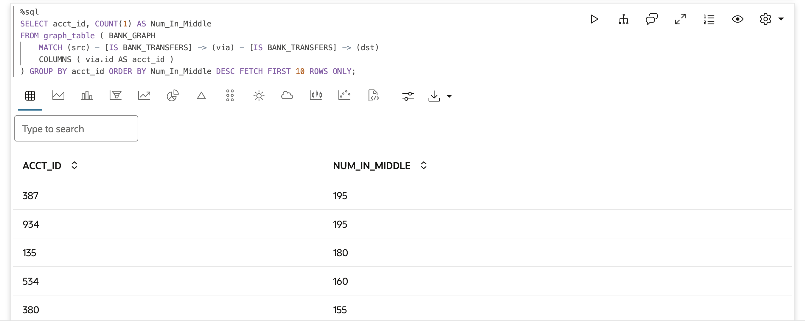
​
3. Note that account 387 shows up again, so let's list accounts that received a transfer from account 387 in 1, 2, or 3 hops.
    
    ```
    <copy>
    SELECT account_id1, account_id2 
    FROM graph_table(BANK_GRAPH
        MATCH (v1)-[IS BANK_TRANSFERS]->{1,3}(v2) 
        WHERE v1.id = 387 
        COLUMNS (v1.id AS account_id1, v2.id AS account_id2)
    );
    </copy>
    ```
    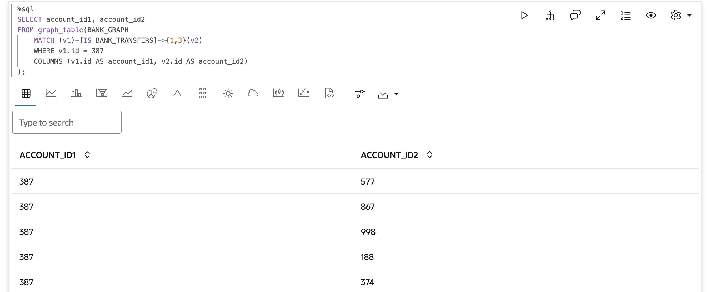
​
5. We can use the same query but modify the number of hops to check if there are any 4-hop transfers that start and end at the same account. 

    ```
    <copy>
    SELECT acct_id, COUNT(1) AS Num_4hop_Chains 
    FROM graph_table (BANK_GRAPH 
        MATCH (src) - []->{4} (src) 
        COLUMNS (src.id AS acct_id) 
    ) GROUP BY acct_id ORDER BY Num_4hop_Chains DESC;
    </copy>
    ```
    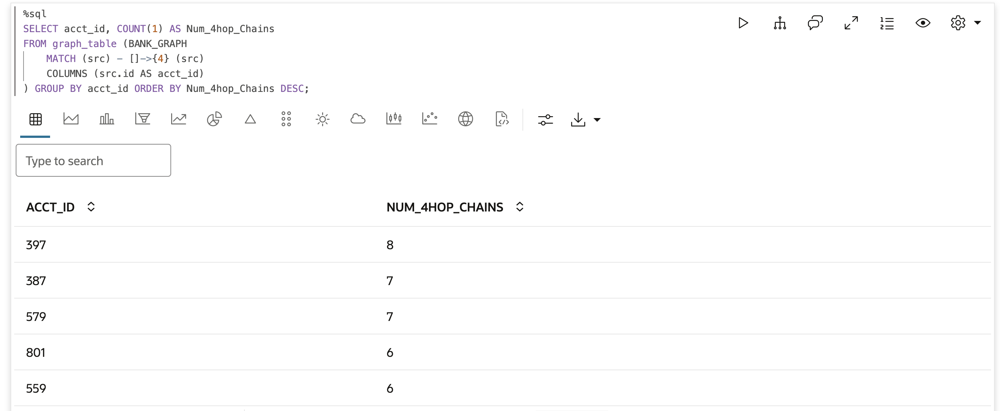
​
6. Lastly, check if there are any 5-hop transfers that start and end at the same account by just changing the number of hops to 5.
    ><b>Note:</b> that though we are looking for longer chains we reuse the same MATCH pattern with a modified parameter for the desired number of hops. This compactness and expressiveness is a primary benefit of the new SQL syntax for graphs in Oracle Database 23ai.
   
    ```
    <copy>
   SELECT acct_id, COUNT(1) AS Num_5hop_Chains 
    FROM graph_table (BANK_GRAPH 
        MATCH (src) - []->{5} (src) 
        COLUMNS (src.id AS acct_id) 
    ) GROUP BY acct_id ORDER BY Num_5hop_Chains DESC;
    </copy>
    ```
    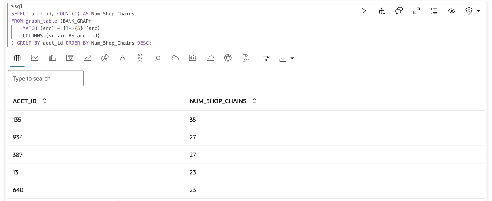

7. Run the first %python-pgx paragraph, which uses the built-in session object to read the graph into memory from the database and creates a PgXGraph object that handles the loaded graph.

    ```
    <copy>
    %python-pgx
    GRAPH_NAME="BANK_GRAPH"
    # try getting the graph from the in-memory graph server
    graph = session.get_graph(GRAPH_NAME)
    # if it does not exist read it into memory
    if (graph == None) :
        session.read_graph_by_name(GRAPH_NAME, "pg_sql")
        print("Graph "+ GRAPH_NAME + " successfully loaded")
        graph = session.get_graph(GRAPH_NAME)
    else :
        print("Graph '"+ GRAPH_NAME + "' already loaded")
    </copy>
    ```
    ​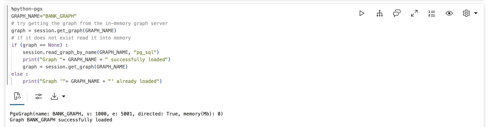

8. Accounts 387 and 934 have a high number of transactions.

    We are going to start looking at these accounts in detail. Let’s start by identifying the owner of account 387.

    ```
    <copy>
    %sql
    select * from bank_accounts where id = 387;
    </copy>
    ```
    ​

    Looks like Antonia Mclachlan is the owner of this account.  

9. What about account 934?

    Let's run the same query but for account 934.

    ```
    <copy>
    %sql
    select * from bank_accounts where id = 934;
    </copy>
    ```
    ​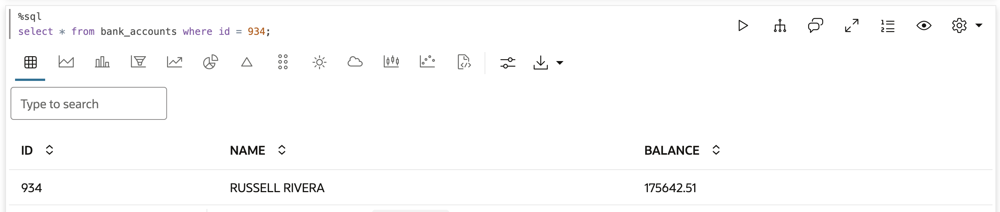

    The owner of account 934 is Russell Rivera.   

10. Let’s look at the circular transfers that originate and terminate at Russell Rivera's account, and visualize the results.

    We start with the number of hops equals 4 as specified as []->{4}.

    ```
    <copy>
    %pgql-pgx
    SELECT * 
    FROM graph_table (BANK_GRAPH 
        MATCH (src) - []->{4} (src) 
        WHERE src.name = 'RUSSELL RIVERA'
        ONE ROW PER STEP ( v1, e1, v2 )
        COLUMNS (src.id AS acct_id, vertex_id(src) as src_id, vertex_id(v1) as v1_id, edge_id(e1) as e1_id, vertex_id(v2) as v2_id ) 
    ) 
    </copy>
    ```
    ​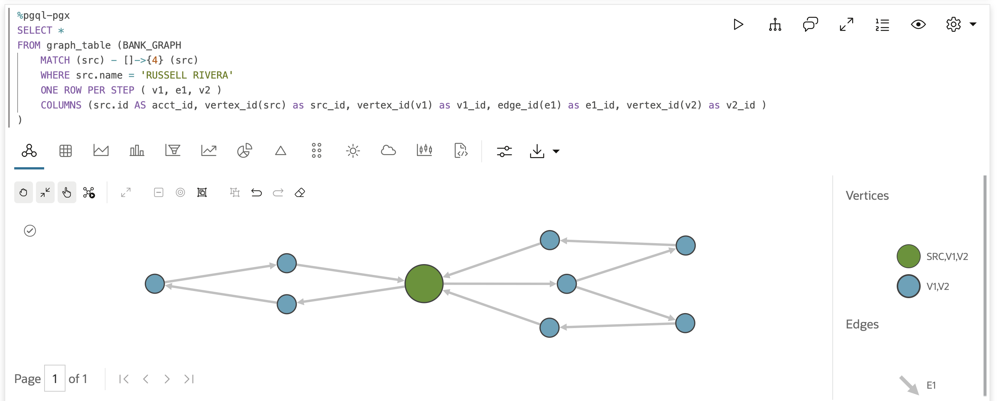

    We see 3 circular payment chains 4 hops in length, that start and end in this account.

11. Now we want to look at the circular payment chains when we change the chain length to be 5 hops.

    ```
    <copy>
    %pgql-pgx
    SELECT * 
    FROM graph_table (BANK_GRAPH 
        MATCH (src) - []->{5} (src) 
        WHERE src.name = 'RUSSELL RIVERA'
        ONE ROW PER STEP ( v1, e1, v2 )
        COLUMNS (src.id AS acct_id, vertex_id(src) as src_id, vertex_id(v1) as v1_id, edge_id(e1) as e1_id, vertex_id(v2) as v2_id ) 
    ) 
    </copy>
    ```
    ​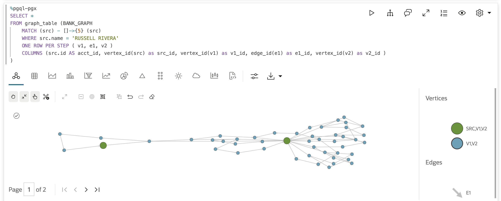

    The number of circular payment chains that start and end in Russell Rivera's account makes it an account we should investigate further.

12. Let us continue our investigation using another algorithm, the PageRank graph analytics algorithm.

    A %python-pgx paragraph let's you execute Python code snippets. We will use the Python API to run the PageRank algorithm.
    The code snippet below creates a PgxGraph object containing a handle to the BANK_GRAPH loaded into the in-memory graph server.
    Then it executes the PageRank algorithm using the built-in analyst Python object.
    The session and analyst objects are created when the in-memory graph server is instantiated and when a notebook is opened.

    ```
    <copy>
    %python-pgx
    graph = session.get_graph("BANK_GRAPH")
    analyst.pagerank(graph);
    </copy>
    ```
    ​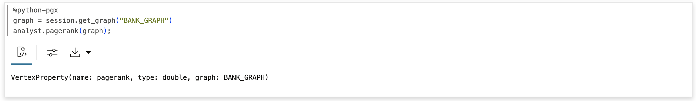

13. Now let's list the PageRank values in descending order to find the accounts with high PageRank values. A high PageRank value indicates that that account is important, which in the context of BANK_GRAPH, a high number of transfers have flown through that account, or the account is connected to accounts with a high number of transfers flowing through them.

    ```
    <copy>
    %pgql-pgx
    SELECT acct_id, acct_holder, pagerank
    FROM graph_table(bank_graph
    MATCH (a)
    COLUMNS (a.id as acct_id, a.name as acct_holder, a.pagerank as pagerank))
    order by pagerank desc;
    </copy>
    ```
    ​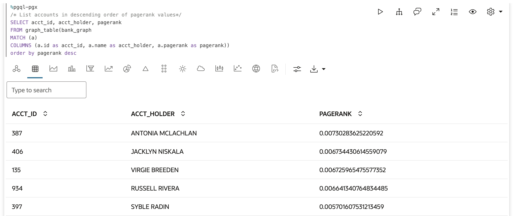

    We see that Russell Rivera's is in the top 5. So this metric also indicates that a large number of transactions flow through Russell Rivera's account.
    But he is not at the very top, and interestingly Antonia Mclachlan is at the top of the list.

14. Now let's use the computed PageRank value in visualizing the result. We use highlights to display the accounts with a high PageRank value with larger circles and red in color.

    Execute the paragraph with the following query, which finds the 3-hop payment chains starting at Antonia Mclachlan's account.

    ```
    <copy>
    %pgql-pgx
    SELECT * 
    FROM graph_table (BANK_GRAPH 
        MATCH (src) - []->{3} (dst) 
        WHERE src.name = 'ANTONIA MCLACHLAN'
        ONE ROW PER STEP ( v1, e1, v2 ))
        COLUMNS (src.id AS acct_id, vertex_id(src) as src_id, vertex_id(v1) as v1_id, edge_id(e1) as e1_id, vertex_id(v2) as v2_id ) 
    </copy>
    ```
    ​ 

    From this visualization we can quickly see which accounts that are connected to Antonia Maclachlan also have a high pagerank value.


You have now completed this lab.

## Learn More
* [Oracle Property Graph](https://docs.oracle.com/en/database/oracle/property-graph/index.html)
* [SQL Property Graph syntax in Oracle Database 23ai Free - Developer Release](https://docs.oracle.com/en/database/oracle/property-graph/23.1/spgdg/sql-ddl-statements-property-graphs.html#GUID-6EEB2B99-C84E-449E-92DE-89A5BBB5C96E)

## Acknowledgements

- **Author** - Kaylien Phan, Thea Lazarova, William Masdon
- **Contributors** - Melliyal Annamalai, Jayant Sharma, Ramu Murakami Gutierrez, Rahul Tasker
- **Last Updated By/Date** - Francis Regalado, January 2025
