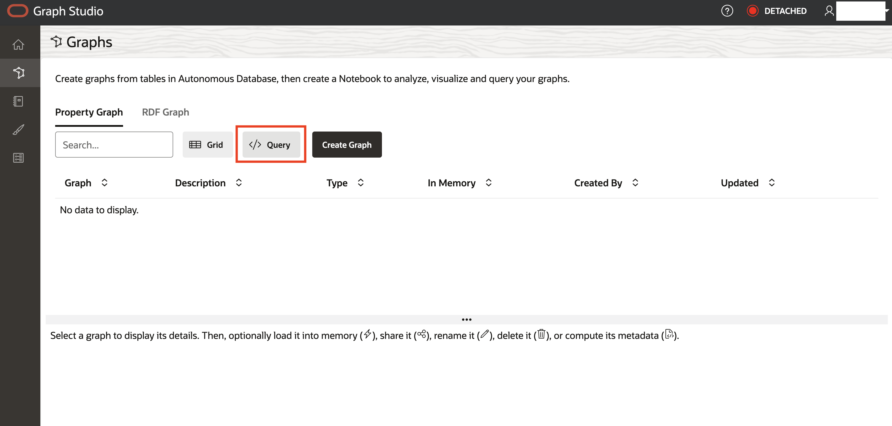

# Setup User

## Introduction

You will be creating an Operational Property Graph inside of Graph Studio, one of the applications that's available in 23ai Autonomous Database. 

Estimated Time: 10 minutes

### Objectives

In this lab, you will:
* Open up Graph Studio
* Create an Operational Property Graph 

### Prerequisites

This lab assumes you have:
* Access to an Oracle Always Free Autonomous Database 23ai
- The bank\_accounts and bank\_transfers tables exist. 

<!-- <if type="livelabs">
Watch the video below for a quick walk-through of the lab. The lab instructions on the left might not match the workshop you are currently in, but the steps in the terminal on the right remain the same.
[Change password](videohub:1_x4hgmc2i)
</if> -->

## Task 1: Download setup materials

1. Click [this link] (https://c4u04.objectstorage.us-ashburn-1.oci.customer-oci.com/p/EcTjWk2IuZPZeNnD_fYMcgUhdNDIDA6rt9gaFj_WZMiL7VvxPBNMY60837hu5hga/n/c4u04/b/livelabsfiles/o/data-management-library-files/23aifree-property-graph.zip) to download the zip file with our property graph setup materials.

2. Unzip the files. You should see these files available. Most of these files we will not be using throughout the lab, but are available if you would like to see what commands we chose to create the schema with (CreateKeys.sql) or the data that populates the tables that we've created (BANK\_ACCOUNTS.csv and BANK\_TRANSFERS.csv).

    

3. Here is a diagram representing the tables that will underlying the Operational Property Graph that we will be creating.

    | Name | Null? | Type |
    | ------- |:--------:| --------------:|
    | ID | NOT NULL | NUMBER|
    | NAME |  | VARCHAR2(4000) |
    | BALANCE |  | NUMBER |
    {: title="BANK_ACCOUNTS"}

    | Name | Null? | Type |
    | ------- |:--------:| --------------:|
    | TXN_ID | NOT NULL | NUMBER|
    | SRC\_ACCT\_ID |  | NUMBER |
    | DST\_ACCT\_ID |  | NUMBER |
    | DESCRIPTION |  | VARCHAR2(4000) |
    | AMOUNT |  | NUMBER |
    {: title="BANK_TRANSFERS"}

## Task 2: Create the Property Graph

1. Click View Login Info on your LiveLabs reservation.

    

2. On the right hand side underneath Terraform Values, click the Graph Studio URL.

    

3. Sign into Graph Studio. 

    Username: hol23ai

    Password: Listed underneath Terraform Values -> User Password (hol23ai).

    

4. Click on the Graph symbol on the left-hand side menu.

    

5. Click </> Query.

    

6. Use the following SQL statement to create a property graph called BANK\_GRAPH using the BANK\_ACCOUNTS table as the vertices and the BANK_TRANSFERS table as edges. Paste this into the text box:

    ```
    <copy>
    CREATE PROPERTY GRAPH BANK_GRAPH 
    VERTEX TABLES (
        BANK_ACCOUNTS
        KEY (ID)
        PROPERTIES (ID, Name, Balance) 
    )
    EDGE TABLES (
        BANK_TRANSFERS 
        KEY (TXN_ID) 
        SOURCE KEY (src_acct_id) REFERENCES BANK_ACCOUNTS(ID)
        DESTINATION KEY (dst_acct_id) REFERENCES BANK_ACCOUNTS(ID)
        PROPERTIES (src_acct_id, dst_acct_id, amount)
    ) OPTIONS (PG_SQL);
    </copy>
    ```

    

7. Click Run. It should say Graph Successfully Created as a result at the bottom.

    

## Task 3: Spin up the Notebook

1. Click the notebook icon on the left hand menu.

    

2. Click Create.

    

3. You can name the notebook BANK_GRAPH. The description will be Notebook for Operational Property Graphs LiveLab. You can leave the tags empty.

    

4. You'll see a message saying that Graph Studio is being attached to an internal compute environment. The notebook will allow us to run PGQ queries against our bank schema, but first needs to spin up. It should take less than a minute.

    

5. Once it finishes, it should look like this. You can see the DETACHED message in the upper right corner turn to say ATTACHED with a green light.

    

6. You may now proceed to the next lab.

## Learn More

* [Introducing Oracle Database 23ai Free – Developer Release](https://blogs.oracle.com/database/post/oracle-database-23c-free)

## Acknowledgements
* **Author** - Kaylien Phan, William Masdon
* **Contributors** - David Start
* **Last Updated By/Date** - Kaylien Phan, Database Product Management, April 2023
