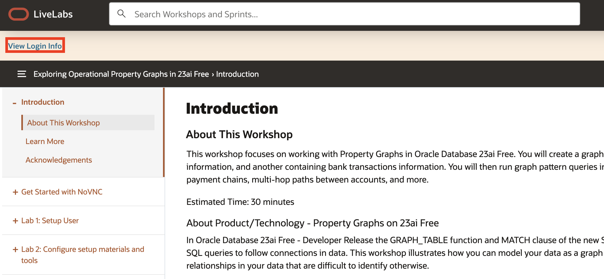
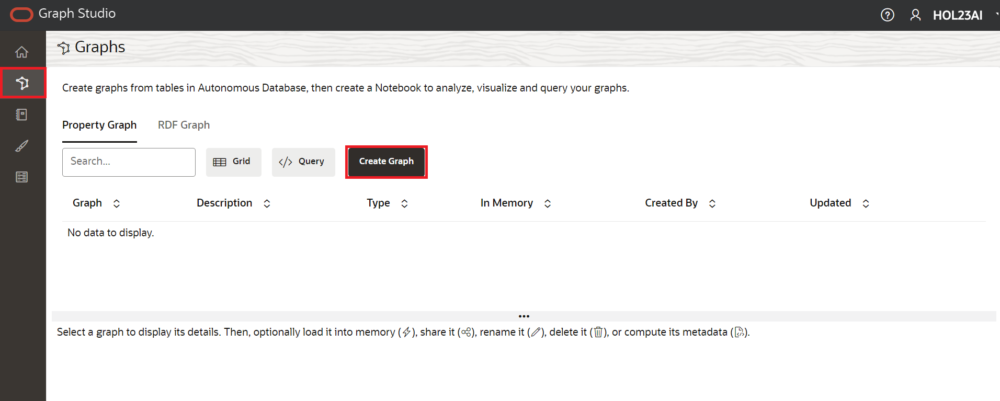
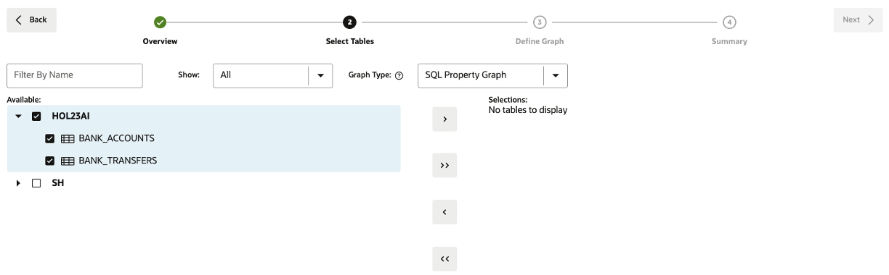
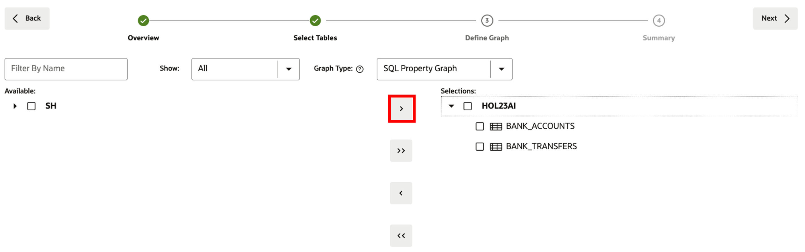
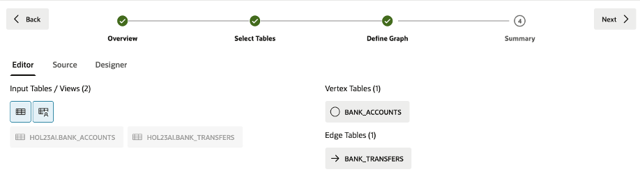
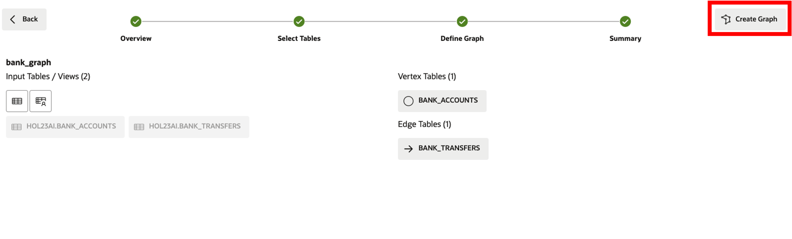

# Setup 

## Introduction

You will be creating an Operational Property Graph inside of Graph Studio, one of the applications that's available in 23ai Autonomous Database. 

Estimated Time: 10 minutes

### Objectives

In this lab, you will:
* Open up Graph Studio
* Create an Operational Property Graph 

### Prerequisites

This lab assumes you have:
* Access to an Oracle Always Free Autonomous Database 23ai
- The bank\_accounts and bank\_transfers tables exist. 

<!-- <if type="livelabs">
Watch the video below for a quick walk-through of the lab. The lab instructions on the left might not match the workshop you are currently in, but the steps in the terminal on the right remain the same.
[Change password](videohub:1_x4hgmc2i)
</if> -->

## Task 1: Setup materials

These files we will not be using throughout the lab, but are available if you would like to see what commands we chose to create the schema with (CreateKeys.sql) or the data that populates the tables that we've created (BANK\_ACCOUNTS.csv and BANK\_TRANSFERS.csv).

1. Click [this link] (https://c4u04.objectstorage.us-ashburn-1.oci.customer-oci.com/p/EcTjWk2IuZPZeNnD_fYMcgUhdNDIDA6rt9gaFj_WZMiL7VvxPBNMY60837hu5hga/n/c4u04/b/livelabsfiles/o/data-management-library-files/23aifree-property-graph.zip) to download the zip file with our property graph setup materials.

2. Unzip the files. You should see these files available. 

    

3. Here is a diagram representing the tables that will underlying the Operational Property Graph that we will be creating.

    | Name | Null? | Type |
    | ------- |:--------:| --------------:|
    | ID | NOT NULL | NUMBER|
    | NAME |  | VARCHAR2(4000) |
    | BALANCE |  | NUMBER |
    {: title="BANK_ACCOUNTS"}

    | Name | Null? | Type |
    | ------- |:--------:| --------------:|
    | TXN_ID | NOT NULL | NUMBER|
    | SRC\_ACCT\_ID |  | NUMBER |
    | DST\_ACCT\_ID |  | NUMBER |
    | DESCRIPTION |  | VARCHAR2(4000) |
    | AMOUNT |  | NUMBER |
    {: title="BANK_TRANSFERS"}

## Task 2: Create the Property Graph

1. Click View Login Info on your LiveLabs reservation.

    

2. On the right hand side underneath Terraform Values, click the Graph Studio URL.

    

3. Sign into Graph Studio. 

    Username: hol23ai

    Password: Listed underneath Terraform Values -> User Password (hol23ai).

    

3. Click the **Graph** icon to navigate to create your graph.  
    Then click **Create Graph**.  
   
      

4. Enter `bank_graph` as the graph name, then click **next**. The description is optional.   
    That graph name is used throughout the next lab. **Do not enter a different name** because then the queries and code snippets in the next lab will fail.  
    
    

5. Expand **GRAPHUSER** and select the `BANK_ACCOUNTS` and `BANK_TRANSFERS` tables. 

    

6. Move them to the right, that is, click the first icon on the shuttle control.   

    

7. Click **Next**.  

    The suggested graph has the `BANK_ACCOUNTS` as a vertex table since there are foreign key constraints specified on `BANK_TRANSFERS` that reference it.   

    And `BANK_TRANSFERS` is a suggested edge table. Click **Next**.

        

7. In the Summary step, click on **Create Graph**. This will open a Create Graph tab, click on **Create Graph. 

      

    This will open a Create Graph tab, click on **Create Graph**. 

    

    The BANK_GRAPH is a view on the underlying tables and metadata, this means that no data is duplicated.

You may now proceed to the next lab.

## Learn More

* [Introducing Oracle Database 23ai Free – Developer Release](https://blogs.oracle.com/database/post/oracle-database-23c-free)

## Acknowledgements
* **Author** - Kaylien Phan, William Masdon
* **Contributors** - David Start
* **Last Updated By/Date** - Ramu Murakami Gutierrez, December 2024
