# Create a DBMS_SEARCH index

## Introduction

This lab walks you through the steps to create a dbms_search index and add tables to it.

Estimated Time: 10 minutes

### Objectives

In this lab, you will:
* Create a DBMS_SEARCH index
* Add tables and a view to the index
* Explore the layout of the index, the data that has been indexed, and the metadata which will later be used to fetch back results

### Prerequisites

This lab assumes you have:
* Oracle AI Database 26ai Free Developer Release
* All previous labs successfully completed
* SQL Developer Web 23.1 or a compatible tool for running SQL statements

## Task 1: Connect your database user HR using Database Actions

1. Your browser should still be open, if not just open a new one. If running in a Sandbox go to Activities and then at the top click on "New Window". If Chrome is not running then click on Chrome.

    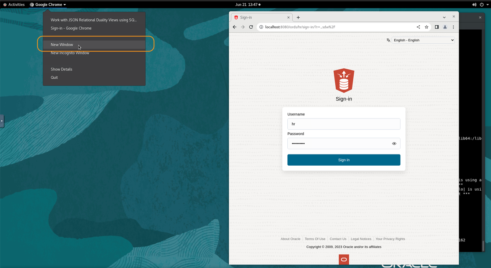

2. The address for SQL Developer Web on your machine is below. Copy and paste that into the browser.
    **Note:** If you did not start ORDs, ORDs stopped working or you closed that terminal in the previous lab, go back and complete the steps in that lab to start ORDs otherwise it will not be running to login here.
    ```
    <copy>
    http://localhost:8080/ords/hr/_sdw
    </copy>
    ```
    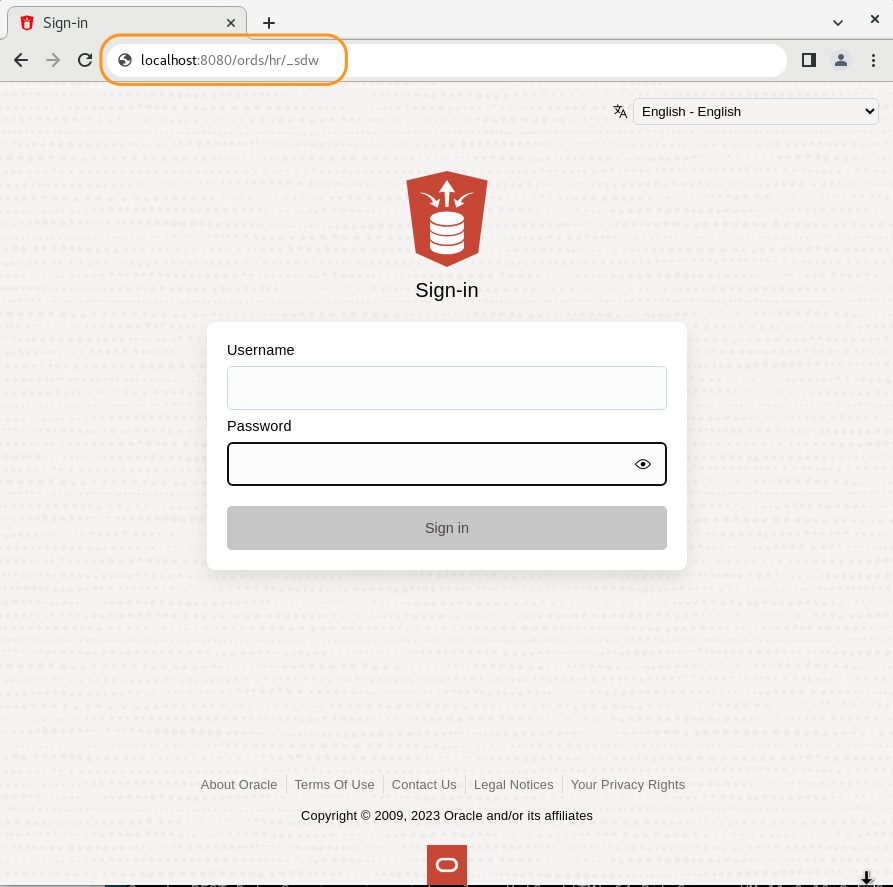

3. To login use the username hr with the password you set in Lab 1 in the browser.

    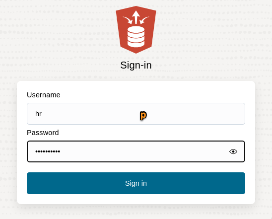

4. To be able to run SQL statements you will need the sql worksheet. Click on SQL to launch that.

    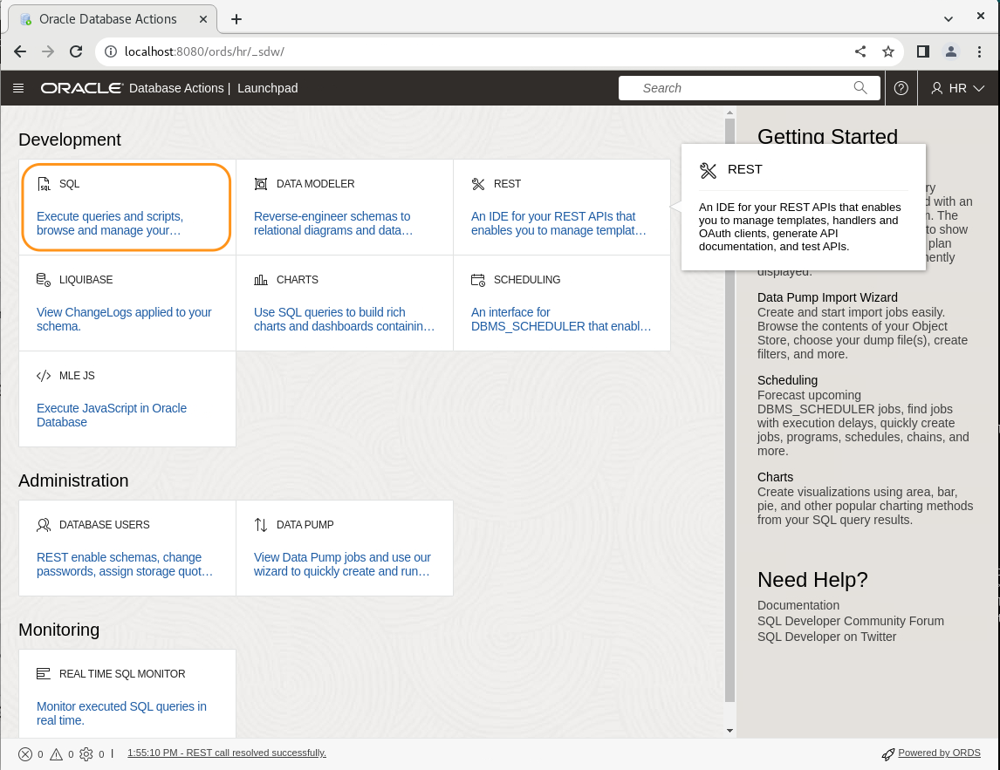

5. You are now logged in. You will see a quick tutorial, which you can follow to see the capabilities of the SQL Worksheet, or you can just close it.
You should then be at a screen that looks like this.

    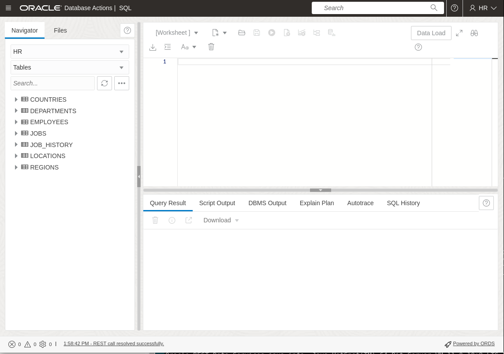    

## Task 2: Create your DBMS_SEARCH index
1. As you go through this workshop, we will specify click the Run button or Run Script button. The Run button runs just one SQL Statement and formats the output into a data grid. The Run Script button runs many SQL statements and spools their output. We will highlight which to use.

    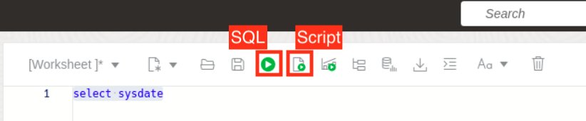

2. We are going to start by creating an empty index. We do this by calling a PL/SQL procedure **DBMS\_SEARCH.CREATE\_INDEX**. Copy the following code, and paste it into the SQL worksheet. When done, click the Run button:

    ```
    <copy>
    BEGIN
        DBMS_SEARCH.CREATE_INDEX('DEMO_IDX');
    END;
    </copy>
    ```

    You should see a message saying "PL/SQL procedure successfully completed".

    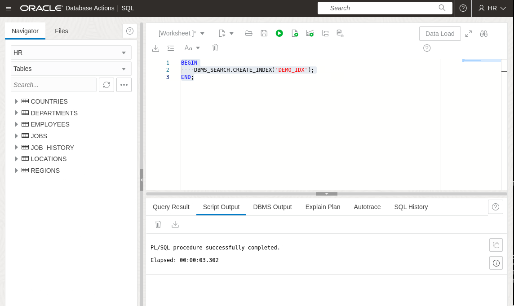

## Task 3: Check the index table

1. On the Navigator pane on the left, refresh the list of tables by clicking the circular button. You will see a number of new tables. The table called DEMO_IDX (same as our index name) is the one we are interested in. Click on the triangle next to it to open it and view its columns.

    This table will contain information about **every** row of **every** table or view we add to the index. For now, it is empty (you can run "SELECT * FROM DEMO_IDX" if you wish to check).

    Note there are a number of other tables starting with DR$DEMO_IDX. These are the underlying tables which hold the text index itself. We don't need to know the layout or contents of any of these tables.

    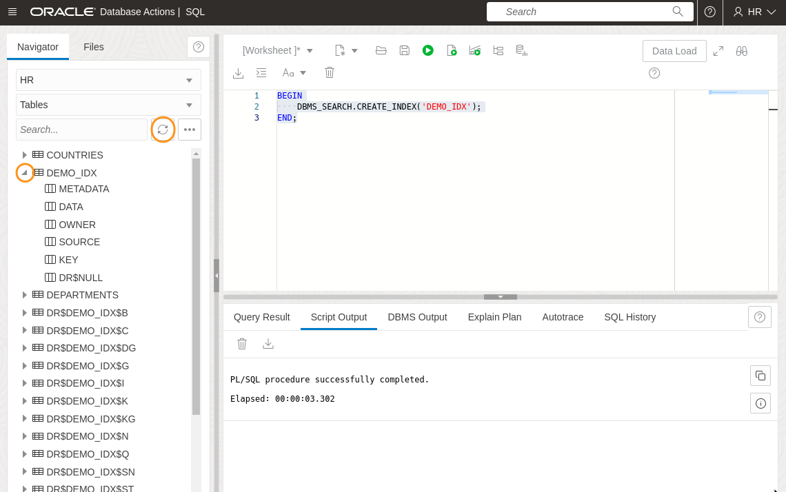

## Task 4: Add some tables to the index as sources

Let's say we want to be able to search for info in the EMPLOYEES and JOBS tables. You can view those tables in the Navigator pane if you wish to. To add them to the index, we use another procedure from the DBMS\_SEARCH package: **ADD\_SOURCE**. This takes the name of the previously-created index, and the name of a source object (table or view) to be added.

1. Copy the following SQL into the worksheet and click "Run".

    ```
    <copy>
    BEGIN
        DBMS_SEARCH.ADD_SOURCE('DEMO_IDX', 'EMPLOYEES');
        DBMS_SEARCH.ADD_SOURCE('DEMO_IDX', 'JOBS');
    END;
    </copy>
    ```

    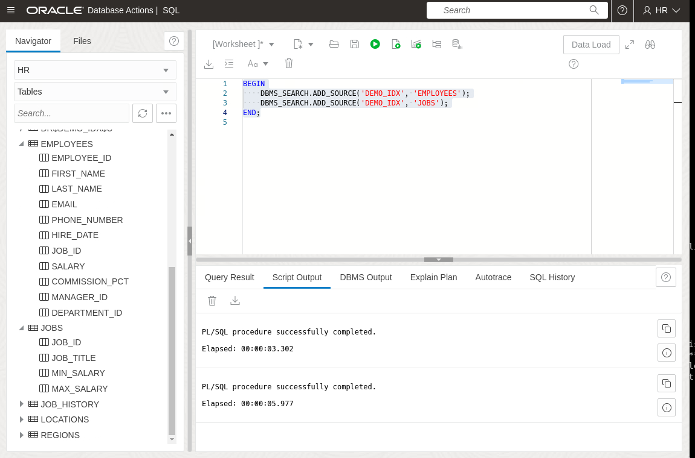

## Task 5: Check what data was indexed

Data added from source tables is not stored in our DEMO\_IDX table. Only metadata is stored there. The metadata is stored in a binary JSON column. We can look at it, but we'll need to use the json_serialize function to get the data in human-readable format.

1. Copy the following SQL into the worksheet and click the "Run" button.

    ```                                                       f
    <copy>
    SELECT JSON_SERIALIZE(metadata) FROM demo_idx;
    </copy>
    ```

    You may need to expand the column width to see all the data.

    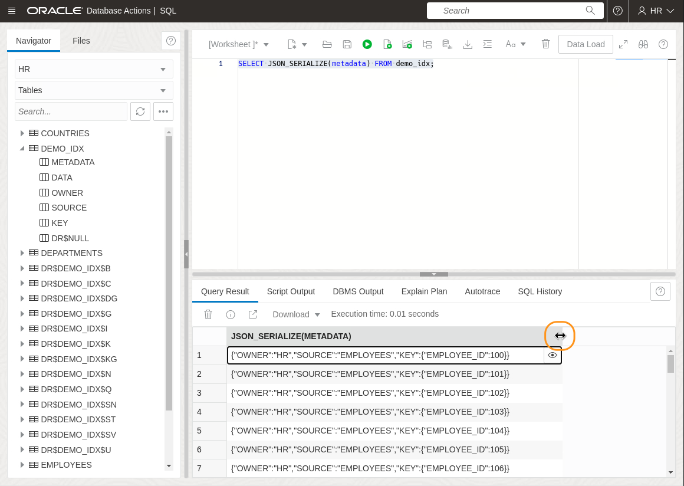

    The column is called METADATA, so it's not surprising that it doesn't contain the actual data that was indexed, but just metadata about what was indexed. The rows on view here are for the HR.EMPLOYEES table. The metadata for an individual row is basically the "logical pointer" to identify an individual row, based on the primary key constraint of a row. We could, if we chose, get the metadata for the JOBS table by using JSON "dot.notation" in the where clause:

    ```
    <copy>
    SELECT JSON_SERIALIZE(metadata) FROM demo_idx idx
    WHERE idx.metadata.SOURCE = 'JOBS';
    </copy>
    ```

    Note that when referring to JSON field names they are case-sensitive.

    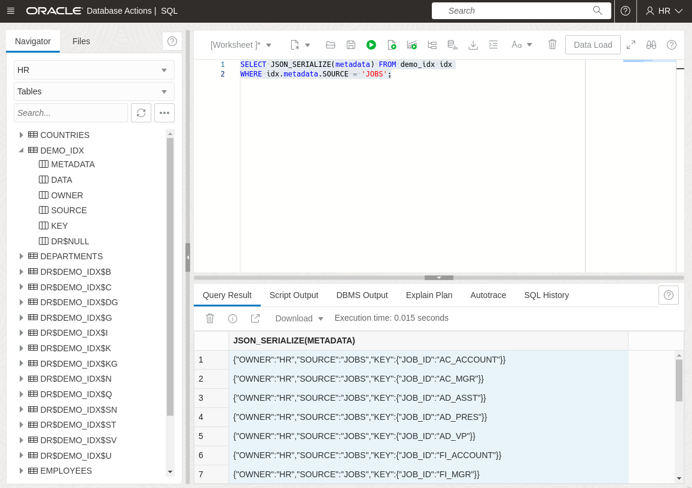

    But what if we want to see the actual data that was indexed? Although that's not stored in the table, there's a package DBMS\_SEARCH.GET\_DOCUMENT which, given the metadata, will go back to the original source table and reassemble the information that was indexed. This information is presented to the indexer in JSON format, so once again we'll need to use json_serialize to see it in human readable form:

2.  This query selects all the information that was indexed. Copy the following and click the "Run" button:

    ```
    <copy>
    SELECT json_serialize(DBMS_SEARCH.GET_DOCUMENT('DEMO_IDX',metadata)) FROM demo_idx;
    </copy>
    ```
    We can see the indexed data takes the form of a JSON document, where the outer element is the owner name, the next inner element is the table (or view) name, and the actual table data is nested inside that in the form "COLUMN NAME": "COLUMN VALUE"

    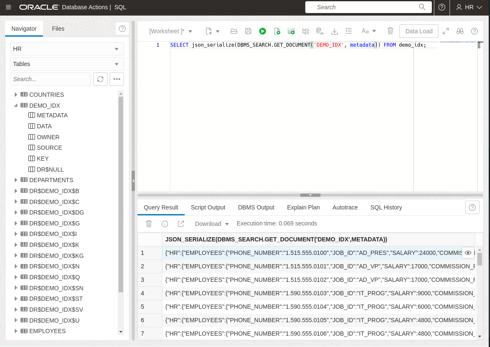

3. If we want to see the specific data for a particular row in a source table, we can do that with another WHERE clause. We'll also add PRETTY to the json_serialize call so it pretty-prints the JSON. Run this one using the "Run Script" button to see the formatting:

    ```
    <copy>
    SELECT json_serialize(DBMS_SEARCH.GET_DOCUMENT('DEMO_IDX', metadata) PRETTY) 
    FROM   demo_idx idx
    WHERE  idx.metadata.OWNER = 'HR'
      AND  idx.metadata.SOURCE = 'EMPLOYEES'
      AND  idx.metadata.KEY.EMPLOYEE_ID = 100
    </copy>
    ```

    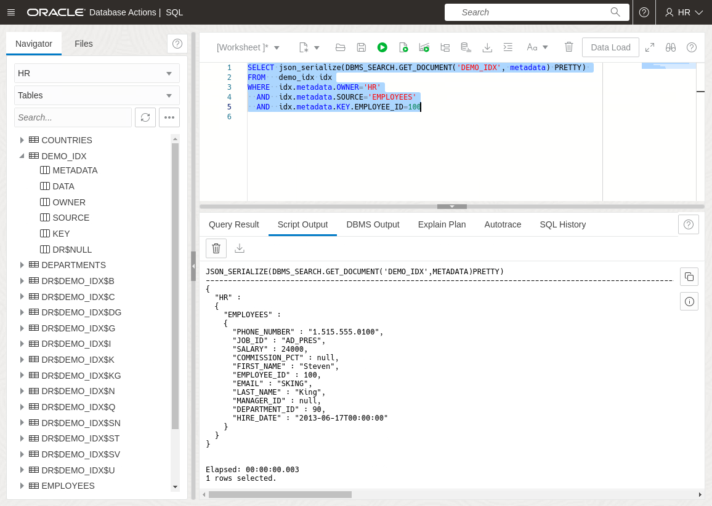

## Task 6: Add tables from another schema

Adding tables from another schema is straightforward. We just need to enter SCHEMA.TABLENAME in place just the table name. Of course, you need SELECT access to a table before you can add it to the index. During the setup phase we granted HR access to two tables in the Sales History (SH) schema, so we can add those to the same index that contains our EMPLOYEES and JOBS tables.

1. Copy the following and click the "Run" button:

    ```
    <copy>
    BEGIN
        DBMS_SEARCH.ADD_SOURCE('DEMO_IDX', 'SH.PRODUCTS');
        DBMS_SEARCH.ADD_SOURCE('DEMO_IDX', 'SH.CUSTOMERS');
    END;
    </copy>
    ```

    Feel free to try variations on the previous queries to explore the METADATA column and the GET_DOCUMENT function, or jump straight on to the next task.

## Task 7: Add a view to our index

Views are a little more complicated to deal with - we can't just add any view. In order to be used with a search index, a view must have both a primary key and a foreign key constraint to any tables used other than the source of the primary key. This ensures that the DBMS_SEARCH index is able to identify any updates to the view's source tables, and update the index appropriately.

1. Copy the following and click the "Run" button:

    ```
    <copy>
    create or replace view employee_jobs 
         (employee_id, 
          full_name, 
          job_id,
          job_title,
          constraint ej_pk primary key (employee_id)
                     rely disable novalidate,
          constraint ej_fk foreign key(job_id) references jobs(job_id)
                     disable novalidate) 
    as
      select employee_id, first_name ||' '|| last_name,
         e.job_id, job_title
      from employees e, jobs j
      where e.job_id = j.job_id;
    </copy>
    ```

2. Now add the view to our index as a source:

    ```
    <copy>
    exec DBMS_SEARCH.ADD_SOURCE('DEMO_IDX', 'EMPLOYEE_JOBS')
    </copy>
    ```

## Summary

In this lab, we did the following:

* Created a DBMS_SEARCH index
* Added tables from our own schema
* Added tables from a different schema
* Added a view

In the next lab we'll look at queries against our index.

## Learn More

* [Using JSON documents and don’t know what you’re looking for? 23ai Search Indexes to the rescue](https://blogs.oracle.com/database/post/23c-search-index)

## Acknowledgements
* **Author** - Roger Ford
* **Last Updated By/Date** - Abby Mulry, December 2025
