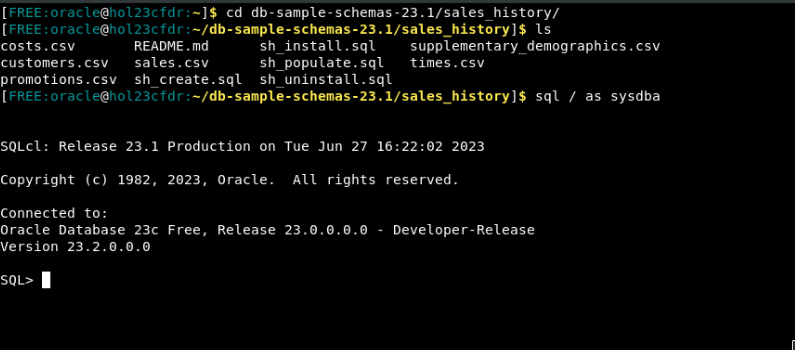
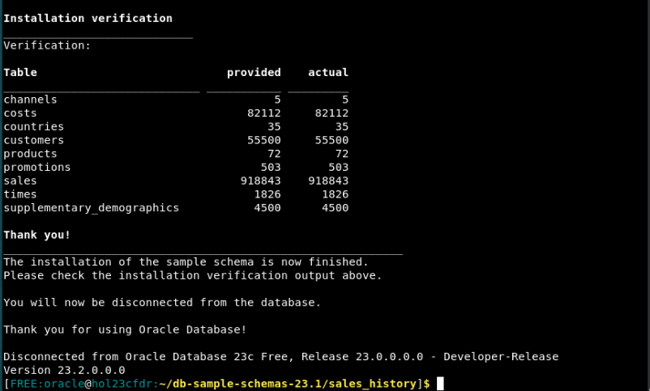
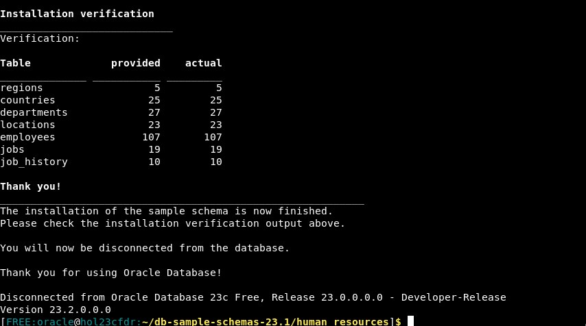
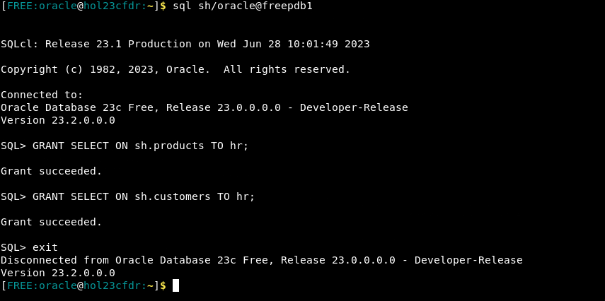
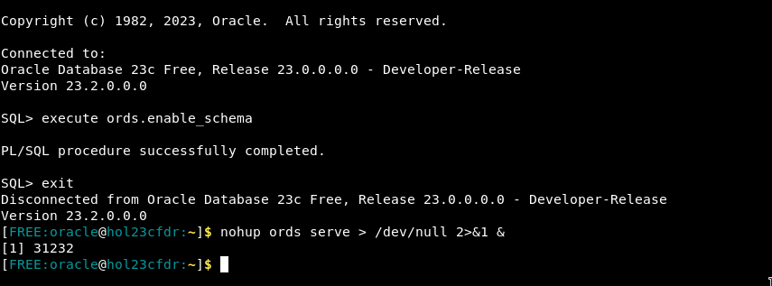

# Create the sample schemas

## Introduction

This lab walks you through the setup steps to download and install the sample schemas Sales History (SH) and Human Resources (HR).

Estimated Time: 10 minutes

### Objectives

In this lab, you will:
* Download the samples zip file
* Load the sample schemas via SQLcl
* Enable ORDS access for our schema
* Start ORDS

### Prerequisites

This lab assumes you have:
* Oracle AI Database 26ai Free Developer Release
* All previous labs successfully completed
* SQL Developer Web 23.1 or a compatible tool for running SQL statements

## Task 1: Download the zip file containing sample schemas

1. The first step is to get to a command prompt. If you need to open a terminal and you are running in a Sandbox environment click on Activities and then Terminal.

    

2. Next set your environment. The oraenv command will set all of the environment variables based on your database. When prompted type FREE for the database name or if you supplied a different database name use that.
    ```
    [FREE:oracle@hol23cfdr:~]$ <copy>. oraenv</copy>
     ORACLE_SID = [FREE] ? FREE
     The Oracle base has been set to /opt/oracle
    [FREE:oracle@hol23cfdr:~]$
		```

    <!--  -->


3. The sample schemas are available in a zip file on Object Storage. We will download them using the wget command line tool and a pre-authenticated request (PAR) link. Copy the following into the command window, pressing "Enter" if necessary:
    ```
    <copy>
    wget https://c4u04.objectstorage.us-ashburn-1.oci.customer-oci.com/p/EcTjWk2IuZPZeNnD_fYMcgUhdNDIDA6rt9gaFj_WZMiL7VvxPBNMY60837hu5hga/n/c4u04/b/livelabsfiles/o/data-management-library-files/db-sample-schemas-23.1.zip
    </copy>
    ```
    

4. Now unzip that file
    ```
    <copy>
    unzip db*.zip
    </copy>
    ```

    That will create a several directories. Move into the Sales History directory and start the SQLcl tool as the SYS user (you must use SQLcl - SQL*Plus will not work):

    ```
    <copy>
    cd
    cd db-sample-schemas-23.1/sales_history/
    sql / as sysdba
    </copy>
    ```

    

    Set the container to the PDB and load the SH sample files. The replies below will set the password to the SH schema to "oracle" but you can choose a different password if you wish.

    ```
    <copy>
    alter session set container = freepdb1;
    @sh_install
    oracle
    USERS
    yes
    
    </copy>
    ````

    Check the Installation verification to ensure all tables have loaded correctly.

    

    Now go to the human_resources directory and restart SQLcl:

    ```
    <copy>
    cd ../human_resources/
    sql / as sysdba
    </copy>
    ````

    Once again, set the container and install the HR samples:

    ```
    <copy>
    alter session set container = freepdb1;
    @hr_install
    oracle
    USERS
    yes
    </copy>
    ````

    Check the verification afterwards.

    

## Task 2: Grant HR user access to SH tables

We're going to allow the HR user to access some of the tables in the SH schema.

1. Still in our terminal window, start SQLcl and log in to the SH schema in the PDB. If you chose a password other than "oracle" earlier, you will need to use it here:

    ```
    <copy>
    cd
    sql sh/oracle@freepdb1
    </copy>
    ```

2.  Now grant SELECT access to the HR user on the tables PRODUCTS and CUSTOMERS

    ```
    <copy>
    GRANT SELECT ON sh.products TO hr;
    GRANT SELECT ON sh.customers TO hr;
    exit
    </copy>
    ```

    

## Task 3: Enable the HR schema for ORDS

1.  Still in our terminal window, start SQLcl and log in to the HR schema in the PDB. If you chose a password other than "oracle" earlier, you will need to use it here:

    ```
    <copy>
    cd
    sql hr/oracle@freepdb1
    </copy>
    ```

2.  To be able to use Database Actions (formerly known as SQL Developer Web), we must enable it from the schema we wish to use:

    ```
    <copy>
    execute ords.enable_schema
    exit
    </copy>
    ```

## Task 3: Start the ORDS Server

1. To start ORDS, from the same command prompt use the following command. The output of [1] 204454 is just an example, your output could be different. Using "nohup" means the termainal window may be closed but ORDS will stay running.

    ```
		[FREE:oracle@hol23cfdr:~]$ <copy>nohup ords serve > /dev/null 2>&1 &</copy>
[1] 204454
[FREE:oracle@hol23cfdr:~]$
		```

    


2. You may now proceed to the next lab.

## Learn More

* [Using JSON documents and don’t know what you’re looking for? 23ai Search Indexes to the rescue](https://blogs.oracle.com/database/post/23c-search-index)

## Acknowledgements
* **Author** - Roger Ford
* **Last Updated By/Date** - Abby Mulry, December 2025
