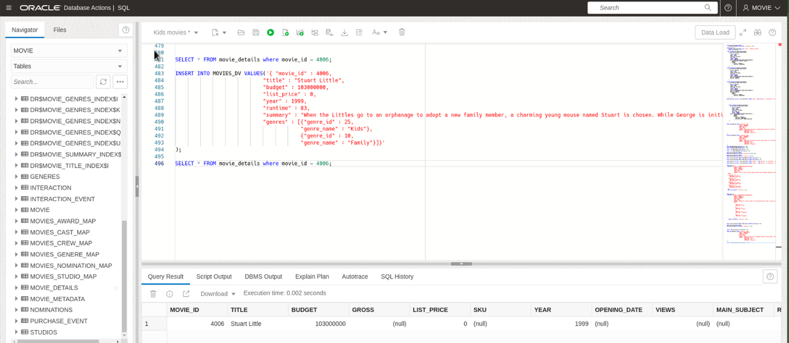
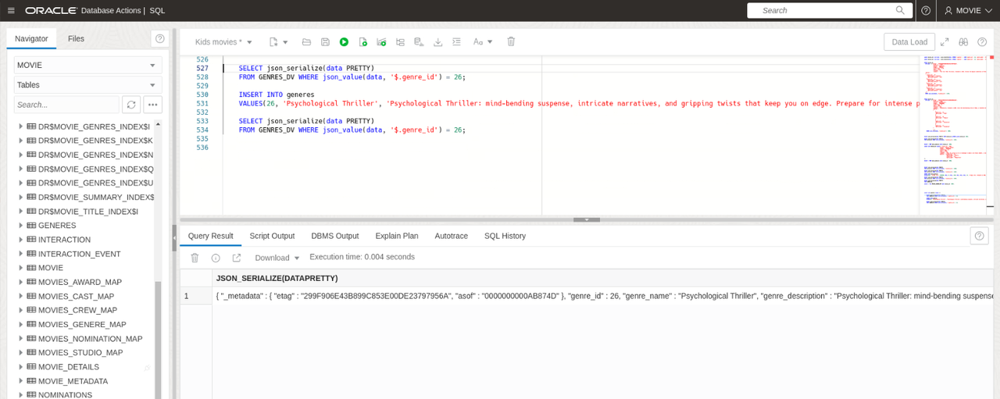
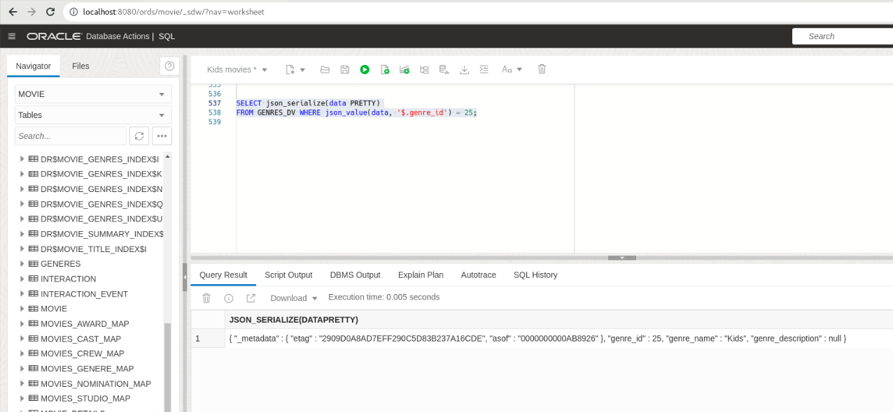
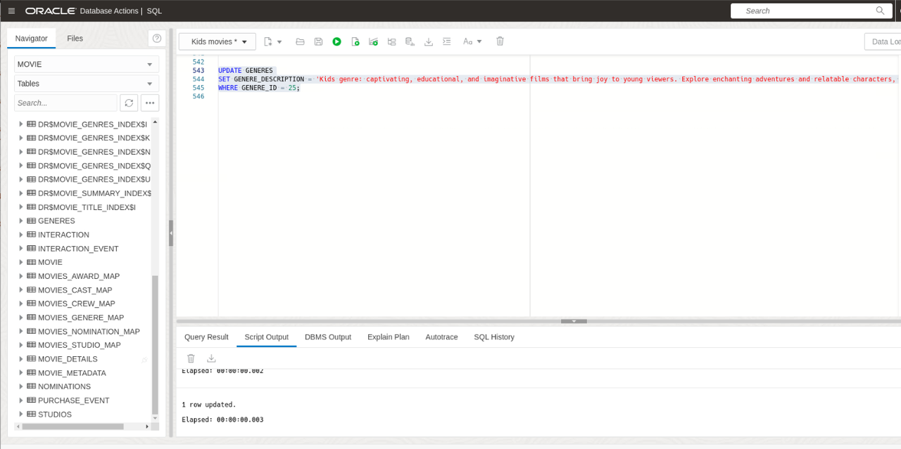
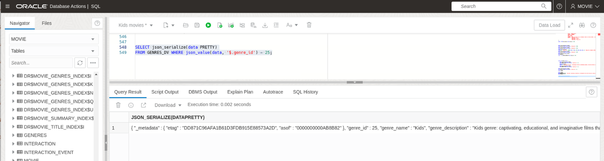
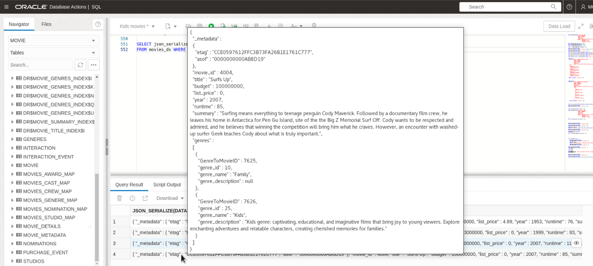
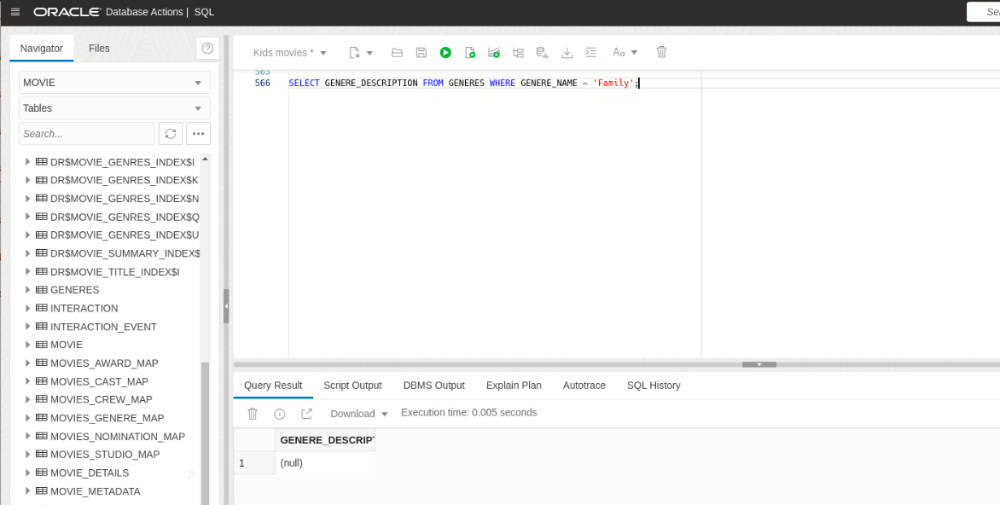
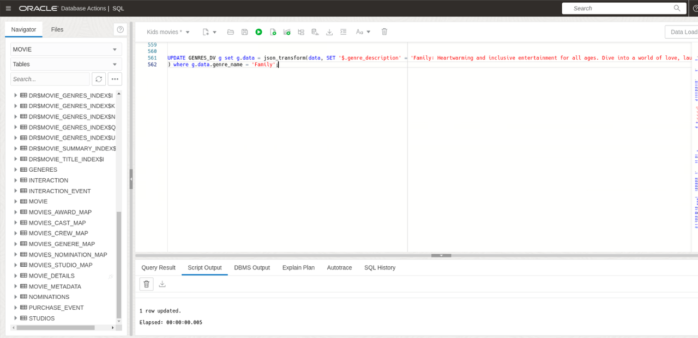
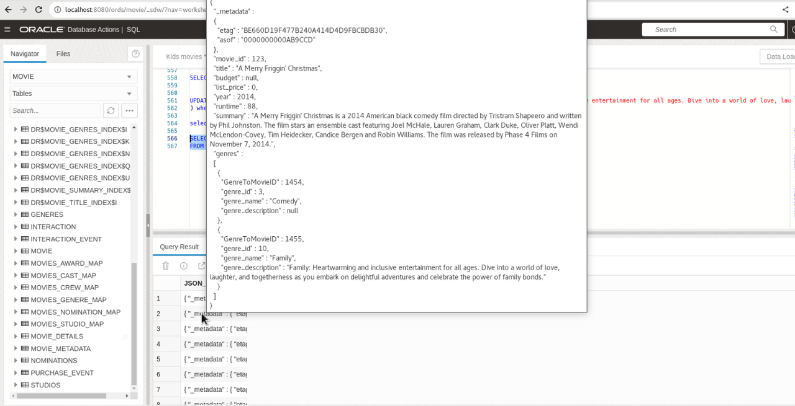

# The Extreme Flexibility of JSON Duality Views

## Introduction

This lab demonstrates the extreme flexibility of JSON Duality Views in the Oracle Database 23ai database. You will learn how to work with SQL data and JSON documents simultaneously, leveraging the true duality of the views. With JSON Duality Views, you have the flexibility and data access benefits of the JSON document model combined with the storage efficiency and power of the relational model.

Estimated Time: 20 minutes

[Lab 4](videohub:1_w820xz7v)

### Objectives

In this lab, you will:

* Perform insert and update operations on Duality Views and SQL base tables

### Prerequisites

This lab assumes you have:

* Oracle Database 23ai Free Developer Release
* All previous labs successfully completed
* SQL Developer Web 23.1 or a compatible tool for running SQL statements


## Task 1: Inserting into SQL tables and duality views
1. To demonstrate how the underlying base tables are populated when adding an entry into the JSON Duality View, we will first check the base table to ensure the record does not exist. Then, we will insert a record into the duality view and check the base table again. Copy the sql below and click **Run Script**

    ```
    <copy>
    SELECT * FROM movie_details where title = 'Stuart Little';

    INSERT INTO MOVIES_DV VALUES('{ "movie_id" : 4006,
                                "title" : "Stuart Little",
                                "budget" : 103000000,
                                "list_price" : 0,
                                "year" : 1999,
                                "runtime" : 83,
                                "summary" : "When the Littles go to an orphanage to adopt a new family member, a charming young mouse named Stuart is chosen. While George is initially unwelcoming so, he shows his beloved new family that great things can truly come in small packages.",
                                "genres" : [{"genre_id" : 25,
                                            "genre_name" : "Kids"},
                                            {"genre_id" : 10,
                                            "genre_name" : "Family"}]}'
    );

    SELECT * FROM movie_details where title = 'Stuart Little';
    </copy>
    ```
    

2. In this step, we will perform the opposite operation. First, we will look at the duality view, then insert a record into the base table, and finally check the duality view for the updated record. Copy the sql below and click **Run Script**
    ```
    <copy>
    SELECT json_serialize(data PRETTY)
    FROM GENRES_DV WHERE json_value(data, '$.genre_name') = 'Psychological Thriller';

    INSERT INTO genres
    VALUES(26, 'Psychological Thriller', 'Psychological Thriller: mind-bending suspense, intricate narratives, and gripping twists that keep you on edge. Prepare for intense psychological tension and thrilling storytelling.');

    SELECT json_serialize(data PRETTY)
    FROM GENRES_DV WHERE json_value(data, '$.genre_name') = 'Psychological Thriller';

    </copy>
    ```
    
    

## Task 2: Duality View benefits

1. Like the previous lab, lets make an update to the `GENRES_DV`. The important thing to note here is, this change will be reflected in **all documents** that contain the Kids genre. Copy the sql below and click **Run Script**

    ```
    <copy>
    SELECT json_serialize(data PRETTY)
    FROM GENRES_DV WHERE json_value(data, '$.genre_name') = 'Kids';
    </copy>
    ```
    We can see that the Kids genre exists but has no description. Let's update this via SQL.

    

2. Let's update the description of the Kids genre. Copy the sql below and click **Run Statement**
 
    ```
    <copy>
    UPDATE GENRES
    SET GENRE_DESCRIPTION = 'Kids genre: captivating, educational, and imaginative films that bring joy to young viewers. Explore enchanting adventures and relatable characters, creating cherished memories for families.'
    WHERE GENRE_ID = 25;
    </copy>
    ```
    

3. Now, let's check the `GENRES` table again to see the updated description. Copy the sql below and click **Run Script**
    ```
    <copy>
    SELECT json_serialize(data PRETTY)
    FROM GENRES_DV WHERE json_value(data, '$.genre_name') = 'Kids';
    </copy>
    ```
    We can see that the Kids genre now has a new description.

    

4. Next, let's examine all movies that contain the Kids genre to see the updated description. Copy the sql below and click **Run Script**
    ```
    <copy>
    SELECT json_serialize(data PRETTY)
    FROM movies_dv WHERE json_value(data, '$.movie_id') IN (4004, 4005, 2355, 4006);
    </copy>
    ```
    

5. Finally, since we made an update via a SQL INSERT statement, let's insert a record via the Duality View. We will add a description to the Family genre. First, check the current description. Copy the sql below and click **Run Script**

    ```
    <copy>
    SELECT GENRE_DESCRIPTION FROM GENRES WHERE GENRE_NAME = 'Family';
    </copy>
    ```
    

6. Update the Genres Duality View and add the description for the Family genre. Copy the sql below and click **Run Script**
    ```
    <copy>
    UPDATE GENRES_DV g set g.data = json_transform(data, SET '$.genre_description' = 'Family: Heartwarming and inclusive entertainment for all ages. Dive into a world of love, laughter, and togetherness as you embark on delightful adventures and celebrate the power of family bonds.') WHERE g.data.genre_name = 'Family';
    </copy>
    ```
    

7. Lastly, let's check the Duality Views containing the Family genre to see the updated description. Copy the sql below and click **Run Script**
    ```
    <copy>
    SELECT json_serialize(data PRETTY)
    FROM movies_dv WHERE json_value(data, '$.movie_id') IN (4004, 4005, 2355, 4006, 123, 124, 167, 190, 198, 212, 227);
    </copy>
    ```
    


8. In summary, this lab demonstrated the power of JSON Relational Duality Views, allowing you to work with data in either JSON Document format or SQL Relational format. Changes made through views are reflected in the corresponding documents and tables. This flexibility enables efficient and convenient create, read, update or delete across multiple documents and tables with ease.

You may now **proceed to the next lab** 

## Learn More

* [JSON Relational Duality: The Revolutionary Convergence of Document, Object, and Relational Models](https://blogs.oracle.com/database/post/json-relational-duality-app-dev)
* [JSON Duality View documentation](http://docs.oracle.com)
* [Blog: Key benefits of JSON Relational Duality] (https://blogs.oracle.com/database/post/key-benefits-of-json-relational-duality-experience-it-today-using-oracle-database-23c-free-developer-release)

## Acknowledgements
* **Author** - Killian Lynch, Oracle Database Product Management, Product Manager
* **Contributors** - Dominic Giles, Oracle Database Product Management, Distinguished Product Manager
* **Last Updated By/Date** - Killian Lynch, Oracle Database Product Management, Product Manager, May 2023

