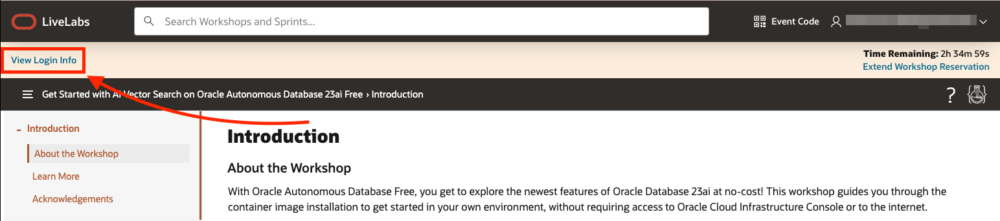
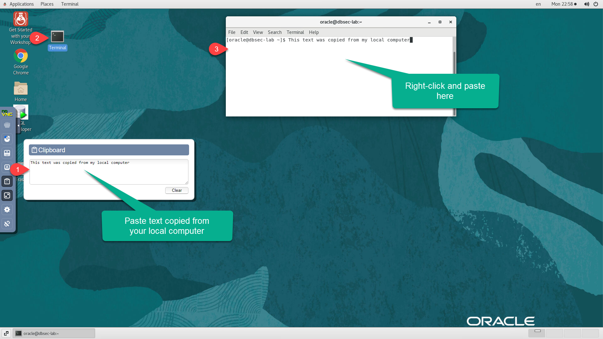
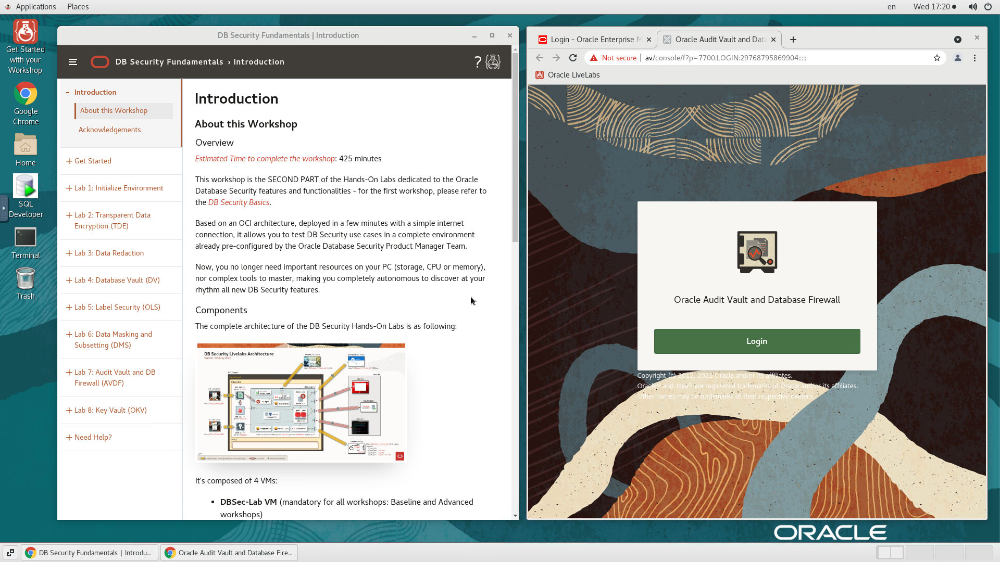

# Use noVNC remote desktop

## Introduction
This lab will show you how to get started with your workshop with a remote desktop session.

Estimated Time: 5 minutes

### Objectives
In this lab, you will:
- Enable fullscreen display of remote desktop session
- Enable remote clipboard integration
- Open the workshop guide from the remote desktop

### Prerequisites

This lab assumes you have:
- Provisioned VM Instance configured with noVNC

## Task 1: Launch noVNC from LiveLabs

1. In your reservation tab, select "View Login Info".

    

2. Select "Launch Remote Desktop".

    

## Task 2: Enable Full-screen Display
For seamless desktop integration and to make the best use of your display, perform the following tasks to render your remote desktop session in fullscreen mode.

1. Click on the small gray tab on the middle-left side of your screen to open the control bar.

    

2. Select *Fullscreen* to render the session on your entire screen.

    
    

## Task 3: Enable Copy/Paste from Local to Remote Desktop
During the execution of your labs, you may need to copy text from your *local PC/Mac* to the *remote desktop*, such as commands from the lab guide. While such direct copy/paste isn't supported as you will realize, you may proceed as indicated below to enable an alternative *local-to-remote clipboard* with Input Text Field.

1. Continuing from the last task above, Select the *clipboard* icon

    

2. Copy some text from your local computer as illustrated below and paste it into the clipboard widget, then finally open up the desired application (e.g. Terminal) and paste accordingly using *mouse controls*

    

    >**Note:** Please make sure you initialize your clipboard with Step 1 shown in the screenshot above before opening the target application in which you intend to paste the text. Otherwise will find the *paste* function in the context menu grayed out when attempting to paste for the first time.

## Task 4: Open Your Workshop Guide

1. If the *Web* browser window(s) is(are) not already open side-by-side, double-click the *Get Started with your Workshop* icon from the remote desktop. This will launch one or two windows depending on the workshop.

    

2. On the left window is your workshop guide and depending on your workshop, you may also have one or two browser tabs loaded with web apps. e.g. Weblogic console, Enterprise Manager Cloud Console, or a relevant application to your workshop such as SQL Developer, JDeveloper, etc.

    
    

## (Optional) Task 5: Open the Terminal

    If you need the terminal and it's not already up, open it as shown below._
    

You may now **proceed to the next lab**.

## Appendix: Connect Remotely Using SSH

While your workshop can be executed end-to-end from the remote desktop, follow the steps provided below if you need to access the instance remotely using an SSH client such as Putty, Unix/Linux/MacOS Terminal, OCI cloud shell, and other terminal emulators available on Windows.

>**Note:** In this section you are enabling SSH access to the OS user running the remote desktop. This could be oracle, opc, or any other OS user for which the noVNC remote desktop has been configured.

This assumes that you already have an RSA-type SSH key-pair available on the local system where you will be connecting from. If you don't and for more info on creating and using SSH keys for your specific platform and client, please refer to the guide [Generate SSH Keys](https://oracle-livelabs.github.io/common/labs/generate-ssh-key)

1. Open the remote clipboard on the remote desktop as shown in *Task 2* and launch a terminal session

2. Paste the block below onto the remote clipboard first, then onto the terminal to create or update the file *$HOME/.ssh/authorized_keys* with the *Vi* editor

    ```text
    <copy>
    cd $HOME; mkdir .ssh; cd .ssh
    vi authorized_keys
    </copy>
    ```

    

3. From the local system (e.g. your laptop) and with the exception of *Putty* users, locate the SSH public key from the key-pair, open it, and copy the entire content to the clipboard.

    

    If using Putty you must load the private key (*.ppk*) into the *Puttygen* utility to see the relevant public key block to copy. Do not copy the content of the public key file directly as it will not work.

    

4. Paste the copied public key onto the remote clipboard first, then onto the terminal where you opened *authorized_keys* for edit

    

5. Save and exit the *Vi* editor

6. Set required permissions on *$HOME/.ssh* and *authorized_keys*

    ```
    <copy>
    chmod 0700 $HOME/.ssh
    chmod 0600 $HOME/.ssh/authorized_keys
    </copy>
    ```

7. Test/Validate connectivity using the private key (for Unix/Linux/MacOS Terminal, OCI cloud shell, and Terminal emulators on Windows such as Cygwin and MobaXterm).

    ```text
    ssh -i [path to private key] remote-user@[instance-public-ip-address]
    ```

    e.g.
    ```text
    <copy>
    ssh -i /home/appuser1/.ssh/livelabs_rsa_priv oracle@150.xxx.xxx.xxx
    </copy>
    ```

    For Putty, please refer to the guide [Generate SSH Keys](https://oracle-livelabs.github.io/common/labs/generate-ssh-key) on how to establish the connection using the *.ppk* private key.

## Acknowledgements
* **Author** - Rene Fontcha, LiveLabs Platform Lead, NA Technology
* **Contributors** - Arabella Yao, Product Manager, Database Product Management
* **Last Updated By/Date** - Ramona Magadan, March 2024