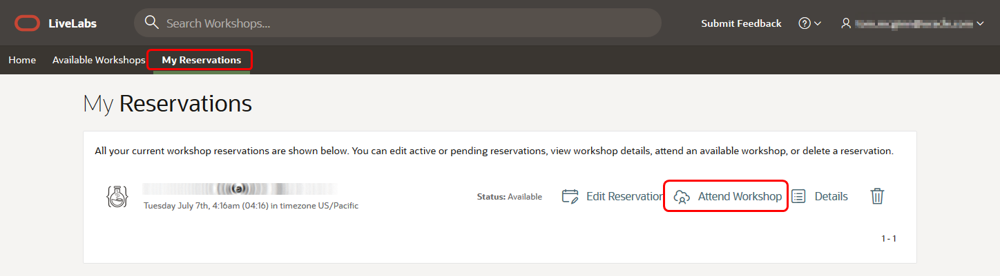

# Initialize the LiveLabs Environment

## Introduction
This lab will show you how to log in to your pre-created compute instance running on Oracle Cloud.

Estimated Time: 10 minutes

### Objectives
In this lab, you will:
- Gather details needed to connect to your instance (public IP address)
- Learn how to connect to your compute instance using Remote Desktop or SSH protocol

### Prerequisites

This lab assumes you have:
- A LiveLabs Cloud account and assigned compartment
- The IP address and instance name of your compute instance
- Successfully logged into your LiveLabs account
- A valid SSH Key (for *SSH Terminal Connections only*)

## Task 1: Access the Graphical Remote Desktop
For ease of execution of this workshop, your VM instance has been pre-configured with a remote graphical desktop, which is accessible using any modern browser on your laptop or workstation. Proceed as detailed below to log in.

1. Now that your instance has been provisioned. If you are not already on the **My Reservations** page, then:
    - Sign in to [LiveLabs](https://livelabs.oracle.com)
    - Click the drop-down arrow next to your **Username**
    - Click **My Reservations**

   

2. Find the request you submitted from the list displayed (only one item will be displayed if this is your first request), then click **Launch Workshop**

    

    >**Note:** The *Launch Workshop* link will be visible only when provisioning is completed

3. Click **View Login Info** and then **Launch Remote Desktop**.

    

    This should take you directly to your remote desktop in a single click.

    

    >**Note:**  While rare, you may see an error titled **Deceptive Site Ahead** or similar depending on your browser type as shown below.

    Public IP addresses used for LiveLabs provisioning come from a pool of reusable addresses and this error is because the address was previously used by a compute instance long terminated, but that wasn't properly secured, got compromised, and was flagged.

    You can safely ignore and proceed by clicking **Details**, and finally, **Visit this unsafe site**.

    

4. During the lifetime of your environment, you may return to this page to request an extension. To further extend the duration of your reservation, click **Extend Workshop Reservation**

    

    >**Note:** You may extend your reservation up to 4 times yielding a maximum lifetime equal to double the initial duration.

You may now **proceed to the next lab**.

## Appendix 1A: Log in to Host Using SSH Key Based Authentication (Optional)

Access to the compute instance by SSH protocol through the terminal is optional. If you are doing a LiveLab that can be done within a terminal completely, we recommend the Oracle Cloud Shell to upload a key and connect.

1.  Go to **Compute** -> **Instances**. Make sure you choose the correct compartment. Select the instance you created. On the instance homepage, find the **Public IP address** for your instance - you will need this information in Step 7.

    

2. Once uploading is finished, you can run the command below to . . .

    ```nohighlight
    <copy>
    ls
    </copy>
    ```
    ```nohighlight
    <copy>mkdir ~/.ssh</copy>
    mv <privatekeyname> ~/.ssh
    chmod 600 ~/.ssh/<privatekeyname>
    ls ~/.ssh
    ```

    

3.  Secure Shell (SSH) . . . replace the **&lt;sshkeyname&gt;** with the name of your SSH private key . . .

    ```text
    <copy>ssh -i ~/.ssh/<sshkeyname> opc@<Your Compute Instance Public IP Address></copy>
    ```
    

    If you are unable to SSH into the compute instance, check out the troubleshooting tips below.

You may now **proceed to the next lab**.

## Acknowledgements
* **Author** - Kaylien Phan, William Masdon, Jim Czuprynski
* **Contributors** - Jim Czuprynski, LiveLabs Contributor, Zero Defect Computing, Inc.
* **Last Updated By/Date** - Jim Czuprynski, July 2023
