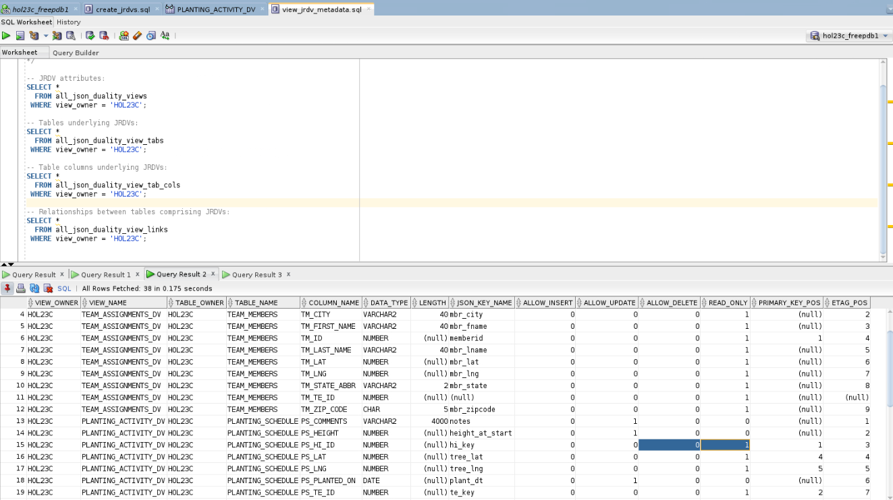

# Create JSON Relational Duality Views

## Introduction

In this lab you will create a set of new JSON Relational Duality Views (JRDVs) that sit atop the database objects you previously created in preparation for exploring the rich feature sets of JDRVs.

Estimated Time: 5 minutes.

### Objectives
Learn how to:
- Create new JRDVs
- Explore JRDV metadata captured within an Oracle Database 23ai database

### Prerequisites
This lab assumes:
- You have already finished all prior labs
- You still have your SQL Developer session open from the prior lab step

Watch the video below for a quick walk through of the lab.
[Create JSON Relational Duality Views walkthrough](videohub:1_16ew3f5s)

## Task 1: Create New JRDVs

1. Click File -> Open and navigate to the **/home/oracle/examples/jsonrdv** folder.

    

2. Next, we will create three new JRDVs that we'll be using throughout the rest of this LiveLab session:

    - Open the file named **create_jrdvs.sql** by clicking on the *File ... Open* icon.
    - Click the button that shows a document with the small green play button on it to run the whole script.
    - If it asks you to select a connection in a popup window, choose **hol23c_freepdb1** from the drop down and then click OK.

    

    You should see that the new JRDVs have been created. If you had created them earlier, they will simply be replaced.

3. Let's view some details about one of the JRDVs that we just created.

    - In the left-hand-side panel, click on the plus sign in front of the Views node in the tree view to expand it and reveal the JRDVs.
    - Click on the JRDV named **PLANTING\_ACTIVITY\_DV** to see some of the details about this object.

    

    - If you click on the Data tab for the JRDV, you can view the data returned as individual JSON documents. Hovering over the row will also display the JSON-formatted information in detail.

    

## Task 2: Explore JRDV Metadata

1. Next, let's take a closer look at the available metadata that Oracle Database 23ai retains automatically for each JRDV.

    - Open the file named **view\_jrdv\_metadata.sql** by clicking on the File ... Open icon.
    - Select the **hol23c\_free** database from the drop-down list in the upper-right-hand corner of the window  to connect to your PDB.
    - Highlight each individual SQL statement and hit CTL-Enter to execute each of them individually, or highlight all of them and hit CTL-Enter to run them collectively (as demonstrated below). Their output will be shown in individual **Query Result n** tabs.

2. The first query uses the **ALL\_JSON\_DUALITY\_VIEWS** data dictionary view to display information about how the data is being returned from the JRDV, including its JSON_SCHEMA definition and high-level DML privileges permitted against the JRDV.

    

3. The second query against the **ALL\_JSON\_DUALITY\_VIEW\_TABS** data dictionary view returns which tables underlie each JRDV, whether or not DML is permitted against those tables through the JRDV, and how the data is returned (e.g. NESTED or SINGLETON).

    

4. The third query against the **ALL\_JSON\_DUALITY\_VIEW\_TAB\_COLS** data dictionary view displays which table columns underlie each JRDV, the JSON key name given to that column in the corresponding JSON document, and whether or not DML is permitted against those columns.

    

5. The fourth query uses the **ALL\_JSON\_DUALITY\_VIEW\_LINKS** data dictionary view shows the linkages between each JRDV and its various underlying table(s).

    

6. The final query leverages the **DBMS\_JSON\_SCHEMA** package's **DESCRIBE** procdedure to display the metadata for the **TEAM\_ASSIGNMENTS\_DV** JRDV in JSON format. Here's an example of how that looks when executed in native SQLPlus format as well.

    

## Task 3: Explore Some JRDV Eccentricities

This task looks at a few eccentricities you might encounter when creating your own JRDVs.

1. Here is an example of a **CREATE JSON RELATIONAL DUALITY VIEW** statement that appears to be perfectly valid; in fact, it is a simplified variant of the DDL used to create the **PLANTING\_ACTIVITY\_DV** JRDV in the prior task, and it attempts to build a JRDV between the PLANTING_SCHEDULE and TEAMS tables.

    - Open the file named **jrdv\_failures.sql** by clicking on the *File ... Open* icon. 
    - Select the **hol23c\_free** database from the drop-down list in the upper-right-hand corner of the window to connect to your PDB. 
    - Execute the statement. You should receive an error message after the statement executes:

   

2. What happened here? The JRDV creation syntax appears to be syntactically correct, but yet Oracle Database 23ai would not create the JDRV as specified. The answer is explained rather cryptically in the more detailed error message explanation for **ORA-40895**:

    ```
    SQL> ? 40895
    Message: "invalid SQL expression in JSON relational duality view (%s)"
    Cause:  An invalid SQL expression was used in JSON relational duality view.
    Action: Ensure that a JSON relational duality view is constructed solely
            using JSON_OBJECT and JSON_ARRAYAGG with JSON_OBJECT input.
            Joins must be expressed on key columns with referential integrity.
    ```

3. The final line in the explanation hints at what went wrong: The "leading" table in the **CREATE OR REPLACE ... VIEW** statement - **TEAMS** - is not a table that associates data between the other tables in the DDL statement. This is one of several basic requirements of constructing JRDVs when linking them together:

    - If an associative table (in this case, **PLANTING\_SCHEDULE**) is mentioned, it **must** be at the top of the list of tables constructing the JRDV.
    - The top-level table **must** have a primary key, which *can* be composed of more than one column.
    - The top-level table **must** have foreign key constraints to the other tables used to construct the JRDV.
    - The remaining lower-level tables **must** also have valid primary keys so that the foreign key relationships are enforceable by the top-level table; also, each primary key constraint **must** be enforced with a unique index.

4. All of the necessary JRDVs have been created.

You may now **proceed to the next lab.**


## Learn More
* [Oracle JSON Developer's Guide](https://docs.oracle.com/en/database/oracle/oracle-database/23/adjsn/)
* [Oracle JSON-Relational Duality Developer's Guide](https://docs.oracle.com/en/database/oracle/oracle-database/23/jsnvu/)

## Acknowledgements
* **Author** - Kaylien Phan, William Masdon, Jim Czuprynski
* **Contributors** - Jim Czuprynski, LiveLabs Contributor, Zero Defect Computing, Inc.
* **Last Updated By/Date** - Jim Czuprynski, July 2023