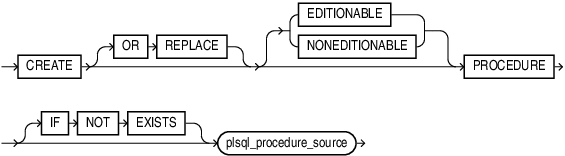
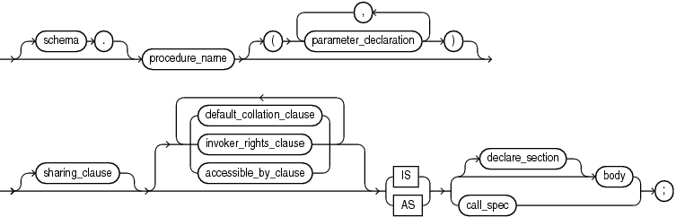
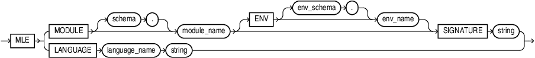
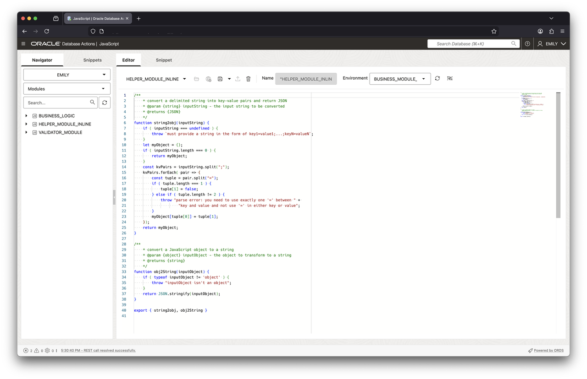
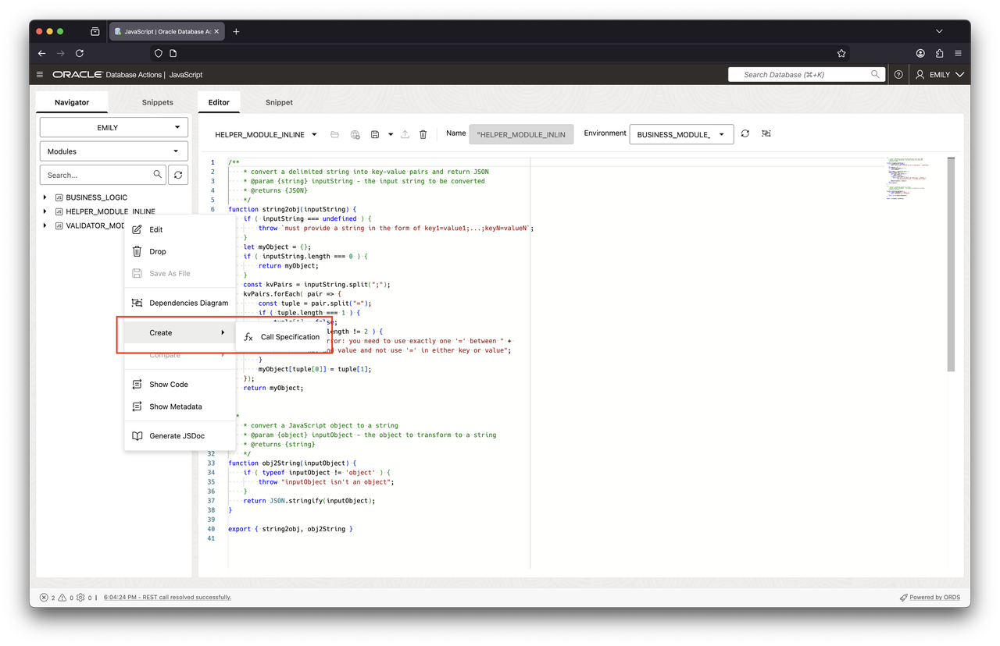
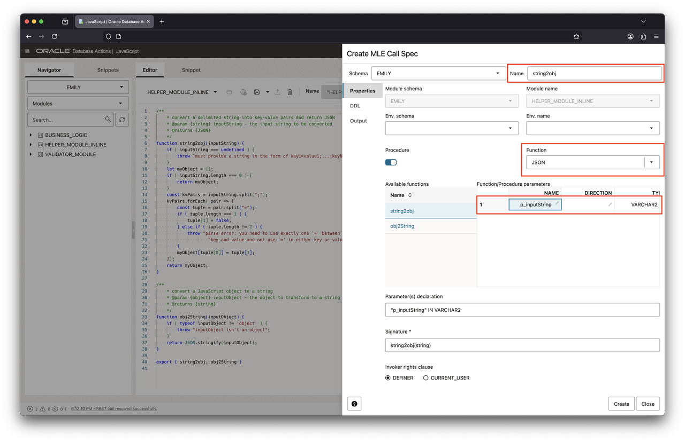
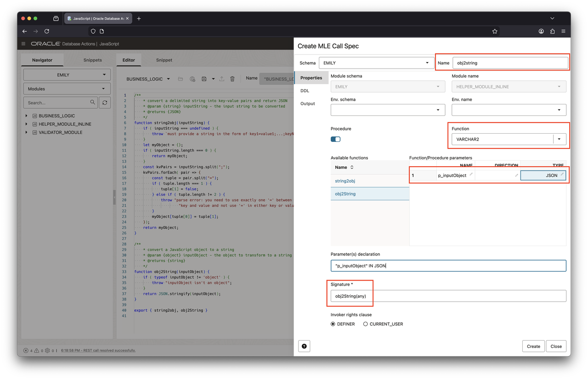

# Declare JavaScript functions

## Introduction

After creating JavaScript modules and environments in the previous lab, you will now learn how to expose JavaScript code in SQL and PL/SQL. After completing this step you can call JavaScript code anywhere you can invoke SQL and PL/SQL functions. All client code, regardless whether it's written in Java, Python, or even with `node-oracledb`, can access JavaScript stored procedures.

Estimated Lab Time: 10 minutes

### Objectives

In this lab, you will:

- Learn more about call specifications
- Create call specifications for JavaScript modules
- Invoke JavaScript code in SQL and PL/SQL
- Understand inline JavaScript functions

### Prerequisites

This lab assumes you have:

- An Oracle AI Database 26ai Free environment available to use
- Created the `emily` account as per Lab 1
- Completed Lab 2 where you created a number of JavaScript modules in the database

## Task 1: Learn more about call specifications

Call specifications are a standard extension to the PL/SQL language allowing you to provide instructions in a different programming language. The function or procedure bodies are typically expressed in PL/SQL, in this lab however you are going to create call specifications for JavaScript.

Technically speaking the call specification follows the `IS|AS` keyword in the `CREATE PROCEDURE` or `CREATE FUNCTION` statement. Call specifications come in many different variants as you can see in the PL/SQL language reference. The following railroad diagram has been copied from the `CREATE PROCEDURE` statement.



The call specification replaces the PL/SQL function or procedure's body:



> **Note**: For more information about call specifications, including context for the above syntax diagrams, see the[Oracle AI Database PL/SQL Language Reference](https://docs.oracle.com/en/database/oracle/oracle-database/26/lnpls/index.html).

You can define call specifications for multiple languages. The JavaScript syntax is defined as follows:



JavaScript developers can choose from 2 options:

- Refer to a function in a JavaScript module
- Provide the JavaScript code inline with the PL/SQL code unit

Both options will be covered in this lab.

## Task 2: Connect to Database Actions

Before starting any of the following tasks, you need to log into Database Actions as EMILY. Make sure to switch to SQL worksheets.

If you forgot the URL to access the Emily account, use the Database Actions dropdown and select Database Users, as shown in this screenshot:


In the ensuing dialog, identify the Emily account and take a note of the URL.


Copy/paste it into your favorite browser and access Database Actions use the option pointed to by the arrow to open Database Actions in a new window.

## Task 3: Create a simple call specification referring to functions in a module

In this task you will learn how to create a call specification based on the MLE module name and (JavaScript) function. If you haven't done so already, switch to SQL worksheets.

1. Review the source code for `helper_module_inline`

    Before you can invoke functions defined in a module you need to ensure they are exported.

    ```sql
    <copy>
    select 
        line, 
        text 
    from
        user_source 
    where 
        name = 'HELPER_MODULE_INLINE';</copy>
    ```

    You should see the following output:

    ```
    LINE TEXT                                                                               
    ---- ---------------------------------------------------------------------------------- 
    1 /**                                                                                
    2     * convert a delimited string into key-value pairs and return JSON              
    3     * @param {string} inputString - the input string to be converted               
    4     * @returns {JSON}                                                              
    5     */                                                                             
    6 function string2obj(inputString) {                                                 
    7     if ( inputString === undefined ) {                                             
    8         throw `must provide a string in the form of key1=value1;...;keyN=valueN`;  
    9     }                                                                              
    10     let myObject = {};                                                             
    11     if ( inputString.length === 0 ) {                                              
    12         return myObject;                                                           
    13     }                                                                              
    14     const kvPairs = inputString.split(";");                                        
    15     kvPairs.forEach( pair => {                                                     
    16         const tuple = pair.split("=");                                             
    17         if ( tuple.length === 1 ) {                                                
    18             tuple[1] = false;                                                      
    19         } else if ( tuple.length != 2 ) {                                          
    20             throw "parse error: you need to use exactly one '=' between " +        
    21                     "key and value and not use '=' in either key or value";        
    22         }                                                                          
    23         myObject[tuple[0]] = tuple[1];                                             
    24     });                                                                            
    25     return myObject;                                                               
    26 }                                                                                  
    27                                                                                    
    28 /**                                                                                
    29     * convert a JavaScript object to a string                                      
    30     * @param {object} inputObject - the object to transform to a string            
    31     * @returns {string}                                                            
    32     */                                                                             
    33 function obj2String(inputObject) {                                                 
    34     if ( typeof inputObject != 'object' ) {                                        
    35         throw "inputObject isn't an object";                                       
    36     }                                                                              
    37     return JSON.stringify(inputObject);                                            
    38 }                                                                                  
    39                                                                                    
    40 export { string2obj, obj2String }   
    ```

    You can see in line 40 that both functions declared in the module are exported.

    If you prefer a graphical user interface log into Database Actions and navigate to MLE JS from the Launchpad. Right-click on `HELPER_MODULE_INLINE` and select Edit from the context menu. This brings up the source code for the module:

    

2. Create call specification for `helper_module_inline` using Database Actions's JavaScript editor

    You can see from the output above that both functions in the module are exported (line 40). This allows us to create call specifications. Before you go ahead and create one you need to decide whether you need a PL/SQL _function_ or _procedure_. In the above case both JavaScript functions return data:

    - `string2obj(string)` returns a JavaScript object
    - `object2String(object)` returns a string

    A PL/SQL _function_ is the best fit: PL/SQL procedures don't provide an option to return a value.

    You create a call specification by right-clicking the module name > Create > Call Specification.

    

    This opens a dialog allowing you to provide the call specification's details. You need to complete two of these, once for the `string2obj()` JavaScript function, the other for `obj2string()`. You can use the following screenshots to create the call specifications.

    

    

3. Create call specification for `helper_module_inline` using Database Action's SQL Worksheet

    In addition to the create call spec wizard available with the JavaScript editor, you can always use SQL Worksheets to create call specifications.

    If you haven't yet, switch to SQL Worksheets to continue with this task.

    Note that you can either create stand-alone functions like earlier, or as demonstrated in this case you can group the functions in a PL/SQL package. Using the syntax diagrams shown earlier you can create the call specification as follows:

    ```sql
    <copy>
    create or replace package helper_pkg as
        
        function string2obj(
            p_inputString varchar2
        ) return JSON
            as mle module helper_module_inline
            signature 'string2obj';
        
        function obj2String(
            p_inputObject JSON
        ) return varchar2
            as mle module helper_module_inline
            signature 'obj2String';

    end helper_pkg;
    /
    </copy>
    ```

    Since `helper_module_inline` does not import functionality from any other module an `ENV` clause is not necessary.

4. Invoke the JavaScript code

    With the JavaScript code available to SQL and PL/SQL it is time to try it out. Begin by converting a JSON object to a string

    ```sql
    <copy>
    select helper_pkg.obj2String(
        JSON('{"a": 1, "b": 2, "c": 3, "d": false}')
    ) obj2String;
    </copy>
    ```

    You should see the following output:

    ```
    OBJ2STRING
    ----------------------------------------
    {"a":1,"b":2,"c":3,"d":false}
    ```

    Now convert a string to a JavaScript object:

    ```sql
    <copy>
    select json_serialize(
        helper_pkg.string2obj(
            'order_id=1;order_date=2023-04-24T10:27:52;order_mode=mail;promotion_id=1'
        )
        pretty
    ) string2obj;
    </copy>
    ```

    You should see the following output:

    ```
    STRING2OBJ
    ----------------------------------------
    {
        "order_id" : "1",
        "order_date" : "2023-04-24T10:27:52",
        "order_mode" : "mail",
        "promotion_id" : "1"
    }
    ```

## Task 4: Create a call specification involving use of an MLE environment

Creating call specifications for functions exported by the `business_logic` module requires an extra step. Remember from the previous lab that `business_logic` relies on `string2obj()` provided by `helper_module_inline`. Here is the relevant section of the code:

```sql
create mle module business_logic language javascript as
import { string2obj } from 'helpers';
/**
 * A simple function accepting a set of key-value pairs, translates it to JSON before
 * inserting the order in the database.
 * @param {string} orderData a semi-colon separated string containing the order de
 * @returns {boolean} true if the order could be processed successfully, false oth
 */
export function processOrder(orderData) {
    const orderDataJSON = string2obj(orderData);
    const result = session.execute("...");

// remaining code not shown
```

Before you can create a call specification for `processOrder()` you must ensure an MLE environment exists that maps the import name `helpers` to the `helpers_module_online`.

1. Review the MLE environment

    Remember from the previous lab that you created the necessary MLE environment. Make sure it is still present in your schema.

    ```sql
    <copy>
    select
        env_name,
        import_name,
        module_name
    from
        user_mle_env_imports
    order by
        env_name;
    </copy>
    ```

    You should see the following output:

    ```
    ENV_NAME                       IMPORT_NAME                    MODULE_NAME
    ------------------------------ ------------------------------ ------------------------------
    BUSINESS_MODULE_ENV            BUSINESS_LOGIC                 BUSINESS_LOGIC
    BUSINESS_MODULE_ENV            helpers                        HELPER_MODULE_INLINE
    ```

2. Create the call specification

    With the MLE environment confirmed to be present in the database you can go ahead and create the call specification. Just as with the previous example a PL/SQL package will be used. Looking at `processOrder()` you can see that the function returns true if the order has been persisted in the database, false otherwise. It does not attempt to catch any exceptions either, requiring the caller to catch any.

    ```sql
    <copy>
    create or replace package business_logic_pkg as

        function process_order(
            p_order_data varchar2
        ) return boolean
            as mle module business_logic
            env business_module_env
            signature 'processOrder';
    end business_logic_pkg;
    /
    </copy>
    ```

    The same can be achieved in Database Actions using the familiar workflow. Switch back to the JavaScript editor, then right-click on `BUSINESS_LOGIC` as you did before with the helper modules. Call specifications for `processOrder()` require knowledge about the environment name. You can set this as shown in this screenshot:

    

    Click on "Create" to close the wizard and persist the call specification.

3. Invoke the JavaScript code

    Just like in task 3 you can now invoke the code thanks to the call specification you just created. Switch back to SQL Worksheets, then run the following command

    ```sql
    <copy>
    set serveroutput on
    declare
        l_success boolean := false;
        l_str     varchar2(256);
    begin
        l_str := 'order_id=1;order_date=2023-04-24T10:27:52;order_mode=theMode;customer_id=1;order_status=2;order_total=42;sales_rep_id=1;promotion_id=1';
        l_success := business_logic_pkg.process_order(l_str);

        -- Consider a more robust success/failure evaluation
        if l_success then
            dbms_output.put_line('success');
        else
            dbms_output.put_line('false');
        end if;
    end;
    /
    </copy>
    ```

    You should see the following output:

    ```
    SQL> l
     1  declare
     2    l_success  boolean := false;
     3    l_str      varchar2(256);
     4  begin
     5    l_str := 'order_id=1;order_date=2023-04-24T10:27:52;order_mode=theMode;customer_id=1;order_status=2;order_total=42; sales_rep_id=1;promotion_id=1';
     6    l_success := business_logic_pkg.process_order(l_str);
     7
     8    -- you should probably think of a better success/failure evaluation
     9    if l_success then
    10      dbms_output.put_line('success');
    11    else
    12      dbms_output.put_line('false');
    13    end if;
    14  end;
    SQL> /
    success
    ```

    In addition you will find a new row in the `ORDERS` table

    ```
    SQL> select count(*) from orders;

      COUNT(*)
    ----------
             1
    ```

## Task 5: Create inline JavaScript functions

In scenarios where you don't need the full flexibility of JavaScript modules and environments you can save some keystrokes by using inline JavaScript functions.

1. Hello World example using inline JavaScript code

    As the name implies an inline function allows you to add the JavaScript code as if it were the PL/SQL body. Refer back to Task 1 and review the figure titled `javascript_declaration`: the lower half of the railroad diagram relates to inline JavaScript functions. In its simplest form you can write the classic `hello world` like so:

    ```sql
    <copy>
    create or replace function hello("who" varchar2) return varchar2
    as mle language javascript 
    <<
        return `hello, ${who}`;
    >>;
    /
    </copy>
    ```

    > **Note** JavaScript identifiers are case sensitive and therefore must be enclosed in double-quotes in the PL/SQL layer or else they won't be recognized in the JavaScript portion of the code.

    Proceed by executing the function.

    ```sql
    <copy>
    select hello('javascript') greeting;
    </copy>
    ```

    You should see the following output on screen:

    ```
    SQL> select hello('javascript') greeting;

    GREETING
    ------------------------
    hello, javascript
    ```

2. Convert string2obj() to an inline JavaScript function

    Following the same syntax diagram let's convert `string2obj()` to an inline function

    ```sql
    <copy>
    create or replace function string2obj(
        "inputString" varchar2
    ) return JSON
    as mle language javascript
    <<
        if ( inputString === undefined ) {
            throw `must provide a string in the form of key1=value1;...;keyN=valueN`;
        }

        let myObject = {};
        if ( inputString.length === 0 ) {
            return myObject;
        }
        
        const kvPairs = inputString.split(";");
        kvPairs.forEach( pair => {
            const tuple = pair.split("=");
            if ( tuple.length === 1 ) {
                tuple[1] = false;
            } else if ( tuple.length != 2 ) {
                throw "parse error: you need to use exactly one '=' between " + 
                "key and value and not use '=' in either key or value";
            }

            myObject[tuple[0]] = tuple[1];
        });
        return myObject;
    >>;
    /
    </copy>
    ```

    Proceed by invoking the function:

    ```sql
    <copy>
    select json_serialize(
        string2obj(
            'order_id=1;order_date=2023-04-24T10:27:52;order_mode=mail;promotion_id=1'
        )
        pretty
    ) string2obj;
    </copy>
    ```

    If you see the following output on screen everything went as expected:

    ```
    SQL> select json_serialize(
      2    string2obj(
      3      'order_id=1;order_date=2023-04-24T10:27:52;order_mode=mail;promotion_id=1'
      4    )
      5    pretty
      6  ) string2obj;

    STRING2OBJ
    --------------------------------------------------
    {
      "order_id" : "1",
      "order_date" : "2023-04-24T10:27:52",
      "order_mode" : "mail",
      "promotion_id" : "1"
    }
    ```

## Task 6: View dictionary information about call specifications

The data dictionary has been enhanced in Oracle AI Database 26ai Free to provide information about call specifications. A new view, named `USER_MLE_PROCEDURES` provides the mapping between PL/SQL code units and JavaScript. There are of course corresponding _ALL/DBA/CDB_ views as well.

1. Query `USER_MLE_PROCEDURES` to learn more about the existing call specifications

    ```sql
    <copy>
    select
        object_name, 
        procedure_name, 
        module_name, 
        env_name 
    from
        user_mle_procedures 
    order by
        object_name;
    </copy>
    ```

2. Understand the query output

    The following is an example of the output generated by the previous query, you may have additional rows returned.

    ```
    OBJECT_NAME        PROCEDURE_NAME MODULE_NAME          ENV_NAME            
    ------------------ -------------- -------------------- ------------------- 
    BUSINESS_LOGIC_PKG PROCESS_ORDER  BUSINESS_LOGIC       BUSINESS_MODULE_ENV 
    HELLO              null           null                 null                
    HELPER_PKG         STRING2OBJ     HELPER_MODULE_INLINE null                
    HELPER_PKG         OBJ2STRING     HELPER_MODULE_INLINE null                
    ISEMAIL            null           VALIDATOR_MODULE     null                
    OBJ2STRING         null           HELPER_MODULE_INLINE null                
    PROCESS_ORDER      null           BUSINESS_LOGIC       BUSINESS_MODULE_ENV 
    STRING2OBJ         null           null                 null              
    ```

    Due to the way the view is defined, you will sometimes see both `object_name` and `procedure_name` populated. In other cases, only `object_name` is populated, and `procedure_name` is null.

    - When using PL/SQL packages to encapsulate JavaScript functions both columns are populated with `object_name` referring to the package name and `procedure_name` to the function/procedure _within_ the package
    - In case of stand-alone PL/SQL functions and procedures `object_name` is populated and `procedure_name` is null
    - Inline JavaScript functions and procedures don't have a corresponding `module_name`

You many now proceed to the next lab.

## Learn More

- [Database PL/SQL Language Reference](https://docs.oracle.com/en/database/oracle/oracle-database/26/lnpls/index.html)
- JavaScript Developer's Guide describes [modules and environments](https://docs.oracle.com/en/database/oracle/oracle-database/26/mlejs/mle-js-modules-and-environments.html#GUID-32E2D1BB-37A0-4BA8-AD29-C967A8CA0CE1) in more detail. There is an [entire chapter](https://docs.oracle.com/en/database/oracle/oracle-database/26/mlejs/calling-mle-js-functions.html) dedicated to call specifications and inline JavaScript functions
- [Database Reference](https://docs.oracle.com/en/database/oracle/oracle-database/26/refrn/index.html) contains the definition of all dictionary views referred to in this lab

## Acknowledgements

- **Author** - Martin Bach, Senior Principal Product Manager, ST & Database Development
- **Contributors** -  Lucas Braun, Sarah Hirschfeld
- **Last Updated By/Date**: Martin Bach 17-DEC-2025
