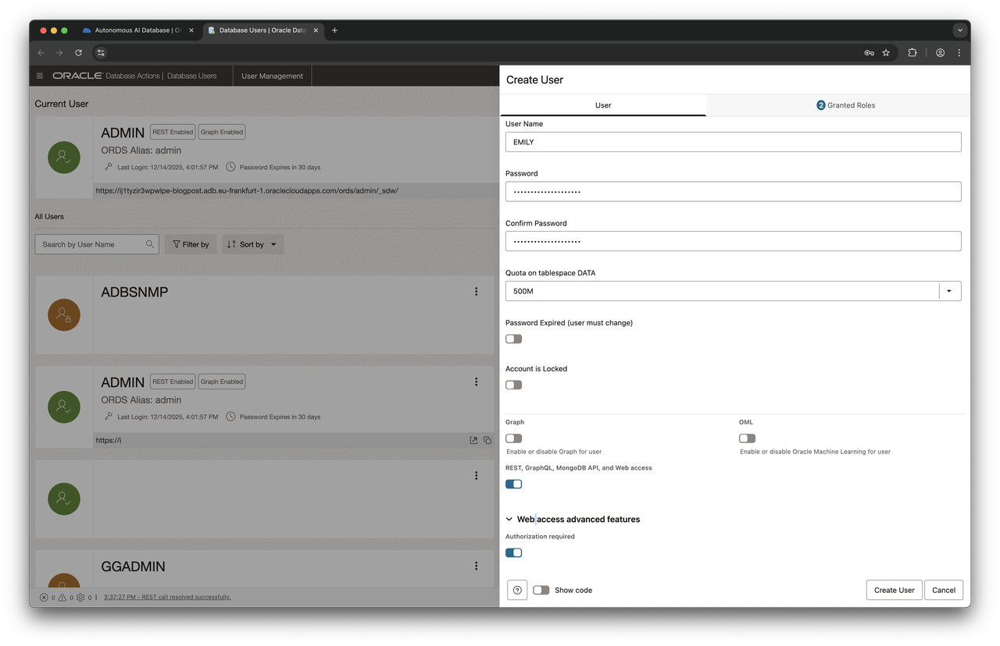
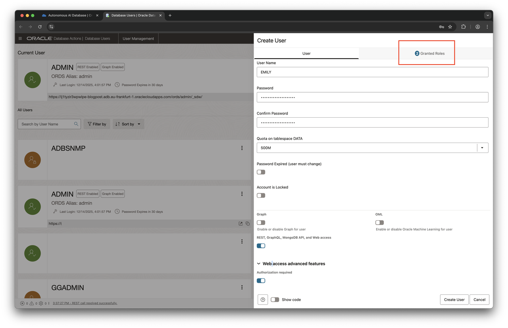
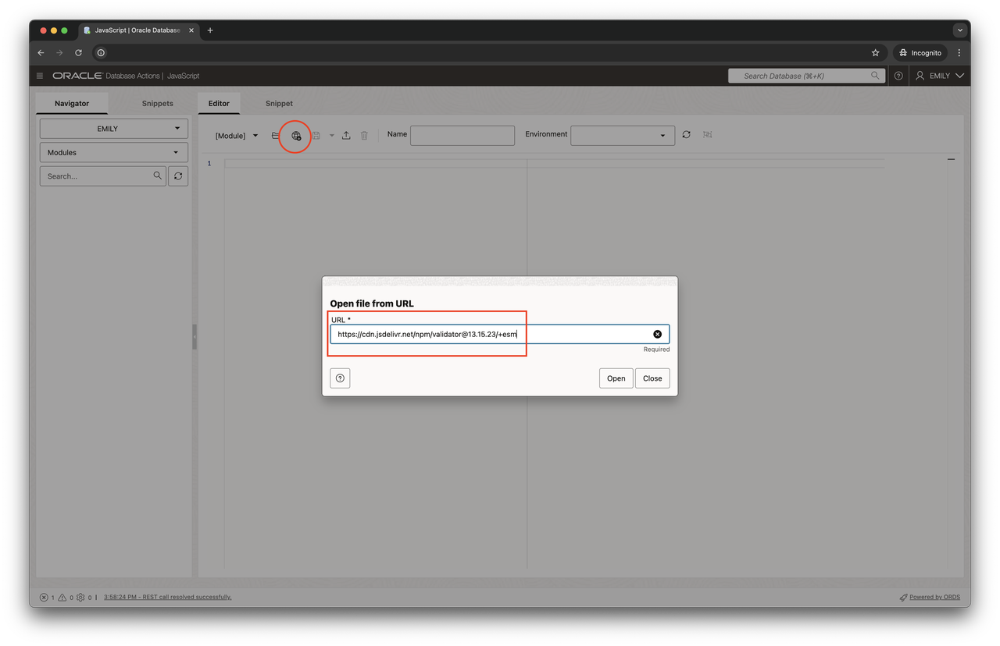
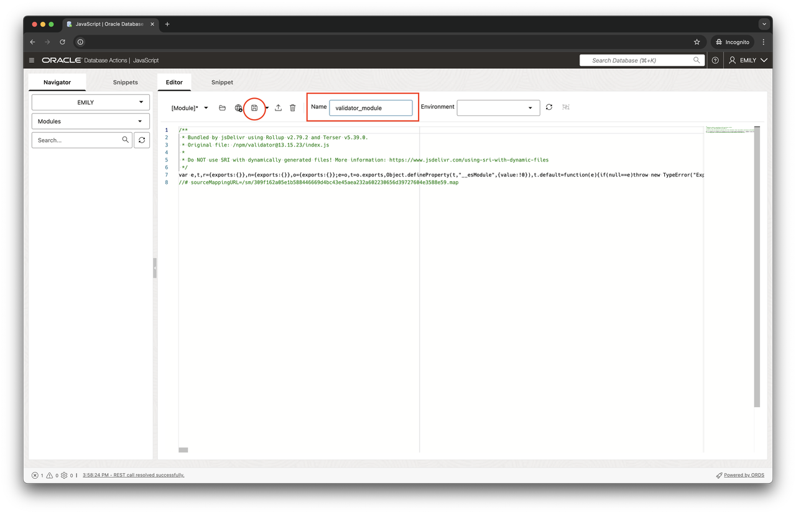
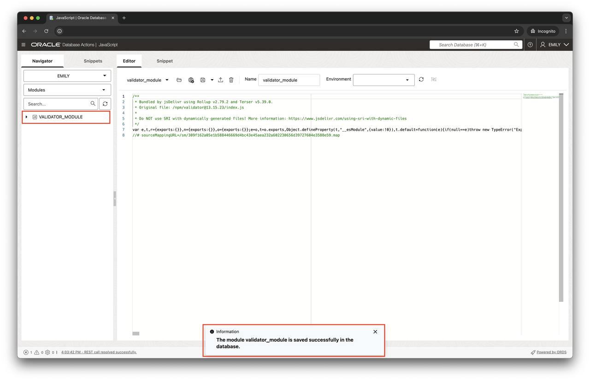

# Get started with JavaScript using a community module

## Introduction

Before jumping into the description of JavaScript features and all their details, let's begin with a practical example. Enhancing data quality is a focus area for many businesses. Poor data quality prevents analysts from making well-informed decisions, and it all starts at the source system. In this lab, you'll learn about validating email addresses, a common scenario in many applications.

Validating email addresses isn't a new problem, and there are plenty of solutions available. This lab explores the open source `validator.js` module's `isEmail()` function and demonstrates how to use it in your application.

> If you intend to use `validator.js` in your own project please refer to validator's GitHub project site for more details about the project's license and implications of use.

This lab works best with the Chrome browser or one of the many other browsers derived off it.

Estimated Time: 10 minutes

### Objectives

In this lab, you will:

- Use Database Actions to interact with your database
- Download the ECMAScript version of the `validator.js` module and store it in the database
- Expose the module to PL/SQL and SQL
- Validate email addresses

### Prerequisites

This lab assumes you have:

- Access to an Oracle AI Database 26ai instance via Database Actions
- Accessed Database Actions

## Task 1: Create a new user

The default user you are connecting to when starting Database Actions—the ADMIN user—is a superuser. Just like with any other system, you shouldn't use superusers for regular tasks.

1. Access your Autonomous Database

    After you logged into Oracle Cloud Console you can access your Autonomous AI Database. Access the hamburger menu in the top-left corner, then click on Oracle AI Database > Autonomous AI Database. Change your compartment by clicking on nnnn (root) and entering the compartment from your login details.

2. Log into Database Actions

    Select Database Actions -> Users in the landing page of your Autonomous Database.
    

    Control is transferred to Database Actions in a new browser tab.

3. Create the Emily account

    Complete the user creation wizard as shown in the screenshot.

    

    Don't forget to enable the "REST enabled" switch.

4. Assign Roles

    Proceed to the second tab in the user creation wizard.

    

    Assign the following roles:

    - `SODA_APP`
    - `DB_DEVELOPER_ROLE`

    Please tick the _Granted_ and _Default_ checkboxes for each of these.

5. Finish the user creation

    Click on the "Create User" button to create the database account and enable it.

This concludes the user creation.

## Task 2: Create the Validator Module

Sign out of the ADMIN account using the menu in the top right corner, and log back in as EMILY. Using the hamburger menu, select _JavaScript_ in the leftmost column. Make sure you are using the _Editor_ tab.

1. Load the Validator Module into the database

    Click on the globe icon (the one in the red circle) to open the "Load from URL" dialog. JavaScript modules can be loaded into the database in many ways, the browser's "Load from URL" being the most convenient.

    

    Enter the following URL: `https://cdn.jsdelivr.net/npm/validator@13.15.23/+esm`

    Oracle's JavaScript engine requires modules to adhere to the ECMAScript format. CommonJS modules or other formats aren't supported. Click on "open" to load the module into the editor.

2. Store the module in the database

    With the source code loaded into the editor, it's time to persist the module in the database. You do so by assigning it a name, `validator_module`, and clicking on the save button, highlighted in the following screenshot.

    

3. View the status

    After clicking on the save button the module is stored in the database. It's shown in the tree view in the left and can be used from now on. The end result is visible in the following screenshot:

    .

This concludes the loading of the JavaScript module in the database.

## Task 3: Make the JavaScript code available to SQL and PL/SQL

You can make any function defined in a JavaScript module available to SQL and PL/SQL. This is done using a call specification. A call specification essentially maps a name in the SQL namespace to a JavaScript function within a module. You are going to create one in this task.

1. Create a call specification

    All of the previous activities can equally be performed via SQL. DDL statements are available to create and drop JavaScript modules, and perform many more tasks. In the following section you are going to switch to SQL. To do so, click on the hamburger menu on the top left, then select SQL under the development column. This opens a SQL worksheet.

2. Create the JavaScript call specification

    Enter the following DDL statement and execute it in the SQL worksheet:

    ```sql
    <copy>
    create or replace function is_email(p_str varchar2)
    return boolean as
    mle module validator_module
    signature 'default.isEmail';
    /
    </copy>
    ```

    This statement allows you to call the function `is_email` in SQL and PL/SQL. Instead of a PL/SQL body, you find a reference to the `validator_module` you created earlier. As the name suggests, validator.js allows you to perform lots of [validations against strings](https://www.jsdelivr.com/package/npm/validator). One of the functions available to you is called `isEmail()`. This is now available for use.

3. Validate some email addresses

    The stage is now set to validate email addresses. Enter the following code into the worksheet:

    ```sql
    <copy>
    select isEmail('user-no-domain') as test1;
    select isEmail('@domain.but.no.user') as test2;
    select isEmail('user@example.com') as test3;
    </copy>
    ```

    Run these statements as a script or individual statements and see validator.isEmail() in action. If you ran these commands as a script, you should see the following output:

    ```
    TEST1 
    ----- 
    false 


    Elapsed: 00:00:00.172
    1 rows selected.

    Copy to clipboard

    TEST2 
    ----- 
    false 


    Elapsed: 00:00:00.004
    1 rows selected.

    Copy to clipboard

    TEST3 
    ----- 
    true  


    Elapsed: 00:00:00.006
    1 rows selected.
    ```

## Learn More

- [JavaScript Developer's Guide](https://docs.oracle.com/en/database/oracle/oracle-database/23/mlejs/index.html)
- [Server-Side JavaScript API Documentation](https://oracle-samples.github.io/mle-modules/)
- [Validator.js on Github](https://github.com/validatorjs/validator.js)

## Acknowledgements

- **Author** - Martin Bach, Senior Principal Product Manager, ST & Database Development
- **Contributors** -  Lucas Braun, Sarah Hirschfeld
- **Last Updated By/Date** - Martin Bach 17-NOV-2023
