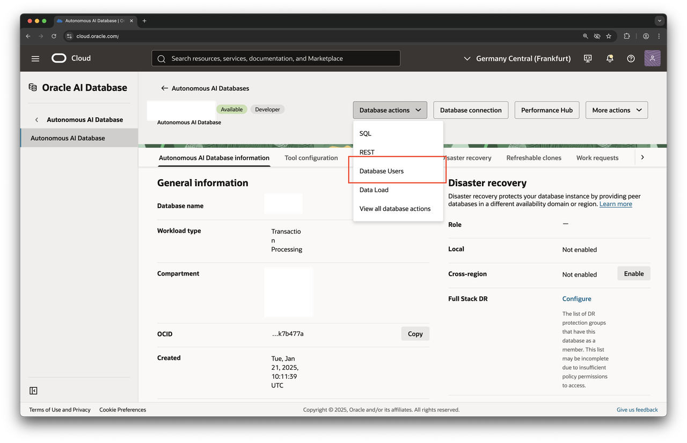
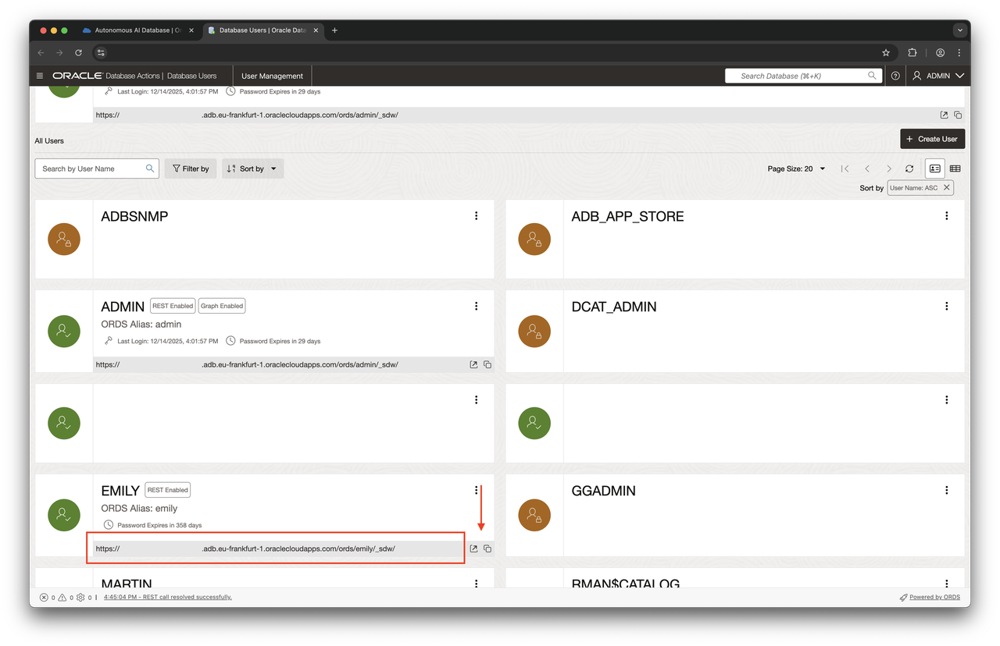

# Working effectively with JSON

## Introduction

JSON, short for JavaScript Object Notation, has become the de facto standard data interchange format and is very popular for storing data. Oracle's Converged Database has supported JSON for many years, adding functionality with each release on top of an already impressive base. Oracle AI Database 26ai is no exception.

You already got a glimpse of JSON in `processOrder()`, part of the `business_logic` module. This function is called with a string argument. The string is made up of a series of key-value pairs, each separated by a semicolon. The input parameter is subsequently translated to a JSON object and used in an insert statement showcasing the `JSON_TABLE` function.

> **Note:** You could have stored the JSON document in a JSON column in the table directly, but then you wouldn't have seen how easy it is to convert JSON to a relational format

In this lab you will learn about an alternative way of working with JSON, based on the Simple Document Access Model (SODA).

Estimated Lab Time: 10 minutes

### Objectives

In this lab, you will:

- Understand how to work with JSON using the document model (SODA)
- Create SODA collections
- Add documents to a collection
- Search for a specific document in a collection
- Modify a document and save it back to the collection
- Delete a document from a collection
- Drop the collection

### Prerequisites

This lab assumes you have:

- An Oracle AI Database 26ai Free environment available to use
- Created the `emily` account as per Lab 1

## Task 1: Log into Database Actions' JavaScript editor

Before starting any of the following tasks, you need to log into Database Actions as emily. Make sure to switch to the JavaScript editor.

If you forgot the URL to log in to the emily account, use the Database Actions dropdown and select Database Users as shown in this screenshot:



In the ensuing dialog, identify the emily account and take a note of the URL.



Copy/paste it into your favorite browser and access Database Actions; use the option pointed to by the arrow to open Database Actions in a new window.

## Task 2: Introduction to the Simple Oracle Document Access (SODA) model

In this part of the lab, you will learn how to interact with JSON using the Simple Oracle Document Access (SODA) model. The SODA API allows you to work with the database without ever having to resort to SQL's DML (Data Manipulation Language) and DDL (Data Definition Language) commands. Instead you follow the same approach you would when using specialized document databases while at the same time enjoying all the benefits of Oracle's Converged Database.

The SODA API is based on the following concepts:

- **SODADatabase**: The top-level object for SODA operations. This is acquired from an Oracle Database connection. A SODA database is an abstraction, allowing access to SODA collections in that SODA database, which then allow access to documents in those collections. A SODA database is analogous to an Oracle Database user or schema.
- **SODACollection**: Represents a collection of SODA documents. By default, collections allow JSON documents to be stored, and they add a default set of metadata to each document. This is recommended for most users.
- **SODADocument**: Represents a document. Typically, the document content will be JSON. The document has properties including the content, a key, timestamps, and the media type. By default, document keys are automatically generated.

The code you will see and use in this lab is quite comprehensive. It follows a certain workflow and assumes you are using the Snippets pane in Database Actions' JavaScript editor.

## Task 3: Interact with JSON using the SODA API

Simple Oracle Document Access (SODA) is a set of NoSQL-style APIs that let you create and store collections of documents (in particular JSON) in Oracle Database, retrieve them, and query them, without needing to know SQL or how the documents are stored in the database.

SODA APIs exist for different programming languages and include support for MLE/JavaScript. SODA APIs are document-centric. You can use any SODA implementation to perform create, read, update, and delete (CRUD) operations on documents of nearly any kind. You can also use any SODA implementation to query the content of JSON documents using pattern-matching: query-by-example (QBE). CRUD operations can be driven by document keys or by QBEs.

The previous lab (concerning the JavaScript SQL driver) introduced a major difference between the client-side `node-oracledb` driver and the one found in the database. Rather than having to get a handle to the default database connection and write additional code, a number of variables have been injected into the global scope. This approach is used throughout this lab.

1. Create a SODA Collection using variables defined in the global scope

    A SODA Collection is a container for JSON documents. Before any documents can be stored, a collection must be created first. Enter the following snippet in the Snippets pane and execute it.

    ```js
    <copy>
    // create the collection. In case a collection with the same name
    // exists already it will be opened - in any case the operation should
    // complete successfully
    const col = soda.createCollection('myCollection');
    </copy>
    ```

    Any code using the SODA API typically starts by creating or opening a collection. The `createCollection()` method will create the collection if needed, or open it if one exists with the same name.

    The code snippet should complete successfully. After the prompt is returned, a new SODA collection will have been created. Under the covers Oracle will create a table named `myCollection`, eventually containing the JSON document and some metadata.

2. Add documents to a collection

    Collections serve as a container for JSON documents. In this step you will add a couple of new documents to the collection. The code performing this operation is shown here.

    ```js
    <copy>
    const col = soda.createCollection('myCollection');

    // define a JSON document
    let doc = {
        "empno": 7839,
        "ename": "KING",
        "job": "PRESIDENT",
        "mgr": "",
        "hiredate": "1981-11-17",
        "sal": 5000,
        "comm": 0,
        "deptno": 10
    };

    // insert the document into the collection
    col.insertOne(doc);

    // insert another one
    doc = {
        "empno": 7566,
        "ename": "JONES",
        "job": "MANAGER",
        "mgr": 7839,
        "hiredate": "1981-04-02",
        "sal": 2975,
        "comm": 0,
        "deptno": 20
    };

    col.insertOne(doc);
    </copy>
    ```

    Execute the code snippet to insert 2 documents into the collection you just created in step 1.

3. Search for a specific document in the collection

    The SODA API provides filter functions to be used with QBE operators. This example demonstrates how to find a document (or set of documents) in a collection using a QBE.

    ```js
    <copy>
    const col = soda.createCollection('myCollection');
    let employees = [];

    try {
        const docCursor = col.find().filter({ "ename": "JONES" }).getCursor();
        let doc;
        while ((doc = docCursor.getNext())) {
            console.log(JSON.stringify(doc.getContent()));
        }

    } catch (err) {
        throw new Error('cannot find an employee named "JONES" in the collection');
    }
    </copy>
    ```

    The snippet searches the collection of employee records you inserted earlier. The QBE locates documents containing an `ename` of `JONES`. In our scenario there aren't any duplicate `ename`s stored in the collection, therefore a single document is retrieved and its content is printed on screen (your ID is most likely different).

    ```text
    {"_id":"6944201eaff7ea112a1c7df1","comm":0,"deptno":20,"empno":7566,"ename":"JONES","hiredate":"1981-04-02","job":"MANAGER","mgr":7839,"sal":2975}

    Elapsed: 00:00:00.072
    ```

4. Modify a document in a collection

    There are times when you have to modify a document in a collection. The SODA API offers a simple and convenient way to do so. The following function can be used to update an employee's salary.

    ```js
    <copy>
    const col = soda.createCollection('myCollection');

    const docCursor = col.find().filter({ "ename": "JONES" }).getCursor();
    let doc;
    while ((doc = docCursor.getNext())) {

        let emp = doc.getContent();

        // increase the salary by 10%, rounded to 2 decimal places
        console.log(`Mr. "JONES"'s salary before the raise is ${emp.sal}`);
        emp.sal = Math.round( emp.sal * 1.1 * 100) / 100
        col.find().key(doc.key).replaceOne(emp);
        console.log(`Mr. "JONES" has been given a raise, his new salary is ${emp.sal}`);

    }
    </copy>
    ```

    Executing this snippet will update JONES's salary by 10 percent.

5. Delete a document from a collection

    Just like records in relational tables, sometimes you have to delete documents from a collection. This example demonstrates how to do so. It deletes the previously modified document.

    ```js
    <copy>
    const col = soda.createCollection('myCollection');

    const result = col.find().filter({ "ename": "JONES" }).remove();
    if ( result.count === 0) {
        throw new Error ("could not delete JONES's employee record");
    }

    console.log('the document has been successfully removed');
    </copy>
    ```

6. Clean up by dropping the collection

    Dropping a collection is like dropping a table in the relational world—it can be potentially dangerous! Only drop a collection if you are absolutely sure you don't need it anymore. Here is an example of how to drop a collection:

    ```js
    <copy>
    // verify if the collection to be dropped exists in the first place
    const col = soda.openCollection('myCollection');
    if (col === null) {
        throw new Error('failed to open "myCollection"');
    }

    // drop the collection to complete this lab. In other scenarios
    // this might be a dangerous operation since the collection and
    // all its documents are removed permanently
    col.drop();
    </copy>
    ```

    The underlying table Oracle created for you has also been dropped, together with the collection itself.

You may now proceed to the next lab.

## Learn More

- [JavaScript Developer's Guide](https://docs.oracle.com/en/database/oracle/oracle-database/26/mlejs/soda-collections-in-mle-js.html#GUID-58C2BBD9-837D-41CD-A9EF-4EA062F1E1E2) describes the SODA API in more detail
- [Simple Oracle Document Access (SODA) landing page](https://docs.oracle.com/en/database/oracle/simple-oracle-document-access/)

## Acknowledgements

- **Author** - Martin Bach, Senior Principal Product Manager, ST & Database Development
- **Contributors** - Lucas Braun, Sarah Hirschfeld
- **Last Updated By/Date** - Martin Bach 18-DEC-2025
