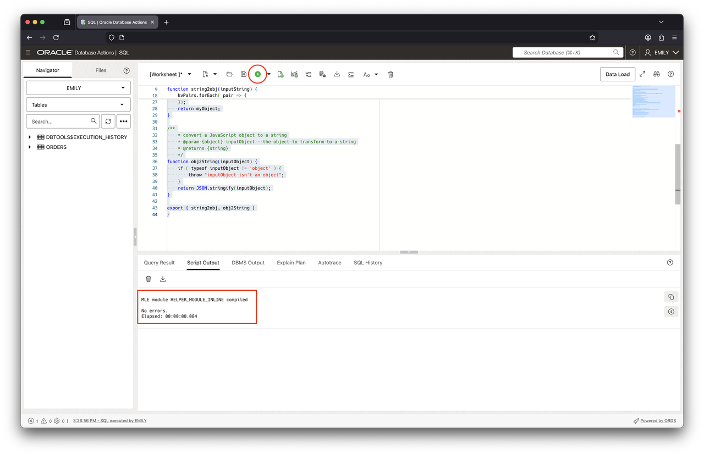
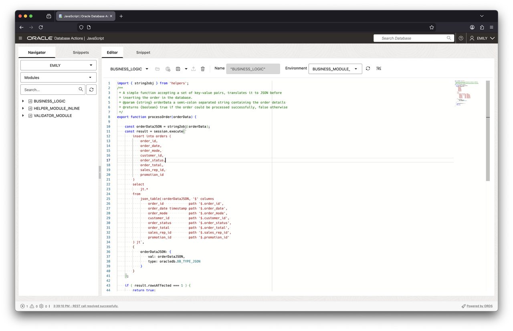
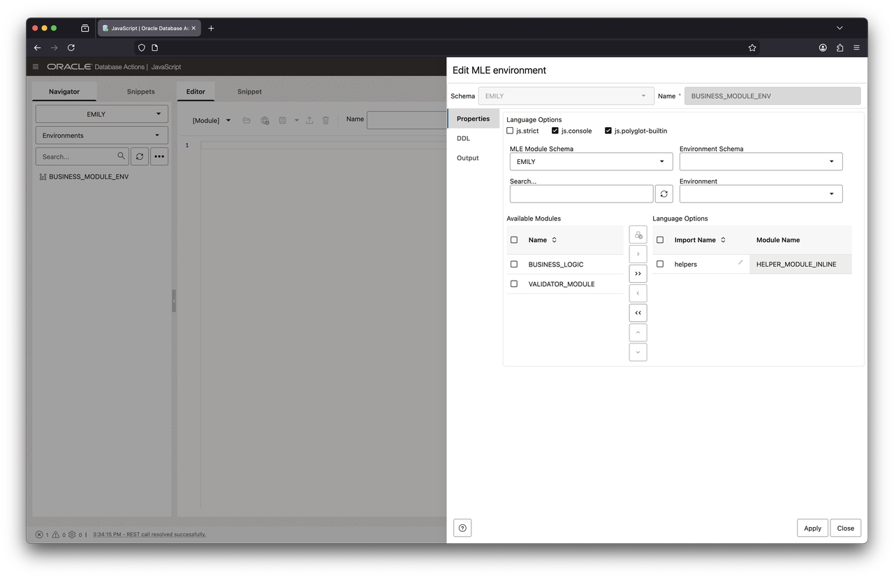
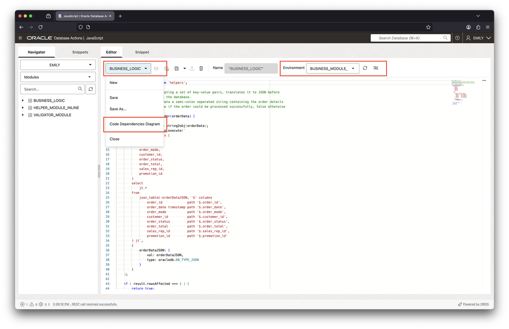
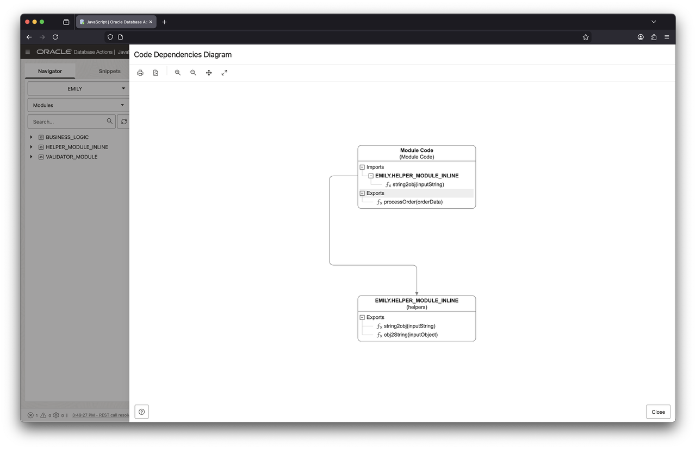

# Create JavaScript Modules and Environments

## Introduction

After the previous lab introduced JavaScript in Oracle AI Database 26ai Free, you will now learn more about Multilingual Engine (MLE) modules and environments. Modules are similar in concept to PL/SQL packages as they allow you to logically group code in a single namespace. Just as with PL/SQL you can create public and private functions. MLE modules contain JavaScript code expressed in terms of ECMAScript modules.

Estimated Lab Time: 10 minutes

### Objectives

In this lab, you will:

- Connect to Database Actions
- Create JavaScript modules
- Perform naming resolution using JavaScript environments
- View dictionary information about modules and environments

### Prerequisites

This lab assumes you have:

- Access to an Oracle AI Database 26ai Autonomous Database
- Created the `EMILY` account as per Lab 1

## Task 1: Connect to Database Actions

Before starting any of the following tasks, you need to log into Database Actions as EMILY. Make sure to switch to SQL worksheets.

If you forgot the URL to log in to the Emily account, use the Database Actions dropdown and select Database Users as shown in this screenshot:


In the ensuing dialog, identify the Emily account and take a note of the URL.


Copy/paste it into your favorite browser and access Database Actions use the option pointed to by the arrow to open Database Actions in a new window.

## Task 2: Create JavaScript modules in Database Actions

A JavaScript module in Oracle AI Database 26ai isn't too dissimilar from a JavaScript module you use in node, deno, or bun. The main difference is that you don't use a file system: the database's dictionary contains all your code.

In the context of the database a module is a unit of MLE's language code represented as a schema object. Storing code within the database is one of the main benefits of using JavaScript in Oracle AI Database 26ai: rather than having to manage a fleet of application servers each with their own copy of the application, the database takes care of this for you.

In addition, Data Guard replication ensures that the exact same code is present in both production and all physical standby databases. This way configuration drift, a common problem bound to occur when activating the disaster recovery site, can be mitigated.

> **Note**: A JavaScript module in MLE is equivalent to an ECMAScript 6 module. The terms MLE module and JavaScript module are used interchangeably in this lab.

The easiest way to create a JavaScript module is to provide the JavaScript code inline with the `create mle module` DDL statement. Enter the following code in your worksheet:

```sql
<copy>create or replace mle module helper_module_inline
language javascript as 

/**
* convert a delimited string into key-value pairs and return JSON
* @param {string} inputString - the input string to be converted
* @returns {JSON}
*/
function string2obj(inputString) {
    if ( inputString === undefined ) {
        throw `must provide a string in the form of key1=value1;...;keyN=valueN`;
    }
    let myObject = {};
    if ( inputString.length === 0 ) {
        return myObject;
    }
    const kvPairs = inputString.split(";");
    kvPairs.forEach( pair => {
        const tuple = pair.split("=");
        if ( tuple.length === 1 ) {
            tuple[1] = false;
        } else if ( tuple.length != 2 ) {
            throw "parse error: you need to use exactly one '=' between " + 
                    "key and value and not use '=' in either key or value";
        }
        myObject[tuple[0]] = tuple[1];
    });
    return myObject;
}

/**
* convert a JavaScript object to a string
* @param {object} inputObject - the object to transform to a string
* @returns {string}
*/
function obj2String(inputObject) {
    if ( typeof inputObject != 'object' ) {
        throw "inputObject isn't an object";
    }
    return JSON.stringify(inputObject);
}

export { string2obj, obj2String }
/</copy>
```

Submit the code to the database using the Execute button, circled in red in the following screenshot:



Execute the statement. The JavaScript module has now been created in the database.

## Task 3: Perform name resolution using MLE environments

1. Reference existing modules

    The more modular your code, the more reusable it is. JavaScript modules in Oracle AI Database 26ai can reference other modules easily, allowing developers to follow a divide and conquer approach designing applications. The code shown later in this lab makes use of the module `helper_module_inline` created earlier to convert a string representing an order before inserting it into a table.

    > **Note**: Lab 4 will explain the use of the JavaScript SQL Driver in more detail.

    The following example makes use of the `SH` sample schema. If you don't have the sample schemas installed in your PDB you can create a simplified version of the `ORDERS` table as follows. Copy and paste the following snippet into your worksheet. Then execute the statement.

    ```sql
    <copy>
    create table orders (
        order_id     number(12) not null,
        order_date   date not null,
        order_mode   varchar2(8),
        customer_id  number(6) not null,
        order_status number(2),
        order_total  number(8,2),
        sales_rep_id number(6),
        promotion_id number(6),
        constraint pk_orders primary key(order_id)
    );
    </copy>
    ```

    The `business_logic` module shown below will insert an order into that table after converting a comma-separated string to a JSON document which is eventually parsed by `json_table()`. Inserting data into a table requires the use of the MLE JavaScript SQL driver which will be covered in a later lab.

    ```sql
    <copy>
    create mle module business_logic language javascript as

    import { string2obj } from 'helpers';
    /**
     * A simple function accepting a set of key-value pairs, translates it to JSON before
     * inserting the order in the database.
     * @param {string} orderData a semi-colon separated string containing the order details 
     * @returns {boolean} true if the order could be processed successfully, false otherwise
     */
    export function processOrder(orderData) {
        
        const orderDataJSON = string2obj(orderData);
        const result = session.execute(`
            insert into orders (
                order_id,
                order_date,
                order_mode, 
                customer_id, 
                order_status,
                order_total, 
                sales_rep_id, 
                promotion_id
            )
            select
                jt.*
            from 
                json_table(:orderDataJSON, '$' columns
                    order_id             path '$.order_id',
                    order_date timestamp path '$.order_date',
                    order_mode           path '$.order_mode',
                    customer_id          path '$.customer_id', 
                    order_status         path '$.order_status',
                    order_total          path '$.order_total', 
                    sales_rep_id         path '$.sales_rep_id',
                    promotion_id         path '$.promotion_id'
            ) jt`,
            {
                orderDataJSON: {
                    val: orderDataJSON,
                    type: oracledb.DB_TYPE_JSON
                }
            }
        );

        if ( result.rowsAffected === 1 ) {
            return true;
        } else {
            return false;
        }
    }
    /
    </copy>
    ```

    Submit this statement against the database.

2. Understand name resolution in JavaScript powered by Multilingual Engine (MLE)

    The `business_logic` module introduces a new concept: an (ECMAScript) `import` statement. `string2obj()`, defined in the helpers module is imported into the module's namespace.

    On its own, MLE does not know how to resolve the import name to a module. A separate entity performs this mapping: a so-called MLE environment. You need to create one for the business module shown above not to throw runtime errors.

3. Create and edit an environment

    The following snippet creates an MLE environment, mapping the import name `helpers` as seen in the `business_logic` module to `helper_module_inline`

    ```sql
    <copy>
    create mle env business_module_env
    imports (
        'helpers' module helper_module_inline
    );
    </copy>
    ```

    This will come in handy later.

## Task 4: View and edit JavaScript modules and environments using the JavaScript editor

Apart from the SQL worksheet you used earlier, a dedicated JavaScript editor exists in Database Actions as well.

1. View JavaScript modules using the JavaScript editor

    The JavaScript editor featured in Database Actions supports working with modules and environments as well. Switch over to the "JavaScript" editor by using the hamburger menu in the top-left corner again, then choose "JavaScript".

    You should see all JavaScript modules in the tree structure to the left, as shown in the following screenshot. Right-clicking on a module name allows you to load it into the editor.

    

2. View environment information using the JavaScript editor

    From the dropdown on the left navigation pane select "Environments" to obtain a list of environments. You should see the `BUSINESS_MODULE_ENV` listed. Right-click the environment's name and choose `Edit` to review the environment definition.

    

    You can see that list of imported modules on the right-hand side of the wizard displays an import name `helpers`, mapping to `helper_module_inline`. Add the `business_logic` module to the list of imported modules by selecting it in the list of available modules, followed by a click on the `>` symbol. Finally click on the apply button to persist the change.

    The environment will play a crucial role when exposing JavaScript code to SQL and PL/SQL, a topic that will be covered in the next lab (Lab 3).

    Database Actions provides a handy way of viewing code dependencies based on a given combination of module/environment. `BUSINESS_LOGIC` is the only module importing functionality provided by another module, and serves as an example.

    Switch back to "Modules" in the left-hand tree view. Next, right-click on the `BUSINESS_LOGIC` module in the tree view and select "Edit" from the context menu. This will load the module's code into the Editor pane. Now you need to associate `BUSINESS_MODULE_ENV` with the module using the dropdown menu as shown in this screenshot. Should the drop-down be empty click on the reload icon next to it and try again.

    Once the environment is associated with the module you can view the module's dependency diagram. Click on the module's name in the drop-down menu in the editor's top left corner (right above the `import { string2obj }` statement) and select "Code Dependencies Diagram".

    

    The following diagram is shown, highlighting `BUSINESS_LOGIC`'s dependency on `HELPER_MODULE_INLINE`.

    

    > **Note:** It's possible to reference a module in multiple environments, there is no strict 1:1 mapping between environment and module.

## Task 5: View dictionary information about modules and environments

A number of dictionary views allow you to see which modules are present in your schema, which environments were created, and which import names have been mapped to modules. Existing views like `ALL_SOURCE` have been extended to show the module's source code. These can come in handy if you don't have access to graphical user interfaces such as Database Actions.

1. View the source code of `helper_module_inline`

    Switch to the SQL worksheets and run the following query, preferably as a script.

    ```sql
    <copy>
    select 
        line, 
        text 
    from
        user_source 
    where 
        name = 'HELPER_MODULE_INLINE';</copy>
    ```

    You should see the following output:

    ```
    LINE TEXT                                                                              
    ---- --------------------------------------------------------------------------------- 
    1 /**                                                                               
    2     * convert a delimited string into key-value pairs and return JSON             
    3     * @param {string} inputString - the input string to be converted              
    4     * @returns {JSON}                                                             
    5     */                                                                            
    6 function string2obj(inputString) {                                                
    7     if ( inputString === undefined ) {                                            
    8         throw `must provide a string in the form of key1=value1;...;keyN=valueN`; 
    9     }                                                                             
    10     let myObject = {};                                                            
    11     if ( inputString.length === 0 ) {                                             
    12         return myObject;                                                          
    13     }                                                                             
    14     const kvPairs = inputString.split(";");                                       
    15     kvPairs.forEach( pair => {                                                    
    16         const tuple = pair.split("=");                                            
    17         if ( tuple.length === 1 ) {                                               
    18             tuple[1] = false;                                                     
    19         } else if ( tuple.length != 2 ) {                                         
    20             throw "parse error: you need to use exactly one '=' between " +       
    21                     "key and value and not use '=' in either key or value";       
    22         }                                                                         
    23         myObject[tuple[0]] = tuple[1];                                            
    24     });                                                                           
    25     return myObject;                                                              
    26 }                                                                                 
    27                                                                               
    28 /**                                                                               
    29     * convert a JavaScript object to a string                                     
    30     * @param {object} inputObject - the object to transform to a string           
    31     * @returns {string}                                                           
    32     */                                                                            
    33 function obj2String(inputObject) {                                                
    34     if ( typeof inputObject != 'object' ) {                                       
    35         throw "inputObject isn't an object";                                      
    36     }                                                                             
    37     return JSON.stringify(inputObject);                                           
    38 }                                                                                 
    39                                                                              
    40 export { string2obj, obj2String }                                                 


    Elapsed: 00:00:00.005
    40 rows selected.
    ```

2. View information about modules in your schema

    ```sql
    <copy>
    select
        module_name,
        language_name
    from
        user_mle_modules
    where
        language_name = 'JAVASCRIPT'
    order by
        module_name;
        </copy>
    ```

    You should see the following output:

    ```
    MODULE_NAME          LANGUAGE_NAME 
    -------------------- ------------- 
    BUSINESS_LOGIC       JAVASCRIPT    
    HELPER_MODULE_INLINE JAVASCRIPT    
    VALIDATOR_MODULE     JAVASCRIPT 
    ```

3. List all environments in your schema

    ```sql
    <copy>
    select
        env_name
    from
        user_mle_envs
    order by
        env_name;
    </copy>
    ```

    You should see the following output:

    ```
    ENV_NAME
    --------------------
    BUSINESS_MODULE_ENV
    ```

4. List all environments together with their module to import name mappings

    ```sql
    <copy>
    select
        env_name,
        import_name,
        module_name
    from
        user_mle_env_imports
    order by
        env_name;
    </copy>
    ```

    You should see the following output:

    ```
    ENV_NAME            IMPORT_NAME    MODULE_NAME          
    ------------------- -------------- -------------------- 
    BUSINESS_MODULE_ENV helpers        HELPER_MODULE_INLINE 
    BUSINESS_MODULE_ENV BUSINESS_LOGIC BUSINESS_LOGIC  
    ```

You may now proceed to the next lab.

## Learn More

- SQL Language Reference [CREATE MLE MODULE](https://docs.oracle.com/en/database/oracle/oracle-database/23/sqlrf/create-mle-module.html#GUID-EF8D8EBC-2313-4C6C-A76E-1A739C304DCC)
- SQL Language Reference [CREATE MLE ENV](https://docs.oracle.com/en/database/oracle/oracle-database/23/sqlrf/create-mle-env.html#GUID-419C81FD-338D-495F-85CD-135D4D316718)
- Chapter 3 in [JavaScript Developer's Guide](https://docs.oracle.com/en/database/oracle/oracle-database/23/mlejs/mle-js-modules-and-environments.html#GUID-32E2D1BB-37A0-4BA8-AD29-C967A8CA0CE1) describes modules and environments in detail
- [Database Reference](https://docs.oracle.com/en/database/oracle/oracle-database/23/refrn/index.html) contains the definition of all dictionary views
- [Mozilla Developer Network](https://developer.mozilla.org/en-US/docs/Web/JavaScript/Guide/Modules) section covering ECMAScript modules

## Acknowledgements

- **Author** - Martin Bach, Senior Principal Product Manager, ST & Database Development
- **Contributors** -  Lucas Braun, Sarah Hirschfeld
- **Last Updated By/Date** - Martin Bach 17-DEC-2025
