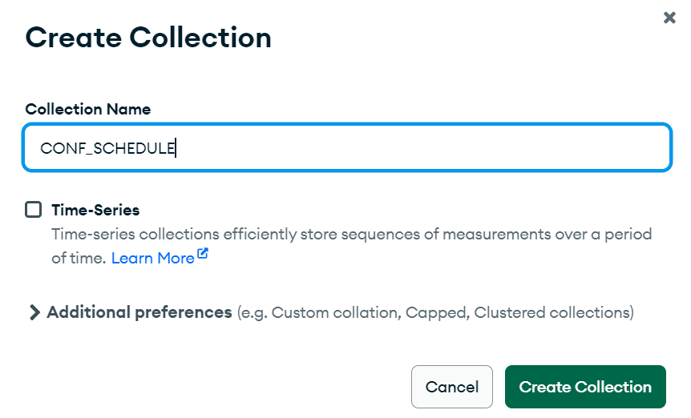
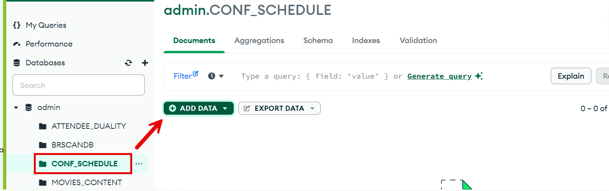
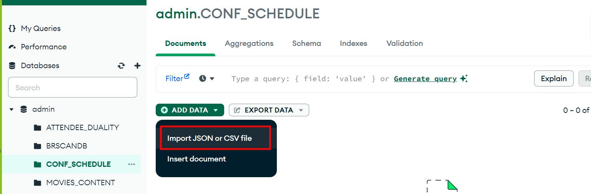
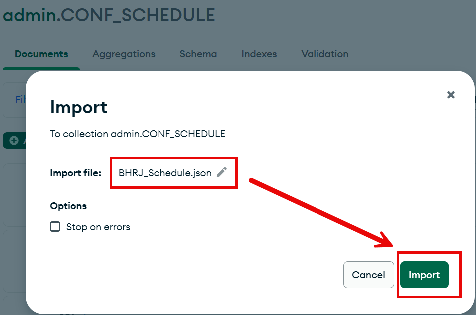
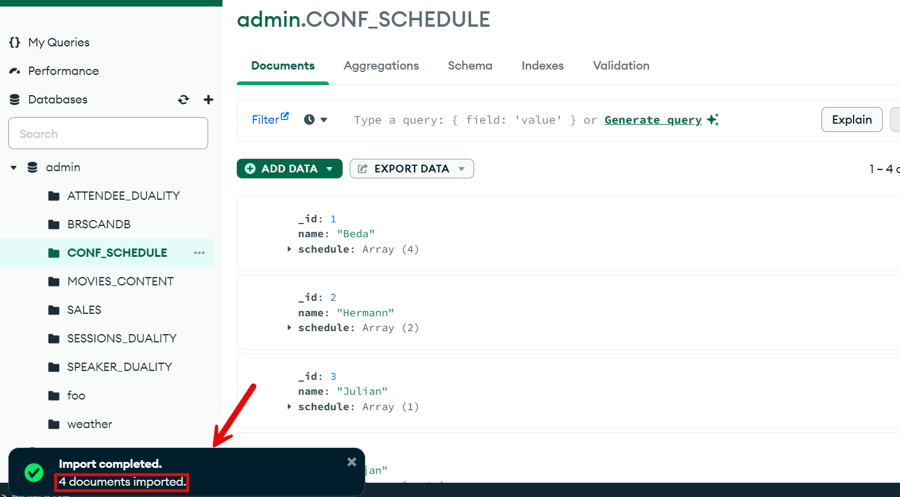

# JSON-To-Duality Migrator

## Introduction

The JSON-To-Duality Migrator can migrate one or more existing sets of JSON documents to JSON-relational duality views. Its PL/SQL subprograms generate the views based on implicit document-content relations (shared content). By default, document parts that can be shared are shared, and the views are defined for maximum updatability. In this lab, we will migrate a JSON collection called CONF_SCHEDULE into Oracle Database 23ai and will test the end-result from both SQL Developer and MongoDB Compass.

Estimated Time: 10 minutes


### Objectives

In this lab, you will:

- Create a native JSON collection
- Import data from JSON files  
- Run the JSON-To-Duality Migrator (both converter and importer)
- Validate the newly created objects (tables and duality views)


### Prerequisites

- Oracle Database 23ai, version 23.4 or above


## Task 1: Clean up the environment:

1. Follow these steps to clean up your environment. These steps are only needed in case you're running the workshop more than once. If this is the first time you are using this workshop, you can skip the cleanup.

    ```
    <copy>
    DROP VIEW if exists CONF_SCHEDULE_DUALITY;
    DROP TABLE if exists CONF_SCHEDULE PURGE;
    DROP TABLE if exists CONF_SCHEDULE_SCHEDULE PURGE;
    DROP TABLE if exists CONF_SCHEDULE_ROOT PURGE;
    </copy>
    ```

## Task 2: Create a native JSON collection

1. Option 1: In SQL Developer run:

    ```
    <copy>CREATE JSON COLLECTION TABLE CONF_SCHEDULE;</copy>
    ```

2. Option 2: Create in MongoDB Compass the collection **CONF\_SCHEDULE**




## Task 3: Import the document(s) from MongoDB Compass into CONF_SCHEDULE

1. Download the [BHRJ_Schedule.json](https://c4u04.objectstorage.us-ashburn-1.oci.customer-oci.com/p/EcTjWk2IuZPZeNnD_fYMcgUhdNDIDA6rt9gaFj_WZMiL7VvxPBNMY60837hu5hga/n/c4u04/b/livelabsfiles/o/labfiles/BHRJ_Schedule.json) document.




2. Import the BHRJ_Schedule.json file





## Task 4: Run the JSON-To-Duality Migrator

1. Follow this code to run the JSON-To-Duality Migrator:

    ```
    <copy>
    SET SERVEROUTPUT ON
    SET LINESIZE 10000
    DECLARE
        DBschema_sql clob;
        myCurrentSchema varchar2(128) default null;
    BEGIN
        SELECT SYS_CONTEXT('USERENV', 'CURRENT_SCHEMA') into myCurrentSchema;

        DBschema_sql :=
        dbms_json_duality.infer_and_generate_schema(
            json('{"tableNames"    : [ "CONF_SCHEDULE" ],
                "useFlexFields" : false,
                "updatability"  : false,
                "sourceSchema"  : '''|| myCurrentSchema|| '''}'));
        dbms_output.put_line('DDL Script: ');
        dbms_output.put_line(DBschema_sql);

        execute immediate DBschema_sql;

        dbms_json_duality.import(table_name => 'CONF_SCHEDULE', view_name => 'CONF_SCHEDULE_DUALITY');
    END;
    /    
    </copy>
    ```
## Task 5: Validate the newly created objects

1. In SQL Developer run:

    ```
    <copy>
    select json_serialize(data pretty) from "CONF_SCHEDULE_DUALITY";
    select * from user_objects where object_name like '%SCHEDULE%';
    select * from CONF_SCHEDULE_SCHEDULE;
    select * from CONF_SCHEDULE_ROOT;
    </copy>
    ```

2. In MongoDB Compass after refreshing the databases, click on the **CONF\_SCHEDULE\_DUALITY** collection under the ADMIN database


3. In mongosh, verify the number of documents in the **CONF\_SCHEDULE\_DUALITY** collection:

    ```
    hol23> <copy>db.CONF_SCHEDULE_DUALITY.countDocuments({});
    </copy>
    ```
## Learn More

* [JSON-Relational Duality Developer's Guide](https://docs.oracle.com/en/database/oracle/oracle-database/23/jsnvu/json-duality.html)

## Acknowledgements

* **Author** - Julian Dontcheff, Hermann Baer
* **Contributors** -  David Start, Ranjan Priyadarshi
* **Last Updated By/Date** - Carmen Berdant, Technical Program Manager, July 2024