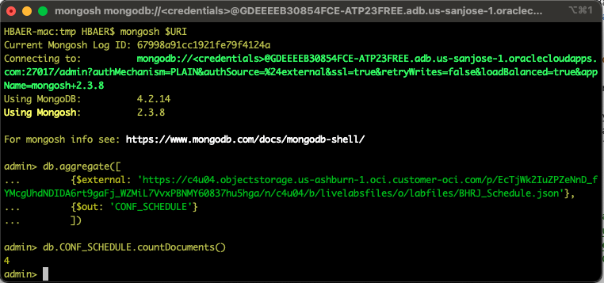
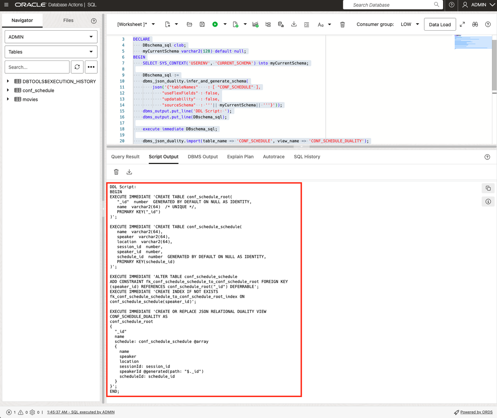
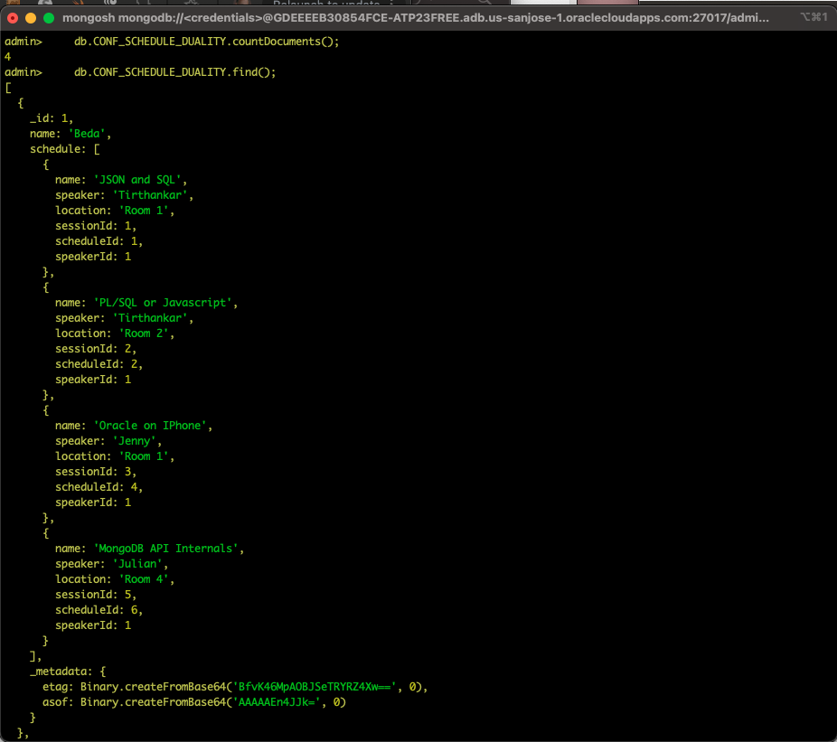

# JSON-To-Duality Migrator

## Introduction

The **JSON-To-Duality Migrator** is a new tool in Oracle Database 23ai that can migrate one or more existing sets of JSON documents to JSON-relational duality views. The migrator can be used for database migration from any document database using JSON documents or build a new application using JSON documents as the migrator will automatically create the necessary duality views.
The JSON-To-Duality Migrator is PL/SQL based. Its PL/SQL subprograms generate the views based on implicit document-content relations (shared content). By default, document parts that can be shared are shared, and the views are defined for maximum updatability. In this lab, we will migrate a JSON collection called CONF_SCHEDULE into Oracle Database 23ai and will test the end-result from both SQL Developer and MongoDB Compass.
The new migrator which has two components:
- **Converter**: Create the database objects needed to support the original JSON documents: duality views and their underlying tables and indexes.
- **Importer**: Import Oracle Database JSON-type document sets that correspond to the original external documents into the duality views created by the converter.

The **converter** is composed of these PL/SQL functions in package **DBMS\_JSON\_DUALITY**:
- **infer\_schema** infers the JSON schema that represents all of the input document sets.
- **generate\_schema** produces the code to create the required database objects for each duality view.
- **infer\_and\_generate\_schema** performs both operations.


Estimated Time: 10 minutes


### Objectives

In this lab, you will:

- Create a native JSON collection and populate if with JSON Documents stored in Object Storage
- Run the JSON-To-Duality Migrator (both converter and importer)
- Validate the newly created objects (tables and duality views)


### Prerequisites

- Oracle Database 23ai, version 23.4 or above


## Task 1: Connect to Mongo Shell to create and populate a new collection

1. Connect to the mongo shell as in the previous labs.

    When connected, you can create a new collection simply by using the Aggregation pipeline operator $external to read from object storage. This is an Oracle-specific operator available in MongoDB. When connected, run the following aggregation pipeline

    ```
    <copy>
    db.aggregate([
            {$external: 'https://c4u04.objectstorage.us-ashburn-1.oci.customer-oci.com/p/EcTjWk2IuZPZeNnD_fYMcgUhdNDIDA6rt9gaFj_WZMiL7VvxPBNMY60837hu5hga/n/c4u04/b/livelabsfiles/o/labfiles/BHRJ_Schedule.json'},
            {$out: 'CONF_SCHEDULE'}
            ])
    </copy>
    ```
    This will create a new collection named CONF_SCHEDULE and populate it with a number of documents.
   
    

    
    In this case we are reading data from a PAR Url, meaning that no authentication is required. You can also access private and secure endpoints, but need to specify a credential object for authentication and authorization.

## Task 2: Run the JSON-To-Duality Migrator

1. Follow this code to run the JSON-To-Duality Migrator: we will do infer\_schema and generate\_schema together.

    ```
    <copy>
    SET SERVEROUTPUT ON
    SET LINESIZE 10000
    DECLARE
        DBschema_sql clob;
        myCurrentSchema varchar2(128) default null;
    BEGIN
        SELECT SYS_CONTEXT('USERENV', 'CURRENT_SCHEMA') into myCurrentSchema;

        DBschema_sql :=
        dbms_json_duality.infer_and_generate_schema(
            json('{"tableNames"    : [ "CONF_SCHEDULE" ],
                "useFlexFields" : false,
                "updatability"  : false,
                "sourceSchema"  : '''|| myCurrentSchema|| '''}'));
        dbms_output.put_line('DDL Script: ');
        dbms_output.put_line(DBschema_sql);

        execute immediate DBschema_sql;

        dbms_json_duality.import(table_name => 'CONF_SCHEDULE', view_name => 'CONF_SCHEDULE_DUALITY');
    END;
    /
    </copy>
    ```
    As you can see, the duality migrator analyzed the existing collection CONF_SCHEDULE and automatically migrated it into a new JSON Relational Duality View CONF\_SCHEDULE\_DUALIY, including the creation of the underlying relational model.

    


## Task 3: Validate the newly created objects and check the output from the select statement below

1. In SQL Developer run:

    ```
    <copy>
    select json_serialize(data pretty) from "CONF_SCHEDULE_DUALITY";
    select * from user_objects where object_name like '%SCHEDULE%';
    select * from CONF_SCHEDULE_SCHEDULE;
    select * from CONF_SCHEDULE_ROOT;
    </copy>
    ```
    You can see your JSON documents as you saw them before in the native JSON collection, but also see the data content in the underlying relational structures.

2. In mongosh, verify the number of documents in the **CONF\_SCHEDULE\_DUALITY** collection: 

    ```
    <copy>
    db.CONF_SCHEDULE_DUALITY.countDocuments();
    db.CONF_SCHEDULE_DUALITY.find();
    </copy>
    ```
    

    You successfully migrated your first collection to a JSON Relational Duality View.

## Learn More

* [JSON-Relational Duality Developer's Guide](https://docs.oracle.com/en/database/oracle/oracle-database/23/jsnvu/json-duality.html)

## Acknowledgements

* **Author** - Julian Dontcheff, Hermann Baer
* **Contributors** -  David Start, Ranjan Priyadarshi
* **Last Updated By/Date** - Hermann Baer, February 2025