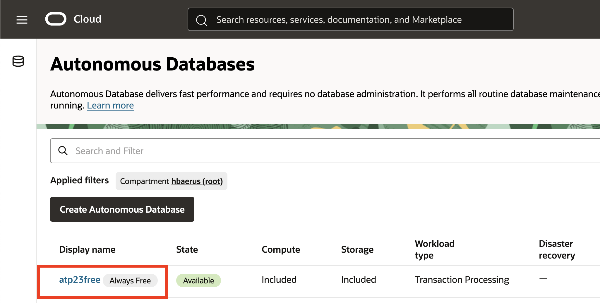
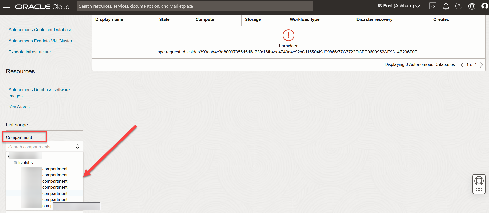

# Configure your ADB instance for this workshop

## Introduction

In this lab you will learn how to configure your Autonomous Database instance, this will help you proceed with the subsequent labs.

Estimated Time: 5 minutes

### Objectives

In this lab, you will:

- Find your pre-provisioned ADB instance
- Enable MongoDB API for your ADB

### Prerequisites

- Completed the **Get Started with LiveLabs** lab

## Task 1: Find your Autonomous Database instance

1. After you log in, the OCI console will be available.

   

2. Open the **Navigation** menu in the upper left and under the **Oracle Database**, click on **Autonomous Database**.

  

3. The **Autonomous Database** page should be displayed with the pre-provisioned database.

  

  > **_NOTE:_** If the database is not displayed, ensure that you are working within the correct compartment. The assigned compartment is shown in the **Reservation Information**. See below how to select your compartment.

  

## Task 2: Enable MongoAPI on your Autonomous Database instance

> **_NOTE:_** This task is essential in order to use MongoDB API to interact with Oracle Database.

1. On your ADB page, in the **Network** section, access the *Edit* button of the **Access control list**.

  

2. The **Edit access control list** page will open. From the **IP notation type** choose **IP address** and click on the **Add my IP address** button. Then click **Save**. After the database has processed the changed, the access control list should be now *Enabled*. MongoDB API

 

## Learn More

* [Using Oracle Autonomous Database Serverless](https://docs.oracle.com/en-us/iaas/autonomous-database-serverless/doc/mongo-using-oracle-database-api-mongodb.html)

## Acknowledgements

* **Author** - Carmen Berdant, Technical Program Manager, Product Management
* **Contributors** -  Kevin Lazarz, Senior Manager, Product Management
* **Last Updated By/Date** - Carmen Berdant, Technical Program Manager, August 2024