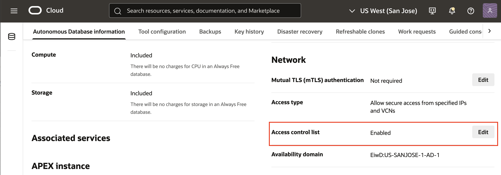

# Enable MongoAPI for Autonomous Database on your instance

## Introduction

Your autonomous database has been pre-provisioned and is already set up. To proceed with the subsequent labs, you will need to enable the MongoAPI on your instance. This lab will guide you through the required steps to do so

Estimated Time: 5 minutes

### Objectives

In this lab, you will:

- Enable MongoAPI for your ADB

### Prerequisites

- Ensure that you have access to a pre-provisioned Autonomous Database instance. This is required to complete the steps in this lab

## Task 1: Enable MongoAPI

1. Open the **Navigation** menu in the upper left and click **Oracle Database**. Under **Oracle Database**, click **Autonomous Transaction Processing**. The **Autonomous Transaction Processing** page should be displayed with the pre-provisioned database.

  

> **_NOTE:_** Ensure that you are working within the correct compartment.

2. On your ADB page, in the **Network** section, access the *Edit* button of the **Access control list**.

  

3. The **Edit access control list** page will open. From the **IP notation type** choose **IP address** and click on the **Add my IP address** button. Then click **Save**. The access control list should be now *Enabled*.

 

## Learn More

* [Using Oracle Autonomous Database Serverless](https://docs.oracle.com/en-us/iaas/autonomous-database-serverless/doc/mongo-using-oracle-database-api-mongodb.html)

## Acknowledgements

* **Author** - Carmen Berdant, Technical Program Manager, Product Management
* **Contributors** -  Kevin Lazarz, Senior Manager, Product Management
* **Last Updated By/Date** - Carmen Berdant, Technical Program Manager, August 2024