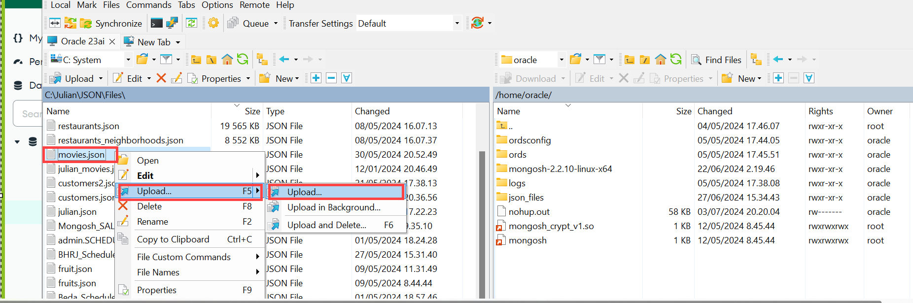
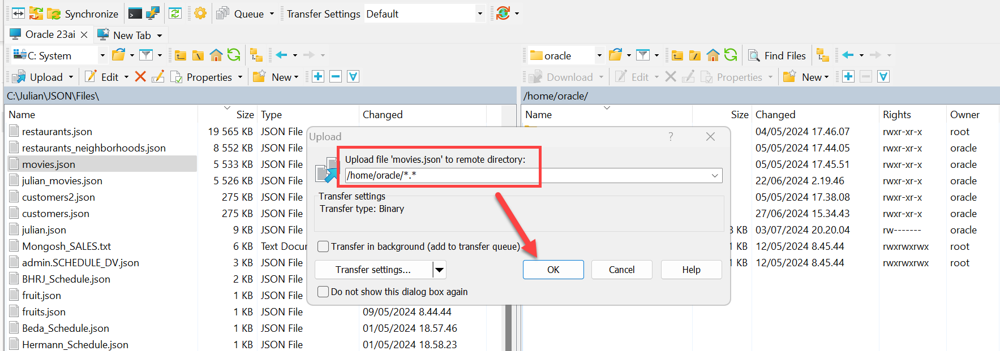

# Migrating MongoDB collections to Oracle Database 23ai

## Introduction

Database migrations from MongoDB to Oracle can be done using external tables if the collections have been already extracted as individual text files especially in the case when only the data needs to be transferred (indexes and other objects will be created afterwards). Or sometimes one wants to transfer JSON collections from different document databases to an Oracle database, this might be a simple way to do it.

The ORACLE_BIGDATA adapter for external tables can now (in Oracle Database 23ai) stream external JSON sources into the database making it easy and efficient query and load JSON stored in text files. In this lab, we will migrate a JSON collection called MOVIES into Oracle Database 23.5 and will test the end-result from both SQL Developer and MongoDB Compass.


Estimated Time: 10 minutes


### Objectives

In this lab, you will:

- Transfer the JSON collection to the Oracle database server
- Create the database directory object
- Create an external table
- Create a JSON COLLECTION TABLE
- Insert the data from the external table to the JSON collection table
- Validate the newly created collection table


### Prerequisites

- Oracle Database 23.5 with direct OS access as oracle user
- WinSCP or similar (for transferring the file)
- MongoDB Compass
- All previous labs successfully completed


## Task 1: Clean up the environment:

1. Follow these steps to clean up your environment:

    ```
    <copy>
    drop TABLE json_file_content purge;
    drop TABLE movies_content purge;
    </copy>
    ```

## Task 2: Create the json_files directory and transfer the movies.json file on the DB server

1. Create the _json\_files_ directory under **/home/oracle/** and then transfer the file _movies.json_ to **/home/oracle/json_files** on the DB server.

    ```
    <copy>cd /home/oracle/
    mkdir json_files</copy>
    ```



## Task 3: Create the Database Directory Object

1. Follow this code to run:

    ```
    <copy>
    CREATE OR REPLACE DIRECTORY json_files_dir AS '/home/oracle/json_files';
    </copy>
    ```

## Task 4: Create the External Table

1. Follow this code to run:

    ```
    <copy>
    CREATE TABLE json_file_content (data JSON)
        ORGANIZATION EXTERNAL
            (TYPE ORACLE_BIGDATA
            ACCESS PARAMETERS (
            com.oracle.bigdata.fileformat=jsondoc
            com.oracle.bigdata.json.unpackarrays=true
            )
        LOCATION (json_files_dir:'movies.json'))
        PARALLEL
        REJECT LIMIT UNLIMITED;
    </copy>
    ```

## Task 5: Create the JSON collection table

1. Follow this code to run:

    ```
    <copy>
    CREATE JSON COLLECTION TABLE movies_content;
    </copy>
    ```

## Task 6: Insert the data from the external table into the JSON collection table

1. Follow this code to run:

    ```
    <copy>
    INSERT INTO movies_content
        SELECT jt.data
        FROM json_file_content,
             json_table(data, '$[*]' columns (data JSON path '$')) jt;
    commit work;
    </copy>
    ```
## Task 7: Test the newly create JSON collection table in the Oracle database. List all movies having a name like %father%


1. In SQL Developer run:
    ```
    <copy>
    select m.data.title from movies_content m where m.data.title like '%father%';
    </copy>

    ```

2. In MongoDB Compass, for _MOVIES\_CONTENT_ filter on the name for father:

    ```
    <copy>
    {title: /father/}
    </copy>
    ```


*Note: If we switch to autonomous, we do not even have to stage data, but can do a simple IAS, that is you can directly insert the data into the table granted the movies.json file is already on object storage:*

    ```
    <copy>
    insert into movies_content
    select * from external (
        (data json)
        TYPE ORACLE_BIGDATA
        ACCESS PARAMETERS (
        com.oracle.bigdata.fileformat=jsondoc
        com.oracle.bigdata.json.unpackarrays=true
        )
        location ('https://c4u04.objectstorage.us-ashburn-1.oci.customer-oci.com/p/EcTjWk2IuZPZeNnD_fYMcgUhdNDIDA6rt9gaFj_WZMiL7VvxPBNMY60837hu5hga/n/c4u04/b/livelabsfiles/o/labfiles/movies.json')
    );
    commit;
    </copy>
    ```


## Learn More

* [Oracle Database Utilities ](https://docs.oracle.com/en/database/oracle/oracle-database/23/sutil/oracle-bigdata-access-driver.html#GUID-6D3221AD-9674-4BC0-B622-809A1F6569F9)

## Acknowledgements

* **Author** - Julian Dontcheff, Hermann Baer
* **Contributors** -  David Start, Ranjan Priyadarshi
* **Last Updated By/Date** - Carmen Berdant, Technical Program Manager, July 2024