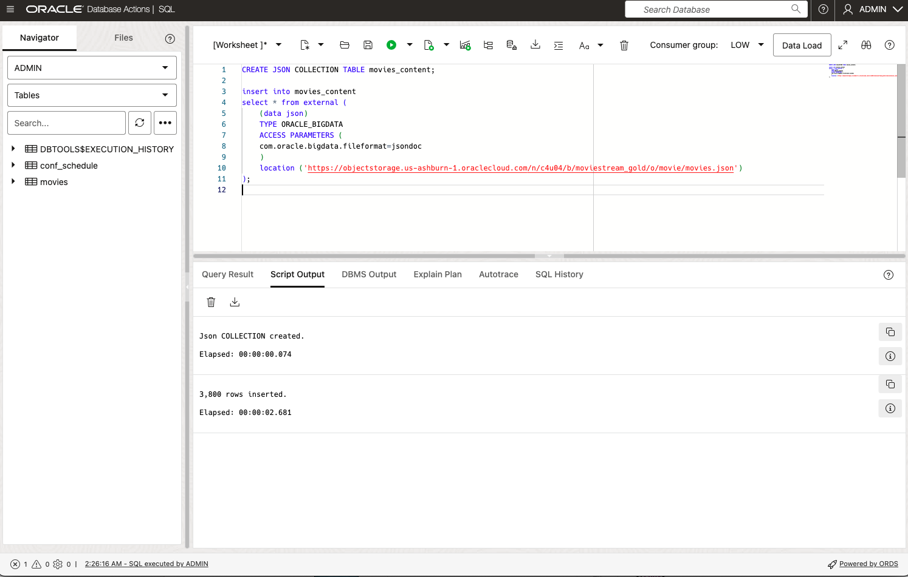

# Migrating MongoDB collections to Oracle Database 23ai

## Introduction

Database migrations from MongoDB to Oracle can be done using external tables if the collections have been already extracted as individual text files especially in the case when only the data needs to be transferred (indexes and other objects will be created afterwards). Or sometimes one wants to transfer JSON collections from different document databases to an Oracle database, this might be a simple way to do it.

With external tables you can stream external JSON sources into the database, making it easy and efficient query and load JSON stored in text files. In this lab, we will migrate a JSON collection called MOVIES into Oracle Database 23ai and will test the end-result from both SQL Developer and MongoDB Compass.

Estimated Time: 10 minutes

### Objectives

In this lab, you will:

- Create and populate a new JSON COLLECTION TABLE using SQL
- Validate the newly created collection table

### Prerequisites

- Oracle Database 23ai

## Task !: Create the JSON collection table

1. In thw SQL worksheet of Database Actions, use the following code to create a JSON Collection Table. The following DDL creates a JSON collection inside the Oracle database that is automatically compatible with MongoDB API.

    ```sql
    <copy>
    CREATE JSON COLLECTION TABLE movies_content;
    </copy>
    ```

## Task 3: Insert the data into the JSON Collection table

1. Follow this code to run:

    ```sql
    <copy>
    insert into movies_content
    select * from external (
        (data json)
        TYPE ORACLE_BIGDATA
        ACCESS PARAMETERS (
        com.oracle.bigdata.fileformat=jsondoc
        )
        location ('https://objectstorage.us-ashburn-1.oraclecloud.com/n/c4u04/b/moviestream_gold/o/movie/movies.json')
    );
    commit;
    </copy>
    ```
    With these two simple SQL statements you created and populated a JSON Collection in the Oracle Database, that is readily available and usable from within any Mongo tool. (Note that this is the equivalent to the aggregation pipeline operation using the $external operator in lab 7).

    

## Task 4: Test the newly create JSON collection table in the Oracle database. List all movies having a name like %father%


1. In SQL Developer Web run:
    ```sql
    <copy>
    select m.data.title from movies_content m where m.data.title like '%father%';
    </copy>

    ```
    

2. In MongoDB shell or MongoDB Compass, for _MOVIES\_CONTENT_ filter on the name for father:

    If you are using mongosh, copy and run the following command:
    ```
    <copy>
    db.MOVIES_CONTENT.find({title: {$like: "%father%"}},{title:1})
    </copy>
    ```
    

    If you happen to have MongoDB Compass installed, you can run the following QBE (Query By Example)
    ```
    <copy>
    {title: /father/}
    </copy>
    ```
    

    You successfully imported and validated a Mongo export file.

## Learn More

* [Oracle Database Utilities ](https://docs.oracle.com/en/database/oracle/oracle-database/23/sutil/oracle-bigdata-access-driver.html#GUID-6D3221AD-9674-4BC0-B622-809A1F6569F9)

## Acknowledgements

* **Author** - Julian Dontcheff, Hermann Baer
* **Contributors** -  David Start, Ranjan Priyadarshi, Kevin Lazarz
* **Last Updated By/Date** - Hermann Baer, February 2025