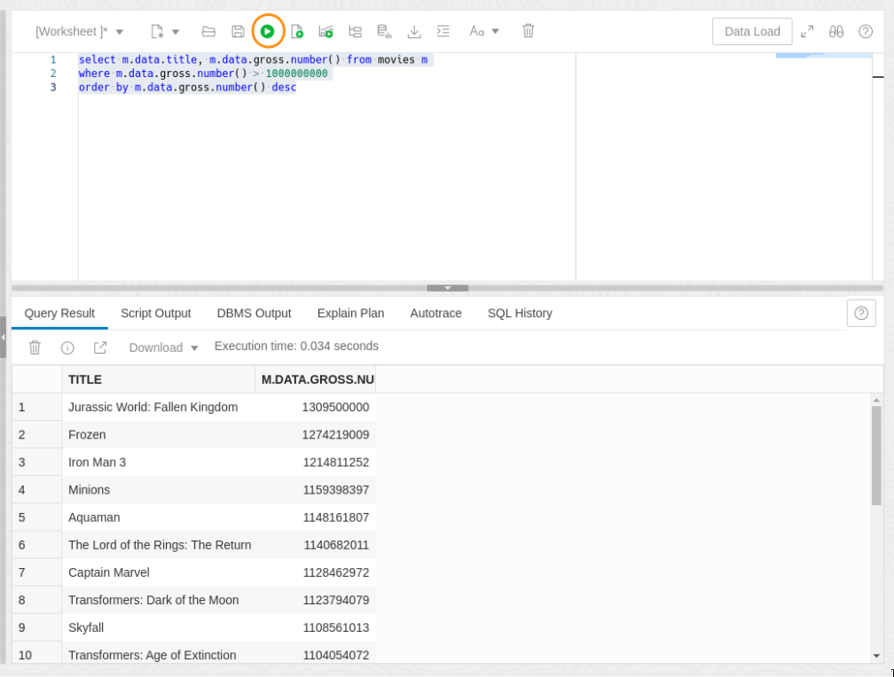
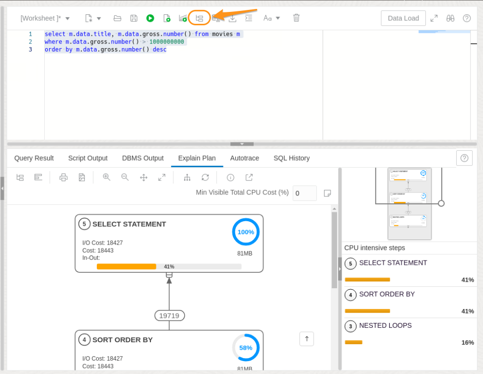
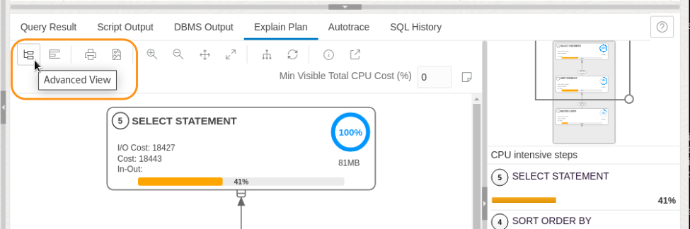
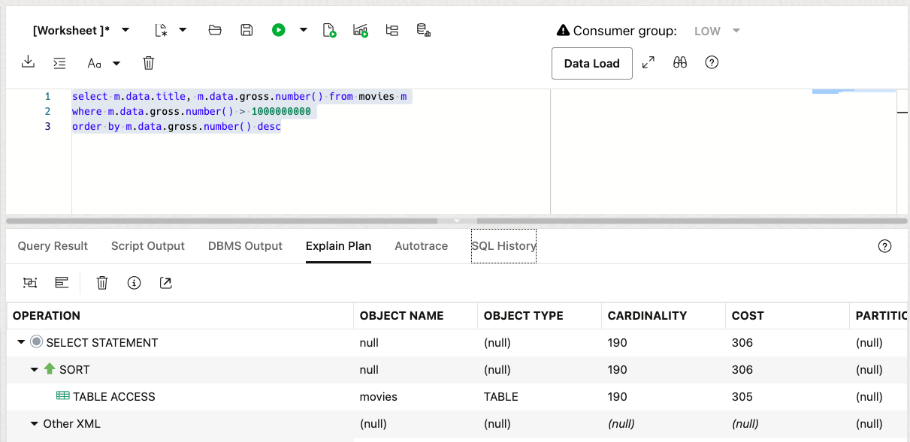
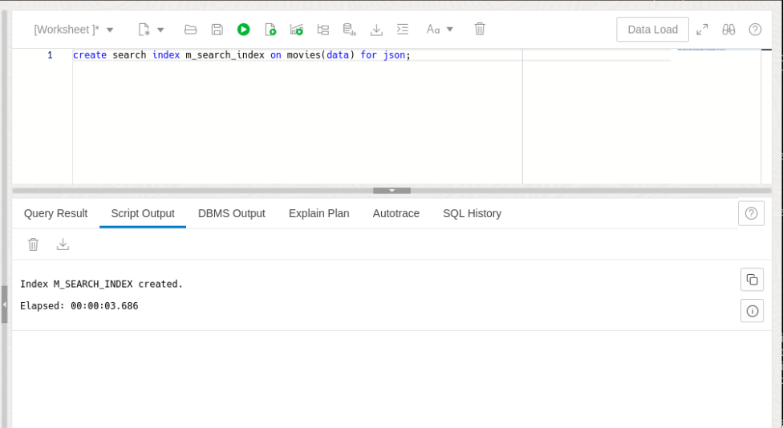
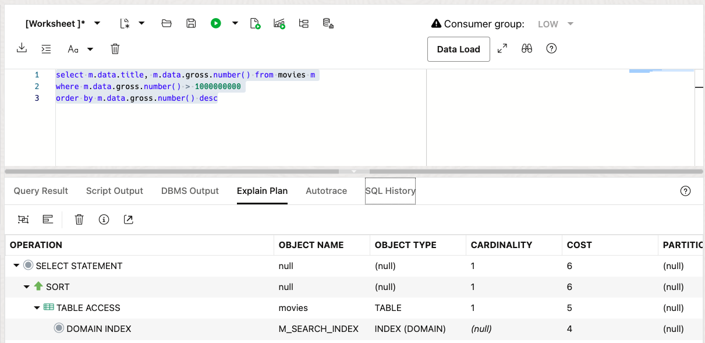
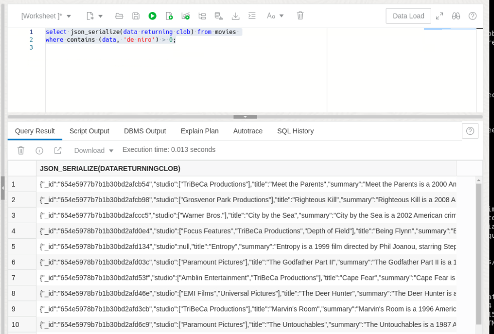
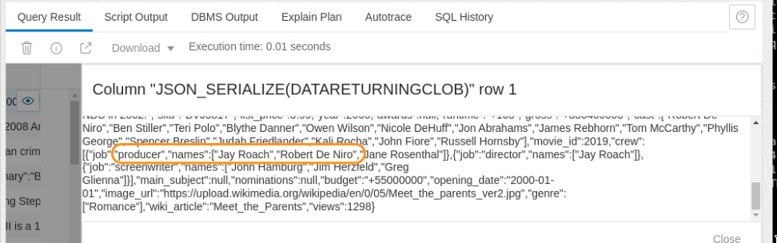
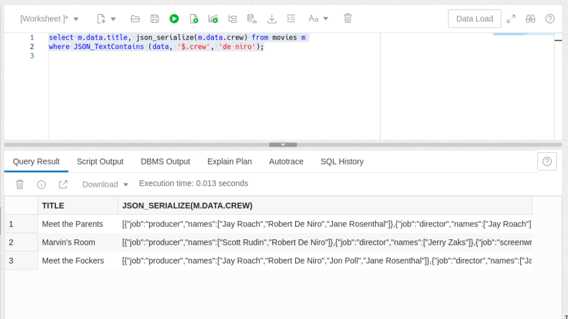
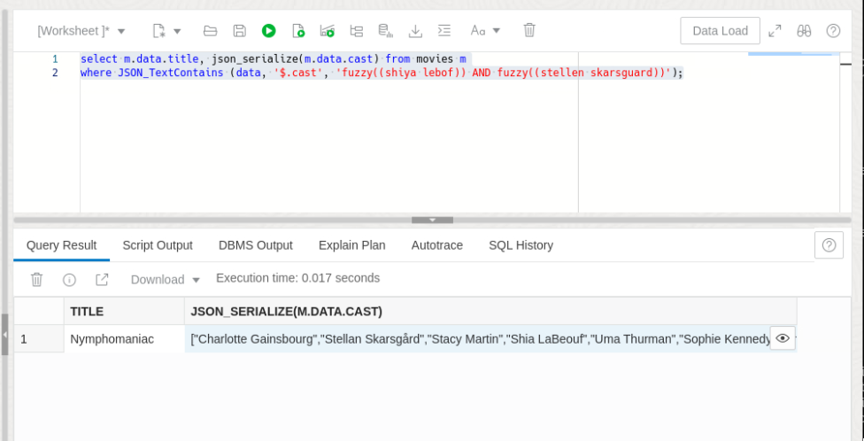

# Work with JSON Search Indexes

## Introduction

JSON Search indexes allow you to index all of the content in a JSON collection without knowing the schema of the JSON in advance. They also allow you to run full-text, or keyword, searches over textual values. In this lab, we'll create a search index on our Movies collection and show how that affects the query plan for JSON queries. We'll also do a variety of full-text searches using the CONTAINS and JSON_TEXTCONTAINS operators.

Estimated Time: 15 minutes
 
### Objectives

In this lab, you will:

- Create a search index
- See that numeric searches are using the search index to speed retrieval
- Perform full-text searches and explore the powerful full-text search capabilities

### Prerequisites

- All previous labs successfully completed

## Task 1: Run a query without an index

1. Open Database Actions (if you don't already have it open). Choose **SQL** under Development from the launchpad.

    

2. Run a query to find all movies which grossed over a billion dollars.

    Enter the following SQL in the SQL Worksheet. The query fetches titles and gross takings (as a number) for all movies which grossed over 1 billion, ordered by gross takings:

    ```
    <copy>
    select m.data.title, m.data.gross.number() from movies m
    where m.data.gross.number() > 1000000000
    order by m.data.gross.number() desc;
    </copy>
    ```

    Click the "Run" button and examine the results

    

3.  Examine the query plan

    Above the worksheet, click on the "Explain Plan" button.

    This will show the plan for the query in graphical format.

    

    If you then click on the similar icon above the diagram (labelled "Advanced View"), the diagram will toggle to a table representing the plan.

    
    
    We can see that the query used a full table scan.

    


## Task 2: Create a Search Index over the JSON and show the query uses it

In this task we'll create a Search Index. Search Indexes are created over the whole JSON column, and do not need to know the schema, or layout, of the JSON. A Search Index is created much like a regular ("BTREE") index - we give it an index name and the name of the table and JSON column to be indexed. The only difference is that we say CREATE SEARCH INDEX instead of CREATE INDEX, and add the suffix "FOR JSON" at the end (other flavors of Search Index can index text or XML).

1. Copy the following SQL into the worksheet and click the "Run" button.

    ```
    <copy>
    create search index m_search_index on movies(data) for json;
    </copy>
    ```

    After a few seconds, you'll receive a notification that your index has been created.

    
    
2. Now repeat the query we ran before looking for movies that grossed over 1 billion.

    ```
    <copy>
    select m.data.title, m.data.gross.number() from movies m
    where m.data.gross.number() > 1000000000
    order by m.data.gross.number() desc;
    </copy>
    ```

    The results, of course, will be the same. But what happens when we look at the query plan? Click the explain plan button (and toggle the advanced view if you see the diagram output)

    

    We can now see that the query is using the index we created (M\_SEARCH\_INDEX) which means for searches on a large table, the query should run much quicker.

## Task 3: Perform basic full-text searches

A JSON Search index is, at its heart, an Oracle Text index. That means we can use the Oracle Text CONTAINS operator against it. Unlike most SQL operators, CONTAINS can _only_ be used when there is a suitable index present. CONTAINS searches for words within text. So let's do a search for the phrase "de niro" somewhere in the JSON data. The CONTAINS operator takes the column to search (DATA) and a query string. It returns 0 if there are no matches, and greater than zero for a match:

1. Copy and run the following query:

    ```
    <copy>
    select json_serialize(data returning clob) from movies 
    where contains (data, 'de niro') > 0;
    </copy>
    ```

    Notice that we don't need to match case for "De Niro" - the CONTAINS operator is case-insensitive by default (it's actually the index which is case-insensitive, but we won't go into that for now).

    

2. Examine the results

    If you look at the JSON for a few results, you may find "Robert De Niro" listed as part of the cast (an actor) or part of the crew as producer or director. Although we only searched for "De Niro", we find fields containing "Robert De Niro" because the CONTAINS operator is doing a word search, rather than a full-field search. It's not a substring search either, as you'll see if you search for 'iro'.

    

##  Task 4: Query specific JSON fields

Using CONTAINS, we were able to search across the whole JSON column, and find occurences of words anywhere. But what if we want to do a word search in specific JSON fields? In that case, we can use a JSON-specific variant of the CONTAINS operator, __JSON_TextContains__.

JSON_TextContains takes three arguments. Like CONTAINS, the first argument is the JSON column to search (DATA in our case). The second argument is a JSON PATH value, telling us which JSON field to search in. It's not a full JSON PATH - it can't contain conditional values, for example. But generally it does adhere to JSON PATH syntax. The third argument is the query string, similar to the second argument to CONTAINS. 

Note: Unlike CONTAINS, JSON_TextContains does not return a value - it is effectively a logic operator and only returns rows that match its arguments. So we don't need "> 0" after it.

1. Copy and run the following query to search for 'De Niro' in the _crew_ field of the JSON. Crew is a top-level JSON field, so can be specified with the JSON path '$.crew'. For ease of reading the results, we'll fetch the title field and the crew array separately in the output.

    ```
    <copy>
    select m.data.title, json_serialize(m.data.crew) from movies m
    where JSON_TextContains (data, '$.cast', 'de niro');
    </copy>```

    This time we get a much shorter list of results, Robert De Niro is clearly more often found in cast than crew.

    

2. Exact word search is very useful, but sometimes you may not know how to spell a word. Or perhaps you do, but the person who wrote the text didn't. In that case, JSON_TextContains has a feature called _fuzzy search__ which will find words similar to the ones you're looking for.

    Let's assume you're looking for the actors Shia LaBeouf and Stellan Skarsgård, but unsurprisingly we aren't sure how to spell either (we may not even know how to enter the accented character on our keyboard). We'll have a go at it by using 'Shiya Lebof' and 'Stellan Skarsguard'

    ```
    <copy>
    select m.data.title, json_serialize(m.data.cast) from movies m
    where JSON_TextContains (data, '$.cast', 'fuzzy((shiya lebof)) AND fuzzy((stellen skarsguard))');
    </copy>
    ```

    Did we mention you can use an AND between words and phrases? You can use _AND_, _OR_ or _NOT_ within a CONTAINS or JSON_TextContains operator to do boolean searches. So here we're looking for fuzzy matches of the two names (the _fuzzy_ operator requires two sets of parentheses around phrases - but only one if a single word is used)

        

    Looking at the results, there is only one movie where Stellan Skarsgård and Shia LeBeouf are both in the cast.

    You can proceed to the next lab.

## Learn More

* [How to Store, Query and Create JSON Documents in Oracle Database](https://blogs.oracle.com/sql/post/how-to-store-query-and-create-json-documents-in-oracle-database)

## Acknowledgements

* **Author** - Roger Ford, Hermann Baer
* **Contributors** -  David Start, Ranjan Priyadarshi
* **Last Updated By/Date** - Carmen Berdant, Database Product Management, August 2024