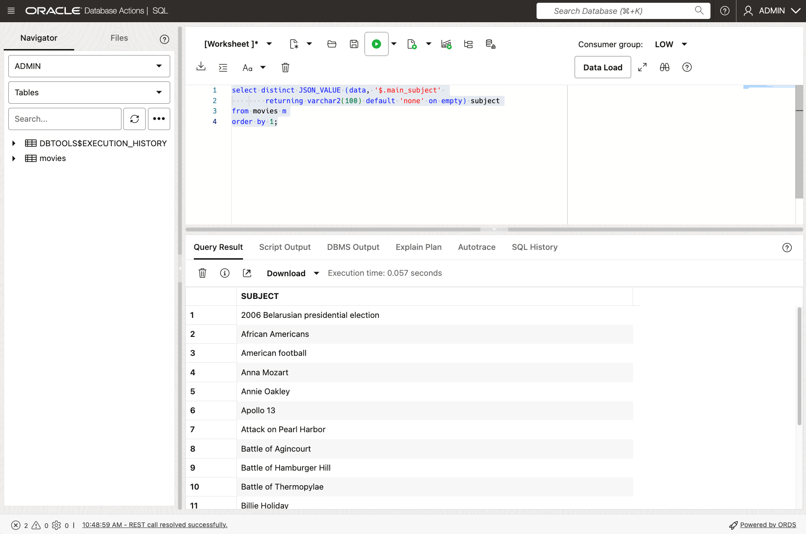
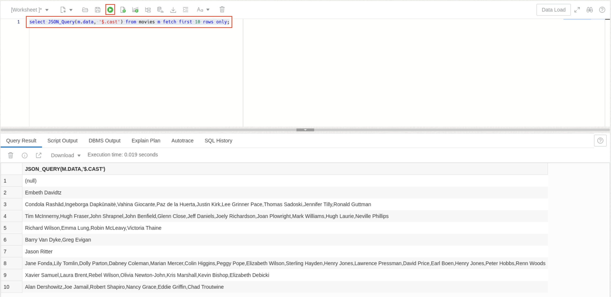
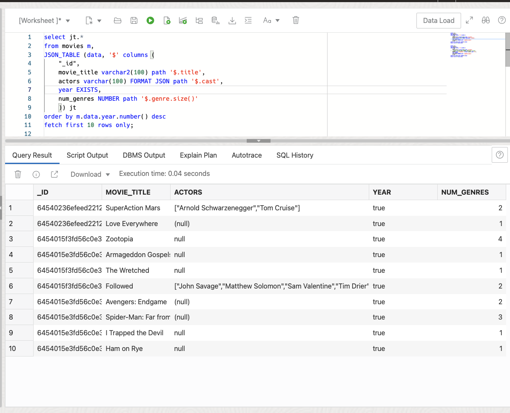
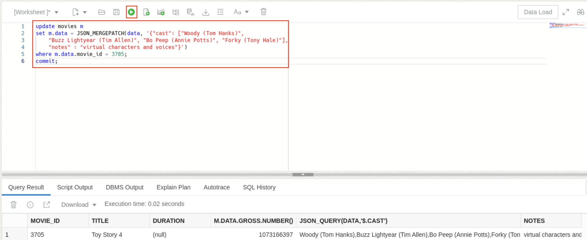
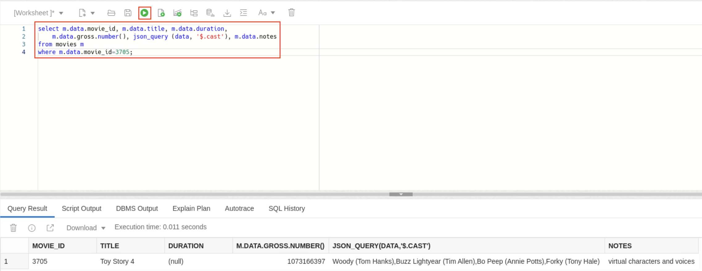
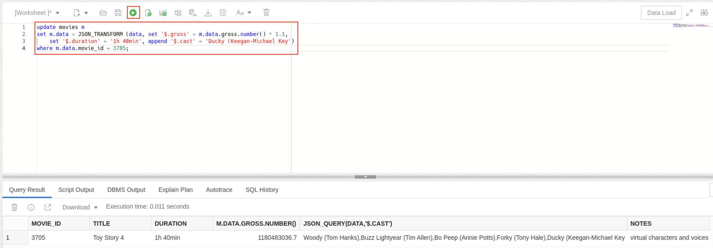

# Use SQL to work with JSON

## Introduction

So far, we've focused mostly on the document store API where we dealt with JSON data as a collection of documents. But there is another way to interact with your JSON data: SQL.

SQL is a very mature query language. Oracle added new operators to work with JSON data (we created an open standard called SQL/JSON which was adopted by the ISO SQL standard).

A key characteristic of a JSON collection (like 'products') is that it is backed by a table - a table then gets auto-created when you create a collection so that you do not have to specify columns and data types.

In the following, we show you how you can use SQL to work with the JSON data in a collection.

Estimated Time: 30 minutes

### Objectives

In this lab, you will:

* Use simple dot notation to extract values from JSON data.
* Use nesting and unnesting methods to
* Explore SQL/JSON path expressions to query JSON data.
* Update documents using JSON\_Mergepatch and JSON\_transform.
* Switch views between relational and JSON formatting.

### Prerequisites

- Oracle Database 23ai, version 23.4 or above
- All previous labs successfully completed to ensure the existence of JSON Collection movies

## Task 1: Explore the table behind your JSON collection

1. Open Database Actions (if you don't already have it open). Choose **SQL** under Development from the launchpad.

    

2. If you have not done anything outside the workshop, you will see one table 'movies' (in addition to the internal sql history table of database actions). This is the table for the 'movies' collection. To get the details about its data structure displayed, let's do a DESCRIBE of the table.

    ```sql
    <copy>
    desc movies;
    </copy>
    ```


    

    You see that the table 'movies' only has one column 'DATA' which holds the JSON document in Oracle's binary OSON format. That's really all you need to know about a **JSON Collection Table**, Oracle's native first class object to store collectons of documents. The DATA column is all you need.


## Task 2: JSON Fundamentals

1. Because the JSON data is stored in a binary representation in OSON format (for query and update efficiency) we need to convert it to a human-readable string using JSON_Serialize.

    Copy and paste this query into SQL Developer Web worksheet and run it. It returns 9 (random) documents from the table/collection.

    ```
    <copy>
    select JSON_Serialize(data pretty) from movies where rownum < 10;
    </copy>
    ```

    

2. Simple dot notation - We can extract values from the JSON data using a simple notation (similar to JavaScript) directly from SQL.

    ```
    <copy>
    select m.data.opening_date.date() as opening_date
         , m.data.title               as title
         , m.data.list_price.number() as price  
    from movies m
    where m.data.list_price.number() = 1.99
    order by 1 desc
    fetch first 10 rows only;
    </copy>
    ```
    

    We use a trailing function like 'date()' or 'number()' to map a selected JSON scalar value to a SQL value.

3. All above examples extracted singleton values from the JSON data - values that only occurred once per document (like title or price). But JSON can have nested arrays - how can we access those?

    Let's say we want to extract all actor names. They occur as JSON strings in the array called 'cast'. Since one movie has typically more than one actor the overall number of actor names is larger than the number of documents. We therefore need a mechanism that generates rows - a row source. This is why we use the 'nested' clause in the FROM part of the query - here we generate the rows and extract the value we're interested in as column values.

    The simplest example is the following, run it first then we will explain it.

    ```
    <copy>
    SELECT jt.*
    FROM movies m NESTED data COLUMNS ("_id", title, year NUMBER) jt;
    </copy>
    ```
    

    As you can see we're extracting the '_id', the 'title' and the 'year' from each document. Instead of a trailing function we can specify an optional SQL data type like NUMBER - the default (used for the title) is a VARCHAR2(4000). Note that since _id starts with an underscore character it's necessary to put it in quotes. Note also that the other attributes we are extracting are case sensitive. So you need to use 'title' and cannot use 'Title'.

2.  We could have written this query with the simple dot notation, as well, because we do not drill into any JSON array yet. Let's do that in  this query, by using the NESTED clause also in the *COLUMNS* clause.

    ```
    <copy>
    select jt.*
    from movies m nested data columns (title, year NUMBER, nested cast[*] columns (actor path '$')) jt
    where m.data.title = 'Iron Man';
    </copy>
    ```
    

    The second 'nested' acts over the JSON array called 'cast'. The '[*]' means that we want to select every item of the array; [0] would only select the first one, for example. Then the second *columns* clause defines which value we want to extract from inside the array. The 'cast' array consists only of string values; we therefore need to select the entire value. This is done with the path expression '$'. We give selected values the column name 'actor'.

3.  Now let's try a simple aggregation of actors using the unnesting method above.

    ```
    <copy>
    select jt.actor, count(1)
    from movies m nested data columns (title, year NUMBER, nested cast[*] columns (actor path '$')) jt
    where actor is not null
    group by actor
    having count(1) >15
    order by count(1) desc;
    </copy>
    ```
    


## Task 3: Queries over JSON data

The "simple dot notation" as shown in the previous steps is a syntax simplification of the SQL/JSON operators. Compared to the 'simple dot notation' they're a bit more verbose but also allow for more customization. These operators are part of the SQL standard.

### SQL/JSON Path Expression

SQL/JSON relies on 'path expressions' which consist of steps: A step can navigate into an object or array.

An object step starts with a dot followed by a key name; for example, '.name' or '."_id"'. If the key name starts with a non-Ascii character you need to quote it; for example, '."0abc"'.

An array step uses square brackets; '[0]' selects the first value in an array. It is possible to select more than one element from the array. For example, '[*]' selects all values, '[0,1,2]' selects the first three elements, and '[10 to 20]' selects elements 11 through 21.

Steps can be chained together. A path expression typically starts with the '$' symbol which refers to the document itself.

Path expressions are evaluated in a 'lax' mode. This means that an object step like '."\_id"' can also be evaluated on an array value: it then means to select the '"\_id"' values of each object in the array. This will be explained a bit in JSON_Exists, where we also explain Path Predicates (filters).

*Learn more -* [SQL/JSON Path Expressions](https://docs.oracle.com/en/database/oracle/oracle-database/21/adjsn/json-path-expressions.html#GUID-2DC05D71-3D62-4A14-855F-76E054032494)

Now let's look at the different SQL/JSON operators step by step:

### JSON_Value

JSON_VALUE takes one **scalar** value from the JSON data and returns it as a SQL scalar value.

1.  The first argument is the input, the column 'data' from the products collection/table. This is followed by a path expression, in this case, we select the value for field 'main\_subject'. The optional 'returning' clause allows us to specify the return type, in this case, a varchar2 value of length 100. Because not every product has a 'main\_subject' value there are cases where no value can be selected. By default NULL is returned in this case. The optional ON EMPTY clause allows us to specify a default value (like 'none') or to raise an error - with ERROR ON EMPTY.

    ```
    <copy>
    select distinct JSON_VALUE (data, '$.main_subject' 
            returning varchar2(100) default 'none' on empty) subject
    from movies m
    order by 1;
    </copy>
    ```
    

2.  JSON_Value can only select one scalar value. The following query will not return a result because it selects the array of actors. (The default is NULL ON ERROR)

    ```
    <copy>
    select JSON_Value (data, '$.cast' ERROR ON ERROR) from movies;
    </copy>
    ```
    


### JSON_Query

Unlike JSON\_Value (which returns one SQL scalar value) the function JSON\_Query can extract complex values (objects or arrays), and it can also return multiple values as a new JSON array. The result of JSON_Query is **JSON data** itself, for example an object or array.

1. This query extracts the embedded array of actors. Scroll down the `Query Result` to see the values.

    ```
    <copy>
    select JSON_Query(m.data, '$.cast') from movies m fetch first 10 rows only;
    </copy>
    ```
    

    *Learn more -* [SQL/JSON Condition JSON_QUERY](https://docs.oracle.com/en/database/oracle/oracle-database/23/adjsn/function-JSON_QUERY.html#GUID-D64C7BE9-335D-449C-916D-1123539BF1FB)


### JSON_Exists

JSON_Exists is used to filter rows, therefore you find it in the WHERE clause. Instead of using a path expression to select and return a value, this operator just tests if such value exits.

1.  For example, return the year and title of all movies where Jim Carrey was in the cast.

    ```
    <copy>
    select m.data.year, m.data.title
    from movies m
    where JSON_Exists(data, '$.cast?(@ == "Jim Carrey")')
    order by 1;
    </copy>
    ```
    This is expressed using a path predicate using the question mark (?) symbol and a comparison following in parentheses. The '@' symbol represents the current value being used in the comparison. For an array the context will be every item of the array - one can think of iterating through the array and performing the comparison for each item of the array. If any item satisfies the condition than JSON_Exists selects the row.

    

2.  The following selects all movies with two or more genres, one genre has to be 'Sci-Fi' and an actor's name has to begin with 'Sigourney'.

    ```
    <copy>
    select m.data.year, m.data.title
    from movies m
    where JSON_Exists(data, '$?(@.genre.size() >= 2 && @.genre == "Sci-Fi" && @.cast starts with "Sigourney")');
    </copy>
    ```
    

    (Fun tidbit: SODA QBE filter expressions as you used before in Database Actions in the UI are rewritten to use JSON_Exists.)

    *Note:* Indexes can be added to speed up finding the right documents.

    *Learn more -* [SQL/JSON Condition JSON_EXISTS](https://docs.oracle.com/en/database/oracle/oracle-database/23/adjsn/condition-JSON_EXISTS.html#GUID-D60A7E52-8819-4D33-AEDB-223AB7BDE60A)

### JSON_Table

JSON\_Table is used to 'flatten' hierarchical JSON data to a table consisting of rows and columns. It is commonly used for analytics or reporting over JSON data. Similarly to the 'nested' clause in the simple dot notation JSON\_Table allows us to unnest an embedded JSON array. JSON\_Table consists of 'row' path expressions (which define the rows) and column path expressions (which extract a value and map it to a column with a given data type). Each row can have JSON\_Value, JSON\_Query and JSON\_Exists semantics (meaning that each row can act like JSON\_Value, JSON\_Query or JSON_Exists). This allows you to combine a set of these operations into one single JSON\_Table expression.

1.  In this example, let's combine a set of these operations into one single JSON_Table expression.

    ```
    <copy>
    select jt.*
    from movies m,
    JSON_TABLE (data, '$' columns (
        "_id",
        movie_title varchar2(100) path '$.title',
        actors varchar(100) FORMAT JSON path '$.cast',
        year EXISTS,
        num_genres NUMBER path '$.genre.size()'
        )) jt
    order by m.data.year.number() desc
    fetch first 10 rows only;
    </copy>
    ```
   
2.  Like the other SQL/JSON operators the first input is the JSON data - the column 'data' from the products collection/table. The first path expressions, '$', is the row path expression - in this case, we select the entire document. It would be possible to directly access an embedded object or array here, for example '$.starring[*]' would then generate a row for each actor.

    The *columns* clause then lists each column. Let's go over this line by line:
    *	The '_id' column is defined to be a number instead of the default VARCHAR2(4000).
    *	The next column is called 'movie_title' which is not a field name in the JSON data, we therefore need to tell which field name we want to use. This is done by providing a title column path expression, '$.title', which targets field 'title'. We also set the data type to be a VARCHAR2 of length 100.
    *	Field 'actors' does not exist, so we map the actors, which are elements of array 'cast', to column 'actors' using path expression '$.cast'. We use FORMAT JSON to specify JSON\_Table that this column has JSON\_Query  semantics and the returned value is JSON itself - in this case, we extract the embedded array.
    *	Similarly, we use the keyword 'EXISTS' to specify that the next column ('year') or JSON_Exists semantics. We're not interested in the actual year value - only if a value exists or not. You will therefore see true|false values for this column (or 1|0 if you change the return type to NUMBER).
    *	The last column 'num_genres' is an example of using a path item method (or trailing function), in this case, we call 'size()' on an array to count the number of values in the array. There are many other trailing functions that can be used.

 

Note the column actors for the first title 'SuperAction Mars', which has an array of two actors. Like with the simplified nested syntax, you can unflatten this embedded array by another nested clause inside the column expression as follows:
```
<copy>select jt.*
from movies m,
JSON_TABLE (data, '$' columns (
    "_id",
    movie_title varchar2(100) path '$.title',
    NESTED path '$.cast[*]' columns (actor path '$'),
    year EXISTS,
    num_genres NUMBER path '$.genre.size()'
    )) jt
order by m.data.year.number() desc
fetch first 10 rows only;
</copy>
```
 
   
3.  A common practice is to define a database view using JSON\_TABLE. Then you can describe and query the view like a relational table. Fast refreshable materialized views are possible with JSON\_Table but not covered in this lab.

    For example, create view movie_view as:

    ```
    <copy>
    create or replace view movie_view as
    select jt.*
    from movies m,
    JSON_TABLE (data, '$' columns (
    "_id",
    movie_title path '$.title',
    year number,
    actors varchar(100) FORMAT JSON path '$.cast',
    budget boolean EXISTS,
    num_genres NUMBER path '$.genre.size()'
    )) jt;
    </copy>
    ```
    **Note that this view is using the new BOOLEAN data type, introduced in Oracle Database 23ai.**
    
    

    Describe the movie_view:

    ```
    <copy>
    desc movie_view;
    </copy>
    ```
    

    select columns from the movie_view:

    ```
    <copy>
    select year, movie_title, num_genres
    from movie_view
    order by num_genres desc, year desc
    fetch first 10 rows only;
    </copy>
    ```
    

    *Learn more -* [SQL/JSON Function JSON_TABLE](https://docs.oracle.com/en/database/oracle/oracle-database/21/adjsn/function-JSON_TABLE.html#GUID-0172660F-CE29-4765-BF2C-C405BDE8369A)

## Task 4: JSON Updates

### JSON_Mergepatch

Besides replacing an old JSON document with a new one there are two operators which allow you to perform updates - JSON\_Mergepatch and JSON\_Transform.

JSON_Mergepatch follows RFC 7386 [https://datatracker.ietf.org/doc/html/rfc7386](https://datatracker.ietf.org/doc/html/rfc7386). It lets you update a JSON instance with a so-called 'patch' which is a JSON document. The simplest way to think about this is that you merge the patch into the JSON instance.

1.  Let's look at an example. Run this query:

    ```
    <copy>
    select m.data.movie_id, m.data.title, m.data.duration, m.data.gross.number() gross, json_query (data, '$.cast') cast, m.data.notes
    from movies m
    where m.data.movie_id=3705;
    </copy>
    ```
    

2.  There are some actors missing, let's use mergepatch to update the cast array.

    ```
    <copy>
    update movies m
    set m.data = JSON_MERGEPATCH(data, '{"cast": ["Woody (Tom Hanks)", "Buzz Lightyear (Tim Allen)", "Bo Peep (Annie Potts)", "Forky (Tony Hale)"], "notes" : "virtual characters and voices"}')
    where m.data.movie_id = 3705;
    </copy>
    ```
    

3.  Run the select query again to see the effect of the change: the cast was updated, and a note got added.

    ```
    <copy>
    select m.data.movie_id, m.data.title, m.data.duration, m.data.gross.number() gross, json_query (data, '$.cast') cast, m.data.notes
    from movies m
    where m.data.movie_id=3705;

    </copy>
    ```
    

    JSON\_Mergepatch also allows you to delete a value (by setting it to null) but JSON\_Mergepatch is not able to handle updates on JSON\_Arrays. This can be done with JSON\_Transform.

    *Learn more -* [Oracle SQL Function JSON_MERGEPATCH](https://docs.oracle.com/en/database/oracle/oracle-database/21/adjsn/oracle-sql-function-json_mergepatch.html#GUID-80B4DA1C-246F-4AB4-8DF5-D492E5661AA8)

### JSON_Transform

JSON\_Transform, like the other SQL/JSON operators, relies on path expressions to define the values to be modified. A JSON\_Transform operation consists of one or more modifying operations that are executed in the same sequence as they're defined. Let's explain this with the following example:


1.  We want to add a new field (duration), calculate a new price (10% higher) and append a new actor to the array.

    ```
    <copy>
    update movies m
    set m.data = JSON_TRANSFORM (data, set '$.gross' = m.data.gross.number() * 1.1, set '$.duration' = '1h 40min', append '$.cast' = 'Ducky (Keegan-Michael Key')
    where m.data.movie_id = 3705;
    </copy>
    ```
    

2. Run the query to see our changes:

    ```
    <copy>
    select m.data.movie_id, m.data.title, m.data.duration, m.data.gross.number(), json_query (data, '$.cast'), m.data.notes
    from movies m
    where m.data.movie_id=3705;
    </copy>
    ```
    

    *Learn more -* [Oracle SQL Function JSON_TRANSFORM](https://docs.oracle.com/en/database/oracle/oracle-database/21/adjsn/oracle-sql-function-json_transform.html#GUID-7BED994B-EAA3-4FF0-824D-C12ADAB862C1)

## Task 5: JSON Generation functions

Irrespective of whether data is stored relationally or as JSON document, you can switch between relational and JSON format at runtime. Here are some examples:

1.  Let's use the movie_view we created earlier. We can use `json_object` to form our table as a JSON object.

    ```
    <copy>
    select JSON_OBJECT(*) from movie_view fetch first 10 rows only;
    </copy>
    ```
    


2. We can use `json_objectagg` to aggregate multiple records into a single document.

    ```
    <copy>
    select json_objectagg( movie_title value num_genres) from movie_view where year = 1984;
    </copy>
    ```
    

3.  We can also use `json_array` to extract multiple columns as array per record.

    ```
    <copy>
    select json_array( movie_title, num_genres) from movie_view where year = 1984;
    </copy>
    ```
    

4. Lastly, we can extract all values of a single column as a single array with `json_arrayagg`.

    ```
    <copy>
    select json_arrayAgg( movie_title) from movie_view where year = 1984;
    </copy>
    ```
    

Now that's only one part of the story: there is way more to the duality between JSON and relational representation. Hold this thought, we will come back to this in Lab 9!

## Task 6: JSON Dataguide

Often, you do not know all the fields that occur in a collection of JSON data, especially if it is from a third party. JSON\_Dataguide lets you retrieve a JSON schema for this data. It tells you all occurring field names, their data types and the paths to access them. It can even automate the generation of a JSON\_Table-based view.

1.  Let's assume for a second that we do not know anything about the JSON data in the *movies* collection.

    ```
    <copy>
    select JSON_Dataguide(data, dbms_json.FORMAT_HIERARCHICAL)
    from movies;
    </copy>
    ```
    
    ```
    {
        "type": "object",
        "o:length": 1,
        "properties": {
            "id": {
                "type": "number",
                "o:length": 4,
                "o:preferred_column_name": "id"
            },
            "note": {
                "type": "string",
                "o:length": 32,
                "o:preferred_column_name": "note"
            },
    ...
    ...
    ...
    }

    ```

2.  Now we can use a simple PL/SQL procedure DBMS\_JSON.create\_view to automatically create a relational view over the JSON data. The JSON Dataguide provides all information for the columns like their name, data type and the JSON path expression to extract the corresponding values.

    ```
    <copy>
    declare
        dg clob;
    begin
        select JSON_Dataguide(data, dbms_json.FORMAT_HIERARCHICAL) into dg
        from movies;
        dbms_json.create_view('full_movie_view', 'movies', 'data', dg, resolveNameConflicts => true);
    end;
    /
    </copy>
    ```
    

    ```
    <copy>
    describe full_movie_view;
    </copy>
     ```
    

3. Now let's check if everything worked as intended. Use this query to compare attributes of the generated view as compared to the one we created.

    ```
    <copy>
    select "year", "title" from full_movie_view minus select year, movie_title from movie_view;
    </copy>
     ```

    

## Acknowledgements

* **Author** - William Masdon, Kaylien Phan, Hermann Baer
* **Contributors** -  David Start, Ranjan Priyadarshi
* **Last Updated By/Date** - Hermann Baer, Database Product Management, August 2024