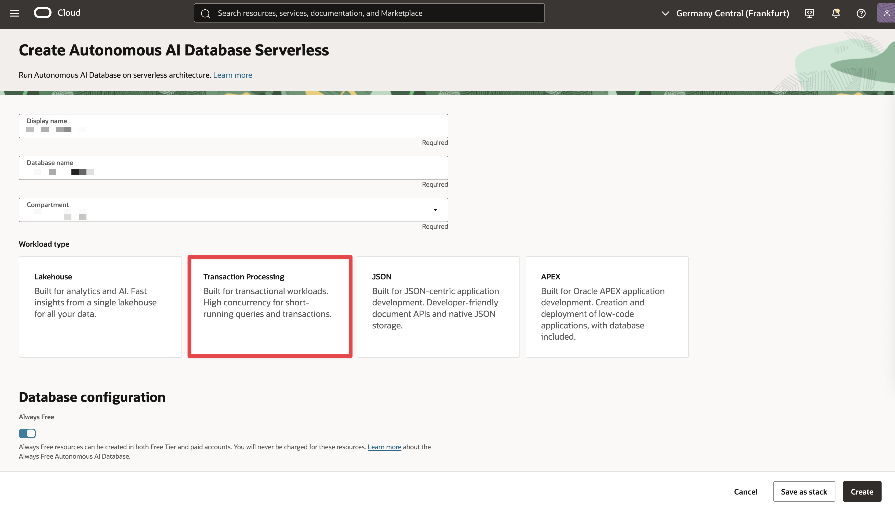

# Create an Autonomous Database 23ai Free instance

## Introduction

Now that you have an Oracle Cloud account, you will learn how to create an Autonomous Database instance. This lab walks you through the necessary steps.

Estimated Time: 15 minutes

### Objectives

In this lab, you will:

-  Create an ADB instance
- Configure an ADB instance

### Prerequisites

- An Oracle Free Tier or Paid Cloud account

## Task 1: Choose ADB from the Services Menu

1. Login to the Oracle Cloud. If you are using a Free Trial or Always Free account, and you want to use Always Free Resources, you need to be in the home region of the tenancy.

2. Open the **Navigation** menu in the upper left and click **Oracle Database**. Under **Oracle Database**, click **Autonomous Transaction Processing**. The **Autonomous Transaction Processing** page should be displayed.

    

## Task 2: Create the ADB instance

1. Click on **Create Autonomous Database** button to start the instance creation process

     

2. This brings up the Create Autonomous Database screen where you will specify the configuration of the instance

3. Provide basic information for the autonomous database:

    - **Choose a compartment** - It will be prepopulated, but you have the option to select a compartment for the database from the drop-down list
    - **Display Name** - You can leave the prepopulated name.
    - **Database Name** - You can leave the prepopulated name. If you want to change it, use letters and numbers only, starting with a letter. Maximum length is 14 characters. (Underscores not
    initially supported.)
    - **Workload** - For this lab, choose *Transaction Processing*.
    - **Deployment Type** - Choose *Serverless* as the deployment type.

    

4. Configure the database:

    - **Always Free** - If your Cloud Account is an Always Free account, you can select this option to create an always free autonomous database. An always free database comes with 1 CPU and 20 GB of storage. For this lab, you can leave Always Free checked.
    - **Choose database version** - Select 23ai from the database version.

    

5. Create administrator credentials:
    - **Password and Confirm Password** - Specify the password for ADMIN user of the service instance and confirm the password.

     

6. Set network access:

    In order to use the Database API for MongoDB, you must set the database up with an access control rule. So choose **Secure access from allowed IPs and VCNs only**.

    You can then set the CIDR block access to 0.0.0.0/0, which allows access from everywhere. This is not recommended for systems used in any production configuration, but sufficient for a workshop.

    

7. Click **Create Autonomous Database**

    

8. Your instance will begin provisioning. In a few minutes, the state will turn from Provisioning to Available. At this point, your Autonomous Transaction Processing database is ready to use! 

    

9. Once the ATP is available, check the *Tool configuration* tab. The MongoDB API is enable. Keep in mind that here is the place you can find the Public access URL that you'll need in a later stage

    

    > **_NOTE:_**  More information about this can be found in the **Learn More** section.

## Learn More

* [Using Oracle Autonomous Database Serverless](https://docs.oracle.com/en-us/iaas/autonomous-database-serverless/doc/mongo-using-oracle-database-api-mongodb.html)

## Acknowledgements

* **Author** - Carmen Berdant, Technical Program Manager, Product Management
* **Contributors** -  Kevin Lazarz, Senior Manager, Product Management
* **Last Updated By/Date** - Carmen Berdant, Technical Program Manager, August 2024