# Configure setup materials and tools

## Introduction

In this lab, we'll be downloading materials and setting up the necessary tools required to execute the rest of the LiveLab. We'll also be opening SQL Developer and starting the ORDS service that you will need to use Oracle Application Express (APEX) later.

Estimated Time: 5 minutes

<if type="livelabs">
Watch the video below for a quick walk-through of the lab.
[Change password](videohub:1_lvc3vcko)
</if>

### Objectives

In this lab, you will:

- Download the graph setup files and materials onto your noVNC instance
- Open SQL Developer
- Start running ORDS to enable APEX

### Prerequisites

This lab assumes you have:

- An instance with 23ai Free Developer Release database installed
- Access to the instance's remote desktop

## Task 1: Download the graph setup materials

1. Click Activities in the upper left corner, then click Terminal. Select File -> New Tab since ORDS is running in your current Terminal tab.

    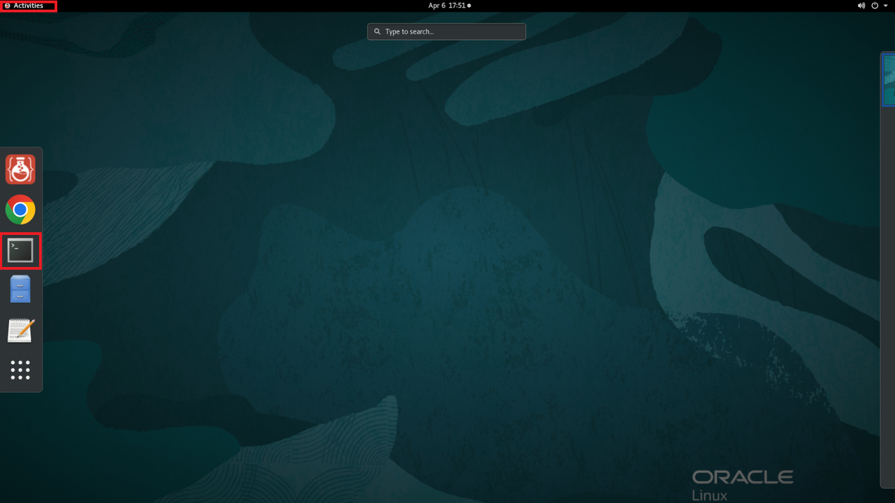

2. Go into this directory.

    **NOTE:** You must ensure to run this command, otherwise you will be downloading/unzipping files to the wrong location.

    ```
    $ <copy>cd ~/examples</copy>
    ```

3. Pull down the materials for setup.

    ```
    $ <copy>wget https://c4u04.objectstorage.us-ashburn-1.oci.customer-oci.com/p/EcTjWk2IuZPZeNnD_fYMcgUhdNDIDA6rt9gaFj_WZMiL7VvxPBNMY60837hu5hga/n/c4u04/b/livelabsfiles/o/data-management-library-files/23aifree-property-graph.zip</copy>
    ```

    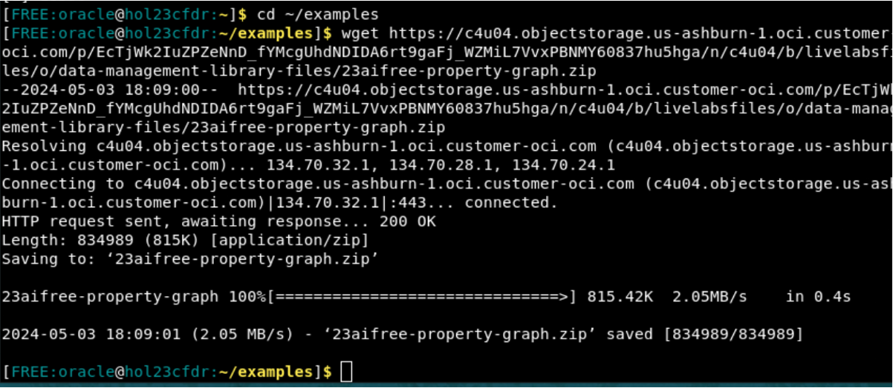

4. Unzip the file. Inside this zip file are the files to setup your schema and APEX application.

    ```
    $ <copy>unzip -o 23aifree-property-graph.zip</copy>
    ```

    <!-- 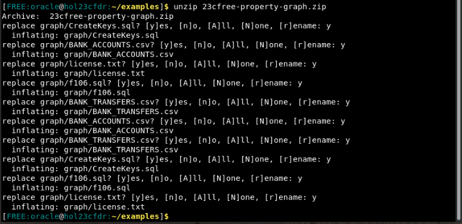 -->

    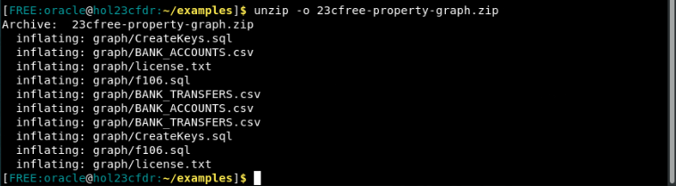
5. Remove the remaining zip file after you've unzipped it.

    ```
    $ <copy>rm -rf 23aifree-property-graph.zip</copy>
    ```

    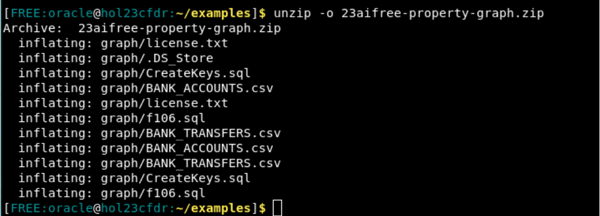

## Task 2: Open SQL Developer

1. Run the command to start up SQL Developer.

    ```
    $ <copy>sqldeveloper</copy>
    ```
    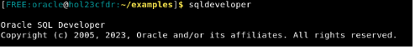

    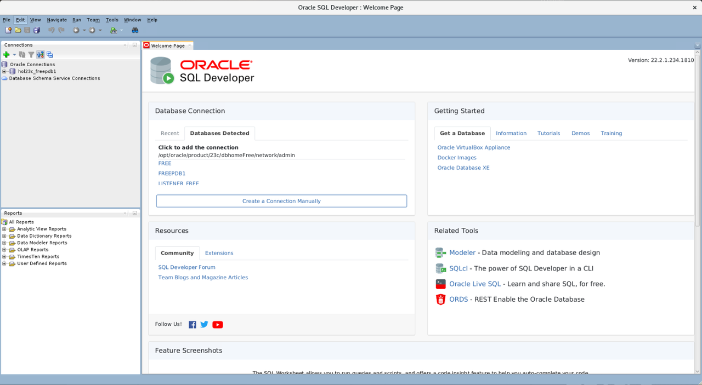

2. On the left side menu, you'll see hol23c_freepdb1 underneath Oracle Connections. Double click it to open the connection. 

    >**Note:** If you do **not** see the hol23c_freepdb1 connection available on the menu, please complete Task 3: Add the user connection and then go to step 4.

    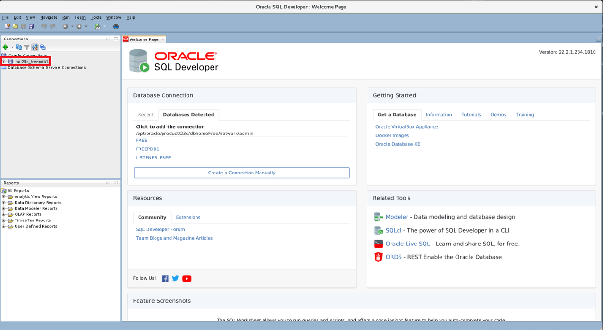

3. Fill out the connection information with your password. The default password we will be using throughout this lab is Welcome123. If you have changed yours, please use that one. After you click okay, you should be connected to your user.

    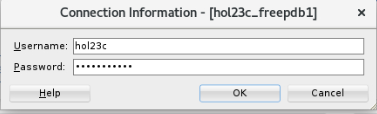

4. Click File -> Open

    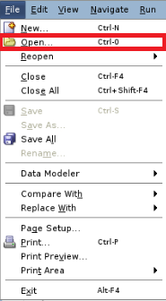

5. Click Home -> examples -> graph

    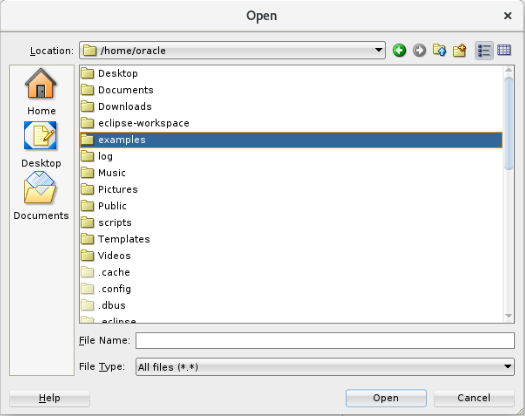

6. Open the CreateKeys.sql.

    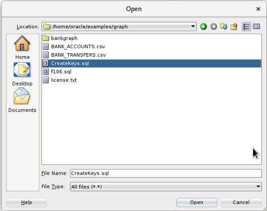

7. Click the button that shows a document with the small green play button on it to run the whole script. If it asks you to select a connection in a popup window, choose hol23c_freepdb1 from the drop down and then click OK.

    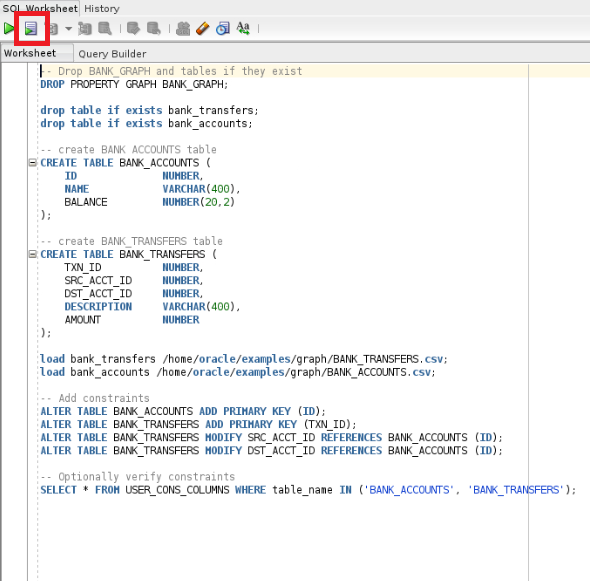

8. Scroll through the output to see that the data has been loaded. Disclaimer: If you see error, property graph does not exist, disregard it and move forward.

    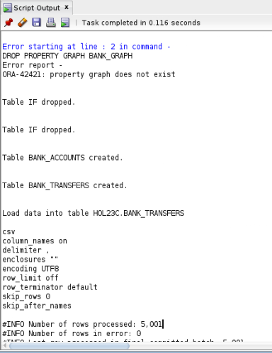

9. There should be about 5000 rows loaded into BANK\_TRANSFERS and 1000 rows loaded in BANK\_ACCOUNTS.

    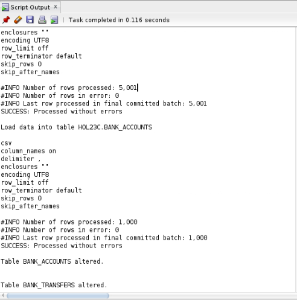

10. Your schema setup is now complete.

## (Optional) Task 3: Add the user connection

1. If you do not already have the hol23c_freepdb1 connection, then click the box that says 'Create a Connection Manually'. 

    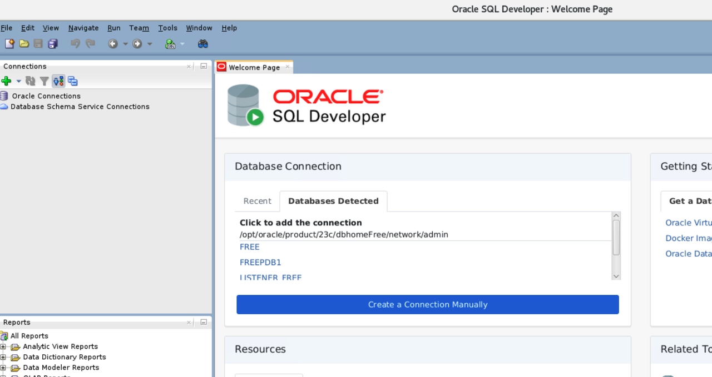

2. Fill out the fields inside of the box to match this image exactly. Make sure that the password you fill out is what you set it to for the user in Lab 1. To ensure it works, click the 'Test' button and ensure it says 'Status: Success' in the bottom left corner.

    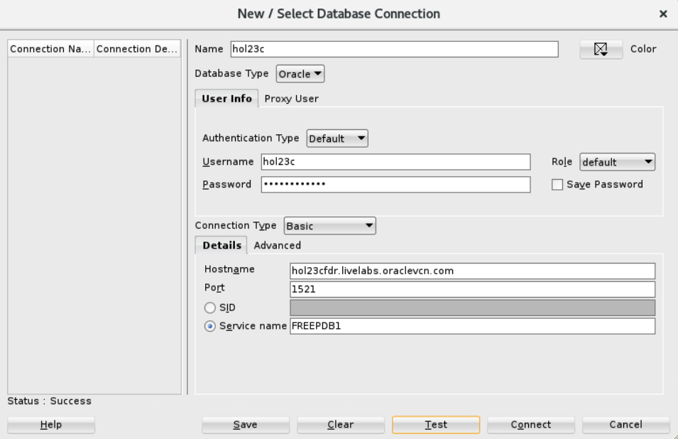

3. Click 'Connect'.

    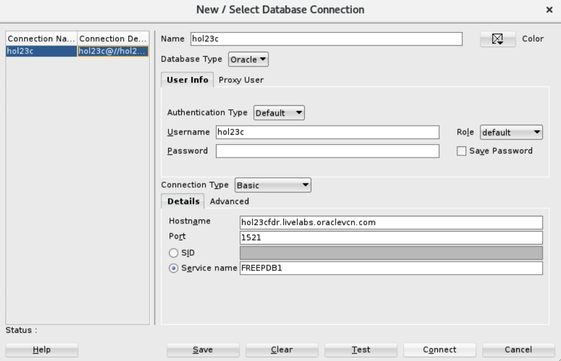

## Learn More

- [Oracle Property Graph](https://docs.oracle.com/en/database/oracle/property-graph/index.html)
- [SQL Property Graph syntax in Oracle Database 23ai](https://docs.oracle.com/en/database/oracle/property-graph/25.3/spgdg/sql-ddl-statements-property-graphs.html)

## Acknowledgements

- **Author** - Kaylien Phan, Thea Lazarova, William Masdon
- **Contributors** - Melliyal Annamalai, Jayant Sharma, Ramu Murakami Gutierrez, Rahul Tasker
- **Last Updated By/Date** - Denise Myrick, August 2025
