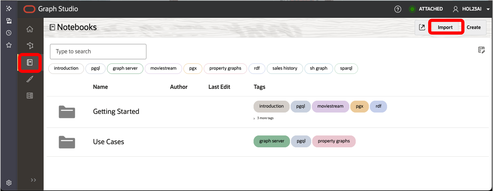
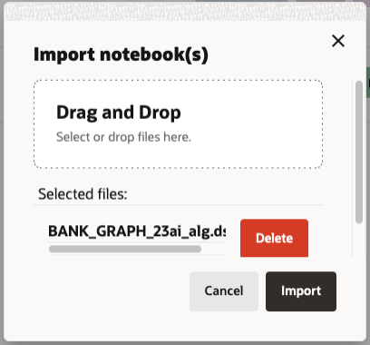
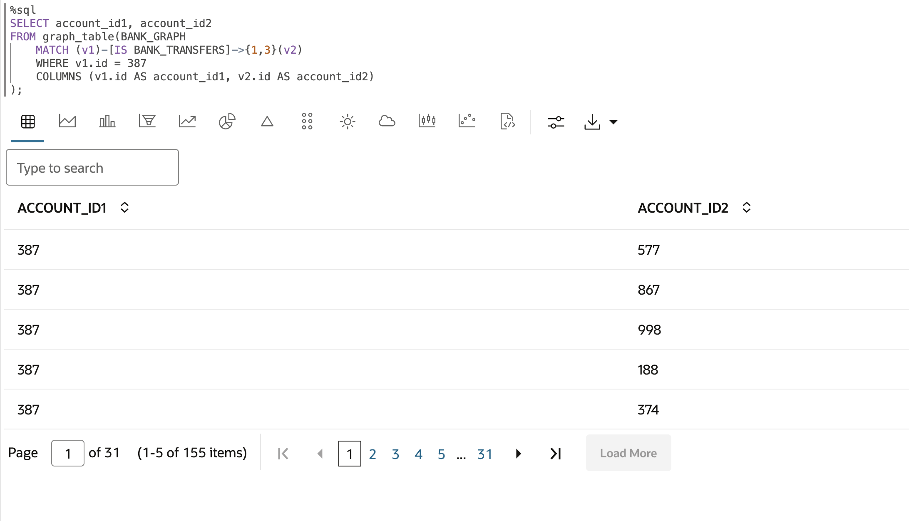
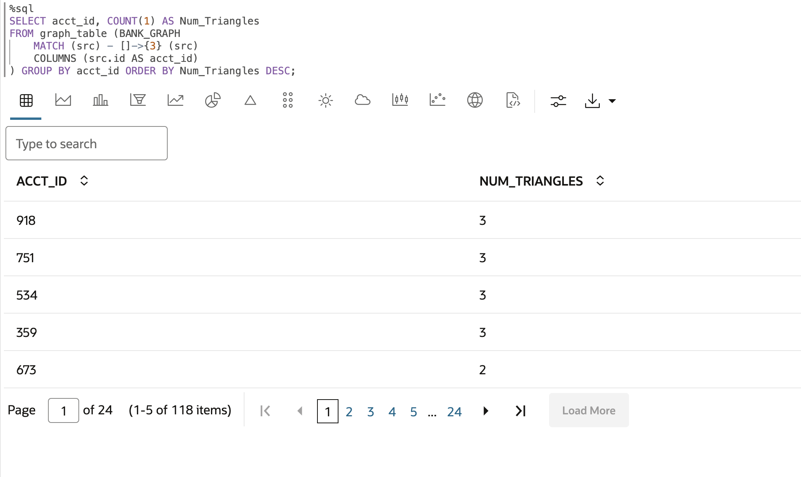
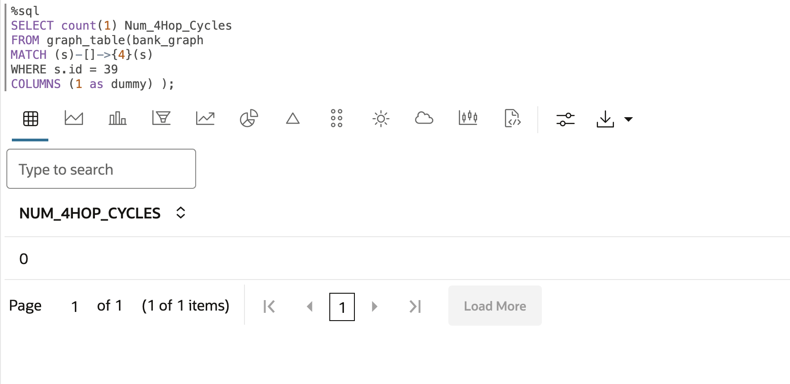
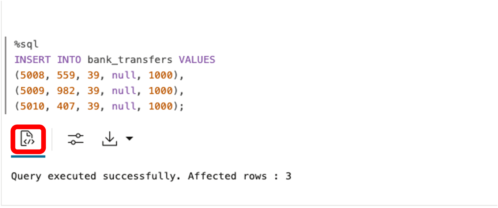
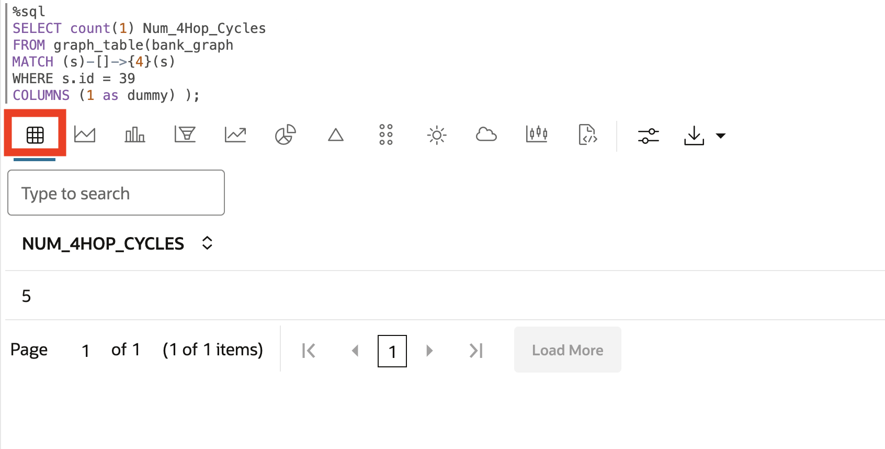
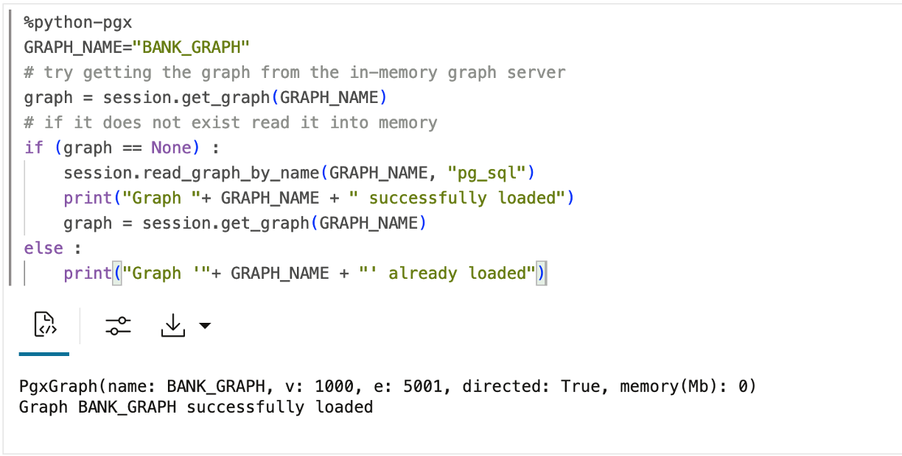

# Operational Property Graphs Example with SQL/PGQ in 23ai

## Introduction

In this lab you will query the newly created graph (that is, `bank_graph`) using SQL/PGQ, a new extension in SQL:2023.
​

Estimated Time: 30 minutes.
​
### Objectives
Learn how to:
- Use APEX and SQL/PGQ to define and query a property graph.
​
### Prerequisites
This lab assumes:  
- The database user exists and has the right roles and privileges.

<!-- <if type="livelabs">
Watch the video below for a quick walk-through of the lab. 
[Change password](videohub:1_ovgflc5c)
</if> -->

## Task 1: Import the notebook

 You can import a notebook that has the graph queries and analytics. Each paragraph in the notebook has an explanation.  You can review the explanation, and then run the query or analytics algorithm.

  [Click here to download the notebook](https://c4u04.objectstorage.us-ashburn-1.oci.customer-oci.com/p/IgAbg73m8_uWkH1JfjrdqqzgPLUM52ZauWRwA7tEb7C2NRDyXZBQAP8eUenQD4N8/n/c4u04/b/livelabsfiles/o/labfiles/BANK_GRAPH_23ai_alg.dsnb) and save it to a folder on your local computer.  This notebook includes graph queries and analytics for the MOVIE_RECOMMENDATIONS graph.

 1. Click the **Notebook** icon. Import a notebook by clicking on the notebook icon on the left, and then clicking on the **Import** icon on the far right.

    
    
     Select or drag and drop the notebook and click **Import**.

    

    A dialog pops up named **Compute Environment**. It will disappear when the compute environment finishes attaching, usually in less than one minute. Or you can click **Close** to close the dialog and start working on your environment. Note that you will not be able to run any paragraph until the environment finishes attaching.
​
## Task 2: Query bank_graph
​
In this task we will run queries using SQL/PGQ's GRAPH_TABLE operator, MATCH clause, and COLUMNS clause. The GRAPH\_TABLE operator enables you to query the property graph by specifying a graph pattern to look for and return the results as a set of columns. The MATCH clause lets you specify the graph patterns, and the COLUMN clause lists the query output columns. Everything else is existing SQL syntax.

A common query in analyzing money flows is to see if there is a sequence of transfers that connect one source account to a destination account. We'll be demonstrating that sequence of transfers in standard SQL.

>**Note**: We created the graph using the Graph Studio modeler. However, in the following paragraph, we provide the **CREATE PROPERTY GRAPH SQL statement**, which you can use to create a graph anywhere SQL queries are supported.
​    ```
    %sql
    CREATE PROPERTY GRAPH BANK_GRAPH 
    VERTEX TABLES (
        BANK_ACCOUNTS
        KEY (ID)
        PROPERTIES (ID, Name, Balance) 
    )
    EDGE TABLES (
        BANK_TRANSFERS 
        KEY (TXN_ID) 
        SOURCE KEY (src_acct_id) REFERENCES BANK_ACCOUNTS(ID)
        DESTINATION KEY (dst_acct_id) REFERENCES BANK_ACCOUNTS(ID)
        PROPERTIES (src_acct_id, dst_acct_id, amount) 
        )
    ```

1. Let's use SQL to find the **top 10 accounts by number of transfers** the account has received. Run the paragraph with the following query.
    
    ```
    <copy>
    SELECT acct_id, COUNT(1) AS Num_Transfers 
    FROM graph_table ( BANK_GRAPH 
        MATCH (src) - [IS BANK_TRANSFERS] -> (dst) 
        COLUMNS ( dst.id AS acct_id )
    ) GROUP BY acct_id ORDER BY Num_Transfers DESC FETCH FIRST 10 ROWS ONLY;
    </copy>
    ```

    
​
    We see that accounts **387** and **934** have a high number of incoming transactions.
    
2.  What if we want to find the accounts where money was simply passing through? Let's find the **top 10 accounts in the middle of a 2-hop chain** of transfers.
    
    ```
    <copy>
    SELECT acct_id, COUNT(1) AS Num_In_Middle 
    FROM graph_table ( BANK_GRAPH 
        MATCH (src) - [IS BANK_TRANSFERS] -> (via) - [IS BANK_TRANSFERS] -> (dst) 
        COLUMNS ( via.id AS acct_id )
    ) GROUP BY acct_id ORDER BY Num_In_Middle DESC FETCH FIRST 10 ROWS ONLY;
    </copy>
    ```

    
​
3. Note that account **387** shows up again, so let's list **accounts that received a transfer from account 387 in 1, 2, or 3 hops**.
    
    ```
    <copy>
    SELECT account_id1, account_id2 
    FROM graph_table(BANK_GRAPH
        MATCH (v1)-[IS BANK_TRANSFERS]->{1,3}(v2) 
        WHERE v1.id = 387 
        COLUMNS (v1.id AS account_id1, v2.id AS account_id2)
    );
    </copy>
    ```

    

4. We looked at accounts with the most incoming transfers and those which were simply conduits. Now let's query the graph to determine if there are any circular payment chains, i.e. a sequence of transfers that start and end at the same account. First let's check if there are **any 3-hop (triangles) transfers that start and end at the same account**. 

    This query lists such accounts, ordered by the number of triangles that start and end with that account.
    
    ```
    <copy>
    SELECT acct_id, COUNT(1) AS Num_Triangles 
    FROM graph_table (BANK_GRAPH 
        MATCH (src) - []->{3} (src) 
        COLUMNS (src.id AS acct_id) 
    ) GROUP BY acct_id ORDER BY Num_Triangles DESC;
    </copy>
    ```

    
​
5. We can use the same query but **modify the number of hops** to check if there are **any 4-hop transfers that start and end at the same account**. 

    ```
    <copy>
    SELECT acct_id, COUNT(1) AS Num_4hop_Chains 
    FROM graph_table (BANK_GRAPH 
        MATCH (src) - []->{4} (src) 
        COLUMNS (src.id AS acct_id) 
    ) GROUP BY acct_id ORDER BY Num_4hop_Chains DESC;
    </copy>
    ```
​
    
​
6. Lastly, check if there are **any 5-hop transfers that start and end at the same account** by just changing the number of hops to 

    Note that though we are looking for longer chains we reuse the same MATCH pattern with a modified parameter for the desired number of hops. This compactness and expressiveness is a primary benefit of the new SQL syntax for graphs in Oracle Database 23ai.
   
    ```
    <copy>
   SELECT acct_id, COUNT(1) AS Num_5hop_Chains 
    FROM graph_table (BANK_GRAPH 
        MATCH (src) - []->{5} (src) 
        COLUMNS (src.id AS acct_id) 
    ) GROUP BY acct_id ORDER BY Num_5hop_Chains DESC;
    </copy>
    ```  
    
    

7. Now that we know there are 3, 4, and 5-hop cycles, let's list **some (any 10) accounts that had these circular payment chains**. 
   
    ```
    <copy>
    SELECT DISTINCT(account_id) 
    FROM GRAPH_TABLE(BANK_GRAPH
       MATCH (v1)-[IS BANK_TRANSFERS]->{3,5}(v1)
        COLUMNS (v1.id AS account_id)  
    ) FETCH FIRST 10 ROWS ONLY;
    </copy>
    ```
​
    
​
8.  Let's list the top 10 accounts that have **circular payment chains of 3 to 5 hops** in descending order of the number of such chains.
   
    ```
    <copy>
    SELECT DISTINCT(account_id), COUNT(1) AS Num_Cycles 
    FROM graph_table(BANK_GRAPH
        MATCH (v1)-[IS BANK_TRANSFERS]->{3, 5}(v1) 
        COLUMNS (v1.id AS account_id) 
    ) GROUP BY account_id ORDER BY Num_Cycles DESC FETCH FIRST 10 ROWS ONLY;
    </copy>
    ```
​
    
​
    Note that accounts **135**, **934** and **387** are the ones involved in most of the 3 to 5 hops circular payment chains. 
​
9. Any insert, update, or delete on the underlying tables will also be reflected in the property graph.

    Now, let's **insert some more data into BANK\_TRANSFERS**. We will see that when rows are inserted in to the BANK\_TRANSFERS table, the BANK\_GRAPH is updated with corresponding edges.
   
    ```
    <copy>
    INSERT INTO bank_transfers VALUES 
    (5002, 39, 934, null, 1000),
    (5003, 39, 135, null, 1000),
    (5004, 40, 135, null, 1000),
    (5005, 41, 135, null, 1000),
    (5006, 38, 135, null, 1000),
    (5007, 37, 135, null, 1000);
    </copy>
    ```

    

10. Re-run the **top 10 query** to see if there are any changes after inserting rows in BANK\_TRANSFERS.
   
    ```
    <copy>
    SELECT acct_id, count(1) AS Num_Transfers 
    FROM GRAPH_TABLE ( bank_graph 
    MATCH (src) - [is BANK_TRANSFERS] -> (dst) 
    COLUMNS ( dst.id as acct_id )
    ) GROUP BY acct_id ORDER BY Num_Transfers DESC fetch first 10 rows only;
    </copy>
    ```

    

    Notice how accounts **135**, and **934** are now **ahead of 387**.
​
11. In a previous query we saw that accounts 135 and 934 had a number of 4-hop circular payments chains. Let's check if account **39** had any.
    
    ```
    <copy>
    SELECT count(1) Num_4Hop_Cycles 
    FROM graph_table(bank_graph 
    MATCH (s)-[]->{4}(s) 
    WHERE s.id = 39
    COLUMNS (1 as dummy) );
    </copy>
    ```     
​
   ​ 

    **It has zero 4-hop circular payment chains**.
​
12. Let’s **insert more transfers** which create some circular payment chains for account 39.

    We will be adding transfers from accounts 599, 982, and 407 into account 39.
   
    ```
    <copy>
    INSERT INTO bank_transfers VALUES 
    (5008, 559, 39, null, 1000),
    (5009, 982, 39, null, 1000),
    (5010, 407, 39, null, 1000);
    </copy>
    ```
  ​  
    
​
13.  Re-run the previous query to see how the new inserts affect the results.
   
    ```
    <copy>
    SELECT count(1) Num_4Hop_Cycles 
    FROM graph_table(bank_graph 
    MATCH (s)-[]->{4}(s) 
    WHERE s.id = 39
    COLUMNS (1 as dummy) );
    </copy>
    ```
  ​  
    

    Notice how we now have **five 4-hop circular payment chains** because the edges of BANK_GRAPH were updated when additional transfers were added to BANK\_TRANSFERS.

14.  We inserted three rows and that resulted in five circular payment chains of length four. Let’s examine why.

    By executing the following query we find the number of **3-hop chains from account 39 to one of the accounts 407, 559, or 982**.

    ```
    <copy>
    SELECT s0, a1, a2, a3 
    FROM graph_table(bank_graph 
    MATCH (s)-[]->(a)-[]->(b)-[]->(c)
    WHERE s.id = 39 and c.id in (559, 982, 407) 
    COLUMNS (s.id as s0, a.id as a1, b.id as a2, c.id as a3) );
    </copy>
    ```
    
    

    Note that there are 2 chains from account **39** to account **407** and another 2 from **39** to **559**.

    So when we inserted a transfer from account **407** to account **39** that resulted in **two 4-hop chains**. The same occurs for account **559**. Hence we get **five new 4-hop circular payment chains**.

15. Let's undo the changes and delete the newly inserted rows.
   
    ```
    <copy>
    DELETE FROM bank_transfers 
    WHERE txn_id IN (5002, 5003, 5004, 5005, 5006, 5007, 5008, 5009, 5010);
    </copy>
    ```

    ​

16. Run the first %python-pgx paragraph, which uses the built-in session object to read the graph **into memory** from the database and creates a PgXGraph object that handles the loaded graph.

    ```
    <copy>
    %python-pgx
    GRAPH_NAME="BANK_GRAPH"
    # try getting the graph from the in-memory graph server
    graph = session.get_graph(GRAPH_NAME)
    # if it does not exist read it into memory
    if (graph == None) :
        session.read_graph_by_name(GRAPH_NAME, "pg_sql")
        print("Graph "+ GRAPH_NAME + " successfully loaded")
        graph = session.get_graph(GRAPH_NAME)
    else :
        print("Graph '"+ GRAPH_NAME + "' already loaded")
    </copy>
    ```
    
    ​

17. Accounts **387** and **934** have a high number of transactions.

    We are going to start looking at these accounts in detail. Let’s start by **identifying the owner of account 387**.

    ```
    <copy>
    %sql
    select * from bank_accounts where id = 387;
    </copy>
    ```
    
    ​

    Looks like **Antonia Mclachlan** is the owner of this account.  

18. What about account 934?

    Let's run the same query but for account **934**.

    ```
    <copy>
    %sql
    select * from bank_accounts where id = 934;
    </copy>
    ```
    
    ​

    The owner of account 934 is **Russell Rivera**.   

19. Let’s look at the **circular transfers that originate and terminate at Russell Rivera's account**, and visualize the results.

    We start with the **of hops equals 4** as specified as []->{4}.

    ```
    <copy>
    %pgql-pgx
    SELECT * 
    FROM graph_table (BANK_GRAPH 
        MATCH (src) - []->{4} (src) 
        WHERE src.name = 'RUSSELL RIVERA'
        ONE ROW PER STEP ( v1, e1, v2 )
        COLUMNS (src.id AS acct_id, vertex_id(src) as src_id, vertex_id(v1) as v1_id, edge_id(e1) as e1_id, vertex_id(v2) as v2_id ) 
    ) 
    </copy>
    ```
    
    ​

    We see **three circular payment chains 4 hops** in length, that start and end in this account.

20. Now we want to look at the circular payment chains when we change the chain length to be **5 hops**.

    ```
    <copy>
    %pgql-pgx
    SELECT * 
    FROM graph_table (BANK_GRAPH 
        MATCH (src) - []->{5} (src) 
        WHERE src.name = 'RUSSELL RIVERA'
        ONE ROW PER STEP ( v1, e1, v2 )
        COLUMNS (src.id AS acct_id, vertex_id(src) as src_id, vertex_id(v1) as v1_id, edge_id(e1) as e1_id, vertex_id(v2) as v2_id ) 
    ) 
    </copy>
    ```
    
    ​

    **The number of circular payment chains that start and end in Russell Rivera's account makes it an account we should investigate further.**

21. Let us continue our investigation using another algorithm, the PageRank graph analytics algorithm.

    A %python-pgx paragraph let's you execute Python code snippets. **We will use the Python API to run the PageRank algorithm.**
    The code snippet below creates a PgxGraph object containing a handle to the BANK_GRAPH loaded into the in-memory graph server.
    Then it executes the PageRank algorithm using the built-in analyst Python object.
    The session and analyst objects are created when the in-memory graph server is instantiated and when a notebook is opened.

    ```
    <copy>
    %python-pgx
    graph = session.get_graph("BANK_GRAPH")
    analyst.pagerank(graph);
    </copy>
    ```
    
    ​

22. Now let's list the PageRank values in descending order to find the accounts with high PageRank values. **A high PageRank value indicates that that account is important**, which in the context of BANK_GRAPH, a high number of transfers have flown through that account, or the account is connected to accounts with a high number of transfers flowing through them.

    ```
    <copy>
    %pgql-pgx
    SELECT acct_id, acct_holder, pagerank
    FROM graph_table(bank_graph
    MATCH (a)
    COLUMNS (a.id as acct_id, a.name as acct_holder, a.pagerank as pagerank))
    order by pagerank desc;
    </copy>
    ```
    
    ​

    We see that **Russell Rivera's is in the top 5**. So this metric also indicates that a large number of transactions flow through Russell Rivera's account.
    But he is not at the very top, and interestingly **Antonia Mclachlan is at the top of the list**.

23. Now let's use the **computed PageRank value** in visualizing the result. We use highlights to display the accounts with a high PageRank value with larger circles and red in color.

    Execute the paragraph with the following query, which finds the **3-hop payment chains starting at Antonia Mclachlan's account**.

    ```
    <copy>
    %pgql-pgx
    SELECT * 
    FROM graph_table (BANK_GRAPH 
        MATCH (src) - []->{3} (dst) 
        WHERE src.name = 'ANTONIA MCLACHLAN'
        ONE ROW PER STEP ( v1, e1, v2 ))
        COLUMNS (src.id AS acct_id, vertex_id(src) as src_id, vertex_id(v1) as v1_id, edge_id(e1) as e1_id, vertex_id(v2) as v2_id ) 
    </copy>
    ```
    
    ​ 

    From this visualization we can quickly see **which accounts that are connected to Antonia Maclachlan also have a high pagerank value**.

24. So far, we used the knowledge that a highly connected account might be fraudulent, or when money moves in a cycle then there is potential fraud. What if we did **not know this about this specific domain**, that cycles might indicate fraud? What if we only new that accounts 934 and 387 are fraudulent, but did not have the additional information on what patterns might constitute fraud?

    We can use a **Graph Machine Learning** algorithm like **DeepWalk** to find accounts that have a similar structure to an account. We don't know what structure we are looking for, we are looking for any structure that is similar. That is the power of machine learning - **you can find similarities even if you don't know exactly what are you are looking for.**

    ```
    <copy>
    %python-pgx
    model = analyst.deepwalk_builder(
    learning_rate=0.002,
    num_epochs=30,
    seed=1,
    )
    </copy>
    ```
    
    ​

25. Now we will **train the DeepWalk model**. Run the following paragraph.

    ```
    <copy>
    %python-pgx
    import time
    start_ts = time.time()
    model.fit(graph)
    print("DeepWalk model training completed in {:.4f} seconds".format(time.time() - start_ts))
    </copy>
    ```
    
    ​ 

26. Let's get the **most similar nodes to account 934** with respect to transfer patterns.

    ```
    <copy>
    %python-pgx
    similars_934 = model.compute_similars("BANK_ACCOUNTS(934)", 10)
    print("List of nodes most similar to node 934.")
    similars_934.print()
    </copy>
    ```
    
    ​

27. Now we will take look at **similar nodes to account 387** with respect to transfer patterns.

    ```
    <copy>
    %python-pgx
    similars_387 = model.compute_similars("BANK_ACCOUNTS(387)", 10)
    print("List of nodes most similar to node 387.")
    similars_387.print()
    </copy>
    ```
    
    ​ 

    We see that 135 shows up as the account closest to 934 and 387, in terms of the patterns of the connections that account is involved in.

28. **When we query for transactions 2 hops away from 934, 387, or 135, we see that their patterns are similar**. Let's add a highlight to see these accounts by giving them a 'star' icon. You can also right-click on them to check their account ids.

    ```
    <copy>
    %pgql-pgx
    FROM graph_table (BANK_GRAPH 
        MATCH (a)-[e1]->(m)-[e2]->(d) 
        WHERE a.id in (934, 387, 135)
        COLUMNS (vertex_id(a) as a_id, edge_id(e1) as e1_id, vertex_id(m) as m_id, edge_id(e2) as e2_id, vertex_id(d) as d_id ) 
    ) 
    </copy>
    ```
    
    ​ 


You have now completed this lab.

## Learn More
* [Oracle Property Graph](https://docs.oracle.com/en/database/oracle/property-graph/index.html)
* [SQL Property Graph syntax in Oracle Database 23ai Free - Developer Release](https://docs.oracle.com/en/database/oracle/property-graph/23.1/spgdg/sql-ddl-statements-property-graphs.html#GUID-6EEB2B99-C84E-449E-92DE-89A5BBB5C96E)

## Acknowledgements

- **Author** - Kaylien Phan, Thea Lazarova, William Masdon
- **Contributors** - Melliyal Annamalai, Jayant Sharma, Ramu Murakami Gutierrez, Rahul Tasker
- **Last Updated By/Date** - Renée Wikestad June 2025
