# Operational Property Graphs Example with SQL/PGQ in Oracle AI Database

## Introduction

In this lab you will query the newly created graph (that is, `bank_graph`) using SQL/PGQ, a new extension in SQL:2023.
​

Estimated Time: 30 minutes.
​
### Objectives

Learn how to:

- Use APEX and SQL/PGQ to define and query a property graph.
​
### Prerequisites

This lab assumes:  

- The database user exists and has the right roles and privileges.
- The bank\_accounts and bank\_transfers tables exist.
​
### Tables are:

| Name | Null? | Type |
| ------- |:--------:| --------------:|
| ID | NOT NULL | NUMBER|
| NAME |  | VARCHAR2(4000) |
| BALANCE |  | NUMBER |
{: title="BANK_ACCOUNTS"}

| Name | Null? | Type |
| ------- |:--------:| --------------:|
| TXN_ID | NOT NULL | NUMBER|
| SRC\_ACCT\_ID |  | NUMBER |
| DST\_ACCT\_ID |  | NUMBER |
| DESCRIPTION |  | VARCHAR2(4000) |
| AMOUNT |  | NUMBER |
{: title="BANK_TRANSFERS"}

<if type="livelabs">
Watch the video below for a quick walk-through of the lab. 
[Change password](videohub:1_ovgflc5c)
</if>

## Task 1: Define a graph view on these tables

1. In your SQL Developer window, click on the tab named hol23c_freepdb1 or hol23c, not the CreateKeys.sql tab that you are currently in.

    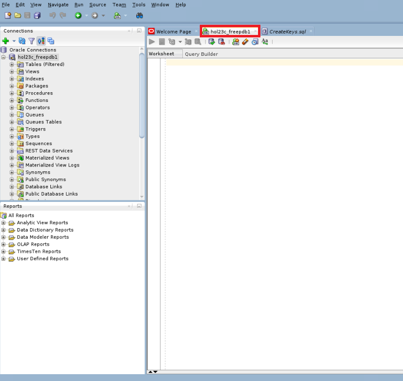
​
2. Use the following SQL statement to create a property graph called BANK\_GRAPH using the BANK\_ACCOUNTS table as the vertices and the BANK_TRANSFERS table as edges. 

    **NOTE:** To avoid conflicting SQL queries, please erase the SQL worksheet after each command is executed. We will continue to use the document button with the green play symbol for the remainder of this lab.

    
    ```
    <copy>
    CREATE PROPERTY GRAPH BANK_GRAPH 
    VERTEX TABLES (
        BANK_ACCOUNTS
        KEY (ID)
        PROPERTIES (ID, Name, Balance) 
    )
    EDGE TABLES (
        BANK_TRANSFERS 
        KEY (TXN_ID) 
        SOURCE KEY (src_acct_id) REFERENCES BANK_ACCOUNTS(ID)
        DESTINATION KEY (dst_acct_id) REFERENCES BANK_ACCOUNTS(ID)
        PROPERTIES (src_acct_id, dst_acct_id, amount)
    );
    </copy>
    ```
​
    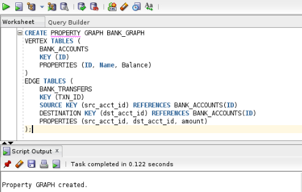

3. You can check the metadata views to list the graph, its elements, their labels, and their properties. First we will be listing the graphs, but there is only one property graph we have created, so BANK\_GRAPH will be the only entry.
    
    ```
    <copy>
    SELECT * FROM user_property_graphs;
    </copy>
    ```

    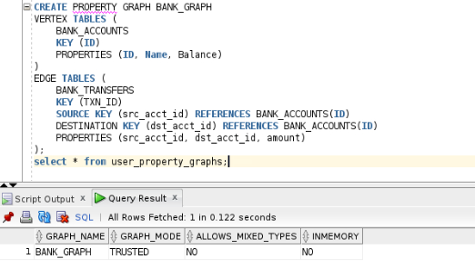
​
4. This query shows the DDL for the BANK_GRAPH graph. 
​
    ```
    <copy>
    SELECT dbms_metadata.get_ddl('PROPERTY_GRAPH', 'BANK_GRAPH') from dual;
    </copy>
    ```
    
    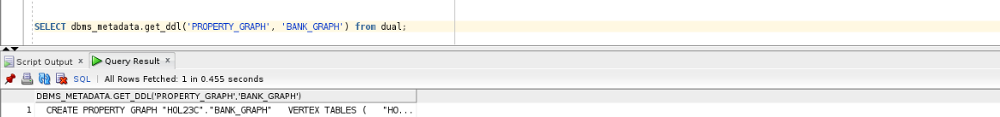 

5. Here you can look at the elements of the BANK\_GRAPH graph (i.e. its vertices and edges).
    
    ```
    <copy>
    SELECT * FROM user_pg_elements WHERE graph_name='BANK_GRAPH';
    </copy>
    ```

    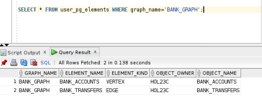
​
6. Get the properties associated with the labels.
    
    ```
    <copy>
    SELECT * FROM user_pg_label_properties WHERE graph_name='BANK_GRAPH';
    </copy>
    ```
​
    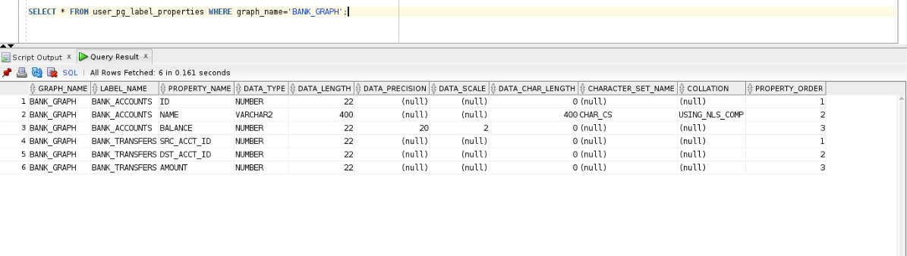
​
## Task 2: Query the bank_graph
​
In this task we will run queries using SQL/PGQ's GRAPH_TABLE operator, MATCH clause, and COLUMNS clause. The GRAPH\_TABLE operator enables you to query the property graph by specifying a graph pattern to look for and return the results as a set of columns. The MATCH clause lets you specify the graph patterns, and the COLUMN clause lists the query output columns. Everything else is existing SQL syntax.
​

A common query in analyzing money flows is to see if there is a sequence of transfers that connect one source account to a destination account. We'll be demonstrating that sequence of transfers in standard SQL.
​
1. Let's start by finding the top 10 accounts which have the most incoming transfers.
    
    ```
    <copy>
    SELECT acct_id, COUNT(1) AS Num_Transfers 
    FROM graph_table ( BANK_GRAPH 
        MATCH (src) - [IS BANK_TRANSFERS] -> (dst) 
        COLUMNS ( dst.id AS acct_id )
    ) GROUP BY acct_id ORDER BY Num_Transfers DESC FETCH FIRST 10 ROWS ONLY;
    </copy>
    ```

    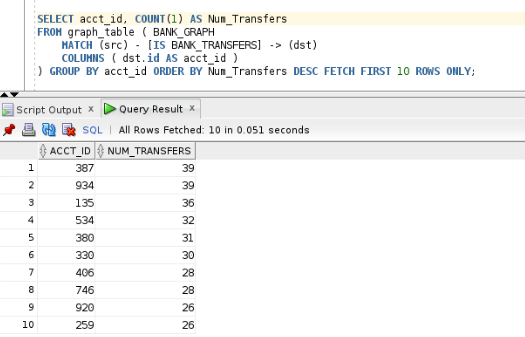
​
    We see that accounts **934** and **387** are high on the list. 
    
2.  What if we want to find the accounts where money was simply passing through. That is, let's find the top 10 accounts in the middle of a 2-hop chain of transfers.
    
    ```
    <copy>
    SELECT acct_id, COUNT(1) AS Num_In_Middle 
    FROM graph_table ( BANK_GRAPH 
        MATCH (src) - [IS BANK_TRANSFERS] -> (via) - [IS BANK_TRANSFERS] -> (dst) 
        COLUMNS ( via.id AS acct_id )
    ) GROUP BY acct_id ORDER BY Num_In_Middle DESC FETCH FIRST 10 ROWS ONLY;
    </copy>
    ```

    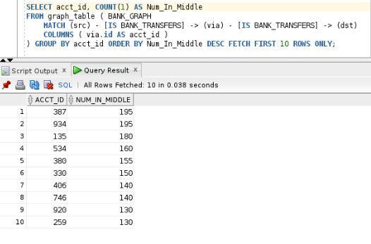
​
3. Note that account 387 shows up in both, so let's list accounts that received a transfer from account 387 in 1, 2, or 3 hops.
    
    ```
    <copy>
    SELECT account_id1, account_id2 
    FROM graph_table(BANK_GRAPH
        MATCH (v1)-[IS BANK_TRANSFERS]->{1,3}(v2) 
        WHERE v1.id = 387 
        COLUMNS (v1.id AS account_id1, v2.id AS account_id2)
    );
    </copy>
    ```

    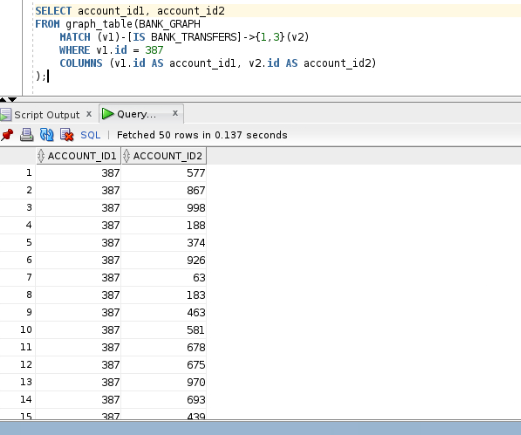

​
4. We looked at accounts with the most incoming transfers and those which were simply conduits. Now let's query the graph to determine if there are any circular payment chains, i.e. a sequence of transfers that start and end at the same account. First let's check if there are any 3-hop (triangles) transfers that start and end at the same account.
    
    ```
    <copy>
    SELECT acct_id, COUNT(1) AS Num_Triangles 
    FROM graph_table (BANK_GRAPH 
        MATCH (src) - []->{3} (src) 
        COLUMNS (src.id AS acct_id) 
    ) GROUP BY acct_id ORDER BY Num_Triangles DESC;
    </copy>
    ```

    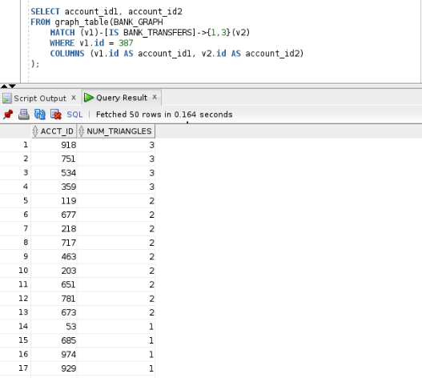
​
5. We can use the same query but modify the number of hops to check if there are any 4-hop transfers that start and end at the same account. 

    ```
    <copy>
    SELECT acct_id, COUNT(1) AS Num_4hop_Chains 
    FROM graph_table (BANK_GRAPH 
        MATCH (src) - []->{4} (src) 
        COLUMNS (src.id AS acct_id) 
    ) GROUP BY acct_id ORDER BY Num_4hop_Chains DESC;
    </copy>
    ```
​
    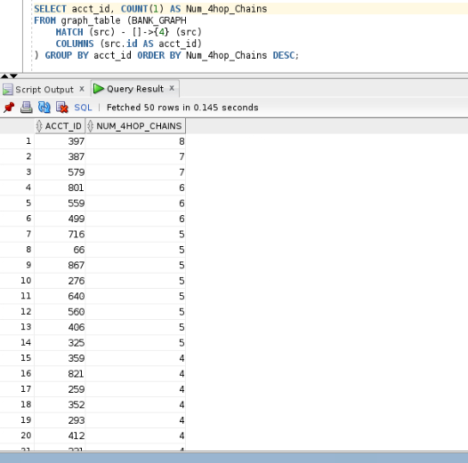
​
6. Lastly, check if there are any 5-hop transfers that start and end at the same account by just changing the number of hops to 5. 
   
    ```
    <copy>
   SELECT acct_id, COUNT(1) AS Num_5hop_Chains 
    FROM graph_table (BANK_GRAPH 
        MATCH (src) - []->{5} (src) 
        COLUMNS (src.id AS acct_id) 
    ) GROUP BY acct_id ORDER BY Num_5hop_Chains DESC;
    </copy>
    ```  

    Note that though we are looking for longer chains we reuse the same MATCH pattern with a modified parameter for the desired number of hops. This compactness and expressiveness is a primary benefit of the new SQL/PGQ functionality.
    
    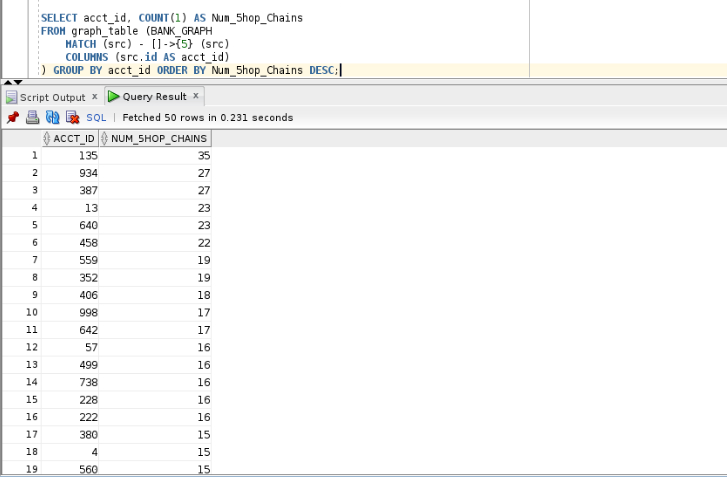

7.  Now that we know there are 3, 4, and 5-hop cycles, let's list some (any 10) accounts that had these circular payment chains. 
   
    ```
    <copy>
    SELECT DISTINCT(account_id) 
    FROM GRAPH_TABLE(BANK_GRAPH
       MATCH (v1)-[IS BANK_TRANSFERS]->{3,5}(v1)
        COLUMNS (v1.id AS account_id)  
    ) FETCH FIRST 10 ROWS ONLY;
    </copy>
    ```
​
    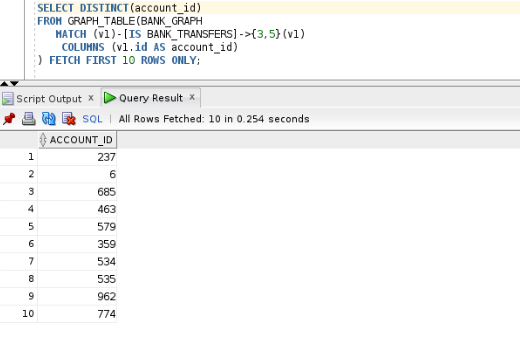
​
8.  Let's list the top 10 accounts by number of 3 to 5 hops that have circular payment chains in descending order. 
   
    ```
    <copy>
    SELECT DISTINCT(account_id), COUNT(1) AS Num_Cycles 
    FROM graph_table(BANK_GRAPH
        MATCH (v1)-[IS BANK_TRANSFERS]->{3, 5}(v1) 
        COLUMNS (v1.id AS account_id) 
    ) GROUP BY account_id ORDER BY Num_Cycles DESC FETCH FIRST 10 ROWS ONLY;
    </copy>
    ```
​
    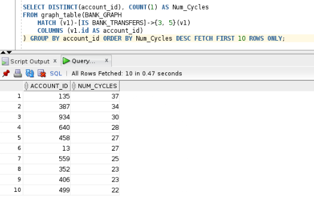
​
    Note that accounts **135**, **934** and **387** are the ones involved in most of the 3 to 5 hops circular payment chains. 
​
9. When we created the `BANK_GRAPH` property graph we essentially created a view on the underlying tables and metadata. No data is duplicated. So any insert, update, or delete on the underlying tables will also be reflected in the property graph.   
​
    Now, let's insert some more data into BANK\_TRANSFERS. We will see that when rows are inserted in to the BANK\_TRANSFERS table, the BANK\_GRAPH is updated with corresponding edges.

    Run this by clicking the button to run the entire script, instead of the green play button.

    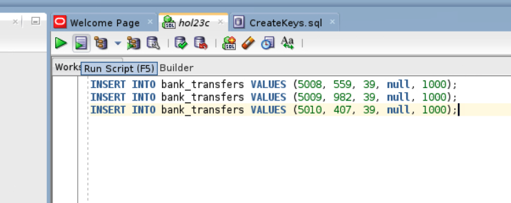
   
    ```
    <copy>
    INSERT INTO bank_transfers VALUES (5002, 39, 934, null, 1000);
    INSERT INTO bank_transfers VALUES (5003, 39, 135, null, 1000);
    INSERT INTO bank_transfers VALUES (5004, 40, 135, null, 1000);
    INSERT INTO bank_transfers VALUES (5005, 41, 135, null, 1000);
    INSERT INTO bank_transfers VALUES (5006, 38, 135, null, 1000);
    INSERT INTO bank_transfers VALUES (5007, 37, 135, null, 1000);
    </copy>
    ```

   ​ 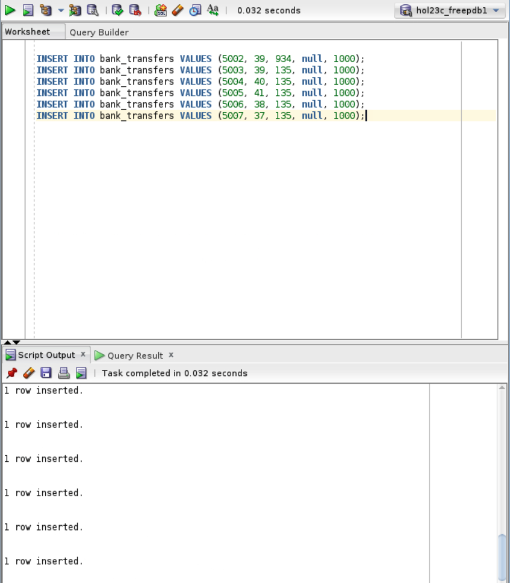

10.   Re-run the top 10 query to see if there are any changes after inserting rows in BANK\_TRANSFERS.
   
    ```
    <copy>
    SELECT acct_id, count(1) AS Num_Transfers 
    FROM GRAPH_TABLE ( bank_graph 
    MATCH (src) - [is BANK_TRANSFERS] -> (dst) 
    COLUMNS ( dst.id as acct_id )
    ) GROUP BY acct_id ORDER BY Num_Transfers DESC fetch first 10 rows only;
    </copy>
    ```
   ​ 
    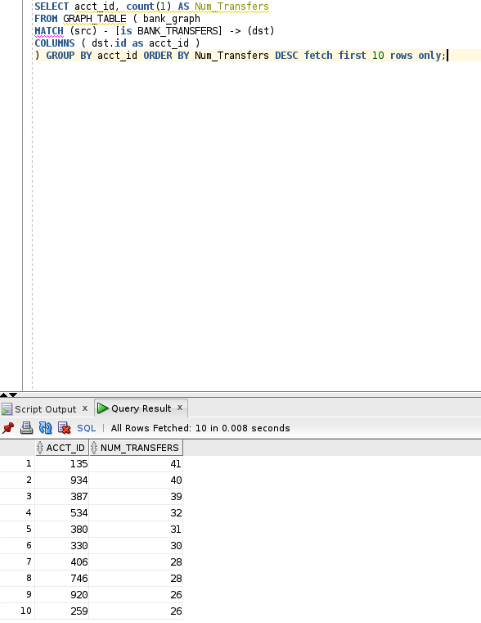
​
    Notice how accounts **135**, and **934** are now ahead of **387**.
​
11. In Step 5 above we saw that accounts 135 and 934 had a number of 4-hop circular payments chains. Let's check if account 39 had any.
    
    ```
    <copy>
    SELECT count(1) Num_4Hop_Cycles 
    FROM graph_table(bank_graph 
    MATCH (s)-[]->{4}(s) 
    WHERE s.id = 39
    COLUMNS (1 as dummy) );
    </copy>
    ```

    It has 0.      
​
   ​ 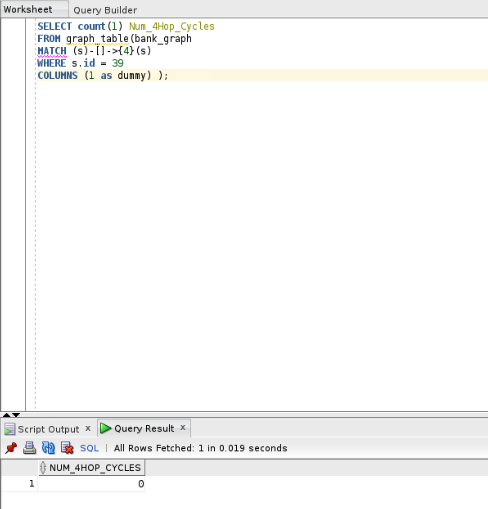
​
12.  So let’s insert more transfers which create some circular payment chains.

    We will be adding transfers from accounts **599**, **982**, and **407** into account **39**.

    Run this by clicking the button to run the entire script, instead of the green play button.
   
    ```
    <copy>
    INSERT INTO bank_transfers VALUES (5008, 559, 39, null, 1000);
    INSERT INTO bank_transfers VALUES (5009, 982, 39, null, 1000);
    INSERT INTO bank_transfers VALUES (5010, 407, 39, null, 1000);
    </copy>
    ```
  ​  
    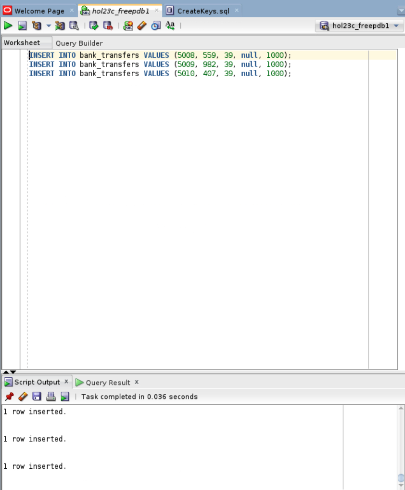
​
13.  Re-run the following query since we've added more circular payment chains.
   
    ```
    <copy>
    SELECT count(1) Num_4Hop_Cycles 
    FROM graph_table(bank_graph 
    MATCH (s)-[]->{4}(s) 
    WHERE s.id = 39
    COLUMNS (1 as dummy) );
    </copy>
    ```
  ​  
    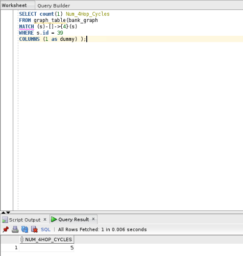
​
    Notice how we now have five 4-hop circular payment chains because the edges of BANK\_GRAPH were updated when additional transfers were added to BANK\_TRANSFERS. 
​
14.  We inserted three rows and that resulted in five circular payment chains of length four. Let’s examine why.

    Execute the following query to find the number of 3-hop chains from account 39 to one of the accounts 407, 559, or 982.

    Note that there are 2 chains from account 39 to account 407 and another 2 from 39 to 559.

    So when we inserted a transfer from account 407 to account 39 that resulted in two 4-hop chains. The same occurs for account 559. Hence we get five new 4-hop circular payment chains.

    ```
    <copy>
    SELECT s0, a1, a2, a3 
    FROM graph_table(bank_graph 
    MATCH (s)-[]->(a)-[]->(b)-[]->(c)
    WHERE s.id = 39 and c.id in (559, 982, 407) 
    COLUMNS (s.id as s0, a.id as a1, b.id as a2, c.id as a3) );
    </copy>
    ```
    
    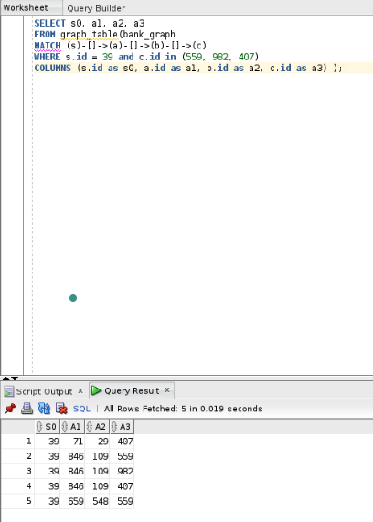
    
15. Finally let's undo the changes and delete the newly inserted rows.
   
    ```
    <copy>
    DELETE FROM bank_transfers 
    WHERE txn_id IN (5002, 5003, 5004, 5005, 5006, 5007, 5008, 5009, 5010);
    </copy>
    ```

    ​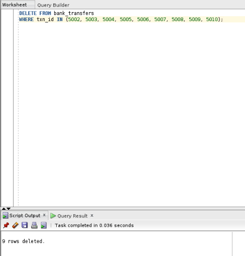

16. You have now completed this lab.

## Learn More

- [Oracle Property Graph](https://docs.oracle.com/en/database/oracle/property-graph/index.html)
- [Graph Developer's Guide for Property Graph - SQL DDL Statements for Property Graphs](https://docs.oracle.com/en/database/oracle/property-graph/25.4/spgdg/sql-ddl-statements-property-graphs.html)

## Acknowledgements

- **Author** - Kaylien Phan, Thea Lazarova, William Masdon
- **Contributors** - Melliyal Annamalai, Jayant Sharma, Ramu Murakami Gutierrez, Rahul Tasker
- **Last Updated By/Date** - Denise  Myrick, October 2025
