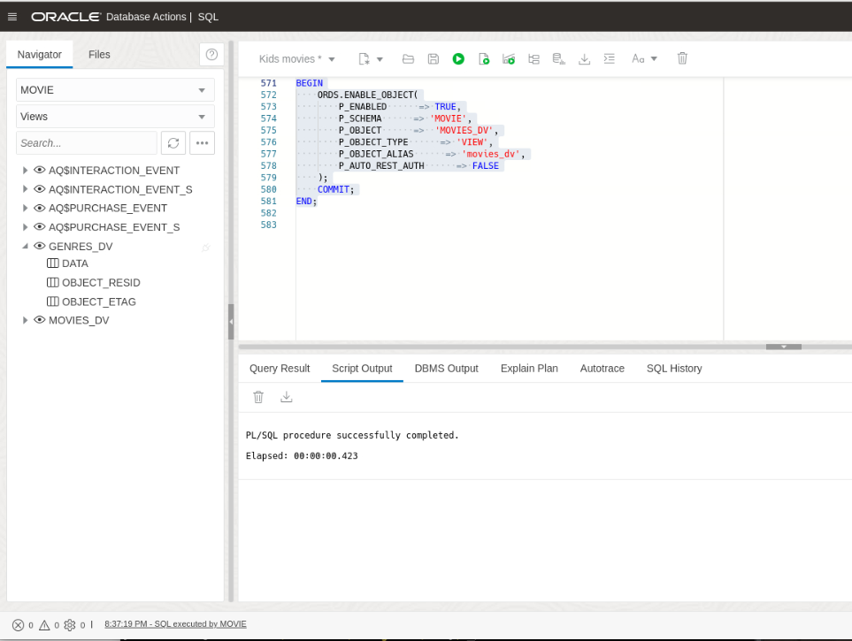
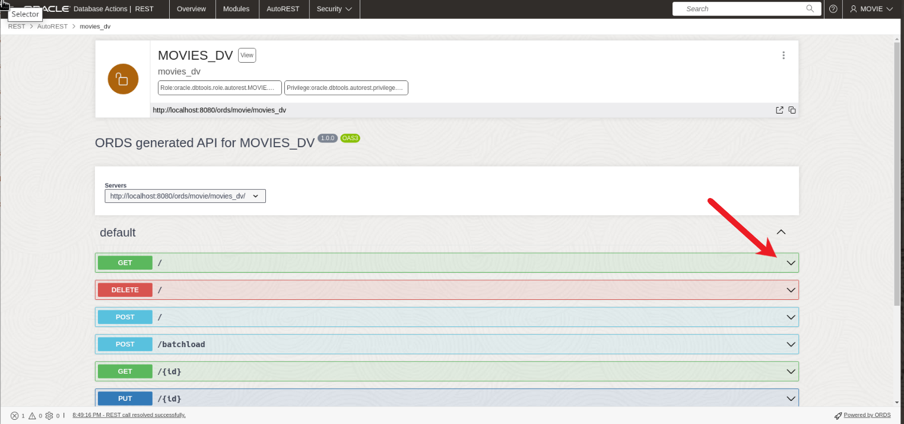
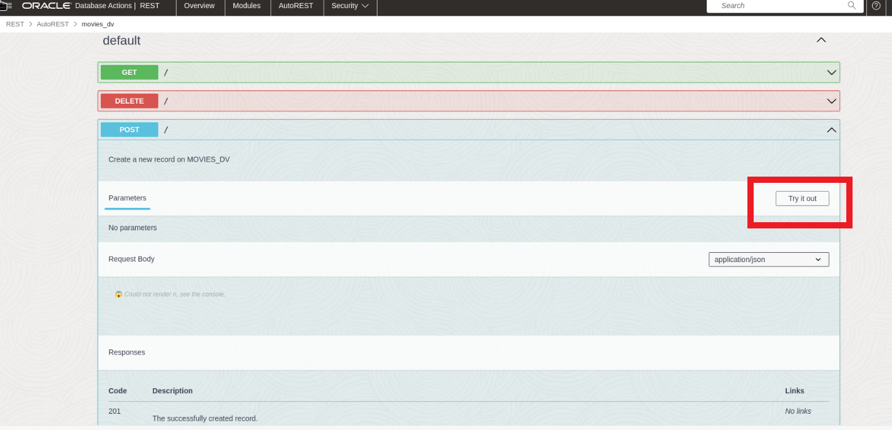

# Populate, Query, and Update Duality Views with REST

## Introduction

This lab focuses on populating, querying, and updating Duality Views in the Oracle Database 23ai database using REST calls. You will use REST calls to upload data into the database using JSON documents. It's important to note that when you make a POST request directly to a Duality View, the data is not stored within the view itself. Instead, the inserted data is stored in the underlying tables that make up the view.

Estimated Time: 10 minutes

[Lab 5](videohub:1_l54mu3jg)

### Objectives

In this lab, you will:

- Download the files used in this workshop. 
- Insert a document to `movies_dv`
- Query documents via GET


### Prerequisites

This lab assumes you have:

- Oracle Database 23ai Free Developer Release
- All previous labs successfully completed
- Oracle REST Data Service (ORDS) 23.1

## Task 1: Use OpenAPI to run REST Calls in an IDE

The ORDS installation includes SQL Developer Web, an online tool for managing your database. You can use OpenAPI within this tool to query your REST-enabled views using a graphical user interface (GUI). Follow these steps to use the IDE:

1. Open a browser and navigate to the following URL:

    ```
    <copy>http://localhost:8080/ords/sql-developer</copy>
    ```

    Log in using the username and password you set up for this workshop. In this case, our user is movie.

    

2. Click on **SQL** under the Development section. The first thing we want to do is enable REST on our Duality Views. Use the Oracle Database Actions Navigator on the left side of the screen, click the drop-down arrow for the box showing the Table objects, and select **Views**. Refer to the picture below.

    

3. Right click on the `GENRES_DV`, hover the mouse over **REST** and click **Enable** if it isn't already enabled. See the picture below NOTE: If it is enabled already, it will say Disable... instead. If you see Disable... you don't have to do anything. Skip to number 5.

    

4. The REST Enable Object side panel will appear. Select **Enable** to continue.

    

5. Lets do the same thing for the `MOVIES_DV`, but this time using PL/SQL. Copy the following code and Select **Run Script**.
    ```
    <copy>
    BEGIN
        ORDS.ENABLE_OBJECT(
            P_ENABLED      => TRUE,
            P_SCHEMA      => 'MOVIE',
            P_OBJECT      =>  'MOVIES_DV',
            P_OBJECT_TYPE      => 'VIEW',
            P_OBJECT_ALIAS      => 'movies_dv',
            P_AUTO_REST_AUTH      => FALSE
        );
        COMMIT;
    END;
    </copy>
    ```
    


6. Click on **Oracle** in the upper left-hand corner of the Database Actions page to return to the home screen. Click on **REST** and then click on **AutoREST**.

    

    

7. Now, for any of the views, click the three dots on the right and select **OpenAPI View**. Lets do this for the the `MOVIES_DV` view. 

    

8. Here, you can see the automatically configured REST calls that were enabled on the view.

    Expand the **GET** section. 

    

9. By default, this section shows sample parameters and responses. However, you can use it to try out the calls themselves.

    Click on **Try it out**. 

    

10. In the **q** field, enter the following query parameters: 

    ```
    <copy>{ "title": "Surfs Up" }</copy>
    ```

11. Click **Execute** to run the REST call with the given parameters. 

    

12. In the **Responses** section, you can now see that OpenAPI has built the call for you. You can see the cURL command and the request URL built from the query parameters you provided. Additionally, you can see the response from the server below, displaying information about the movie "Surfs Up".

    

## Task 2: Use POST REST Calls

1. Similar to the previous labs, let's add a new movie to our `MOVIES_DV` Duality View. This time, we will use the POST section.

    Expand the **POST** section.

    

2. Like the GET section, the POST section shows sample parameters and responses. Click on **Try it out** to test the calls.

    Click on **Try it out**. 
    

3. In the request body section, copy and paste the following code, and click **Run**:

    ```
    <copy>
    {"movie_id" : 4008,
                "title" : "The Wizard of Oz",
                "budget" : 2800000,
                "list_price" : 0,
                "year" : 1939,
                "runtime" : 112,
                "summary" : "The Wizard of Oz is a beloved classic that follows the magical journey of Dorothy, a young girl whisked away to the enchanting Land of Oz. With her loyal companions—a scarecrow, a tin man, and a cowardly lion—Dorothy embarks on a quest to find the great Wizard, hoping he can help her return home. Along the yellow brick road, they encounter fantastical creatures, face wicked witches, and discover the power of friendship and believing in oneself in this timeless tale of courage and self-discovery.",
                "genres" : 
                [
                    {
                    "genre_id" : 25,
                    "genre_name" : "Kids"
                    },
                    {
                    "genre_id" : 10,
                    "genre_name" : "Family"
                    },
                    {
                    "genre_id" : 18,
                    "genre_name" : "Adventure"
                    }
                ]}
    </copy>
    ```
    
4. After executing the POST request, you will receive a response indicating that the movie was successfully added to the `MOVIES_DV` Duality View.

    

In summary, this lab showcased the versatility of JSON Relational Duality Views, which provide the ability to seamlessly work with data in both JSON Document format and SQL Relational format. The changes made through these views are automatically synchronized with the corresponding documents and tables. This flexibility empowers developers to perform create, read, update, and delete operations efficiently across multiple documents and tables, streamlining data management and enhancing productivity.


## Learn More

- [JSON Relational Duality: The Revolutionary Convergence of Document, Object, and Relational Models](https://blogs.oracle.com/database/post/json-relational-duality-app-dev)
- [JSON Duality View documentation](https://docs.oracle.com/en/database/oracle/oracle-database/23/jsnvu/index.html)
- [Blog: Key benefits of JSON Relational Duality](https://blogs.oracle.com/database/post/key-benefits-of-json-relational-duality-experience-it-today-using-oracle-database-23c-free-developer-release)
- [ORDS Documentation](https://docs.oracle.com/en/database/oracle/oracle-rest-data-services/23.1/)

## Acknowledgements
* **Author** - Killian Lynch, Oracle Database Product Management, Product Manager
* **Contributors** - Dominic Giles, Oracle Database Product Management, Distinguished Product Manager
* **Last Updated By/Date** - Killian Lynch, Oracle Database Product Management, Product Manager, May 2023