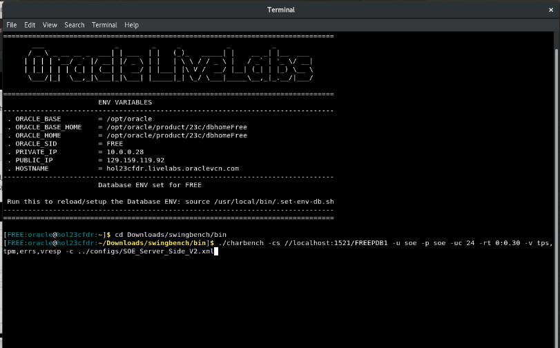

# Run Charbench

## Introduction

Welcome to Lab 3 of the "Swingbench Unleashed: Conquer Database Stress Testing" workshop! Now that you've run your stress test using Swingbench, it's time to dive into one of the other useful load generators in swingbench, charbench. In this lab, we'll take you on a journey through the capabilities of Charbench, an essential component of the Swingbench toolkit, designed to simulate and stress-test character-based applications against your database.

Charbench, a portmanteau of "Character" and "Benchmark," is a specialized feature within Swingbench that focuses on emulating character-based workloads typical of OLTP (Online Transaction Processing) environments. Character-based workloads are central to numerous industries, including e-commerce, customer relationship management, and enterprise resource planning, where rapid and constant interactions with databases are essential.

Estimated Time: 5 minutes

### Objectives

In this lab, you will:

* **Tool Familiarization:** Gain a solid understanding of the Swingbench toolkit, with a specific focus on Charbench. Learn about its features, capabilities, and how it fits into the broader context of database performance testing.
* **Executing Workloads:** Experience the process of running workloads using Charbench. Simulate high-concurrency scenarios and observe how Charbench generates a load that mirrors real user interactions with the database.
* **Performance Monitoring:** Discover how to monitor key performance metrics during workload execution. Learn which metrics are crucial for assessing database performance, such as response times, throughput, and resource utilization.

### Prerequisites

This lab assumes you have:

* Installed Oracle Database 23ai Free Developer Release
* Successfully completed all previous labs


## Task 1: Running Charbench

1. Here we are going to be running Charbench. Charbench is a character front end that enables the load generator to be be run where it is not possible/sensible to use a graphical front end. 

2. We are going to run the same workload on the database that we did with the swingbench front end. Copy and paste the following code. The connection string (-cs) is defined along with the userid (-u) and password (-p). This test will simulate 24 concurrent users (-uc) and have a runtime of 1 minute (-rt). The variables that will be displayed are denoted with a (-v) and the config (-c) file to be used will be SOE\_Server\_Side_V2.xml. 
    > Note: to check out all of the usage parameters available for charbench, type `./charbench -h`

    ```
    <copy>
    ./charbench -cs //localhost:1521/FREEPDB1 -u soe -p soe -uc 24 -rt 0:1.00 -v tps,tpm,errs,vresp -c ../configs/SOE_Server_Side_V2.xml 
	</copy>
    ```
	

## Task 2: The Results

1. The output can be found below. 

    

    The results we are seeing are very similar to the results we saw when we ran swingbench. The standard Swingbench application has great visuals and serves as a great tool. However, when launching it remotely, as the tool's operation can inadvertently introduce latency, which can impact the accuracy of results. To counter this, the charbench utility located within the bin directory offers a strategic solution. By leveraging this utility, the potential for result distortion due to latency can be eliminated, making it the choice for executing benchmarks programmatically and ensuring consistent outcomes in repeated testing scenarios.

Stress testing with charbench can be a good idea for several reasons: 

* Testing New Features: When a new feature or change is introduced in the Oracle database, users can use Charbench to test its impact on character-based processing. This helps in evaluating the feature's benefits and potential drawbacks before implementing it in a production environment.

* Benchmarking: Users can use Charbench to benchmark different Oracle database versions or hardware configurations. By comparing the performance of different setups using a consistent workload, you can make informed decisions about upgrades or changes in infrastructure.

* Troubleshooting: If the database is experiencing performance issues related to character processing, DBAs can use Charbench to recreate and isolate the problem. This can aid in identifying the root cause of the issue and devising appropriate solutions.


## Task 3: Bonus - The power of Swingbench 

1. Swingbench also allows you to customize and create your own benchmarks to run. You can do this three different ways:

    * Add or extend transactions using Java
    * PL/SQL by extending the PL/SQL that's shipped with the product
    * SQL Builder - A utility that lets you easily put together statements to build your own full blown benchmarks

    Here is a video on SQL Builder.

    [](https://www.youtube.com/watch?v=PzQpMFqO7KA)


In closing, this lab has to remain short for this session, but in the near future a more comprehensive LiveLab over all things Swingbench will be created and hosted online for free at https://livelabs.oracle.com/pls/apex/dbpm/r/livelabs/home


## Learn More

* [Swingbench](https://www.dominicgiles.com/index.html)


## Acknowledgements
* **Author** - Killian Lynch, Oracle Database Product Management, Product Manager
* **Contributors** - Dominic Giles, Oracle Database Product Management, Distinguished Product Manager
* **Last Updated By/Date** - Killian Lynch, Oracle Database Product Management, Product Manager, August 2023
