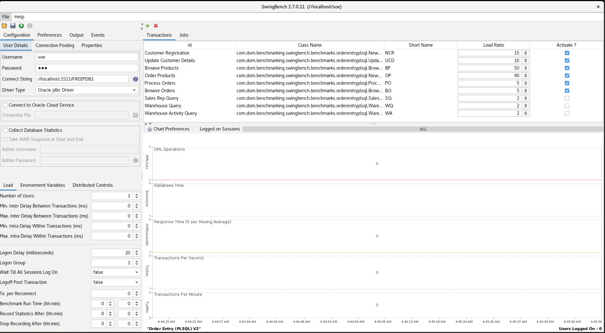

# Run Swingbench

## Introduction


In this lab, we're diving deeper into Swingbench as we guide you through the process of running your first stress test. Now that you have Swingbench configured and ready, it's time to unleash its power to simulate real-world workloads on your database system.

Stress testing is all about pushing your system to its limits and observing how it behaves under heavy loads. Swingbench will allow you to mimic user activities and transactions, giving you valuable insights into your database's performance characteristics. By the end of this lab, you'll have a stress test running and a wealth of data to analyze.


Estimated Time: 5 minutes

### Objectives

In this lab, you will:

* **Select a Benchmark:** Understand the available benchmark types in Swingbench and choose an appropriate one for your use case.
* **Configure Workload:** Customize workload parameters, including the number of users, transaction mix, and think time, to reflect real-world scenarios.
* **Initiate and Investigate the Stress Test:** Start a Swingbench stress test and monitor its progress within the tool and review the results.

### Prerequisites

This lab assumes you have:

* Installed Oracle Database 23ai Free Developer Release
* Successfully completed all previous labs


## Task 1: Running Swingbench

1. Swingbench currently has 3 front ends for running the workload generator. 
    * swingbench : Is a graphically rich frontend that enables you to modify all of the parameters as well as run and monitor the workloads.
    * minibench : Is a simpler frontend that enables you to run workloads and monitor them but the parameters must be set in the command line or by editing the config file.
    * charbench : Is a command line only tool where all of the parameters are set on the command line and metrics like latency and throughput are written to standard outputs or a file.

    

2. Today we will be looking at both Swingbench and the character bench (charbench). We'll start with running a workload using the graphically rich front end of Swingbench. Copy and paste the following code into the terminal to open the swingbench interface.
    ```
    <copy>
    ./swingbench 
    </copy>
    ```
    

3. When the interface opens, you will be prompted to select the configuration you would like swingbench to run. Because we installed the second version of the OE Schema, **select** SEO\_Server\_Side\_V2 and **Click** OK.

    

4. We are now looking at the swingbench User interface. The user interface is composed of three sections:
    * The configuration, Preferences, Outputs and events panel (top left hand side) is responsible for the entry and updating of parameters such as connect strings, number of simulated users, etc.
    * The transactions panel (top right hand section) is responsible for allowing users to enter and update the load to be executed by the simulated user sessions.
    * The graphing panel (bottom right hand), displays results such as transactions per minute and average response time.

        

5. The first thing we want to do is input our: Username, Password and Connect String. 
    * Username: soe
    * Password: soe
    * Connect String: //localhost:1521/FREEPDB1
    
    

6. Now lets **check the boxes for** Collect Database Statistic and the Take AWR Snapshot at Start and End. We will supply the Admin Username and password as follows:
    * Admin Username: system
    * Admin Password: Welcome123#

    

7. Now lets set out number of users. For this small demo, lets set the users to 24.

    

8. With swingbench we have the option to save the current state configuration. Lets quickly do that. Click the save configuration button as shown in the image below.

    

9. Now that we have that saved, lets see how that works. **Click** file and exit

    

10. Time to run the test. Copy and paste the following code into the terminal to open the swingbench interface.

    ```
    <copy>
    ./swingbench 
    </copy>
    ```
    

11. Click the play button in the upper left hand side of the screen to run the workload.

    


## Task 2: The Results


In the gif above we are seeing a couple things worth pointing out. 

* We have roughly 40 thousand transactions per minute hitting the database
* There are around 700 transactions per second being executed
* The database time shows us a two main things in this demo. We can see a dark green line at the very bottom and a light green line that covers most of the chart.
    * The dark green represents our CPU time, while the light green represents our scheduler. Why is it so schedule heavy? Remember, this is a demo environment that only has 4 cores available. Stress testing with Swingbench is designed to simulate real-world workloads on a database. This lab isn't about uncovering a demo scenario - rather, equipping you with the the understanding of how to stress test your own database. 

Stress testing with Swingbench can be a good idea for several reasons:

* Real-world Simulation: Swingbench is designed to simulate real-world workloads on a database. It generates a variety of transactions, queries, and data modifications that mimic what an actual application might do. This helps in understanding how the database performs under realistic conditions.

* Performance Evaluation: Stress testing helps in evaluating the performance of a database under heavy load. By subjecting the database to a high number of concurrent users and transactions, you can identify bottlenecks, resource limitations, and areas where performance might degrade.

* Capacity Planning: Swingbench can help you determine the capacity limits of your database. It allows you to test how the database performs when it approaches its maximum load capacity. This information is crucial for making informed decisions about hardware upgrades or scaling out the database infrastructure.

* Identifying Weak Points: Stress testing can help identify weak points in your database architecture, application design, and infrastructure setup. For instance, it might reveal issues with query optimization, indexing, or resource allocation that could go unnoticed under normal loads.

* Load Balancing and Failover Testing: Swingbench can be used to test the effectiveness of load balancing and failover mechanisms in a database cluster. This ensures that if one node fails, the workload is properly redistributed to other nodes without causing a major disruption in service.

* Database Tuning: Stress testing can uncover areas where database performance can be improved through tuning. By analyzing the performance metrics and response times during stress tests, you can adjust configuration settings, indexing strategies, and query optimization to enhance overall performance.

* Scalability Assessment: If you're planning to scale your application or database, stress testing can provide insights into how well your system can handle increased loads. It helps you understand if your architecture is scalable and whether additional resources are required to handle the expected growth.

* Quality Assurance: Incorporating stress testing as part of your quality assurance process helps ensure that your application and database can withstand unexpected spikes in usage, preventing crashes or slowdowns during peak times.

* Preventing Downtime: By identifying performance bottlenecks and potential issues in advance, you can proactively address them before they lead to system downtime or degraded user experience.

* Regulatory Compliance: In some industries, like finance or healthcare, stress testing might be required to meet regulatory standards and ensure the stability and security of the systems handling sensitive data.

Remember that stress testing should be conducted carefully, using realistic scenarios and properly monitored to avoid causing harm to your production environment. It's important to interpret the results in the context of your specific application and usage patterns, and to make informed decisions based on the insights gained from the testing process.

1. If you haven't done so already, you can stop the Swingbench load generator with the stop button in the top left hand of the screen

    

2. Exit from swingbench. **Click** file and exit

    

You may now **proceed to the next lab** 

## Learn More

* [About Swingbench](https://www.dominicgiles.com/swingbench/#about-swingbench)
* [About Order Entry in Swingbench](https://www.dominicgiles.com/swingbench/#setting-up)

## Acknowledgements
* **Author** - Killian Lynch, Oracle Database Product Management, Product Manager
* **Contributors** - Dominic Giles, Oracle Database Product Management, Distinguished Product Manager
* **Last Updated By/Date** - Killian Lynch, Oracle Database Product Management, Product Manager, August 2023

