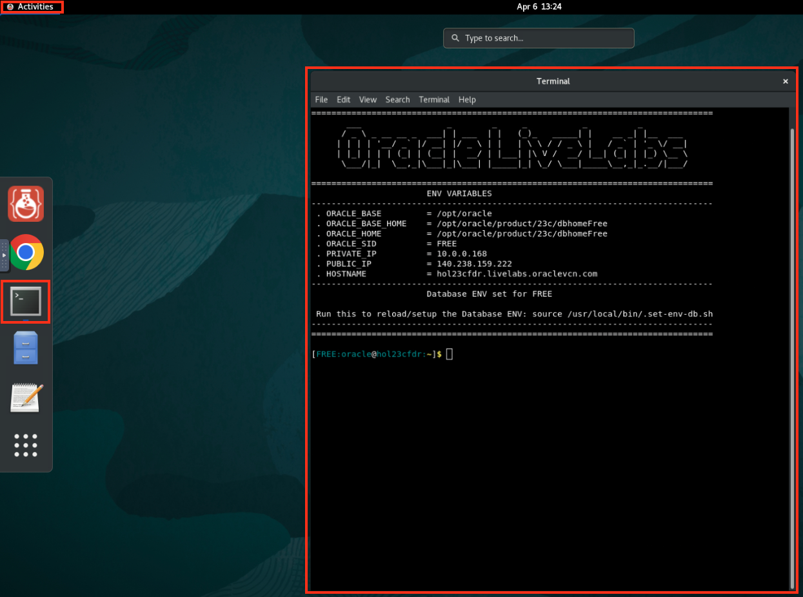
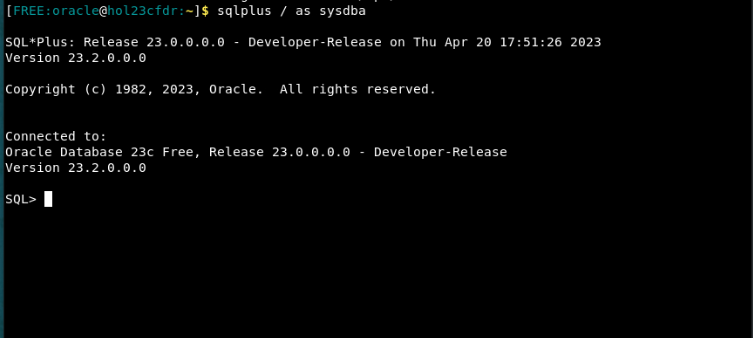
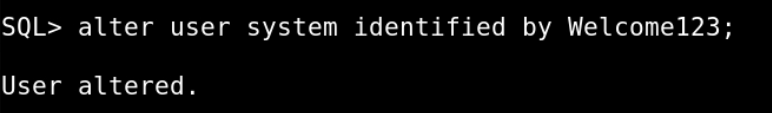

# Setup - User Creation and Table Initialization

## Introduction

In this lab, we will focus on setting up the necessary components for our Oracle database environment. We will create two users, User 1 and User 2, and initialize two tables under Schema 1.

By following the instructions provided, you will complete the setup process and have the necessary users and tables ready for further exploration in the Oracle live lab. Let's dive in and get started with Lab 1!

Estimated Time: 10 minutes

Watch the video below for a quick walk-through of the lab.

[Setup Tutorial](videohub:1_rkprm8hq)

### Objectives

* Create two users, User 1 and User 2, for the Oracle database environment.
* Initialize two tables under Schema 1: inventory\_no\_reservations and inventory\_reservations.
* Create the inventory\_no\_reservations table with the following columns: id, product\_name, quantity, and budget.
* Create the inventory\_reservations table with the following columns: id, product\_name, quantity, budget (reservable), and a minimum_balance constraint.
* Insert data into the inventory\_no\_reservations table with two rows: Product A and Product B.
* Insert data into the inventory\_reservations table with two rows: Product C and Product D.

### Prerequisites

In order to do this workshop you need
* An Oracle Database 23ai Free Developer Release Database or one running in a LiveLabs environment

## Task 1: Create Users

Task 1 involves creating the users. By executing the provided SQL statements, we will create User 1 and User 2, each with their respective passwords. These users will be used for various tasks in the upcoming labs.

1. The first step is to get to a command prompt. If you need to open a terminal and you are running in a Sandbox environment click on Activities and then Terminal.

    

2. Setup database users and environment

    * Login to sqlplus
    ```
    <copy>
    sqlplus / as sysdba
    </copy>
    ```
    

    * Change system user password

    ```
    <copy>
    alter user system identified by Welcome123;
    </copy>
    ```
    

    * Switch session from container database to pluggable database 1
    ```
    <copy>
    alter session set container = FREEPDB1;
    </copy>
    ```

    


    * Login to system user in pdb1

    ```
    <copy>
    CONNECT system/Welcome123@FREEPDB1
    </copy>
    ```

    * Create schema1, user 1 and user 2. You can use whatever password you want to select!

    ```
    <copy>
    CREATE USER s1 IDENTIFIED BY Welcome123;
    </copy>
    ```

    ```
    <copy>
    CREATE USER u1 IDENTIFIED BY Welcome123;
    </copy>
    ```

    ```
    <copy>
    CREATE USER u2 IDENTIFIED BY Welcome123;
    </copy>
    ```

    * Provide the following roles so the users can connect to the database, execute queries, and access database objects like so:

    ```
    <copy>
    GRANT CONNECT to u1;
    </copy>
    ```

    ```
    <copy>
    GRANT CREATE SESSION TO u1;
    </copy>
    ```

    ```
    <copy>
    GRANT CONNECT to u2;
    </copy>
    ```

## Task 2: Create two tables under Schema 1

Moving on to Task 2, we will create two tables under Schema 1. The first table, inventory\_no\_reservations, will serve as a normal table without any special features. The second table, inventory\_reservations, will be created with lock-free reservations. This feature enables efficient management of reservations for specific columns, and we will bind it to the 'budget' column in our case.

1. Create the first table. Table 1 would be inventory\_no\_reservations (normal table)

    ```
    <copy>
    CREATE TABLE s1.inventory_no_reservations (
      id NUMBER PRIMARY KEY,
      product_name VARCHAR2(50),
      quantity NUMBER,
      budget NUMBER
    );
    </copy>
    ```

2. Create a second table with lock-free reservations. Table 2 would be inventory\_reservations (lock free reservation table)

    * Create the table with the reservable keyword to enable lock free reservations to a specific column. In this case we bind it to the `budget` variable.

    ```
    <copy>
    CREATE TABLE s1.inventory_reservations (
      id NUMBER PRIMARY KEY,
      product_name VARCHAR2(50),
      quantity NUMBER,
      budget NUMBER reservable CONSTRAINT minimum_balance CHECK (budget >= 400)
    );
    </copy>
    ```

## Task 3: Insert a few rows into each

Task 3 focuses on inserting a few rows into each of the tables we created. We will insert data into the inventory\_no\_reservations table and the inventory\_reservations table. This step will provide us with initial data to work with in the subsequent labs.

1. Insert data into the first table:

    * Create unlimited quota on the tablespace
    ```
    <copy>
    ALTER USER s1 QUOTA UNLIMITED ON users;
    commit;
    </copy>
    ```

    * Inserting rows into inventory\_no\_reservations table

    ```
    <copy>
    INSERT INTO s1.inventory_no_reservations
    VALUES
    (1, 'Product A', 10, 700), 
    (2, 'Product B', 5, 200);
    commit;
    </copy>
    ```


2. Insert data into the second table:

    * Inserting rows into inventory\_reservations table

    ```
    <copy>
    INSERT INTO s1.inventory_reservations
    VALUES
    (1, 'Product C', 8, 1000), 
    (2, 'Product D', 3, 500);
    commit;
    </copy>
    ```

You many now **proceed to the next lab**

## Acknowledgements

* **Author(s)** - Blake Hendricks, Database Product Manager
* **Contributor(s)** - Vasudha Krishnaswamy, Russ Lowenthal, Vijay Balebail
* **Last Updated By/Date** - 7/17/2023