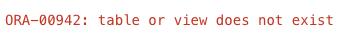

# Power Up with 23ai SQL Features

## Introduction

In this lab, we'll explore the power of SQL Features in Oracle's Database 23ai Free - Developer Release. We'll visit 10 features you need to know, and how they compare to their existing counterparts.

Estimated Time: 10 minutes

### Objectives

In this lab, you will practice these 10 features:
* FROM clause - now optional
* Boolean for SQL
* IF [NOT] EXISTS DDL clause
* Multivalue INSERTs
* New table value constructor
* Aliases in GROUP BY clause
* RETURNING clause of UPDATE and MERGE statement
* Joins in UPDATE and DELETE
* Annotations - new metadata for database objects
* "Lightweight object types" with SQL Domains

> Note: the order of the feature list does not reflect any ranking of importance.

### Prerequisites

This lab assumes you have:
* Oracle Database 23ai Free Developer Release
* All previous labs successfully completed

[SQL 23ai Features walkthrough](videohub:1_7ggddw60)
## Task 1: Start SQL*Plus
To dive into these features, we'll be using SQL*Plus - an interactive and batch query tool that is installed with every Oracle Database installation. It has a command-line user interface.

1. From the terminal, enter this line:
    <if type="sql-features">
    ```
    sqlplus hol23c/[your_password_here]@localhost:1521/freepdb1
    ```
    We used the password Welcome123, but change [your\_password\_here] to match yours.
    ```
    <copy>
    sqlplus hol23c/Welcome123@localhost:1521/freepdb1
    </copy>
    ```
    </if>
    <if type="23c-install">
    ```
    sqlplus hol23c/[your_password_here]@localhost:1521/freepdb1
    ```
    We used the password Welcome123#, but change [your\_password\_here] to match yours.
    ```
    <copy>
    sqlplus hol23c/Welcome123#@localhost:1521/freepdb1
    </copy>
    ```
    </if>
## Task 2: FROM clause - now optional
An interesting feature introduced in Oracle Database 23ai is optionality of FROM clause in SELECT statements. Up to this version the FROM clause was obligatory.

1. For example, consider the following statement:
    ```
    SELECT sysdate;
    ```

    Executed in an Oracle Database version earlier than 23ai will, it will return the following error:
    ```
    ERROR at line 1:
    ORA-00923: FROM keyword not found where expected
    ```

    However, in Oracle Database 23ai we can successfully execute the statement. Try now in SQL*Plus.
    ```
    <copy>SELECT sysdate;</copy>
    ```

    Success! This feature ensures better compatibility across databases.
    ```
    SYSDATE
    ---------
    04-APR-23
    ```

## Task 3: Boolean for SQL

Oracle Database 23ai introduces the new BOOLEAN datatype. This leverages the use of true boolean columns/variables, instead of simulating them with a numeric value or varchar. The ability to write boolean predicates simplifies the syntax of SQL statements.

1. To see this in action, let's first, we'll create a table called TEST_BOOLEAN.
    ```
    <copy>
    CREATE TABLE TEST_BOOLEAN (name VARCHAR2(100), IS_SLEEPING BOOLEAN);
    </copy>
    Table created.​
    ```

2. Let's fill our new table with data. The value `IS_SLEEPING` will be `NOT NULL` set to `FALSE` as default.
    ```
    <copy>ALTER TABLE TEST_BOOLEAN modify (IS_SLEEPING boolean NOT NULL);
    </copy>
    Table altered.
    ```
    ```
    <copy>ALTER TABLE TEST_BOOLEAN modify (IS_SLEEPING default FALSE);
    </copy>
    Table altered.
    ```
    Here, you can see the different types of Boolean input for Mick, Keith, and Ron. All are valid.
    This one uses the default "FALSE" value - Mick is not sleeping.
    ```
    <copy>INSERT INTO TEST_BOOLEAN (name) values ('Mick');</copy>
    ​1 row created.​
    ```
    This one uses a "NO" value - Keith is not sleeping.
    ```
    <copy>INSERT INTO TEST_BOOLEAN (name, is_sleeping) values ('Keith','NO');</copy>
    ​1 row created.
    ```
    This row uses a "1" value - Ron is sleeping.
    ```
    <copy>INSERT INTO TEST_BOOLEAN (name, is_sleeping) values ('Ron',1);</copy>
    1 row created.
    ```

3. Now let's see the see some results based on our Boolean values.
    ```
    <copy>SELECT name FROM test_boolean WHERE NOT is_sleeping;</copy>
    NAME
    --------------------------------------------------------------------------------
    Mick
    Keith
    ```

    ```
    <copy>set linesize window
    SELECT * FROM test_boolean;</copy>
    ```
    ```
    NAME                                                                                                 IS_SLEEPING
    ------------------------------------------------------------------------------------------------ -----------
    Mick                                                                                                 FALSE
    Keith                                                                                                FALSE
    Ron                                                                                                  TRUE
    ```

    You no longer need to remember what kind of boolean system you put in place. As we've shown, using 0/1, True/False, Yes/No, or any other common inputs will return an accurate table value.

## Task 4: IF [NOT] EXISTS DDL clause

​Starting with Oracle Database 23ai, the new "IF [NOT] EXISTS" DDL clause allows to decide how DDL errors will be handled. This simplifies the DDL scripting, as potential errors due to objects existence or inexistence can be hidden to the scripting.
1. First, let's test without using this new feature. Enter and run the following statement:
    ```
    <copy>
    DROP TABLE DEPT;
    </copy>
    ```
    Since there is no existing DEPT table to drop, we'll see an error.
    

2. However, in 23ai we're able to use `DROP IF EXISTS` without an error. This gives us peace of mind while avoiding errors. Let's run the same statement, but include this new IF EXISTS feature.
    ```
    <copy>
    DROP TABLE IF EXISTS DEPT;
    </copy>
    ```

3. Similarly, we can use this feature to create tables, if they do not already exist. Let's go ahead and create that DEPT table.
    >NOTE: Any trailing numbers when pasting these into the terminal will not effect the command.

    ```
    <copy>
    CREATE TABLE IF NOT EXISTS DEPT
        (DEPTNO NUMBER(2) CONSTRAINT PK_DEPT PRIMARY KEY,
        DNAME VARCHAR2(14) ,
        LOC VARCHAR2(13) ) ;
    </copy>
    ```

4. Let's continue using this feature to create more sample tables throughout this lab. Here, we'll make an employee table called EMP.
    ```
    <copy>
    CREATE TABLE IF NOT EXISTS EMP
        (EMPNO NUMBER(4) CONSTRAINT PK_EMP PRIMARY KEY,
        ENAME VARCHAR2(10),
        JOB VARCHAR2(9),
        MGR NUMBER(4),
        HIREDATE DATE,
        SAL NUMBER(7,2),
        COMM NUMBER(7,2),
        DEPTNO NUMBER(2) CONSTRAINT FK_DEPTNO REFERENCES DEPT);
    </copy>
    ```

## Task 5: Multivalue INSERTs

Another interesting feature ensuring better coexistence and compatibility with other frequently used database management systems is multivalue `INSERT` statement.
1. In previous versions of Oracle database, as an example, inserting multiple rows required a separate insert statement for each:
    ```
    INSERT INTO DEPT VALUES (10,'ACCOUNTING','NEW YORK');
    INSERT INTO DEPT VALUES (20,'RESEARCH','DALLAS');
    INSERT INTO DEPT VALUES (30,'SALES','CHICAGO');
    INSERT INTO DEPT VALUES (40,'OPERATIONS','BOSTON');
    INSERT INTO DEPT VALUES (50,'HR','LOS ANGELES');
    INSERT INTO DEPT VALUES (60,'IT','SAN FRANCISCO');
    INSERT INTO DEPT VALUES (70,'MANUFACTURING','DETROIT');
    ```

    Oracle Database 23ai introduced the new syntax allowing for inserting all these rows in a single one `INSERT` statement, so you may insert several tuples in one DML. Enter and run the following:
    ```
    <copy>
    INSERT INTO DEPT VALUES (10,'ACCOUNTING','NEW YORK'),
        (20,'RESEARCH','DALLAS'),
        (30,'SALES','CHICAGO'),
        (40,'OPERATIONS','BOSTON'),
        (50,'HR','LOS ANGELES'),
        (60,'IT','SAN FRANCISCO'),
        (70,'MANUFACTURING','DETROIT');
    </copy>
    ```

    In addition to better compatibility with other databases, this statement can be used to ensure consistency of some insert operations in auto-commit mode. This could be important, for example, for APEX applications using this mode to work on data.

2. Use this feature to fill in values for the EMP table.
    ```
    <copy>
    INSERT INTO EMP VALUES
        (7369,'SMITH','CLERK',7902,to_date('17-12-1980','dd-mm-yyyy'),800,NULL,20),
        (7499,'ALLEN','SALESMAN',7698,to_date('20-2-1981','dd-mm-yyyy'),1600,300,30),
        (7521,'WARD','SALESMAN',7698,to_date('22-2-1981','dd-mm-yyyy'),1250,500,30),
        (7566,'JONES','MANAGER',7839,to_date('2-4-1981','dd-mm-yyyy'),2975,NULL,20),
        (7654,'MARTIN','SALESMAN',7698,to_date('28-9-1981','dd-mm-yyyy'),1250,1400,30),
        (7698,'BLAKE','MANAGER',7839,to_date('1-5-1981','dd-mm-yyyy'),2850,NULL,30),
        (7782,'CLARK','MANAGER',7839,to_date('9-6-1981','dd-mm-yyyy'),2450,NULL,10),
        (7788,'SCOTT','ANALYST',7566,to_date('13-JUL-87')-85,3000,NULL,20),
        (7839,'KING','PRESIDENT',NULL,to_date('17-11-1981','dd-mm-yyyy'),5000,NULL,10),
        (7844,'TURNER','SALESMAN',7698,to_date('8-9-1981','dd-mm-yyyy'),1500,0,30),
        (7876,'ADAMS','CLERK',7788,to_date('13-JUL-87')-51,1100,NULL,20),
        (7900,'JAMES','CLERK',7698,to_date('3-12-1981','dd-mm-yyyy'),950,NULL,30),
        (7902,'FORD','ANALYST',7566,to_date('3-12-1981','dd-mm-yyyy'),3000,NULL,20),
        (7934,'MILLER','CLERK',7782,to_date('23-1-1982','dd-mm-yyyy'),1300,NULL,10);
    </copy>
    ```

## Task 6: New table value constructor

Starting from Oracle database 23ai, table values constructor has been extended. It can now be used in `INSERT` statements, to create several rows in a single command. It can also be used in `SELECT` statements, and in the view factorization syntax. In this last case, it simplifies the syntax of the statements, and avoid using the `DUAL` table.

1. The following statement looks like a kind of table function on the fly.
    ```
    <copy>SELECT * FROM (VALUES (50,'HR'), (60,'DEV'), (70,'AI')) virt_dept (deptno, dname);</copy>

        DEPTNO DNA
    ---------- ---
            50 HR
            60 DEV
            70 AI
    ```

## Task 7: Aliases in GROUP BY clause

Oracle Database 23ai, among of a lot of other features, introduces the ability to use aliases in GROUP BY clause of a SELECT statement. This feature simplifies writing queries with complex expressions as well as ensures better compatibility with some other relational databases, like Teradata, MySQL and PostgreSQL.
1. For example:

    ```
    SELECT to_char(hiredate,'YYYY') "Year", count(*)
    FROM emp
    GROUP BY to_char(hiredate,'YYYY');
    ```

    In Oracle Database 23ai this can be written in a bit simpler way:

    ```
    <copy>
    SELECT to_char(hiredate,'YYYY') "Year", count(*)
    FROM emp
    GROUP BY "Year";
    </copy>
    ```

    The result:

    ```
    Year   COUNT(*)
    ---- ----------
    1981         10
    1987          2
    1980          1
    1982          1
    ```

## Task 8: RETURNING clause of UPDATE and MERGE statement

This clause has been implemented long ago as a part of `EXECUTE IMMEDIATE` statement. However in Oracle Database 23ai we can find it as a part of traditional, static DML statements.
1. In this case it allows for obtaining old and new values of columns from a row processed by such statement:
    ```
    <copy>SELECT ename, sal FROM emp WHERE ename = 'KING';</copy>

    ENAME             SAL
    ---------- ----------
    KING             5000
    ```

    ```
    <copy>VARIABLE old_salary NUMBER;
    </copy>
    ```
    ```
    <copy>
    VARIABLE new_salary NUMBER;
    </copy>
    ```
    ```
    <copy>
    UPDATE emp
        SET sal=sal+1000
        WHERE ename = 'KING'
        RETURNING OLD sal, NEW sal into :old_salary, :new_salary;
    </copy>
    1 row updated.
    ```

    ```
    <copy>
    PRINT old_salary;
    </copy>
    OLD_SALARY
    ----------
        5000
    ```

    ```
    <copy>
    PRINT new_salary;
    </copy>
    NEW_SALARY
    ----------
        6000
    ```

## Task 9: Joins in UPDATE and DELETE

You may update table data via joins - based on foreign table conditions. There is no need for sub selects or `IN` clause.
1. Let's take a look at the employee salary information from the research department.
    ```
    <copy>select e.sal, e.empno from emp e, dept d where e.deptno=d.deptno and d.dname='RESEARCH';</copy>
    ```

2. Now to update the salary information, prior to 23ai we would need to use a nested statement:
    ```
    UPDATE emp e set e.sal=e.sal*2
    WHERE e.deptno in
    (SELECT d.deptno FROM dept d WHERE e.deptno=d.deptno
    and d.dname='RESEARCH');
    ```

    With Oracle Database 23ai, you can now use:
    ```
    <copy>UPDATE emp e set e.sal=e.sal*2
    FROM dept d
    WHERE e.deptno=d.deptno
    and d.dname='RESEARCH';</copy>
    5 rows updated.
    ```

3. You can see the salary has been successfully updated.
    ```
    <copy>select e.sal, e.empno from emp e, dept d where e.deptno=d.deptno and d.dname='RESEARCH';</copy>
    ```

## Task 10: Annotations, new metadata for database objects

Annotations are optional meta data for database objects. An annotation is either a name-value pair or name by itself. The name and optional value are freeform text fields.  An annotation is represented as a subordinate element to the database object to which the annotation has been added. Supported schema objects include tables, views, materialized views, and indexes. With annotations you may store and retrieve metadata about a database objects. You can use it to customize business logic, user interfaces or provide metada to metatdata repositories. It can be added with CREATE or ALTER statement. - on table or column level.
With annotations you may store and retrieve metadata about a database objects. You can use it to customize business logic, user interfaces or provide metadata to metadata repositories.

1. Let's create an annotated table `EMP_ANNOTATED` with column and table annotations.

    ```
    <copy>
    CREATE TABLE emp_annotated
    (empno number annotations(identity, display 'person_identity', details 'person_info'),
    ename varchar2(50),
    salary number annotations (display 'person_salary', col_hidden))
    annotations (display 'employee_table');
    </copy>
    ```

    These will help to format the output.
    ```
    <copy>
    set lines 200;
    set pages 200;
    col object_name format a25;
    col object_type format a15;
    col annotation_name format a15;
    col annotation_value format a15;
    col column_name format a20;
    </copy>
    ```

2. Data Dictionary views such as `USER_ANNOTATIONS` and `USER_ANNOTATIONS_USAGE` can help to monitor the usage.
    ```
    <copy>
    SELECT object_name, object_type, column_name, annotation_name, annotation_value
    FROM user_annotations_usage;
    </copy>
    ```

## Task 11: "Light weight object types" with SQL Domains

A SQL domain is a dictionary object that belongs to a schema and encapsulates a set of optional properties and constraints and is created with a `CREATE DOMAIN` statement. Domains provide constraints, display, ordering and annotations attributes. After you define a SQL domain, you can define table columns to be associated with that domain, thereby explicitly applying the domain's optional properties and constraints to those columns.
SQL Domains allow users to declare the intended usage for columns. They are data dictionary objects so that abstract domain specific knowledge can be easily reused.

1. We'll look at these in more detail in the next lab, but for now, let's try a quick example. We'll create a domain named `yearbirth` and table named `person`.
    Domain creation is for admin level users. First, exit from sql*plus, then log in as sysdba.
    ```
    <copy>
    exit
    </copy>
    ```
    ```
    <copy>
    sqlplus / as sysdba
    </copy>
    ```
    Set the correct container.
    ```
    <copy>alter session set container=FREEPDB1;</copy>
    Session altered.
    ```

2. Grant privileges to our main user `hol23c` to create domains.
    ```
    <copy>grant db_developer_role to hol23c;</copy>
    Grant succeeded.
    ```
    Connect to hol23c. Replace _`Welcome123`_ with the password you created in Lab 1.
    ```
    <copy>connect hol23c/Welcome123@localhost:1521/freepdb1</copy>
    Connected.
    ```

3. Now create the domain `yearbirth` and the table `person`.
    ```
    <copy>CREATE DOMAIN yearbirth as number(4)
        constraint check ((trunc(yearbirth) = yearbirth) and (yearbirth >= 1900))
        display (case when yearbirth < 2000 then '19-' ELSE '20-' end)||mod(yearbirth, 100)
        order (yearbirth -1900)
        annotations (title 'yearformat');
        </copy>
    Domain created.
    ```
    ```
    <copy>
    CREATE TABLE person
        (id number(5),
        name varchar2(50),
        salary number,
        person_birth number(4) DOMAIN yearbirth
        )
        annotations (display 'person_table');
    </copy>
    Table created.
    ```
    ```
    <copy>desc person;</copy>
    ```

    ```
    Name					                   Null?    Type
    ----------------------------------------- -------- ----------------------------
    ID                                                  NUMBER(5)
    NAME						                        VARCHAR2(50)
    SALARY                                              NUMBER
    PERSON_BIRTH					                    NUMBER(4) HOL23C.YEARBIRTH
    ```

4. Now let's add data to our table.
    ```
    <copy>INSERT INTO person values (1,'MARTIN',3000, 1988);</copy>
    ```

5. With the new function `DOMAIN_DISPLAY` you can display the property.
    ```
    <copy>SELECT DOMAIN_DISPLAY(person_birth) FROM person;</copy>
    ```

    ```
    DOMAIN_DISPLAY(PERSON_BIRTH)
    -------------------------------------------
    19-88
    ```

6. Domain usage and Annotations can be monitored with data dictionary views. First we'll set some formatting, then view `user_annotations_usage`.
    ```
    <copy>
    set lines 200;
    set pages 200;
    col object_name format a15;
    col object_type format a12;
    col annotation_name format a15;
    col annotation_value format a20;
    col column_name format a15;
    col domain_name format a12;
    col domain_owner format a12;
    </copy>
    ```
    ```
    <copy>SELECT * FROM user_annotations_usage;</copy>
    ```
    ```
    OBJECT_NAME	OBJECT_TYPE  COLUMN_NAME     DOMAIN_NAME  DOMAIN_OWNER ANNOTATION_NAME	ANNOTATION_VALUE
    --------------- ------------ --------------- ------------ ------------ --------------- --------------------
    EMP_ANNOTATED   TABLE                                                   DISPLAY
    employee_table
    PERSON          TABLE                                                   DISPLAY
    person_table
    EMP_ANNOTATED   TABLE	     EMPNO                                     IDENTITY
    EMP_ANNOTATED   TABLE	     EMPNO                                     DISPLAY
    person_identity
    EMP_ANNOTATED   TABLE	     EMPNO                                     DETAILS
    person_info
    EMP_ANNOTATED   TABLE	     SALARY                                    DISPLAY
    person_salary
    EMP_ANNOTATED   TABLE	     SALARY                                    COL_HIDDEN
    YEARBIRTH       DOMAIN                                                  TITLE
    yearformat
    PERSON          TABLE	     PERSON_BIRTH    YEARBIRTH	  HOL23C     TITLE
    yearformat
    ```

## Learn More

* [SQL Language Reference](https://docs.oracle.com/en/database/oracle/oracle-database/23/sqlrf/index.html)
* [Database Development Guide](https://docs.oracle.com/en/database/oracle/oracle-database/23/adfns/registering-application-data-usage-database.html#GUID-6F630041-B7AE-4183-9F97-E54682CA6319)
* [Blog: Oracle Database 23ai Free Developer Release - 10 features you should know](https://blogs.oracle.com/coretec/post/oracle-database-23c-free-developer-sql)
* [Blog: Introducing Oracle Database 23ai Free – Developer Release](https://blogs.oracle.com/database/post/oracle-database-23c-free)
* [Oracle Database Free - Developer Release User Forum](https://forums.oracle.com/ords/apexds/domain/dev-community/category/oracle-database-free)
* [Oracle Database 23ai Free—Developer Release Product Site](https://www.oracle.com/database/free/)
* [Oracle Database New Features](https://docs.oracle.com/en/database/oracle/oracle-database/23/nfcoa/introduction.html#GUID-C852CD78-8F16-4449-8BE0-D85C80D38E3C)
* [Permitted Database Offering](https://docs.oracle.com/en/database/oracle/oracle-database/23/dblic/Licensing-Information.html#GUID-0F9EB85D-4610-4EDF-89C2-4916A0E7AC87)

## Acknowledgements
* **Author** - Ulrike Schwinn, Distinguished Data Management Expert; Hope Fisher, Program Manager
* **Contributors** - Witold Swierzy, Data Management Expert; Stephane Duprat, Technical End Specialist
* **Last Updated By/Date** - Hope Fisher, Oct 2023