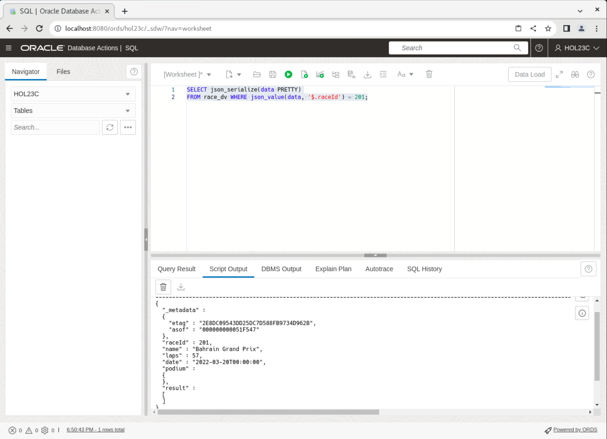
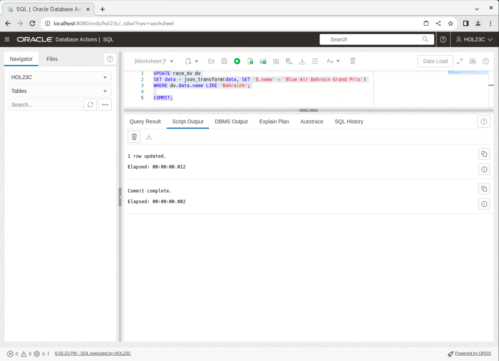
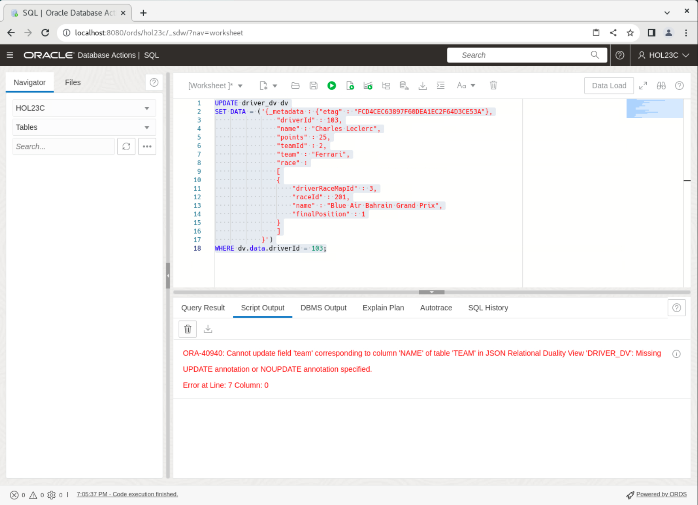

# Working with JSON and the Duality Views

## Introduction

This lab walks you through the steps to work with JSON documents in the Oracle Database 23ai database. We'll show you how to populate the tables and subsequent duality views, as well as filter, replace, fetch, update, and delete JSON documents by predicates. Finally, we'll let you test out non-updateable fields.

Estimated Time: 10 minutes

### Objectives

In this lab, you will:
* Populate the duality views
* Work with JSON documents and predicates
* Test non-updateable fields

### Prerequisites

This lab assumes you have:
* Oracle Database 23ai Free Developer Release
* All previous labs successfully completed
* SQL Developer Web 23.1 or a compatible tool for running SQL statements


## Task 1: Find documents matching a filter (aka predicate)

1. To find race info by raceId, you can use JSON functions, such as json\_value and json\_exists in predicates when querying duality views.

    You can also use simplified dot notation in predicates, but this will be explored later in the lab. The json\_exists function is more powerful than json\_value in terms of the conditions it can express and is used by the REST interface to translate query by examples. Copy the SQL below and click **Run Script**.

    ```
    <copy>
    SELECT json_serialize(data PRETTY)
    FROM race_dv WHERE json_value(data, '$._id') = 201;
    </copy>
    ```

    

## Task 2: Replace and fetch a document by ID

1. Announce results for the Bahrain Grand Prix by updating the appropriate race entry with the details after the race.

    Note that the "etag" value supplied in the content is used for "out-of-the-box" optimistic locking, to prevent the well-known "lost update" problem that can occur with concurrent operations. During the replace by ID operation, the database checks that the eTag provided in the replacement document matches the latest eTag of the target duality view document.

    If the eTags do not match, which can occur if another concurrent operation updated the same document, an error is thrown. In case of such an error, you can reread the updated value (including the updated eTag), and retry the replace operation again, adjusting it (if desired) based on the updated value. 
    
    In other words, you may have to adjust the update statement so that the etag matches the etag from the select statement above. Copy the SQL below and click **Run Script**.

    ```
    <copy>
    UPDATE race_dv
    SET data = ('{"_metadata": {"etag" : "2E8DC09543DD25DC7D588FB9734D962B"},
                    "_id" : 201,
                    "name"   : "Bahrain Grand Prix",
                    "laps"   : 57,
                    "date"   : "2022-03-20T00:00:00",
                    "podium" :
                    {"winner"         : {"name" : "Charles Leclerc",
                                        "time" : "01:37:33.584"},
                    "firstRunnerUp"  : {"name" : "Carlos Sainz Jr",
                                        "time" : "01:37:39.182"},
                    "secondRunnerUp" : {"name" : "Lewis Hamilton",
                                        "time" : "01:37:43.259"}},
                    "result" : [ {"driverRaceMapId" : 3,
                                "position"        : 1,
                                "driverId"        : 103,
                                "name"            : "Charles Leclerc"},
                                {"driverRaceMapId" : 4,
                                "position"        : 2,
                                "driverId"        : 104,
                                "name"            : "Carlos Sainz Jr"},
                                {"driverRaceMapId" : 9,
                                "position"        : 3,
                                "driverId"        : 106,
                                "name"            : "Lewis Hamilton"},
                                {"driverRaceMapId" : 10,
                                "position"        : 4,
                                "driverId"        : 105,
                                "name"            : "George Russell"} ]}')
    WHERE json_value(data, '$._id') = 201;

    COMMIT;
    </copy>
    ```
    
2. Now see the updated results for the Bahrain Grand Prix. Copy the SQL below and click **Run Script**.

    ```
    <copy>
    SELECT json_serialize(data PRETTY)
    FROM race_dv WHERE json_value(data, '$._id') = 201;
    </copy>
    ```
    

## Task 3: Update specific fields in the document identified by a predicate

1. Now we'll update the Bahrain Grand Prix's name with sponsor information. Here we use json\_transform to update specific fields.

    An alternative approach is to use json_mergepatch, which is standardized, but is limited to simple object field updates and cannot be used for updating specific array elements. The json\_transform function, however, can be used to update specific array elements.

    **Note:** We are using the dv.data.name in this example. This is just another way to access values. Copy the SQL below and click **Run Script**.

    ```
    <copy>
    UPDATE race_dv dv
    SET data = json_transform(data, SET '$.name' = 'Blue Air Bahrain Grand Prix')
    WHERE dv.data.name LIKE 'Bahrain%';

    COMMIT;
    </copy>
    ```
    

2. Select from the view to ensure the change is in. In this example we are also showing that you can use json_value in the where clause. Copy the SQL below and click **Run Script**.

    ```
    <copy>
    SELECT json_serialize(data PRETTY)
    FROM race_dv WHERE json_value(data, '$.name') LIKE 'Blue Air Bahrain%';
    </copy>
    ```
    

## Task 4: Re-parenting of sub-objects between two documents
Switch Charles Leclerc's and George Russell's teams. This can be done by updating the Mercedes and Ferrari team_dvs. The documents can be updated by simply sending the new list of drivers for both documents in the input.

1. First, show the team documents. Copy the SQL below and click **Run Script**.

    ```
    <copy>
    SELECT json_serialize(data PRETTY) FROM team_dv dv
    WHERE dv.data.name LIKE 'Mercedes%';
    SELECT json_serialize(data PRETTY) FROM team_dv dv
    WHERE dv.data.name LIKE 'Ferrari%';
    </copy>
    ```
    

2. Then perform the updates. Copy the SQL below and click **Run Script**.

    ```
    <copy>
    UPDATE team_dv dv
    SET data = ('{_metadata : {"etag" : "855840B905C8CAFA99FB9CBF813992E5"},
                    "_id" : 2,
                    "name"   : "Mercedes",
                    "points" : 40,
                    "driver" : [ {"driverId" : 106,
                                "name"     : "Lewis Hamilton",
                                "points"   : 15},
                                {"driverId" : 103,
                                "name"     : "Charles Leclerc",
                                "points"   : 25} ]}')
        WHERE dv.data.name LIKE 'Mercedes%';

    UPDATE team_dv dv
    SET data = ('{_metadata : {"etag" : "DA69DD103E8BAE95A0C09811B7EC9628"},
                    "_id" : 302,
                    "name"   : "Ferrari",
                    "points" : 30,
                    "driver" : [ {"driverId" : 105,
                                "name"     : "George Russell",
                                "points"   : 12},
                                {"driverId" : 104,
                                "name"     : "Carlos Sainz Jr",
                                "points"   : 18} ]}')
        WHERE dv.data.name LIKE 'Ferrari%';

    COMMIT;
    </copy>
    ```
    

3. Then show the team documents after the updates, you'll see that the former teams with Mercedes have now been swapped to Ferrari and vice versa. Copy the SQL below and click **Run Script**.

    ```
    <copy>
    SELECT json_serialize(data PRETTY) FROM team_dv dv
    WHERE dv.data.name LIKE 'Mercedes%';

    SELECT json_serialize(data PRETTY) FROM team_dv dv
    WHERE dv.data.name LIKE 'Ferrari%';
    </copy>
    ```
    

4. Show the driver documents after the updates as well. Copy the SQL below and click **Run Script**.
    ```
    <copy>
    SELECT json_serialize(data PRETTY) FROM driver_dv dv
    WHERE dv.data.name LIKE 'Charles Leclerc%';

    SELECT json_serialize(data PRETTY) FROM driver_dv dv
    WHERE dv.data.name LIKE 'George Russell%';
    </copy>
    ```
    


## Task 5: Update a non-updateable field

1. Update team for a driver through driver\_dv. This will throw an error as we specified the JSON Duality View to not allow this field to be updatable through driver_dv. Copy the SQL below and click **Run Script**.

    ```
    <copy>
    UPDATE driver_dv dv
    SET DATA = ('{_metadata : {"etag" : "FCD4CEC63897F60DEA1EC2F64D3CE53A"},
                    "_id" : 103,
                    "name" : "Charles Leclerc",
                    "points" : 25,
                    "teamId" : 2,
                    "team" : "Ferrari",
                    "race" :
                    [
                    {
                        "driverRaceMapId" : 3,
                        "raceId" : 201,
                        "name" : "Blue Air Bahrain Grand Prix",
                        "finalPosition" : 1
                    }
                    ]
                }')
    WHERE dv.data."_id" = 103;
    </copy>
    ```
    

## Task 6: Delete by predicate

1. Delete the race document for Bahrain Grand Prix. The underlying rows are deleted from the race and driver\_race\_map tables, but not from the driver table because it is marked read-only in the view definition. Copy the SQL below and click **Run Script**.

    **Note:** that the "where" clause can have any valid SQL expression, e.g. equality on OBJECT\_ID, some condition using simplified syntax, or JSON function, such as json\_value or json\_exists.

    ```
    <copy>
    DELETE FROM race_dv dv WHERE dv.data."_id" = 201;

    SELECT json_serialize(data PRETTY) FROM race_dv;
    SELECT json_serialize(data PRETTY) FROM driver_dv;

    COMMIT;
    </copy>
    ```
    

2. You may now proceed to the next lab.

## Learn More

* [JSON Relational Duality: The Revolutionary Convergence of Document, Object, and Relational Models](https://blogs.oracle.com/database/post/json-relational-duality-app-dev)
* [JSON Duality View documentation](http://docs.oracle.com)
* [Blog: Key benefits of JSON Relational Duality] (https://blogs.oracle.com/database/post/key-benefits-of-json-relational-duality-experience-it-today-using-oracle-database-23c-free-developer-release)

## Acknowledgements
* **Author** - Kaylien Phan, William Masdon
* **Contributors** - David Start, Ranjan Priyadarshi
* **Last Updated By/Date** - Kaylien Phan, Database Product Management, April 2023
