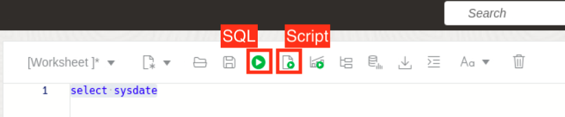

# Create the schema including JSON Duality Views

## Introduction

This lab walks you through the setup steps to create the user, tables, and JSON duality views needed to execute the rest of this workshop. Then you will populate the views and tables.

Estimated Time: 10 minutes

### Objectives

In this lab, you will:
* Login as your database user
* Create the JSON Duality Views and base tables needed
* Populate your database

### Prerequisites

This lab assumes you have:
* Oracle Database 23ai Free Developer Release
* All previous labs successfully completed
* SQL Developer Web 23.1 or a compatible tool for running SQL statements

## Task 1: Connecting to your database user

1. Your browser should still be open, if not just open a new one. If running in a Sandbox go to Activities and then at the top click on new window. If Chrome is not running then click on Chrome.

    

2. The address for SQL Developer Web on your machine is below. Copy and paste that into the browser.
    **Note:** If you did not start ORDs, ORDs stopped working or you closed that terminal in the previous lab, go back and complete the steps in that lab to start ORDs otherwise it will not be running to login here.
    ```
    <copy>
    http://localhost:8080/ords/hol23c/_sdw
    </copy>
    ```
    

3. To login use the username hol23c with the password you set in Lab 1 in the browser.

    

4. To be able to run SQL statements you will need the sql worksheet. Click on SQL to launch that.

    

5. You are now logged in and should be at a screen that looks like this.

        

## Task 2: Creating your database tables and JSON duality views
1. As you go through this workshop, we will specify click the Run button or Run Script button. The Run button runs just one SQL Statement and formats the output into a data grid. The Run Script button runs many SQL statements and spools their output. We will highlight which to use.

    

2. You will need to create your tables. Copy the code below and run it in the worksheet by clicking the **Run Script** button.
Note: The script uses the new 23ai syntax of if exists and if not exists. This prevents error messages if you need to rerun the script.


    ```
    <copy>
    DROP VIEW IF EXISTS team_dv;
    DROP VIEW IF EXISTS race_dv;
    DROP VIEW IF EXISTS driver_dv;
    DROP TABLE IF EXISTS driver_race_map;
    DROP TABLE IF EXISTS race;
    DROP TABLE IF EXISTS driver;
    DROP TABLE IF EXISTS team;

    CREATE TABLE IF NOT EXISTS team
    (team_id INTEGER GENERATED BY DEFAULT ON NULL AS IDENTITY,
    name    VARCHAR2(255) NOT NULL UNIQUE,
    points  INTEGER NOT NULL,
    CONSTRAINT team_pk PRIMARY KEY(team_id));

    CREATE TABLE IF NOT EXISTS driver
    (driver_id INTEGER GENERATED BY DEFAULT ON NULL AS IDENTITY,
    name      VARCHAR2(255) NOT NULL UNIQUE,
    points    INTEGER NOT NULL,
    team_id   INTEGER,
    CONSTRAINT driver_pk PRIMARY KEY(driver_id),
    CONSTRAINT driver_fk FOREIGN KEY(team_id) REFERENCES team(team_id));

    CREATE TABLE IF NOT EXISTS race
    (race_id   INTEGER GENERATED BY DEFAULT ON NULL AS IDENTITY,
    name      VARCHAR2(255) NOT NULL UNIQUE,
    laps      INTEGER NOT NULL,
    race_date DATE,
    podium  JSON,
    CONSTRAINT   race_pk PRIMARY KEY(race_id));

    CREATE TABLE IF NOT EXISTS driver_race_map
    (driver_race_map_id INTEGER GENERATED BY DEFAULT ON NULL AS IDENTITY,
    race_id            INTEGER NOT NULL,
    driver_id          INTEGER NOT NULL,
    position           INTEGER,
    CONSTRAINT driver_race_map_pk  PRIMARY KEY(driver_race_map_id),
    CONSTRAINT driver_race_map_fk1 FOREIGN KEY(race_id) REFERENCES race(race_id),
    CONSTRAINT driver_race_map_fk2 FOREIGN KEY(driver_id) REFERENCES driver(driver_id));

    </copy>
    ```
    

3. Create a trigger on the driver\_race\_map table to populate the points fields in team and driver based on race results. You can either click the trash to clear the worksheet or delete what is there before pasting the code below. Click **Run Script**.

    ```
    <copy>
    CREATE OR REPLACE TRIGGER driver_race_map_trigger
    BEFORE INSERT ON driver_race_map
    FOR EACH ROW
    DECLARE
        v_points  INTEGER;
        v_team_id INTEGER;
    BEGIN
    SELECT team_id INTO v_team_id FROM driver WHERE driver_id = :NEW.driver_id;

    IF :NEW.position = 1 THEN
        v_points := 25;
    ELSIF :NEW.position = 2 THEN
        v_points := 18;
    ELSIF :NEW.position = 3 THEN
        v_points := 15;
    ELSIF :NEW.position = 4 THEN
        v_points := 12;
    ELSIF :NEW.position = 5 THEN
        v_points := 10;
    ELSIF :NEW.position = 6 THEN
        v_points := 8;
    ELSIF :NEW.position = 7 THEN
        v_points := 6;
    ELSIF :NEW.position = 8 THEN
        v_points := 4;
    ELSIF :NEW.position = 9 THEN
        v_points := 2;
    ELSIF :NEW.position = 10 THEN
        v_points := 1;
    ELSE
        v_points := 0;
    END IF;

    UPDATE driver SET points = points + v_points
        WHERE driver_id = :NEW.driver_id;
    UPDATE team SET points = points + v_points
        WHERE team_id = v_team_id;
    END;
    /

    </copy>
    ```
    

4. Now we will create the RACE\_DV duality view. Notice that we only allow update on the driver table but insert update delete on race and driver\_race\_map. You have the ability to control the interaction at the table level within your view. In the next step you will create a duality view to create and delete drivers. You can either click the trash to clear the worksheet or delete what is there before pasting the code below. Click **Run Script**.

    ```
    <copy>
    CREATE OR REPLACE JSON RELATIONAL DUALITY VIEW race_dv AS
    SELECT JSON {
                '_id' IS r.race_id,
                'name'   IS r.name,
                'laps'   IS r.laps WITH NOUPDATE,
                'date'   IS r.race_date,
                'podium' IS r.podium WITH NOCHECK,
                'result' IS
                    [ SELECT JSON {'driverRaceMapId' IS drm.driver_race_map_id,
                                    'position'        IS drm.position,
                                    UNNEST
                                    (SELECT JSON {'driverId' IS d.driver_id,
                                                    'name'     IS d.name}
                                        FROM driver d WITH NOINSERT UPDATE NODELETE
                                        WHERE d.driver_id = drm.driver_id)}
                        FROM driver_race_map drm WITH INSERT UPDATE DELETE
                        WHERE drm.race_id = r.race_id ]}
        FROM race r WITH INSERT UPDATE DELETE;
		</copy>
    ```
		

5. Now we will create the DRIVER\_DV duality view. Since this is for drivers, we don't want them creating teams or races so we set those to noinsert, noupdate, nodelete. Also they can update or insert a driver's race map but not remove them. You can either click the trash to clear the worksheet or delete what is there before pasting the code below. Click **Run Script**.

	```
	<copy>
    CREATE OR REPLACE JSON RELATIONAL DUALITY VIEW driver_dv AS
    SELECT JSON {'_id' IS d.driver_id,
            'name'     IS d.name,
            'points'   IS d.points,
            UNNEST
                (SELECT JSON {'teamId' IS t.team_id,
                            'team'   IS t.name WITH NOCHECK}
                    FROM team t WITH NOINSERT NOUPDATE NODELETE
                    WHERE t.team_id = d.team_id),
            'race'     IS
                [ SELECT JSON {'driverRaceMapId' IS drm.driver_race_map_id,
                                UNNEST
                                (SELECT JSON {'raceId' IS r.race_id,
                                                'name'   IS r.name}
                                    FROM race r WITH NOINSERT NOUPDATE NODELETE
                                    WHERE r.race_id = drm.race_id),
                                'finalPosition'   IS drm.position}
                    FROM driver_race_map drm WITH INSERT UPDATE NODELETE
                    WHERE drm.driver_id = d.driver_id ]}
    FROM driver d WITH INSERT UPDATE DELETE;
	</copy>
    ```
    

6. The last duality view is TEAMS\_DV. When creating or modifying a team you can insert or update a driver. You can either click the trash to clear the worksheet or delete what is there before pasting the code below. Click **Run Script**.

	```
	<copy>  
    CREATE OR REPLACE JSON RELATIONAL DUALITY VIEW team_dv AS
    SELECT JSON {'_id'  IS t.team_id,
                'name'    IS t.name,
                'points'  IS t.points,
                'driver'  IS
                    [ SELECT JSON {'driverId' IS d.driver_id,
                                    'name'     IS d.name,
                                    'points'   IS d.points WITH NOCHECK}
                        FROM driver d WITH INSERT UPDATE
                        WHERE d.team_id = t.team_id ]}
        FROM team t WITH INSERT UPDATE DELETE;

    </copy>
    ```
	

## Task 3: Populating the database
1. We are inserting a collection of team documents into TEAM\_DV. This automatically populates the driver and team table as well as the driver collection. If you remember the team duality view joins team and driver. It also allows inserts into both tables. Copy the sql below and click **Run Script**

    ```
    <copy>
    INSERT INTO team_dv VALUES ('{"_id" : 301,
                            "name"   : "Red Bull",
                            "points" : 0,
                            "driver" : [ {"driverId" : 101,
                                            "name"     : "Max Verstappen",
                                            "points"   : 0},
                                        {"driverId" : 102,
                                            "name"     : "Sergio Perez",
                                            "points"   : 0} ]}');

    INSERT INTO team_dv VALUES ('{"_id" : 302,
                                "name"   : "Ferrari",
                                "points" : 0,
                                "driver" : [ {"driverId" : 103,
                                                "name"     : "Charles Leclerc",
                                                "points"   : 0},
                                            {"driverId" : 104,
                                                "name"     : "Carlos Sainz Jr",
                                                "points"   : 0} ]}');

    INSERT INTO team_dv VALUES ('{"_id" : 2,
                                "name"   : "Mercedes",
                                "points" : 0,
                                "driver" : [ {"driverId" : 105,
                                                "name"     : "George Russell",
                                                "points"   : 0},
                                            {"driverId" : 106,
                                                "name"     : "Lewis Hamilton",
                                                "points"   : 0} ]}');
    COMMIT;
	</copy>
	```
	

2. Additionally, we are inserting a collection of race documents into RACE\_DV. This automatically populates the race table. Copy the sql below and click **Run Script**

	```
    <copy>
    INSERT INTO race_dv VALUES ('{"_id" : 201,
                                "name"   : "Bahrain Grand Prix",
                                "laps"   : 57,
                                "date"   : "2022-03-20T00:00:00",
                                "podium" : {}}');

    INSERT INTO race_dv VALUES ('{"_id" : 202,
                                "name"   : "Saudi Arabian Grand Prix",
                                "laps"   : 50,
                                "date"   : "2022-03-27T00:00:00",
                                "podium" : {}}');

    INSERT INTO race_dv VALUES ('{"_id" : 203,
                                "name"   : "Australian Grand Prix",
                                "laps"   : 58,
                                "date"   : "2022-04-09T00:00:00",
                                "podium" : {}}');
    COMMIT;
    </copy>
    ```

	

3. Populating a duality view automatically updates data shown in related duality views, by updating their underlying tables.

    For example, in the previous step documents were inserted into the team\_dv duality view. This duality view joins the team table with the driver table, so on insert into this duality view both the team table as well as the driver table are populated.

    If you now list the contents of the driver\_dv duality view, which is based on the driver table, it has documents as well. Copy the sql below and click **Run Script**

    ```
    <copy>
    SELECT json_serialize(data PRETTY) FROM driver_dv;
    SELECT json_serialize(data PRETTY) FROM race_dv;
    </copy>
    ```

    

    Your setup is now complete.

4. You may now proceed to the next lab.

## Learn More

* [JSON Relational Duality: The Revolutionary Convergence of Document, Object, and Relational Models](https://blogs.oracle.com/database/post/json-relational-duality-app-dev)
* [JSON Duality View documentation](http://docs.oracle.com)
* [Blog: Key benefits of JSON Relational Duality] (https://blogs.oracle.com/database/post/key-benefits-of-json-relational-duality-experience-it-today-using-oracle-database-23c-free-developer-release)

## Acknowledgements
* **Author** - Kaylien Phan, William Masdon
* **Contributors** - David Start, Ranjan Priyadarshi
* **Last Updated By/Date** - Kaylien Phan, Database Product Management, April 2023
