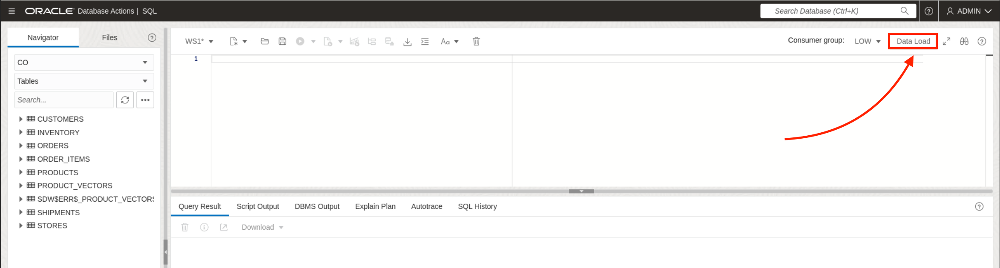
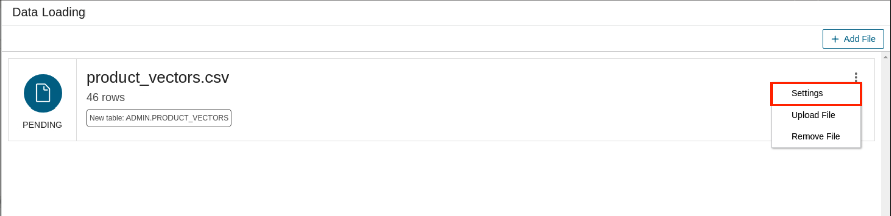
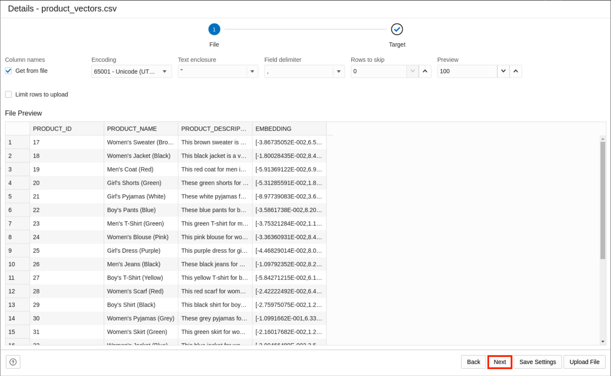

# Explore the Power of Oracle AI Vector Search

## Introduction
In this lab, you will quickly configure the Oracle Autonomous Database Free 23ai Docker Container in your remote desktop environment.

*Estimated Time:* 10 minutes

### Objectives

In this lab, you will:

* Pull, run, and start an Oracle Autonomous Database 23ai Docker image with Podman.
* Gain access to Database Actions, APEX, and more via your container.
* Explore Oracle’s AI Vector Search. 

### Prerequisites
This lab assumes you have:
- An Oracle account


## Task 1: Configure the Clothing Retail Schema

**_Note:_** _All of the following commands are to be run in the terminal._

1.  **Launch a shell session in the container.**
    ```
    <copy>
    podman exec -it oracle_adb-free_1 /bin/bash
    </copy>
    ```

2. **Connect to the database.**
    ```
    <copy>
    sqlplus admin/Welcome_12345@myatp_low
    </copy>
    ```

3. **Install the sample schema.** You'll be installing Oracle's "Customer Orders" sample schema, which stores the data, objects, and relations necessary for a typical retail store. This schema mas been modified to include English product descriptions for us to vectorize later.

    ```
    <copy>
    start /u01/customer-orders/co_install.sql;
    </copy>
    ```
4. **Fill in the installation prompts.** <br/><br/> 
    &nbsp;&nbsp;&nbsp;&nbsp; **Password for the user CO:** D3fP&$$_12345 <br/>
    &nbsp;&nbsp;&nbsp;&nbsp; **Enter a tablespace for CO:** Press enter. <br/>
    &nbsp;&nbsp;&nbsp;&nbsp; **Do you want to overwrite the schema, if it already exists?:** YES

The following output means the schema has successfully installed. You may now proceed to the next lab.

## Task 2: Perform a Traditional Search for Professional Attire 
As a retailer, you want customers to easily search your catalog for the clothing items they want. Let's see how that would typically work.

1. **Return to SQL Developer Web.** Open Google Chrome (Activities >> Chrome Icon) to return to SQL Developer Web. If signed out, repeat steps 5-7 of Lab 1.

2. **Review the products table.** 
    ```
    <copy>
    select * from co.products;
    </copy>
    ```

3. . **Traditionally search your catalog for the word "professional".** 
    ```
    <copy>
    select * from co.products where lower(JSON_VALUE(product_details, '$.description')) like '%professional%' or lower(product_name) like '%professional%';
    </copy>
    ```
4. . **Traditionally search your catalog for the word "slacks".**
    ```
    <copy>
    select * from co.products where lower(JSON_VALUE(product_details, '$.description')) like '%slacks%' or lower(product_name) like '%slacks%';
    </copy>
    ```

**Notice that both queries returned zero results!**

This doesn't mean that our catalog has nothing we could wear to a conference or in a professional setting. Our results are simply limited by traditional search methods. Only searching for a specific word means that we might overlook similar results because they aren't an exact match. Even when we find that exact match, it's still not a guarantee that it'll align with what you meant. 

This because we're only looking at the literal value of of our search query and not considering the actual meaning of it. Vector search allows us to query our data based on its actual meaning. Let’s see how it simple it is to vector search the product descriptions instead.

## Task 3: Perform a Vector Search for Professional Attire

1. **Click Data Load, in the upper-right.**
    

2. **Select "Add file".**
    

3. **Upload the product_vectors.csv file.** This file is found at _Home/customer-orders/_.
    

4. **Edit the settings.** Click the 3 ellipses next to the loaded file and select "Settings" and then "Next".
    

5. **Click Next.**
    

 **Update the "Target Details" and click "Save Settings** Update the schema and table name to match the image below .
    


7. . **Vector search your catalog on the word "professional".** 
    ```
    <copy>
    SELECT product_id, product_name, product_description 
    FROM co.product_vectors_raw
    ORDER BY VECTOR_DISTANCE(to_vector(embedding), to_vector('[-1.38417125E-001,9.71514508E-002,-1.18379503E-001,-1.29179478E-001,-2.79206838E-002,-9.25924536E-003,7.63561204E-002,-8.47336557E-003,-9.88291353E-002,5.86197292E-003,1.24105304E-001,2.64565721E-002,-2.90193707E-001,6.24980172E-003,1.40465021E-001,-1.0187757E-001,1.13065904E-002,-1.62050202E-002,-1.51706114E-001,1.0432037E-001,1.69033576E-002,-6.36996627E-002,2.22446039E-001,8.87518004E-002,5.68140186E-002,-2.21980792E-002,-2.91388109E-002,6.10229652E-003,1.23727275E-002,-1.61174312E-002,-2.18355004E-003,-5.69379814E-002,-7.01681077E-002,7.43765458E-002,8.72624367E-002,-8.85243937E-002,-1.58647411E-002,-9.89395455E-002,-1.2489415E-001,-1.55174434E-001,3.95436995E-002,-6.47113007E-003,6.44426644E-002,-6.55944273E-002,-3.10505833E-002,-1.65970504E-001,-8.76084268E-002,-6.62551969E-002,7.95538165E-003,-5.58951758E-002,-5.03059104E-002,1.55989215E-001,-5.80965802E-002,-2.22495496E-002,1.19294189E-001,-1.20502286E-001,9.3728438E-002,1.48948599E-002,-6.63644373E-002,1.32789746E-001,7.51211941E-002,-5.60273789E-002,-1.13926828E-001,-6.62457347E-002,-2.19992418E-002,5.06774988E-003,4.64191213E-002,5.68691492E-002,5.02295792E-002,-4.11496758E-002,-3.50375026E-002,6.46986738E-002,-3.56235483E-004,-3.62013914E-002,2.69071013E-002,4.18330394E-002,-6.73687039E-003,-2.01085322E-002,1.12838395E-001,7.21994713E-002,-8.7489374E-003,-1.16420537E-002,6.37029298E-003,1.96365491E-002,-5.01939096E-002,-6.94921836E-002,6.35710964E-003,-1.28438711E-001,1.77688166E-001,-1.67947963E-001,1.17344201E-001,7.17160255E-002,-1.23912282E-001,6.6053316E-002,7.24657997E-002,1.1995139E-001,-7.1466784E-003,5.12270406E-002,1.27887025E-001,6.25869036E-002,-1.19979665E-001,1.12567812E-001,2.28577014E-002,-4.52852659E-002,7.86832869E-002,-9.707091E-002,-8.44487473E-002,1.29422441E-001,7.83354938E-002,-1.59848779E-001,2.41119806E-002,1.14535931E-002,2.27301707E-003,-2.59636398E-002,2.51355022E-003,1.0459137E-001,2.69407909E-002,-1.11877277E-001,1.12808578E-001,1.14215619E-003,2.92326175E-002,1.44840822E-001,4.73851375E-002,-1.27157673E-001,-2.07854062E-001,-1.11806065E-001,-8.02985206E-003,-7.00606555E-002]'), EUCLIDEAN ) 
    FETCH EXACT FIRST 10 ROWS ONLY;
    </copy>
    ```
8. . **Vector search your catalog on the word "slacks".**
    ```
    <copy>
    SELECT product_id, product_name, product_description 
    FROM co.product_vectors_raw 
    ORDER BY VECTOR_DISTANCE(to_vector(embedding), to_vector('[-9.68606323E-002,7.5337708E-002,-1.0658735E-001,-1.38738364E-001,-2.28260402E-002,3.5230644E-002,2.68885796E-003,1.36218229E-002,1.15028154E-002,4.23902161E-002,8.37896764E-002,2.90349014E-002,-1.51465312E-001,1.49059035E-002,1.46184951E-001,-1.77720428E-001,5.30827865E-002,-5.13745425E-003,-7.5569436E-002,1.34732634E-001,5.25507284E-003,3.61185595E-002,2.11690515E-001,5.85873537E-002,-3.19165476E-002,-7.93770403E-002,1.45305004E-002,4.49487194E-002,1.37902955E-002,-1.09221734E-001,-5.7302203E-002,-1.12185463E-001,-6.40390366E-002,6.2864095E-002,4.25061174E-002,-1.19959101E-001,5.48176914E-002,-1.05015293E-001,-1.09484673E-001,-1.26435086E-001,8.88467953E-002,-6.78603202E-002,7.37638995E-002,-5.0049141E-002,6.07395545E-002,-1.30454943E-001,-5.51283062E-002,-1.21642545E-001,-3.97110172E-002,1.46834096E-002,-9.3602553E-002,2.41991818E-001,3.517735E-002,-7.62047153E-003,1.30953774E-001,-1.40298694E-001,9.79949087E-002,-6.78110123E-002,-1.04402095E-001,9.76447538E-002,8.0076322E-002,-1.31879494E-001,-8.34248215E-002,-8.54361951E-002,-1.22926809E-001,-8.59939158E-002,8.22370127E-002,5.52646583E-003,9.4893679E-002,-9.64170173E-002,-3.16511393E-002,-9.48159024E-003,-7.33673051E-002,-3.52119654E-002,-2.69408673E-002,9.13547445E-003,1.26846209E-001,3.09299417E-002,1.38598114E-001,4.07091081E-002,3.46698835E-002,2.05623899E-002,3.31137851E-002,-8.18310399E-003,-6.5582931E-002,-7.39831626E-002,-7.24066142E-003,-6.11410327E-002,1.57419547E-001,-1.34564966E-001,8.96778107E-002,-4.31015593E-004,-1.22770734E-001,7.80297145E-002,5.69474846E-002,8.80813822E-002,3.1488277E-002,-1.51161058E-002,7.1529232E-002,8.24968889E-002,-1.08482465E-001,1.52552053E-002,4.57050614E-002,-1.20126978E-001,9.49510187E-002,-7.69320577E-002,-1.02195516E-001,1.10023908E-001,5.00271246E-002,-1.07030541E-001,7.50863254E-002,5.98394163E-002,5.17932661E-002,5.67459613E-002,6.10302612E-002,8.13639611E-002,-6.97210804E-002,-1.61270708E-001,6.98513016E-002,7.82461837E-002,-1.56437326E-002,1.21171348E-001,6.85361698E-002,-1.86466992E-001,-1.40970141E-001,-1.14370458E-001,-3.85081656E-002,6.8552658E-002]'), EUCLIDEAN ) 
    FETCH EXACT FIRST 10 ROWS ONLY;
    </copy>
    ```

## Acknowledgements
- **Authors** - Brianna Ambler, Database Product Management, August 2024
- **Contributors** -Brianna Ambler, August 2024
- **Last Updated By/Date** - Brianna Ambler, August 2024
