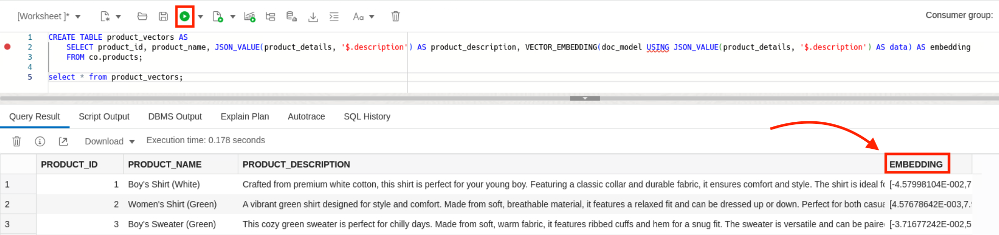
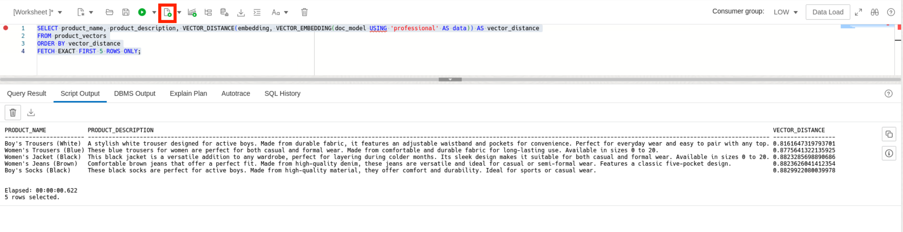

# Learn the Vector Search Process on Oracle Database 23ai

## Introduction
In this lab, you will learn how to prepare your workspace to perform AI Vector Search.

**_Estimated Time: 45 minutes_**

### **Objectives**

In this lab, you will:

* Configure your workspace to use Oracle AI Vector Search.
* Load a vector embedding model.
* Vectorize the sample data.
* Query the vector data with Oracle AI Vector Search.

### **Prerequisites**
This lab assumes you have:
- An Oracle account


## Task 1: Prepare the Workspace

1. **Return to the terminal and connect to the database.**
    ```
    <copy>
    podman exec -it oracle_adb-free_1 sqlplus admin/Welcome_12345@myatp_low
    </copy>
    ```
    

2. **Create a folder for our vector embedding model in the PDB.**
    ```
    <copy>
    CREATE OR REPLACE DIRECTORY DM_DUMP AS 'models';
    </copy>
    ```    
    

3. **Copy the absolute file path of the PDB's working directory.** Copy the file path returned by the following command.
    ```
    <copy>
    SELECT directory_path FROM all_directories WHERE directory_name = 'DM_DUMP';
    </copy>
    ```
    

4. **Disconnect from the database.**
    ```
    <copy>
    exit
    </copy>
    ```
    

5. **Move the vector model into the PDB's working directory.** Paste the following command into the terminal, and then paste the path generated in step 3. This will not produce any output, if successful.
    ```
    <copy>
    podman exec -it oracle_adb-free_1 cp -r u01/all-MiniLM-L12-v2.onnx </copy> replace-with-working-directory
    </copy>
    ```

6. **Return to SQL Developer Web.**
    


7. **Confirm the model appears in the database directory.**
    ```
    <copy>
    SELECT * FROM DBMS_CLOUD.LIST_FILES('DM_DUMP');
    </copy>
    ```
    

8. **Load the ONNX model into the database.** Learn more on how to use this function and the model requirements [here](https://docs.oracle.com/en/database/oracle/oracle-database/23/arpls/dbms_vector1.html#GUID-7F1D7992-D8F7-4AD9-9BF6-6EFFC1B0617A).
    ```
    <copy>
    EXECUTE DBMS_VECTOR.LOAD_ONNX_MODEL('DM_DUMP','all-MiniLM-L12-v2.onnx','doc_model');
    </copy>
    ```
    

   

## Task 2: Generate, Store, & Query Vector Data

1. **Generate and store the product description vectors.**
    ```
    <copy>
    CREATE TABLE product_vectors AS 
        SELECT product_id, product_name, JSON_VALUE(product_details, '$.description') AS product_description, VECTOR_EMBEDDING(doc_model USING JSON_VALUE(product_details, '$.description') AS data) AS embedding 
        FROM co.products;
    </copy>
    ```
    

2. **Using vector search, retrieve the 5 products most similar to the word "professional".** By default, VECTOR_DISTANCE uses the cosine formula as it's distance metric, but you can change the metric as you see fit. We recommend using the metric suggested by the embedding model, in this case it was cosine. Learn more about distance metrics [here](https://docs.oracle.com/en/database/oracle/oracle-database/23/vecse/vector-distance-metrics.html).
    ```
    <copy>
    SELECT product_name, product_description, VECTOR_DISTANCE(embedding, VECTOR_EMBEDDING(doc_model USING 'professional' AS data)) AS vector_distance
    FROM product_vectors
    ORDER BY vector_distance
    FETCH EXACT FIRST 5 ROWS ONLY;
    </copy>
    ```

    This is a vast improvement from the empty result set we got from our traditional search! We can see that the similarity search has returned clothing items described with words contextually similar to "professional". 
    
    
3. **Using vector search, retrieve the 5 products most similar to the word "slacks".**
    ```
    <copy>
    SELECT product_name, product_description, VECTOR_DISTANCE(embedding, VECTOR_EMBEDDING(doc_model USING 'slacks' AS data)) AS vector_distance
    FROM product_vectors
    ORDER BY vector_distance
    FETCH EXACT FIRST 5 ROWS ONLY;
    </copy>
    ```

    Once again--big improvements! Notice that the model was able to relate slacks to other bottoms, and use the term's professional context to find other formal wear. So, despite there not being a product description containing the word "slacks", viable results are still returned due to their similarity to the query. 
    


**Congratulations! You've completed the workshop.**

## Acknowledgements
- **Authors** - Brianna Ambler, Database Product Management
- **Contributors** - Brianna Ambler, Database Product Management
- **Last Updated By/Date** - Brianna Ambler, August 2024
