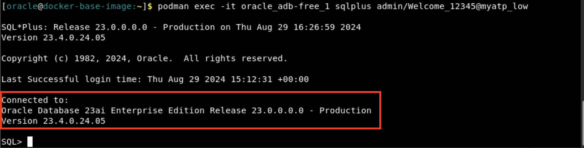
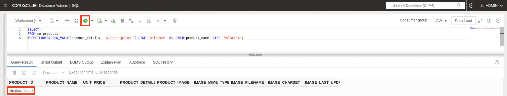

# Perform a Traditional Data Search

## Introduction
In this lab, you will quickly configure the Oracle Autonomous Database Free 23ai Docker Container in your remote desktop environment.

**_Estimated Time: 20 minutes_**

### **Objectives**

In this lab, you will:

* Configure a clothing retail schema.
* Introduce the traditional search dilemma.


### **Prerequisites**
This lab assumes you have:
- An Oracle account


## Task 1: Configure the Clothing Retail Schema

**_Note:_** _All of the following commands are to be run in the terminal._

1.  **Return to the terminal.**
    

2. **Connect to the database.** You can connect to the database using any of the TNS aliases listed in 'tnsnames.ora", using the following format: 'user'/'password'@'tns_alias'.
    ```
    <copy>
    podman exec -it oracle_adb-free_1 sqlplus admin/Welcome_12345@myatp_low
    </copy>
    ```
    

3. **Install the sample schema.** You'll be installing Oracle's "Customer Orders" sample schema, which stores the data, objects, and relations necessary for a typical retail store. This schema mas been modified to include English product descriptions for us to vectorize later. Find out more about Oracle's sample schemas [here](https://docs.oracle.com/en/database/oracle/oracle-database/19/comsc/introduction-to-sample-schemas.html).

    ```
    <copy>
    start /u01/customer-orders-schema/co_install.sql;
    </copy>
    ```

4. **Fill in the installation prompts.** The following output should then output, meaning the schema has successfully installed.  <br/><br/> 
    &nbsp;&nbsp;&nbsp;&nbsp; **Password for the user CO:** D3fP&$$_12345 <br/>
    &nbsp;&nbsp;&nbsp;&nbsp; **Enter a tablespace for CO:** Press enter. <br/>
    &nbsp;&nbsp;&nbsp;&nbsp; **Do you want to overwrite the schema, if it already exists?:** YES

    

## Task 2: Perform a Traditional Search for Professional Attire 
As a retailer, you want customers to easily search your catalog for the clothing items they want. Let's see how that would typically work.

1. **Return to SQL Developer Web.** Activities >> SQL Developer Window. 
    

2. **View the products table.** 
    ```
    <copy>
    select * from co.products;
    </copy>
    ```
    

3. **View the product details.** The product details are stored as a JSON document. Let's see what details are in here!
    ```
    <copy>
    SELECT product_name, JSON_SERIALIZE(product_details PRETTY) as product_details
    FROM co.products;
    </copy>
    ```
    

4. **Traditionally search your catalog for the word "professional".** 
    ```
    <copy>
    SELECT * 
    FROM co.products 
    WHERE LOWER(JSON_VALUE(product_details, '$.description')) LIKE '%professional%' OR LOWER(product_name) LIKE '%professional%';
    </copy>
    ```
    

5. . **Traditionally search your catalog for the word "slacks".**
    ```
    <copy>
    SELECT * 
    FROM co.products 
    WHERE LOWER(JSON_VALUE(product_details, '$.description')) LIKE '%slacks%' OR LOWER(product_name) LIKE '%slacks%';
    </copy>
    ```
    

**Notice that both queries returned zero results!**

This doesn't mean that our catalog has nothing we could wear to a conference or in a professional setting. Our results are simply limited by traditional search methods. Only searching for a specific word means that we might overlook similar results because they aren't an exact match. Even when we find that exact match, it's still not a guarantee that it'll align with what you meant. 

This because we're only looking at the literal value of of our search query and not considering the actual meaning of it. Vector search allows us to query our data based on its actual meaning. In the next lab, we'll embed these terms and perform vector search on them instead.

## Acknowledgements
- **Authors** - Brianna Ambler, Database Product Management, August 2024
- **Contributors** -Brianna Ambler, August 2024
- **Last Updated By/Date** - Brianna Ambler, August 2024
