# Bank Transfers Graph Example with SQL/PGQ in 23c

## Introduction

In this lab you will view the queries created the graph (that is, `bank_graph`) in APEX.

Estimated Time: 10 minutes.

Watch the video below for a quick walk-through of the lab. 
[Walkthrough](videohub:1_ypjlr8es)

### Objectives
Learn how to:
- Use APEX and SQL to query, analyze, and visualize a graph.

### Prerequisites
This lab assumes:
- The graph user and graph bank_graph exists
- You have ORDS running so you can open APEX

## Task 1: Login and create APEX workspace

1. Open Activities -> Google Chrome. If your Chrome is already open and you are trying to create a new window, press control + N or select the dropdown of Google Chrome in the top left corner and click New Window.

    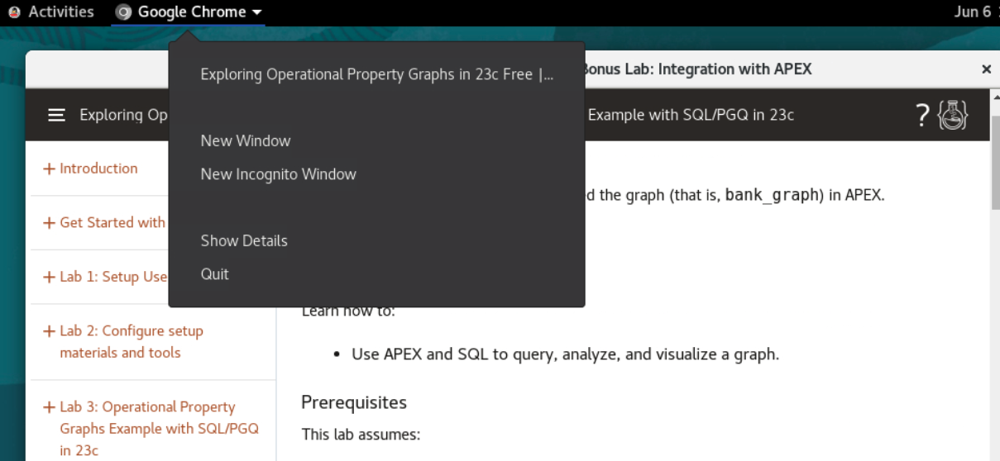


2. Go to this URL and wait for the screen to load.
    ```
    <copy>
    http://localhost:8080/ords/apex_admin
    </copy>
    ```

    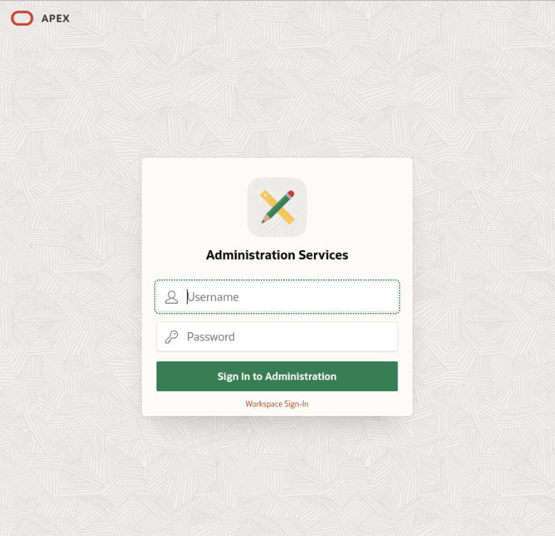

3. Login as ADMIN with the password Welcome123# and reset it as you please.

    

4. You can see the welcome screen for APEX now. 

    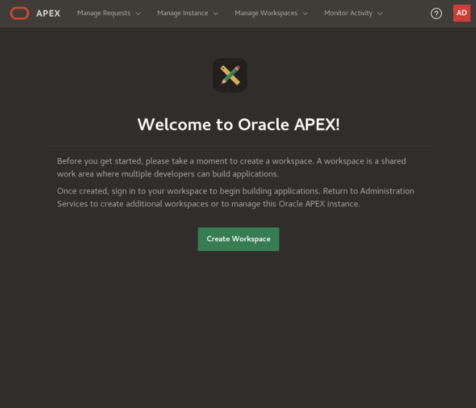

5. Click Create Workspace

    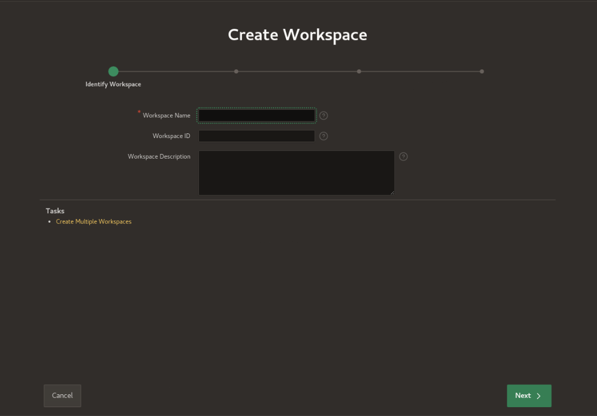

6. Name the workspace 'graph' and click Next

    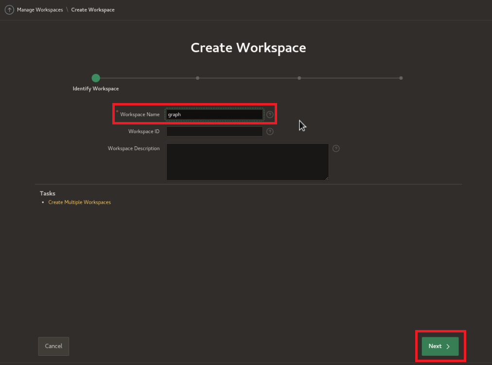

7. Set reuse existing schema to Yes. Click the menu icon next to schema name and select HOL23C. Leave the default for space quota and password. Click Next.

    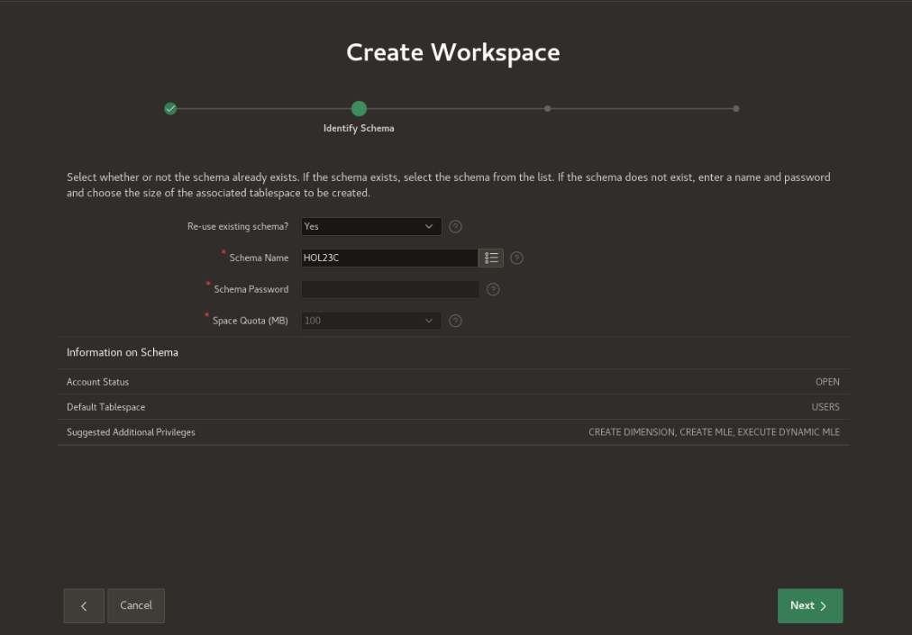

8. Administrator Username: admin, Administrator Password: Welcome123#, Email: your email. We will be resetting this password later on as well. Click Next.

    

9. Review the output then click Create Workspace.

    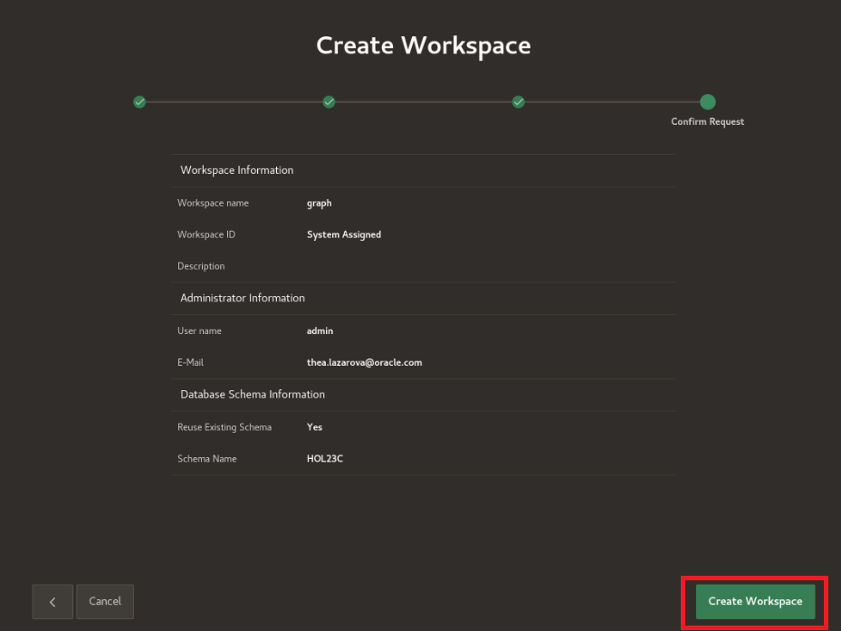

10. Success! Now click Done.

    

## Task 2: Import APEX app to visualize queries

1. In the upper right corner, click the admin icon then click Sign out.
    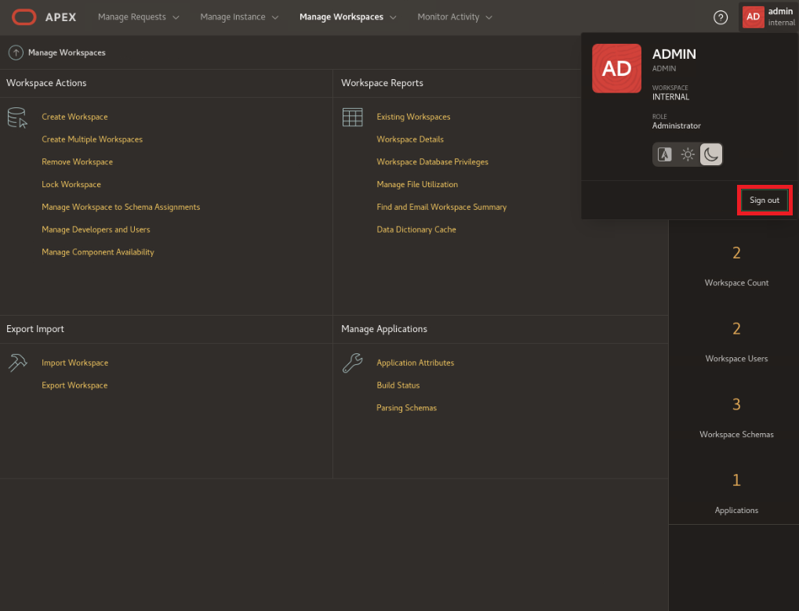


2.  Log back in as the admin info you just created along with the workspace name as graph.
    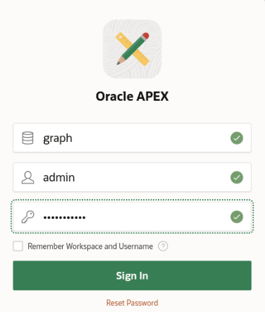


3. Reset password.
    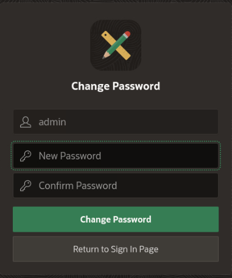

4. App Builder -> Import

    

5. Click to add a file to open for import. Go to Home -> examples -> graph -> f101.sql and select that file. Leave the defaults and click Next.

    

    

6. Click next.
    
    
7.  Select Reuse Application ID 106 From Export File. Leave all other options and click Install Application.

    

8.  Click Run Application.

    


9.  Login.
    **NOTE:** admin is case-sensitive.

    


10. Click Property Graph queries with SQL box.
    
    
11. Scroll through output to see the queries that you had ran in the prior lab visualized.
    

12. Click the hamburger menu in the upper left corner of the application and click "Using the Graph Visualization Plugin".

13. Scroll through the output to see the Graph Viz plugin utilized.
    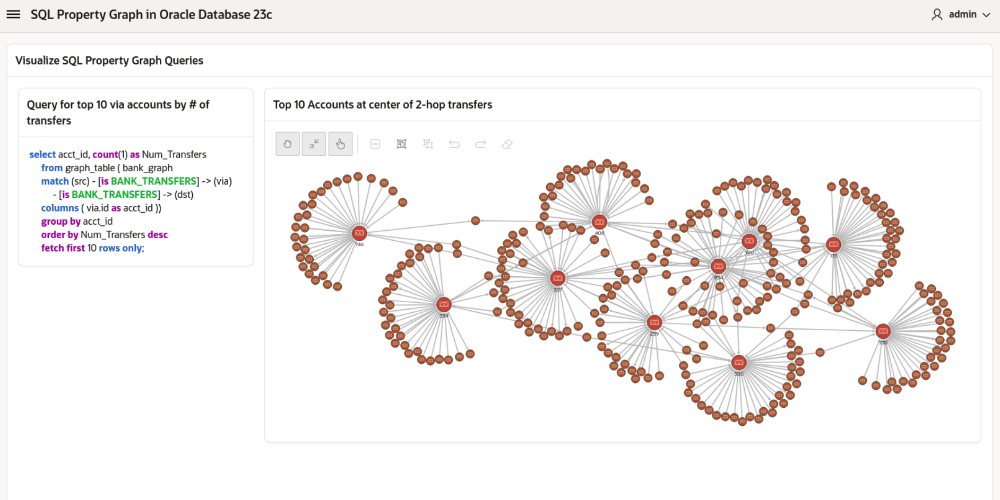

14. You have now completed this lab.

## Learn More
* [Oracle Property Graph](https://docs.oracle.com/en/database/oracle/property-graph/index.html)
* [SQL Property Graph syntax in Oracle Database 23c Free - Developer Release](https://docs.oracle.com/en/database/oracle/property-graph/23.1/spgdg/sql-ddl-statements-property-graphs.html#GUID-6EEB2B99-C84E-449E-92DE-89A5BBB5C96E)

## Acknowledgements
- **Author** - Kaylien Phan, Thea Lazarova, William Masdon
- **Contributors** - Melliyal Annamalai, Jayant Sharma, Ramu Murakami Gutierrez, Rahul Tasker
- **Last Updated By/Date** - Kaylien Phan, Thea Lazarova
