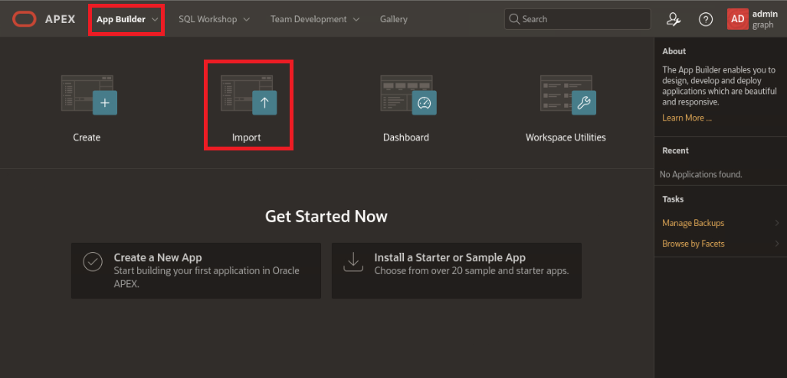
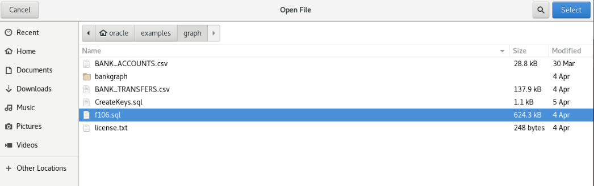
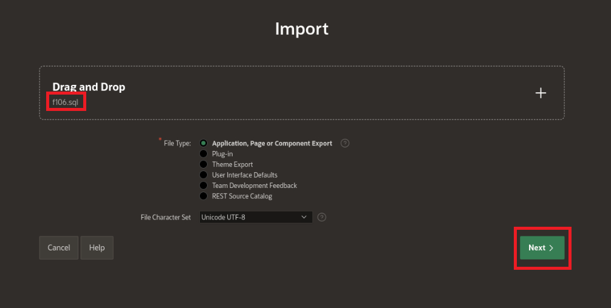
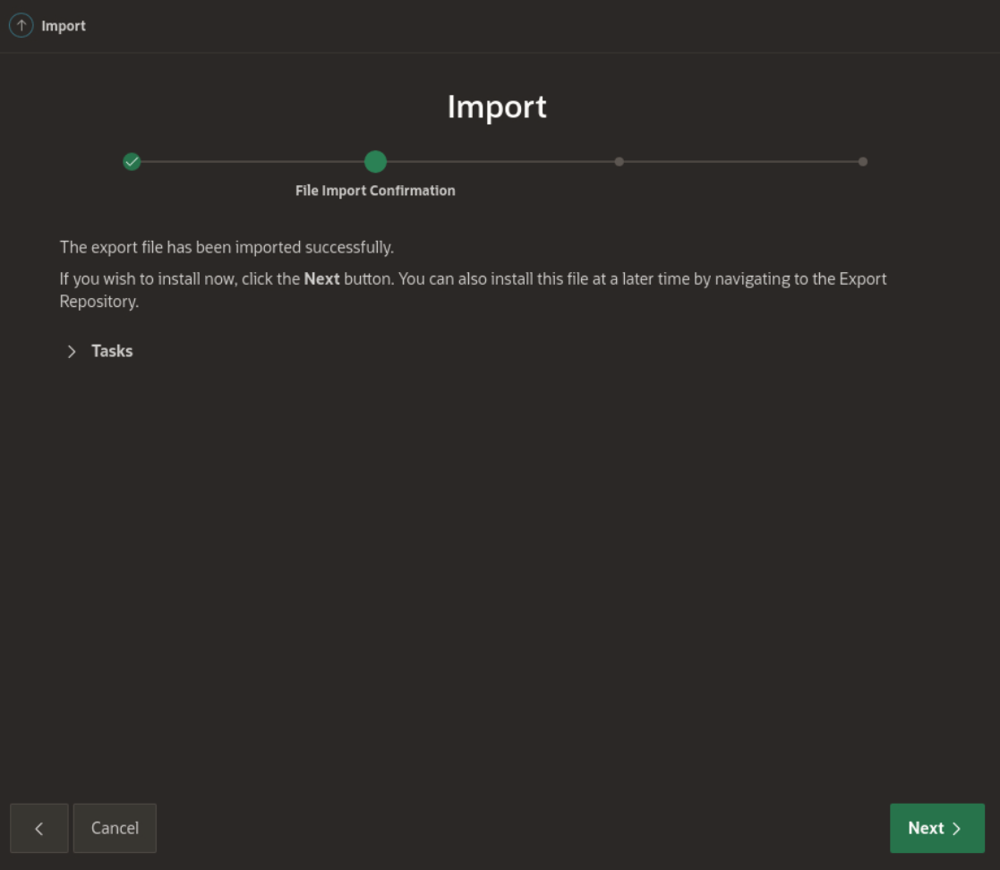
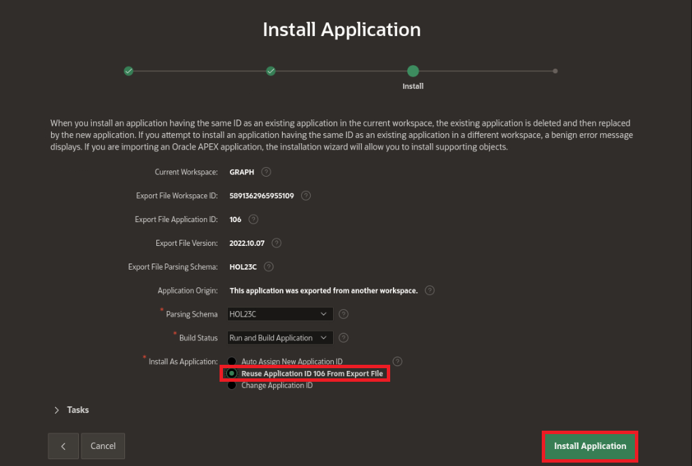
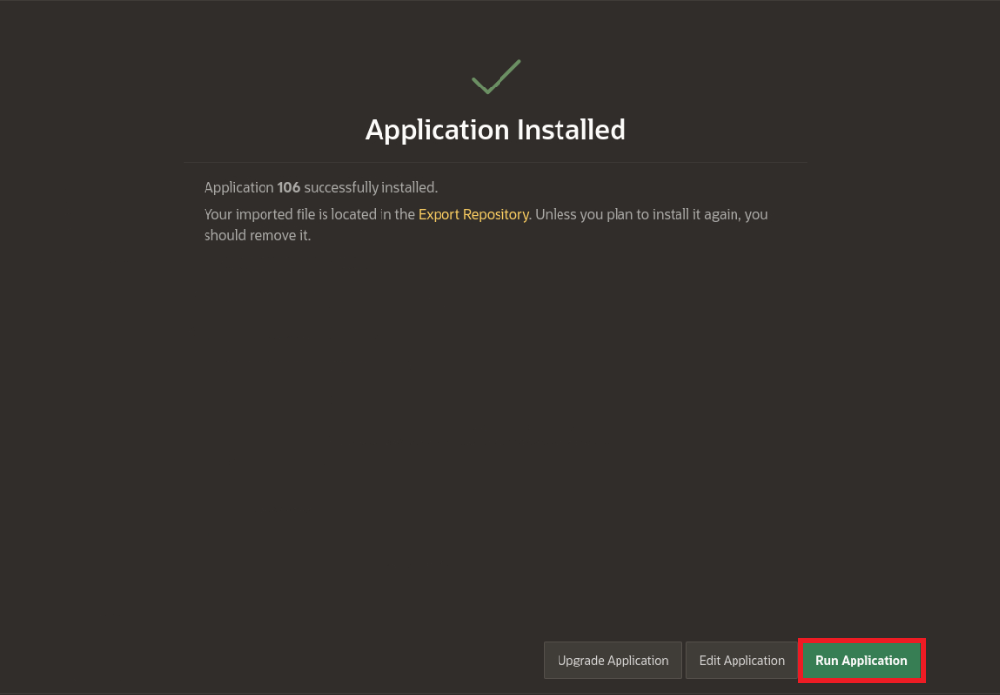
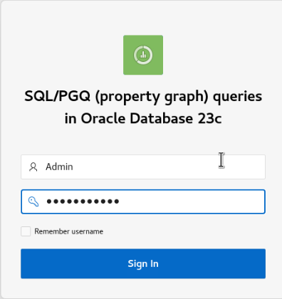
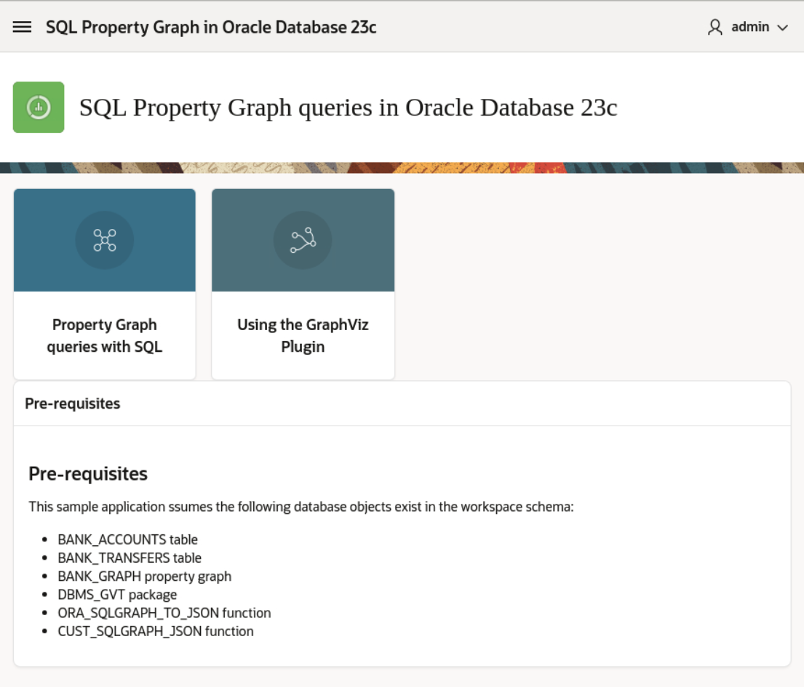
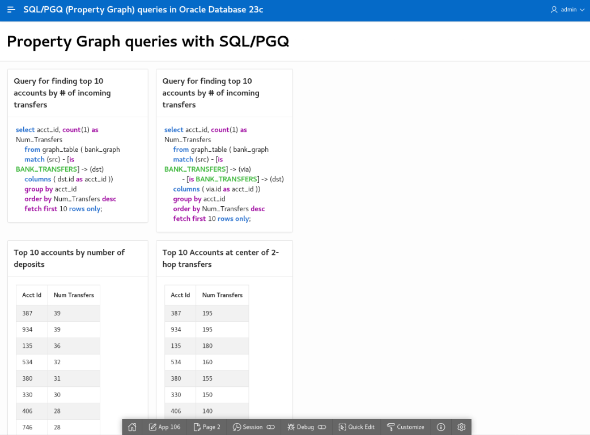

# Bank Transfers Graph Example with SQL/PGQ in 23c

## Introduction

In this lab you will view the queries created the graph (that is, `bank_graph`) in APEX.

Estimated Time: 10 minutes.

<!-- Watch the video below for a quick walk through of the lab. -->

<!-- update video link. Previous iteration:  -->

### Objectives
Learn how to:
- Use APEX and SQL to query, analyze, and visualize a graph.

### Prerequisites
This lab assumes:
- The graph user and graph bank_graph exists
- You have ORDS running so you can open APEX

## Task 1 : Import APEX app to visualize queries

1. App Builder -> Import

    

2. Click to add a file to open for import. Go to Home -> example -> graph -> f106.sql and open that file. Leave the defaults and click next.

    

    

3. Click next.
    
    
4.  Leave all defaults, except check Reuse app 106 from file under Install Application and click Install Application. 

    

5.  Click run application

    

6.  Login.

    

7. Click property graph queries with pgq box
    
    
8. Scroll through output.
    

9. You have now completed this lab.

## Learn More
* [Oracle Property Graph](https://docs.oracle.com/en/database/oracle/property-graph/index.html)
* [SQL Property Graph syntax in Oracle Database 23c Free - Developer Release](https://docs.oracle.com/en/database/oracle/property-graph/23.1/spgdg/sql-ddl-statements-property-graphs.html#GUID-6EEB2B99-C84E-449E-92DE-89A5BBB5C96E)

## Acknowledgements
- **Author** - Kaylien Phan, Thea Lazarova, William Masdon
- **Contributors** - Melliyal Annamalai, Jayant Sharma, Ramu Murakami Gutierrez, Rahul Tasker
- **Last Updated By/Date** - Kaylien Phan, Thea Lazarova
