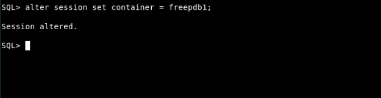
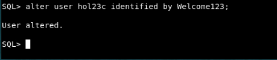

# Setup User

## Introduction

Resetting the password for the hol23c user in the Oracle Database and starting up ORDS, which will be needed to start up other applications.

Estimated Time: 5 minutes

### Objectives

In this lab, you will:
* Set the password for the hol23c user

### Prerequisites

This lab assumes you have:
* Oracle Database 23c Free Developer Release
* A terminal or console access to the database

Watch the video below for a quick walk-through of the lab. The lab instructions on the left might not match the workshop you are currently in, but the steps in the terminal on the right remain the same.
[Change password](videohub:1_x4hgmc2i)

## Task 1: Setting database user password and starting ORDS

1. The first step is to get to a command prompt. If you need to open a terminal and you are running in a Sandbox environment click on Activities and then Terminal.

    

2. Next set your environment. The oraenv command will set all of the environment variables based on your database. When prompted type FREE for the database name or if you supplied a different database name use that.
    ```
    [FREE:oracle@hol23cfdr:~]$ <copy>. oraenv</copy>
     ORACLE_SID = [FREE] ? FREE
     The Oracle base has been set to /opt/oracle OR The Oracle base remains unchanged with value /opt/oracle.
    [FREE:oracle@hol23cfdr:~]$
		```

    <!--  -->


3. Next connect to your database.
    ```
		[FREE:oracle@hol23cfdr:~]$ <copy>sqlplus / as sysdba</copy>

    SQL*Plus: Release 23.0.0.0.0 - Developer-Release on Wed Apr 5 13:38:14 2023
    Version 23.2.0.0.0

    Copyright (c) 1982, 2023, Oracle.  All rights reserved.


    Connected to:
    Oracle Database 23c Free, Release 23.0.0.0.0 - Developer-Release
    Version 23.2.0.0.0

    SQL>
		```
    

4. Next change to your pluggable database. If your pluggable database is a different name, make sure to change the command below.
    ```
    SQL> <copy>alter session set container = freepdb1;</copy>

    Session altered.

    SQL>
		```
    

5. To change the password for the user hol23c use the "alter user \[username\] identified by \[new password\]" command. The syntax below for the hol23c user, make sure to replace new\_password\_here to your new password. Throughout this workshop we will use the Welcome123 password.
    ```
		<copy>alter user hol23c identified by </copy> [new_password_here];
		```
    ```
    SQL> alter user hol23c identified by Welcome123;

    User altered.

    SQL>
    ```
    

6. Once the password has been changed you can exit SQL Plus.

    ```
		SQL> <copy>exit</copy>
Disconnected from Oracle Database 23c Free, Release 23.0.0.0.0 - Developer-Release
Version 23.2.0.0.0
[FREE:oracle@hol23cfdr:~]$
		```

    

7. To start ORDS, from the same command prompt use the following command. The output of [1] 204454 is just an example, your output could be different.

    ```
		[FREE:oracle@hol23cfdr:~]$ <copy>ords serve > /dev/null 2>&1 &</copy>
[1] 204454
[FREE:oracle@hol23cfdr:~]$
		```

    **NOTE:** You must leave this terminal open and the process running. Closing either will stop ORDS from running, and you will not be able to access other applications that are used in this lab.

    


8. You may now proceed to the next lab.

## Learn More

* [Introducing Oracle Database 23c Free – Developer Release](https://blogs.oracle.com/database/post/oracle-database-23c-free)

## Acknowledgements
* **Author** - Kaylien Phan, William Masdon
* **Contributors** - David Start
* **Last Updated By/Date** - Kaylien Phan, Database Product Management, April 2023
