# Create the schema including JSON Duality Views

## Introduction

This lab walks you through the setup steps to create the user, tables, and JSON duality views needed to execute the rest of this workshop. Then you will populate the views and tables.

Estimated Time: 5 minutes

### Objectives

In this lab, you will:
* Login as your database user
* Create the JSON duality views and base tables needed
* Populate your database

### Prerequisites (Optional)

This lab assumes you have:
* Oracle Database 23c Free Developer Release
* Eclipse or a compatible IDE for executing Java code
* All previous labs successfully completed

<if type="livelabs">
Watch the video below for a quick walk-through of the lab. 
[Change password](videohub:1_lkkdkfj3)
</if>

## Task 1: Opening your project in Eclipse

1. In the open terminal on the right, paste in this command to navigate to the Java code directory.


    ```
    <copy>
    cd ~
    cd examples/java
    </copy>
    ```

2. Now paste this in to grab the latest version of the Java code. 


    ```
    <copy>
    wget https://c4u04.objectstorage.us-ashburn-1.oci.customer-oci.com/p/EcTjWk2IuZPZeNnD_fYMcgUhdNDIDA6rt9gaFj_WZMiL7VvxPBNMY60837hu5hga/n/c4u04/b/livelabsfiles/o/data-management-library-files/JdbcDuality.zip
    </copy>
    ```

    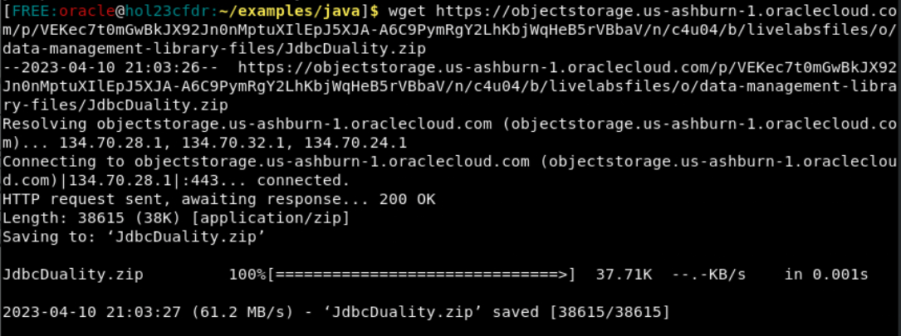


3. Unzip the file.

    ```
    <copy>
    unzip -o JdbcDuality.zip
    </copy>
    ```

    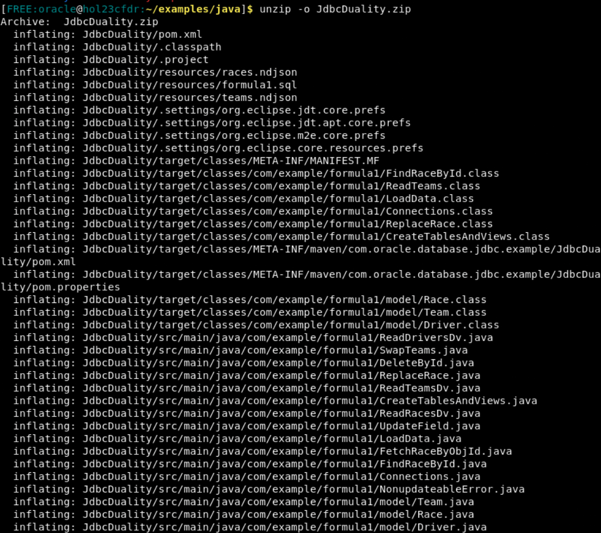


4. Paste in this command to navigate to the directory with the Eclipse application.

    ```
    <copy>
    cd /
    cd /u01/app/eclipse/
    </copy>
    ```

    Then paste this to open the application.

    ```
    <copy>
    ./eclipse
    </copy>
    ```

   Once Eclipse is launched, the workspace will open.

    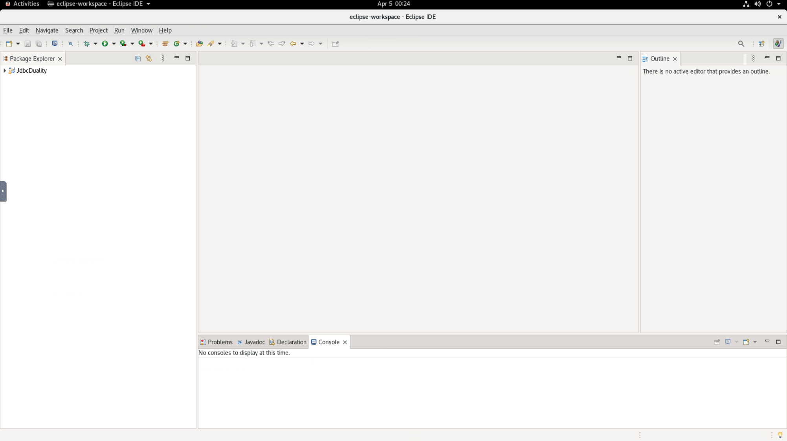

5. On the left side Package Explorer, click the dropdown menu for JdbcDuality -> src/main/java/com.example.formula1 -> Connections.java. This is the first file we will observe. It shows the Connection string that every Java Class in this program will utilize to connect to the database. If you have changed your password in the last lab, please replace Welcome123# with your password.

    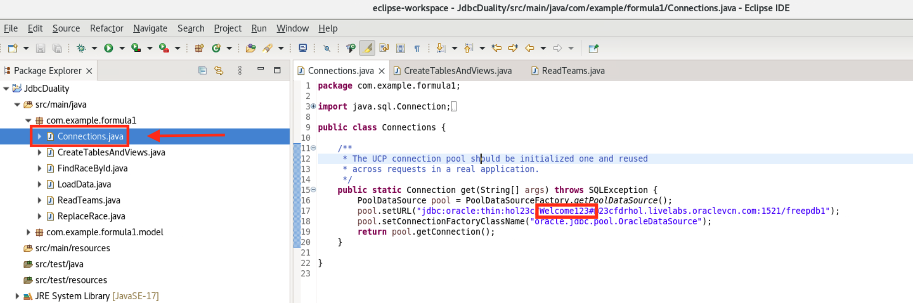

## Task 2: Creating your database tables and JSON duality views
1. Now, to actually execute a Java file. Click on CreateTablesAndViews.java. We're going to create the necessary database objects to explore JSON Duality Views through Formula 1 racing data with this class.

    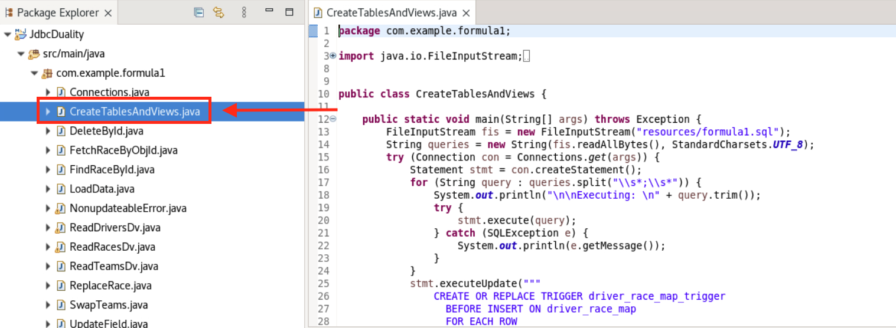

2. In the code, you can see the main class of the program is setting formula1.sql as the file to read queries in from. This file contains the SQL commands that will create the necessary tables/views for this lab. 

    The program reads in this file as input and breaks up the commands into individual queries. It will then execute each query within a try/catch block, so that errors will be printed in the console if they occur.

    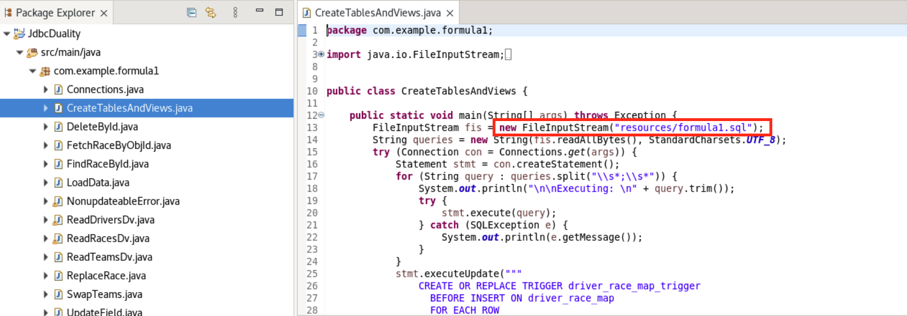

3. Formula1.sql is located under the resources folder, so you can open it as well.

    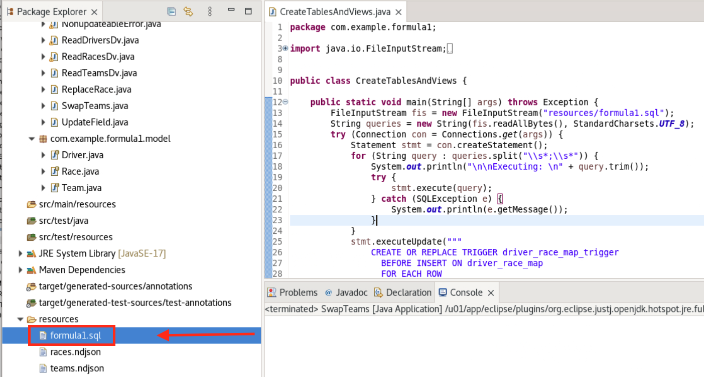

4. First, it will drop any of the listed tables/views if they exist. Then, it will create 4 base tables written in standard SQL. Those tables are:
    - team = representing F1 race teams
    - driver = the racecar drivers
    - race = all the races
    - driver\_race\_map = the positions each driver finished in for each race

    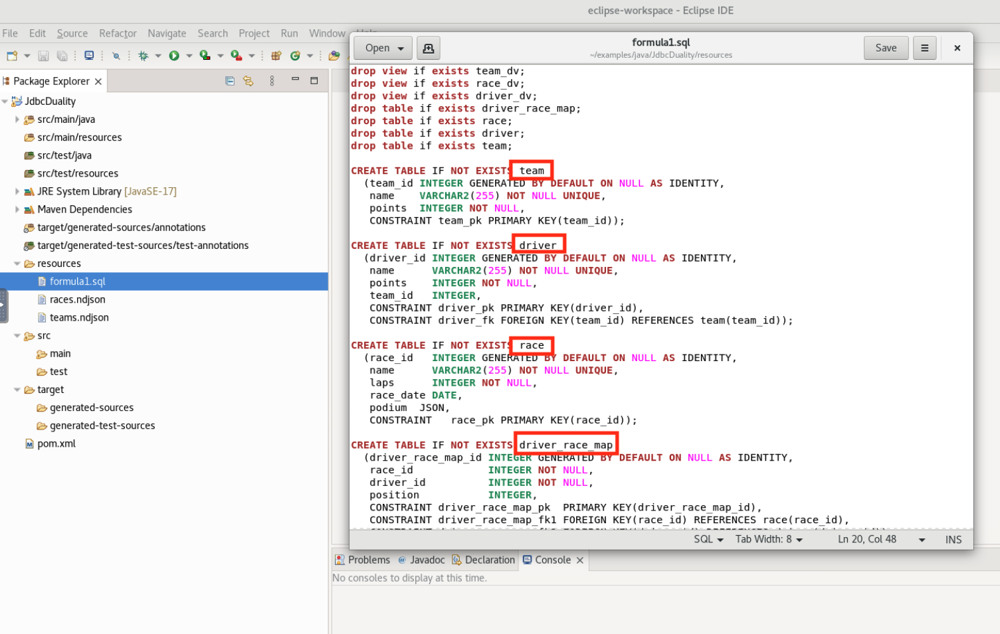

5. Following that, the JSON relational duality views will be created from that same file. The syntax looks pretty different from creating a standard table. What it's doing is emulating JSON's hierarchal object structure with name/value pairs and nested arrays/objects. The 3 created are:
    - race\_dv
    - driver\_dv
    - team\_dv

    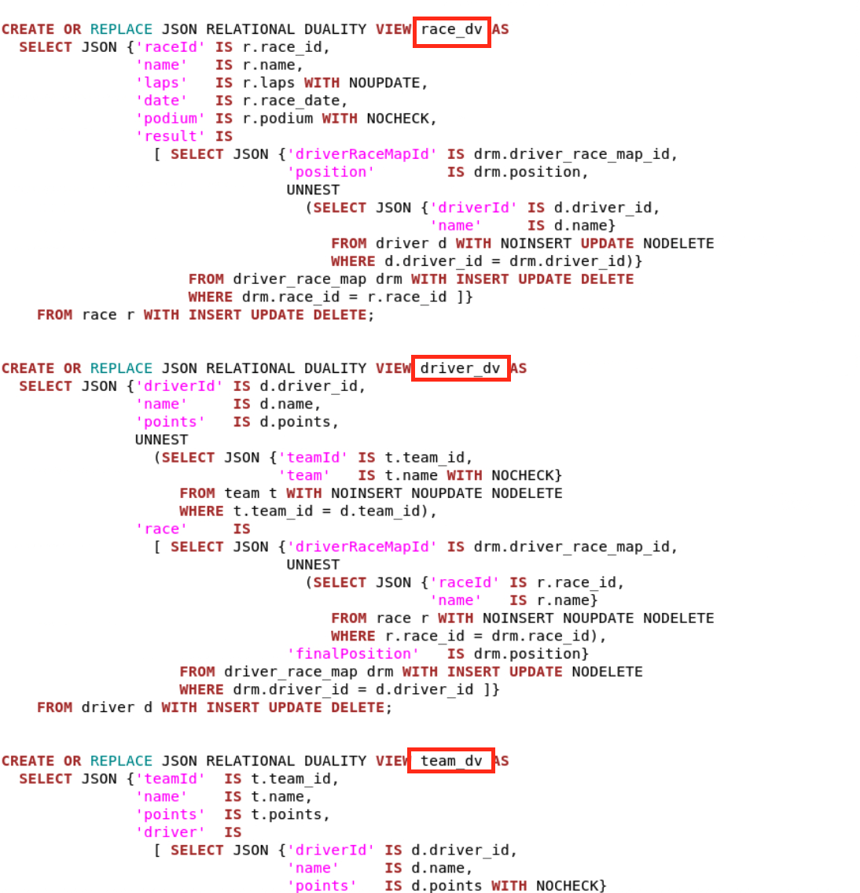

6. They each use data from the base tables to construct their views, but you can also directly insert, update, and delete onto these views as specified in the Create. 

    As each base table is specified in the view, it states things like NOINSERT or UPDATE or NODELETE. This will determine how underlying base tables can be modified by operations executed directly on the view. We will explore this throughout the lab.

    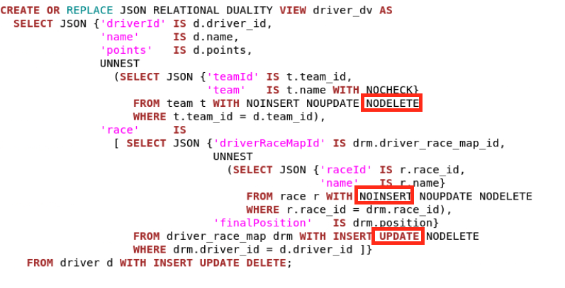

7. Then following that, back in the Java file, it will create a trigger on the driver\_race\_map table to populate the points fields in team and driver based on race results.

    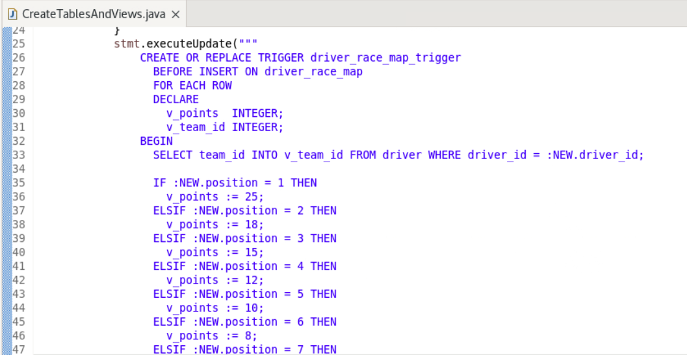

8. Now, click the small green play button drop down in the upper left of the Eclipse window. You must have the CreateTablesAndViews.java file open. We will run this program by clicking Run As -> Java Application.

    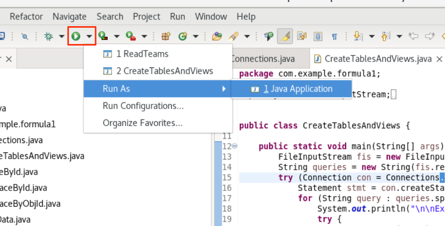

9. You may scroll through the output to see all the commands completed successfully.

    


## Task 3: Populating the database
1. Click on the LoadData.java file and open it. 

    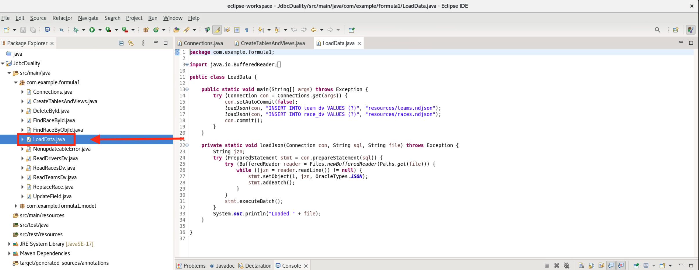

2. In the main method, the program is connecting to the database and calling loadJson twice. Each time is to insert data from different JSON files into their respective duality views. The insert statements have bind variables to allow them to pass in different JSON documents without rewriting the statements.

    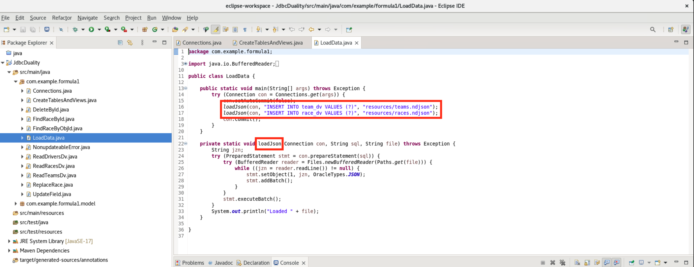

3. If you open races.ndjson and teams.ndjson under resources, you can look through the JSON to be inserted.

    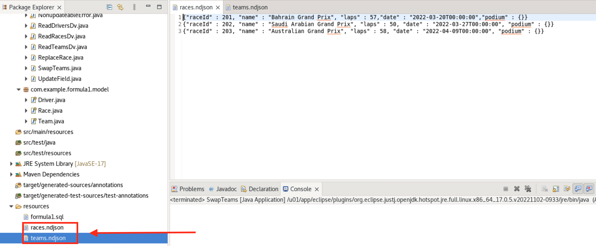

4. We are inserting a collection of team documents into TEAM\_DV. This automatically populates the driver and team table as well as the driver collection. 
    
    Additionally, we are inserting a collection of race documents into RACE\_DV. This automatically populates the race table.
    
    

5. Click the same dropdown and run this program as a Java application.

    

6. From the output, you can see we loaded the JSON documents without error.

    


## Task 4: Examining data in the duality views
    
1. Now, we will look at the contents of teams_dv (the teams duality view). Open ReadTeamsDv.java.
    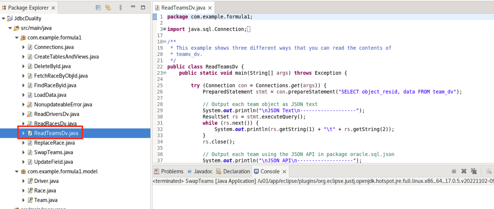

2. You'll see that we provided you 3 different ways to list the contents of the duality views:
    - JSON text = The database represents the JSON as a binary format, but converts it into a text string in this method.
    - JSON API = This programmatic API allows you to not use strings. You can access the values in the JSON directly without having to convert to text strings, which can improve performance.
    - Java Objects = If you would prefer to not represent your data as a JSON object at all, you can return it as a Java object. In this case, you have the Team.java class. JSON-B can parse through each document the database returns and match each field to the different parameters of Team's constructor. 

    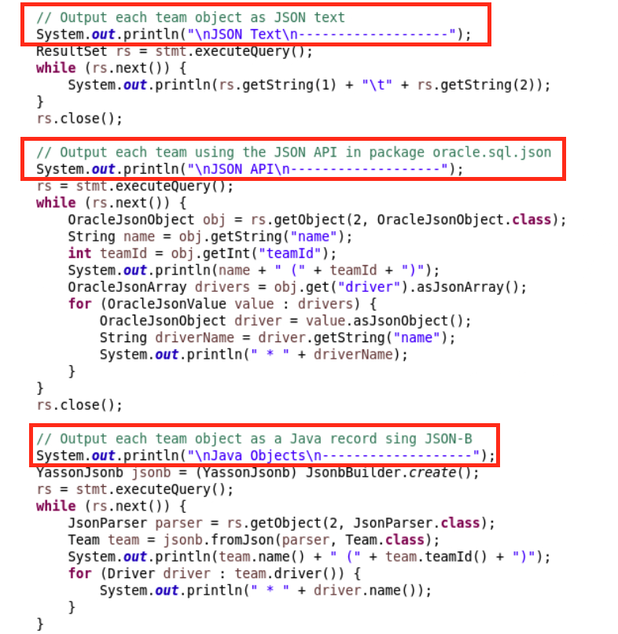

3. Team.java can be accessed under com.example.formula1.model.

    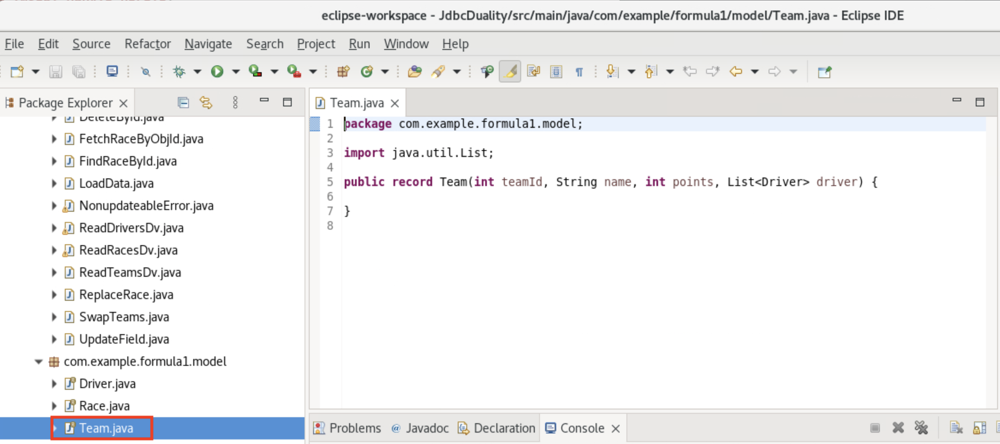

4. To run the file, press the green button. Regardless of which method to access the data, you can see the teams_dv has been loaded with records now.

    
    
5. We have also included classes to look at the contents of the drivers\_dv and the races\_dv. For simplicity, we will only be showing the data as JSON text strings from now on. First, please open ReadRacesDv.java. Run it with the green play button. You will see that this view is populated now.

    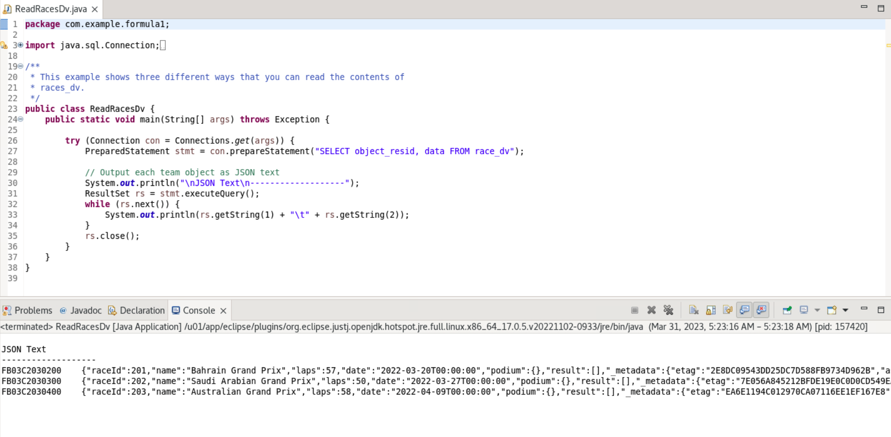

6. We want to emphasize that populating a duality view automatically updates data shown in related duality views by updating their underlying tables. 

    For example, in a previous step, documents were inserted into the team\_dv duality view. This duality view joins the team table with the driver table, and so on insert into this duality view, both the team table as well as the driver table are populated. 
    
    So if you now list the contents of the driver\_dv duality view, which is based on the driver table, it has documents as well.

    To see these contents, we will run ReadDriversDv.java.

    

7. Your setup is now complete. You may proceed to the next lab.
  

## Learn More

* [JSON Relational Duality: The Revolutionary Convergence of Document, Object, and Relational Models](https://blogs.oracle.com/database/post/json-relational-duality-app-dev)
* [JSON Duality View documentation](http://docs.oracle.com)

## Acknowledgements
* **Author** - Kaylien Phan, William Masdon, Josh Spiegel
* **Contributors** - David Start, Ranjan Priyadarshi
* **Last Updated By/Date** - Kaylien Phan, Database Product Management, April 2023
