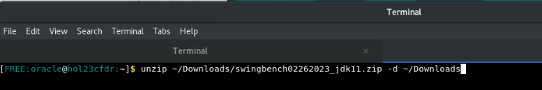
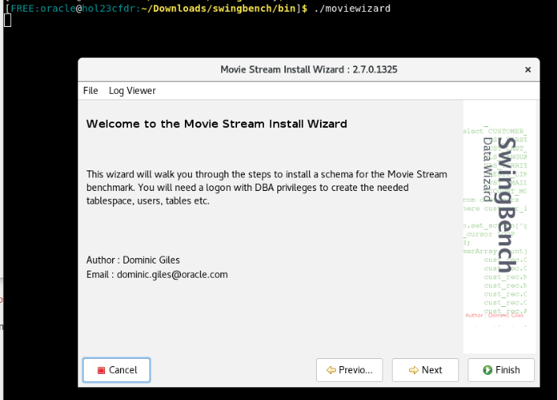
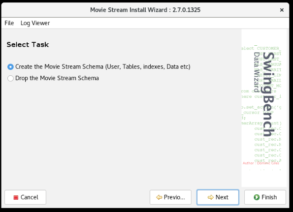
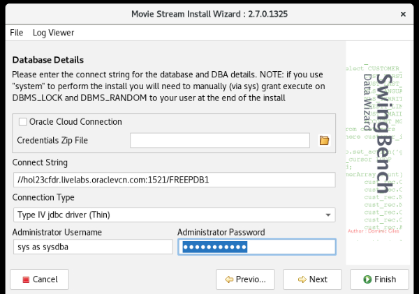
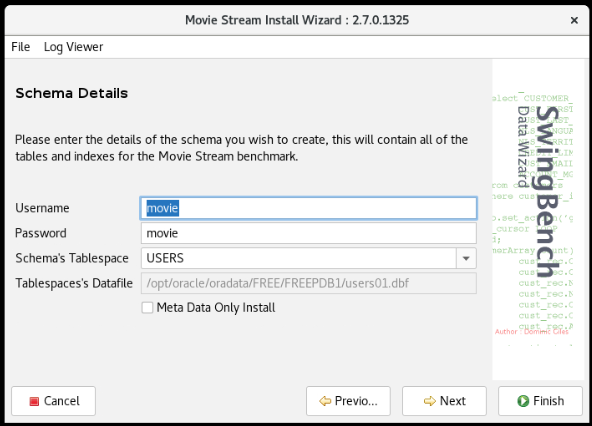
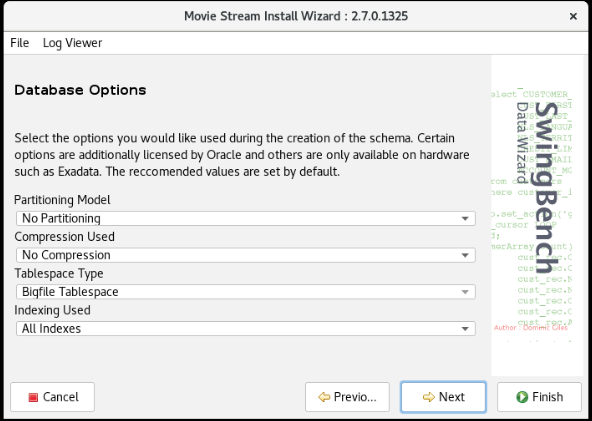
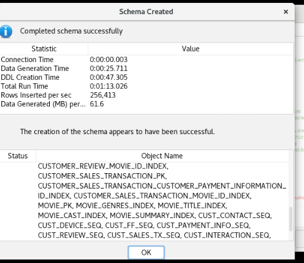
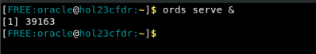

# Prepare your environment for the workshop 

## Introduction

This lab provides a step-by-step guide to help you get started with the JSON Duality LiveLab. In this lab, you will create the necessary schema and tables need for the following labs.

In this lab, we will be installing Swingbench, a powerful performance testing tool for Oracle databases. Swingbench allows you to simulate realistic workloads, measure system performance, and evaluate scalability. It assists in load testing, stress testing, and benchmarking Oracle environments, helping you identify bottlenecks, optimize configurations, and ensure the efficiency and reliability of Oracle-based applications. We will focus on the Oracle MovieStreams schema, which creates the required tablespace, users, and tables for this lab.

Estimated Time: 15 minutes

### Objectives

In this lab, you will:
* Install Swingbench
* Create the schema
* Start up Oracle REST Data Services (ORDS)
* Connect to SQL Developer Web via the browser

### Prerequisites

This lab assumes you have:
* Oracle Database 23c Free Developer Release installed
* Terminal or console access to the database
* Internet access

## Task 1: Install Swingbench

1. The first step is to open a command prompt. If you are running in a Sandbox environment, click on **Activities** and then select **Terminal**.

  

2. Next, set your environment. The `oraenv` command will set all the environment variables based on your database. When prompted, type "FREE" for the database name. If you supplied a different database name during installation, use that instead.

    ```
    <copy>
    . oraenv
    </copy>
	```

    


3. Next click [here](https://objectstorage.us-ashburn-1.oraclecloud.com/p/VEKec7t0mGwBkJX92Jn0nMptuXIlEpJ5XJA-A6C9PymRg[…]/livelabsfiles/o/data-management-library-files/swingbench02262023_jdk11.zip) to download the latest version of Swingbench.

4. Once the download is complete, open a terminal or command prompt on your computer and navigate to the location where the file was saved.

    ```
    <copy>
    unzip ~/Downloads/swingbench02262023_jdk11.zip -d ~/Downloads
    </copy>
	```
    

5. Navigate to the directory where Swingbench is installed. If Swingbench is installed in the "swingbench" folder within your home directory, you can use the following command:

    ```
    <copy>
    cd Downloads/swingbench/bin
    </copy>

	```

  

6. Once you are in the "swingbench/bin" directory, run the following command to execute the Movie Stream Install Wizard:

    ```
    <copy>
    ./moviewizard
    </copy>
    ```

    This command starts the Movie Stream Install Wizard, which guides you through the installation and configuration process for the Movie Stream workload.
    

7. When the Movie Stream wizard opens, click **Next** to get started.

8. Make sure the **Create the Movie Stream Schema** box is checked and click **Next**.

    

9. Under the "Connect string" box, copy (Ctrl + V) or type the following:

    ```
    <copy>
    //hol23cfdr.livelabs.oraclevcn.com:1521/FREEPDB1
    </copy>
    ```
    

11. In the Administrator Password box, copy and paste or type the following password:

    ```
    <copy>
    Welcome123#
    </copy>
    ```
    Once finished press **Next**
    
    


12. Change the username to **movie** and leave the default password of movie, then click **Next** 

    

13. Accept the defaults for the "Database Options" page and click **Next**

    

14. Change the size of the benchmark using the "User Defined Scale" option to 0.5 and click **Next**

    

15. Accept the default **Level of Parallelism** at 8 and click **Finish**

    

16. This step may take approximately 1-2 minutes to complete. You can continue to the next section while this process runs in the background.

    

## Task 2: Start ORDS

1. Open a new tab in the terminal by selecting **File** and **New Tab** 

    

2. Now you will need the Movie Schema to finish creating. Once its done, to enable the RESTful services for the new movie schema, sign into SQL*Plus using the newly created movie user. Once logged in, copy the following command into the terminal:


    ```
    <copy>
    sqlplus movie/movie@//localhost:1521/FREEPDB1
    </copy>
    ```
    

3. Run the following command in SQL*Plus:

    ```
    <copy>
    BEGIN
        ORDS.ENABLE_SCHEMA(p_enabled => TRUE, p_schema => 'MOVIE');
        END;
        /
    </copy>
    ```
    

4. Exit SQL*Plus by running the following command:

    ```
    <copy>
    exit
    </copy>
    ```
    

5. To start ORDS, enter the following command in the same command prompt window:

    ```
	<copy>
    ords serve &
    </copy>
	```
    

6. IIf you are running this in a Sandbox, go to Activities and then click on New Window at the top. If Chrome is not running, click on Chrome.

    

7. Copy and paste the following address into the browser. This is the address for SQL Developer Web on your machine. Note: If you did not start ORDs, ORDs stopped working or you closed that terminal in the previous lab, go back and complete the steps in that lab to start ORDs otherwise it will not be running to login here.

    ```
    <copy>
    http://localhost:8080/ords/sql-developer
    </copy>
    ```

8. Sign in to SQL Developer Web using the movie schema with the username movie and password movie.

    

Congratulations! You have finished the setup for this workshop. You may now **proceed to the next lab** 


## Learn More

* [Introducing Oracle Database 23c Free – Developer Release](https://blogs.oracle.com/database/post/oracle-database-23c-free)

## Acknowledgements
* **Author** - Killian Lynch, Oracle Database Product Management, Product Manager
* **Contributors** - Dominic Giles, Oracle Database Product Management, Distinguished Product Manager
* **Last Updated By/Date** - Killian Lynch, Oracle Database Product Management, Product Manager, May 2023
